# 第九章。异常检测

在第四章中，我们看到了特征学习的机制，特别是自动编码器作为监督学习任务的无监督预训练步骤的使用。

在本章中，我们将应用类似的概念，但用于不同的用例，即异常检测。

出色的异常检测器之一是找到智能数据表示，可以轻易表现出与正态分布的偏差。深度自动编码器在学习基础数据的高级抽象和非线性关系方面表现非常好。我们将展示深度学习如何非常适合异常检测。

在本章中，我们将首先解释离群点检测和异常检测概念之间的差异和共同之处。读者将通过一个想象的欺诈案例研究，随后通过示例，展示在现实世界应用中存在异常的危险以及自动和快速检测系统的重要性。

在进入深度学习实现之前，我们将介绍一些广泛应用于传统机器学习的技术家族及其当前局限性。

我们将应用在第四章中看到的深度自动编码器的架构，但用于一种特定的半监督学习，也称为新颖性检测。我们将提出两种强大的方法：一种基于重建错误，另一种基于低维特征压缩。

我们将介绍 H2O，这是一个最受欢迎的用于构建简单但可扩展的前馈多层神经网络的开源框架之一。

最后，我们将使用 H2O 自动编码器模型的 Python API 编写一些异常检测示例。

第一个例子将重用你在第三章中看到的 MNIST 数字数据集，*深度学习基础*和第四章中看到的*无监督特征学习*，但用于检测书写不良的数字。第二个例子将展示如何检测心电图时间序列中的异常脉动。

总结一下，本章将涵盖以下主题：

+   什么是异常和离群点检测？

+   异常检测的实际应用

+   流行的浅层机器学习技术

+   使用深度自动编码器进行异常检测

+   H2O 概述

+   代码示例：

    +   MNIST 数字异常识别

    +   心电图脉动检测

# 什么是异常和离群点检测？

异常检测通常与离群值检测和新奇检测相关，它是识别在同质数据集中偏离预期模式的项目、事件或观察结果。

异常检测是关于预测未知的。

每当我们在数据中发现一个不一致的观察结果，我们可以称之为异常或离群值。尽管这两个词经常可以互换使用，但实际上它们指的是两个不同的概念，正如 Ravi Parikh 在他的一篇博客文章中描述的那样（`https://blog.heapanalytics.com/garbage-in-garbage-out-how-anomalies-can-wreck-your-data/`）：

> *"异常值是一个远离分布均值或中位数的合法数据点。它可能是不寻常的，比如 9.6 秒的 100 米赛跑，但仍在现实范围内。异常是由与其余数据生成过程不同的过程生成的非法数据点。"*

让我们尝试用一个简单的欺诈检测示例来解释两者的区别。

在一份交易日志中，我们观察到一个特定客户每个工作日的午餐平均花费 10 美元。突然间，有一天他们花了 120 美元。这当然是一个离群值，但也许那天他们决定用信用卡支付整笔账单。如果这些交易中有几笔远高于预期金额的订单，那么我们可以识别出异常。异常是指当单一的罕见事件理由不再成立时，例如，连续三个订单的交易金额超过 120 美元。在这种情况下，我们谈论的是异常，因为已经从一个不同的过程生成了重复和相关的离群值模式，可能是信用卡欺诈，与通常的行为相比。

当阈值规则可以解决许多检测问题时，发现复杂的异常需要更高级的技术。

如果一个克隆的信用卡进行了大量金额为 10 美元的微支付，基于规则的检测器可能会失败。

通过简单地查看每个维度上的度量值，异常生成过程仍然可能隐藏在平均分布内。单一维度信号不会触发任何警报。让我们看看如果我们在信用卡欺诈示例中添加一些额外维度会发生什么：地理位置、当地时区的时间以及一周中的日期。

让我们更详细地分析同一个欺诈示例。我们的客户是一名全职员工，居住在罗马，但在米兰工作。每个周一早上，他乘火车去上班，然后在周六早上回罗马看朋友和家人。他喜欢在家做饭；他一周只出去吃几次晚餐。在罗马，他住在他的亲戚附近，所以他周末从不必准备午餐，但他经常喜欢和朋友出去过夜。预期行为的分布如下：

+   **金额**：介于 5 到 40 美元之间

+   **位置**：米兰 70%和罗马 30%

+   **一天中的时间**：70%在中午到下午 2 点之间，30%在晚上 9 点到 11 点之间。

+   **一周中的日期**：一周内均匀分布

有一天，他的信用卡被克隆了。欺诈者住在他的工作地附近，为了不被抓住，他们每天晚上约 10 点在一家同伙的小店里系统地进行 25 美元的小额支付。

如果我们只看单个维度，欺诈交易将只是略微偏离预期分布，但仍然可接受。金额和一周中的日期的分布效果将保持更多或更少相同，而位置和一天中的时间将稍微增加到米兰的晚上时间。

即使是系统地重复，他生活方式的微小变化也是一个合理的解释。欺诈行为很快就会变成新的预期行为，即正常状态。

让我们考虑联合分布：

+   约 70%的金额在米兰午餐时间约 10 美元左右，只在工作日

+   约 30%的金额在周末晚餐时间在罗马约 30 美元左右

在这种情况下，欺诈行为在第一次发生时会立即被标记为异常值，因为米兰夜间超过 20 美元的交易非常罕见。

给出前面的例子，我们可能会认为考虑更多维度可以使我们的异常检测更智能。就像任何其他机器学习算法一样，你需要在复杂性和泛化之间找到一个权衡。

如果维度过多，所有观察结果都会投射到一个空间中，其中所有观察结果彼此等距离。因此，一切都将成为“异常值”，按照我们定义异常值的方式，这本质上使整个数据集“正常”。换句话说，如果每个点看起来都一样，那么你就无法区分这两种情况。如果维度太少，模型将无法从草堆中发现异常值，可能会让它在大量分布中隐藏更长时间，甚至永远。

然而，仅识别异常值是不够的。异常值可能是由于罕见事件、数据收集中的错误或噪音引起的。数据总是肮脏的，充满了不一致性。第一条规则是“永远不要假设你的数据是干净和正确的”。找到异常值只是一个标准例程。更令人惊讶的是发现偶发且无法解释的重复行为：

> *"数据科学家意识到，他们最好的日子与发现数据中真正奇怪的特征的日子重合。"*
> 
> *《草堆与针》：异常检测，作者：Gerhard Pilcher & Kenny Darrell，数据挖掘分析师，Elder Research, Inc.*

特定异常模式的持续存在是我们正在监控的系统中发生了变化的信号。真正的异常检测发生在观察到基础数据生成过程中的系统偏差时。

这也影响到数据预处理步骤。与许多机器学习问题相反，在异常检测中，你不能只过滤掉所有的异常值！尽管如此，你应该仔细区分它们的性质。你确实想要过滤掉错误的数据条目，删除噪声，并对剩余的数据进行归一化。最终，你想要在清理后的数据集中检测到新颖性。

# 异常检测的现实应用

异常情况可能发生在任何系统中。从技术上讲，你总是可以找到一个在系统历史数据中找不到的从未见过的事件。在某些情况下检测到这些观察结果的影响可能会产生巨大的影响（积极和消极）。

在执法领域，异常检测可以用于揭示犯罪活动（假设你在一个平均人足够诚实以便识别突出分布之外的罪犯的地区）。

在网络系统中，异常检测可以帮助发现外部入侵或用户的可疑活动，例如，一个意外或故意向公司内部网络以外泄露大量数据的员工。或者可能是黑客在非常用端口和/或协议上打开连接。在互联网安全的特定案例中，异常检测可以用于通过简单地观察非受信任域名上的访客激增来阻止新的恶意软件传播。即使网络安全不是你的核心业务，你也应该通过数据驱动的解决方案来保护你的网络，以便在出现未识别的活动时监控并提醒你。

另一个类似的例子是许多主要社交网络的身份验证系统。专门的安全团队已经开发出可以衡量每个单独活动或活动序列以及它们与其他用户的中位行为有多远的解决方案。每当算法标记一项活动为可疑时，系统将提示你进行额外的验证。这些技术可以大大减少身份盗窃，并提供更大的隐私保护。同样，相同的概念也可以应用于金融欺诈，正如我们在前面的例子中看到的那样。

由人类行为产生的异常是最受欢迎的应用之一，但也是最棘手的。这就像一场国际象棋比赛。一方面，你有专业领域的专家、数据科学家和工程师开发先进的检测系统。另一方面，你有黑客，他们了解这场比赛，研究对手的走法。这就是为什么这种系统需要大量的领域知识，并且应该设计成具有反应性和动态性的。

并非所有的异常都来自“坏人”。在营销中，异常可以代表孤立的，但高利润的客户，可以用定制的报价来定位他们。他们不同和特殊的兴趣和/或有利可图的个人资料可用于检测离群客户。例如，在经济衰退期间，找到一些潜在客户，尽管大趋势，他们的利润增长，这可能是适应你的产品和重新设计业务策略的一个想法。

其他应用包括医学诊断、硬件故障检测、预测性维护等。这些应用也需要灵活性。

商机，就像新的恶意软件一样，每天都可能出现，它们的生命周期可能非常短，从几小时到几周。如果你的系统反应慢，你可能会太晚，永远追不上你的竞争对手。

人工检测系统不能扩展，通常也遭受泛化的困扰。正常行为的偏差并不总是显而易见，分析师可能难以记住整个历史以进行比对，这是异常检测的核心要求。如果异常模式隐藏在数据中实体的抽象和非线性关系中，情况会变得复杂。需要智能和完全自动化的系统，能够学习复杂的互动关系，提供实时和准确的监控，是该领域创新的下一个前沿。

# 流行的浅层机器学习技术

异常检测并不新鲜，许多技术已经被广泛研究。建模可以分为两个阶段：数据建模和检测建模。

## 数据建模

数据建模通常包括将可用数据分组成我们希望检测的观察的粒度，以包含检测模型需要考虑的所有必要信息。

我们可以确定三种主要类型的数据建模技术：

**点异常**：这类似于单个异常值检测。我们数据集中的每一行对应一个独立的观察。目标是将每个观察分类为“正常”或“异常”，或者更好地提供一个数字异常得分。

**上下文异常**：每个点都附加有额外的上下文信息。一个典型的例子是在时间序列中查找异常，其中时间本身就代表了上下文。一月份冰淇淋销售的激增和七月份是不同的。上下文必须封装到额外的特征中。时间上下文可以是代表月份、季度、日期、星期几的分类日历变量，或布尔标志如*是否* *是* *公共假期？*

**集体异常**：代表潜在异常原因的观测模式。集体指标应该被智能地聚合成新的特征。一个例子是之前描述的欺诈检测示例。交易应该被分组到会话或间隔中，并且应该从序列中提取统计数据，比如付款金额的标准偏差、频率、两次连续交易之间的平均间隔、消费趋势等。

同样的问题可以用多种混合方法来解决，定义不同粒度的数据点。例如，可以独立地最初检测出个别异常交易，然后在时间上进行链接，封装时间上下文，并在分组序列上重复检测。

## 检测建模

无论数据类型如何，检测模型的通用输入由多维空间中的点（特征空间）组成。因此，通过一些特征工程，我们可以将任何异常表示转换为单个特征向量。

出于这个原因，我们可以将异常检测看作是离群值检测的特殊情况，其中单个数据点还包含了上下文和能够代表模式的任何其他信息。

与任何其他机器学习技术一样，我们既有监督学习方法，也有无监督学习方法。此外，我们还提出了半监督模式：

+   **监督**：以监督方式进行的异常检测也可以称为异常分类，例如垃圾邮件检测。在异常分类中，我们将每个观测标记为异常（垃圾邮件）或非异常（正常邮件），然后使用二元分类器将每个点分配到相应的类别。可以使用任何标准的机器学习算法，比如支持向量机、随机森林、逻辑回归，当然还有神经网络，尽管它不是本章的重点。

    这种方法的主要问题之一是数据的倾斜度。根据定义，异常只占人口的一小部分。在训练阶段没有足够的反例将导致糟糕的结果。此外，一些异常可能以前从未见过，很难建立一个足够概括正确分类它们的模型。

+   **无监督**：纯粹的无监督方法意味着没有关于什么构成异常或不异常的基本事实（没有黄金标准）的历史信息。我们知道数据中可能存在异常，但没有关于它们的历史信息。

    在这些场景中，检测也可以视为聚类问题，目标不仅是将相似的观测结果进行分组，还要识别所有其余的孤立点。因此，它带来了所有关于聚类问题的问题和考虑。数据建模和距离度量应该被谨慎选择，以便能够将每个点排列为靠近或远离现有的“正常行为”群集之一。

    典型的算法是 k-means 或基于密度的聚类。聚类的主要困难在于对噪声的高度敏感和著名的维度灾难。

+   **半监督**：也被称为新颖性检测，半监督学习可能对你来说是一个新名词。它既可以被视为无监督学习（数据未标记），也可以被视为单类别监督学习（所有都在同一个标签下）。半监督的假设是训练数据集完全属于一个标签："期望的行为"。我们不是学习用于预测“期望”还是“异常”的规则，而是学习用于预测观察到的点是否来自生成训练数据的相同源的规则。这是一个相当强的假设，也是使异常检测成为实践中最难解决的问题之一的原因。

    流行的技术包括 SVM 单类别分类器和统计分布模型，例如多元高斯分布。

    更多关于用于异常检测的多元高斯分布的信息可以在这个教程中找到：[`dnene.bitbucket.org/docs/mlclass-notes/lecture16.html`](https://bitbucket.org/)。下图显示了在二维空间中可视化的主分布中的异常值的经典识别：

    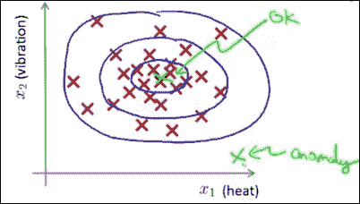

    具有单个异常值的正态分布的二维表示（[`dnene.bitbucket.org/docs/mlclass-notes/lecture16.html)`](https://bitbucket.org/)

# 使用深度自编码器进行异常检测。

使用深度学习的提出方法是半监督的，并且在以下三个步骤中广泛解释：

1.  确定代表正态分布的一组数据。在这种情况下，“正常”一词代表一组我们有信心主要代表非异常实体的点，并且不应与高斯正态分布混淆。

    识别通常是历史性的，我们知道没有官方确认的异常。这就是为什么这种方法不是纯无监督的原因。它依赖于这样一个假设：大多数观察结果是没有异常的。我们可以使用外部信息（即使是可用的标签）来实现所选子集的更高质量。

1.  从这个训练数据集中学习“正常”是什么意思。训练模型将在其数学定义中提供一种度量标准；也就是说，将每个点映射到代表与另一个代表正态分布的点之间距离的实数。

基于异常分数的阈值进行检测。通过选择合适的阈值，我们可以在精度（更少的虚警）和召回（更少的漏报）之间实现所需的折衷。

这种方法的优点之一是对噪声的鲁棒性。我们可以接受训练中正常数据中的一小部分异常值，因为该模型将试图概括群体的主要分布而不是单个观测值。这种特性在泛化方面给我们带来了巨大的优势，相对于监督方法而言，后者仅限于过去所能观察到的内容。

此外，这种方法也可以扩展到带标签的数据，使其适用于各种类别的异常检测问题。由于建模过程中不考虑标签信息，我们可以将其从特征空间中丢弃，并将所有内容视为同一标签下的。在验证阶段，标签仍然可以用作基本真相。然后，我们可以将异常分数视为二元分类分数，并使用 ROC 曲线及相关指标作为基准。

对于我们的用例，我们将利用自编码器架构来学习训练数据的分布。正如我们在 第四章 *无监督特征学习* 中所看到的，网络被设计为具有任意但对称的隐藏层，输入层和输出层中的神经元数量相同。整个拓扑结构必须对称，即左侧的编码拓扑与右侧的解码部分相同，并且它们都共享相同数量的隐藏单元和激活函数：

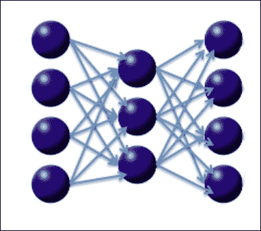

H2O 训练手册中的自编码器简单表示（https://github.com/h2oai/h2o-training-book/blob/master/hands-on_training/images/autoencoder.png）

通常使用的损失函数是输入与输出层中相应神经元之间的 **MSE**（**均方误差**）。通过这种方式，网络被迫通过原始数据的非线性和压缩表示来逼近一个恒等函数。

深度自编码器也经常用作监督学习模型的预训练步骤和降维。事实上，自编码器的中心层可以用于表示降维的点，正如我们将在最后一个示例中看到的那样。

然后，我们可以开始使用完全重构的表示进行分析，这是编码和解码级联的结果。恒等自编码器会完全重构原始点的相同值。这并不是非常有用的。实际上，自编码器基于中间表示进行重构，这些表示使训练误差最小化。因此，我们从训练集中学习这些压缩函数，使得正常点很可能被正确重构，但异常值的 **重构误差**（原始点与重构点之间的均方误差）会更高。

然后我们可以使用重构误差作为异常分数。

或者，我们可以使用一个技巧，将网络的中间层设置得足够小，以便我们可以将每个点转换为低维压缩表示。如果将其设置为二或三，甚至可以可视化这些点。因此，我们可以使用自动编码器来降低维度，然后使用标准机器学习技术进行检测。

# H2O

在我们深入研究示例之前，让我们花一些时间来证明我们选择使用 H2O 作为异常检测的深度学习框架的决定是合理的。

H2O 不仅仅是一个要安装的库或软件包。它是一个开源、功能丰富的分析平台，提供了机器学习算法和高性能并行计算抽象。

H2O 核心技术是围绕着为内存处理分布式数据集进行优化的 Java 虚拟机构建的。

可以通过基于 Web 的 UI 或在许多语言中以编程方式使用，例如 Python、R、Java、Scala 和 JSON 中的 REST API。

数据可以从许多常见数据源加载，例如 HDFS、S3、大多数流行的 RDBMS 和少数其他 NoSQL 数据库。

加载后，数据以`H2OFrame`的形式表示，使得习惯于使用 R、Spark 和 Python pandas 数据框架的人感到熟悉。

后端可以在不同引擎之间切换。它可以在您的机器上本地运行，也可以部署在 Spark 或 Hadoop MapReduce 之上的集群中。

H2O 将自动处理内存占用，并优化大多数数据操作和模型学习的执行计划。

它提供了针对经过训练模型的数据点进行快速评分的功能；据宣传，它的运行时间为纳秒级。

除了传统的数据分析和机器学习算法外，它还提供了一些非常强大的深度学习模型的实现。

构建模型的一般 API 是通过`H2OEstimator`。可以使用专门的`H2ODeepLearningEstimator`类来构建前馈多层人工神经网络。

我们选择 H2O 用于异常检测的一个主要原因是它提供了一个内置类，非常适用于我们的用例，即`H2OAutoEncoderEstimator`。

正如您将在以下示例中看到的那样，构建一个自动编码器网络只需要指定几个参数，然后它将自动调整其余部分。

估算器的输出是一个模型，根据要解决的问题，可以是分类模型、回归、聚类，或在我们的情况下是自动编码器。

H2O 的深度学习并不是穷尽的，但它相当简单直接。它具有自动自适应权重初始化、自适应学习率、各种正则化技术、性能调整、网格搜索和交叉折叠验证等功能。我们将在第十章 *构建生产就绪的入侵检测系统* 中探讨这些高级功能。

我们也希望很快在框架中看到 RNN 和更高级的深度学习架构的实现。

H2O 的关键点是可伸缩性、可靠性和易用性。它非常适合关心生产方面的企业环境。其简单性和内置功能也使其非常适合研究任务和希望学习和尝试深度学习的好奇用户。

## 开始使用 H2O

本地模式下的 H2O 可以简单地使用 `pip` 安装为依赖项。请按照 [`www.h2o.ai/download/h2o/python`](http://www.h2o.ai/download/h2o/python) 上的说明操作。

第一次初始化时将自动启动本地实例。

打开 Jupyter 笔记本并创建一个 `h2o` 实例：

```py
import h2o
h2o.init()
```

要检查初始化是否成功，应该打印出类似于 `"Checking whether` there is an H2O instance running at `http://localhost:54321`. `connected."` 的内容。

你现在已经准备好导入数据并开始构建深度学习网络了。

# 示例

以下示例是如何应用自动编码器来识别异常的概念证明。本章不涉及特定调优和高级设计考虑。我们将默认一些文献中的结果，而不深入研究太多已经在前几章中涵盖的理论基础。

我们建议读者仔细阅读第四章 *无监督特征学习* 和有关自动编码器的相关部分。

我们将在示例中使用 Jupyter 笔记本。

或者，我们也可以使用 H2O Flow (`http://www.h2o.ai/product/flow/`)，这是一个类似 Jupyter 的 H2O 笔记本样式的用户界面，但我们不想在整本书中使读者感到困惑。

我们还假设读者对 H2O 框架、pandas 和相关绘图库 (`matplotlib` 和 `seaborn`) 的工作原理有基本了解。

在代码中，我们经常将一个 `H2OFrame` 实例转换为 `pandas.DataFrame`，以便我们可以使用标准绘图库。这是可行的，因为我们的 `H2OFrame` 包含小数据；但在数据量大时不推荐使用。

## MNIST 数字异常识别

这是一个用于基准测试异常检测模型的相当标准的示例。

我们在第三章中已经看到过这个数据集，*深度学习基础*。不过，在这种情况下，我们不是在预测每个图像代表的数字，而是判断图像代表的是一个清晰的手写数字还是一个丑陋的手写数字。目标是识别写得不好的数字图像。

实际上，在我们的示例中，我们将丢弃包含标签（数字）的响应列。我们对每个图像代表的数字不感兴趣，而是更关心这个数字的清晰程度。

我们将遵循 H2O 教程中提供的相同配置，位于`github.com/h2oai/h2o-training-book/blob/master/hands-on_training/anomaly_detection.md`。

我们将以标准的`pandas`和`matplotlib`导入开始：

```py
%matplotlib inline
import pandas as pd
from matplotlib import cm
import matplotlib.pyplot as plt 
import numpy as np
from pylab import rcParams
rcParams['figure.figsize'] = 20, 12
from six.moves import range
```

接下来，我们将从 H2O 存储库导入数据（这是原始数据集的改编版本，以便更轻松地解析和加载到 H2O 中）：

```py
train_with_label = h2o.import_file("http://h2o-public-test-data.s3.amazonaws.com/bigdata/laptop/mnist/train.csv.gz")
test_with_label = h2o.import_file("http://h2o-public-test-data.s3.amazonaws.com/bigdata/laptop/mnist/test.csv.gz")
```

加载的训练和测试数据集表示每行一个数字图像，并包含 784 列，表示 28 x 28 图像网格中每个像素的 0 到 255 的灰度值，最后一列用作标签（数字）。

我们将只使用前 784 个作为预测因子，而将标签保留在验证中：

```py
predictors = list(range(0,784))
train = train_with_label[predictors]
test = test_with_label[predictors]
```

H2O 教程建议使用一个只有 20 个神经元的隐藏层的浅层模型，以双曲正切作为激活函数，并进行 100 个 epochs（对数据进行 100 次扫描）。

目标不是学习如何调整网络，而是理解异常检测方法背后的直觉和概念。我们需要理解的是编码器容量取决于隐藏神经元的数量。过大的容量会导致一个恒等函数模型，这不会学习任何有趣的结构。在我们的案例中，我们设置了一个较低的容量，从 784 个像素到 20 个节点。这样，我们将迫使模型学习如何通过只使用表示数据相关结构的少数特征最好地逼近恒等函数：

```py
from h2o.estimators.deeplearning import H2OAutoEncoderEstimator
model = H2OAutoEncoderEstimator(activation="Tanh", hidden=[20], ignore_const_cols=False, epochs=1)
model.train(x=predictors,training_frame=train)
```

在我们训练自编码器模型之后，我们可以预测测试集中使用我们的新降维表示重构的数字，并根据重构错误对它们进行排序：

```py
test_rec_error = model.anomaly(test)
```

让我们快速描述一下重构错误：

```py
test_rec_error.describe()
```

我们会看到重构错误在 0.01 到 1.62 之间，平均值大约为 0.02，不是对称分布。

让我们绘制出所有测试点的重构错误的散点图：

```py
test_rec_error_df = test_rec_error.as_data_frame()
test_rec_error_df['id'] = test_rec_error_df.index
test_rec_error_df.plot(kind='scatter', x='id', y='Reconstruction.MSE')
```

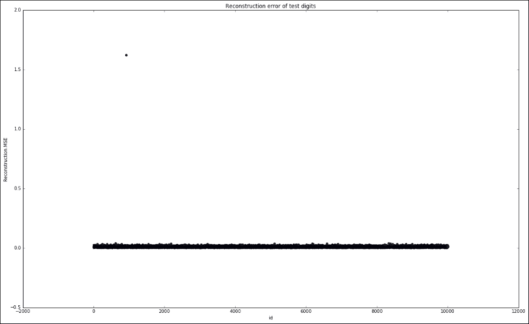

我们可以看到测试集仅包含一个明显的异常点，而其余的点落在[0.0，0.07]范围内。

让我们将包括标签在内的测试特征集与重构错误连接起来，并抓取异常点，并尝试使用自编码器模型重构它：

```py
test_with_error = test_with_label.cbind(test_rec_error)
outlier = test_with_error[test_with_error['Reconstruction.MSE'] > 1.0][0, :]
outlier_recon = model.predict(outlier[predictors]).cbind(outlier['Reconstruction.MSE'])
```

我们需要定义一个辅助函数来绘制单个数字图像：

```py
def plot_digit(digit, title):
    df = digit.as_data_frame()
    pixels = df[predictors].values.reshape((28, 28))
    error = df['Reconstruction.MSE'][0]
    fig = plt.figure()
    plt.title(title)
    plt.imshow(pixels, cmap='gray')
    error_caption = 'MSE: {}'.format(round(error,2)) 
    fig.text(.1,.1,error_caption)
    plt.show()
```

并且绘制原始异常值和其重构版本：

```py
plot_digit(outlier, 'outlier')
plot_digit(outlier_recon, 'outlier_recon')
```

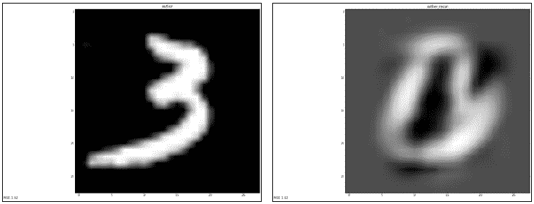

重构版本非常嘈杂，尽管异常值似乎清晰地表示数字三。我们会发现它有一个使它与其他三个数字不同的特定细节。

让我们更仔细地观察剩余点的错误分布：

```py
test_rec_error.as_data_frame().hist(bins=1000, range=[0.0, 0.07])
```

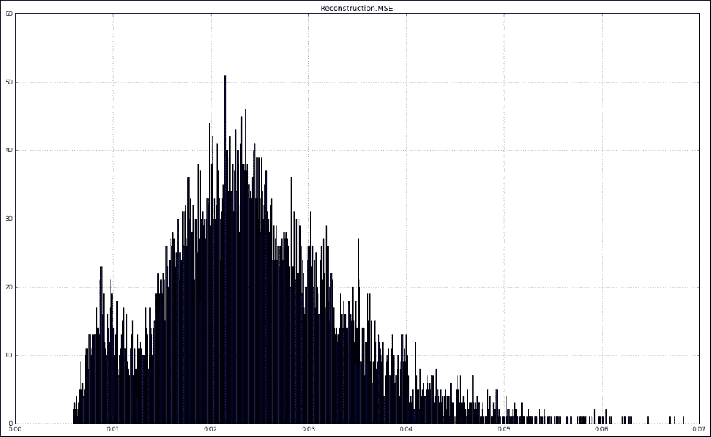

根据分布，我们可以将“中心钟”在 0.02 处分为“好”数字（在左边）和“坏”数字（在右边）。最右边的尾部（大于 0.05）可以被视为“丑陋”的数字或最异常的数字。

现在我们将从“好”子集中挑选一些数字三的数字，并与我们的异常值进行比较：

```py
digits_of_3 = test_with_error[(test_with_error['C785'] == 3) & (test_with_error['Reconstruction.MSE'] < 0.02)]
```

为了可视化多个数字，我们需要将绘图工具扩展为一个绘制图像网格的函数：

```py
def plot_multi_digits(digits, nx, ny, title):
    df = digits[0:(nx * ny),:].as_data_frame()
    images = [digit.reshape((28,28)) for digit in df[predictors].values]

    errors = df['Reconstruction.MSE'].values
    fig = plt.figure()
    plt.title(title)
    plt.xticks(np.array([]))
    plt.yticks(np.array([]))
    for x in range(nx):
        for y in range(ny):
            index = nx*y+x
            ax = fig.add_subplot(ny, nx, index + 1)
            ax.imshow(images[index], cmap='gray')
            plt.xticks(np.array([]))
            plt.yticks(np.array([]))
            error_caption = '{} - MSE: {}'.format(index, round(errors[index],2)) 
            ax.text(.1,.1,error_caption)
    plt.show()
```

现在，我们可以绘制 36 个随机数字的原始值和重构值，排列在一个`6（nx）`乘以`6（ny）`的网格中：

```py
plot_multi_digits(digits_of_3, 6, 6, "good digits of 3")
plot_multi_digits(model.predict(digits_of_3[predictors]).cbind(digits_of_3['Reconstruction.MSE']), 6, 6, "good reconstructed digits of 3")
```

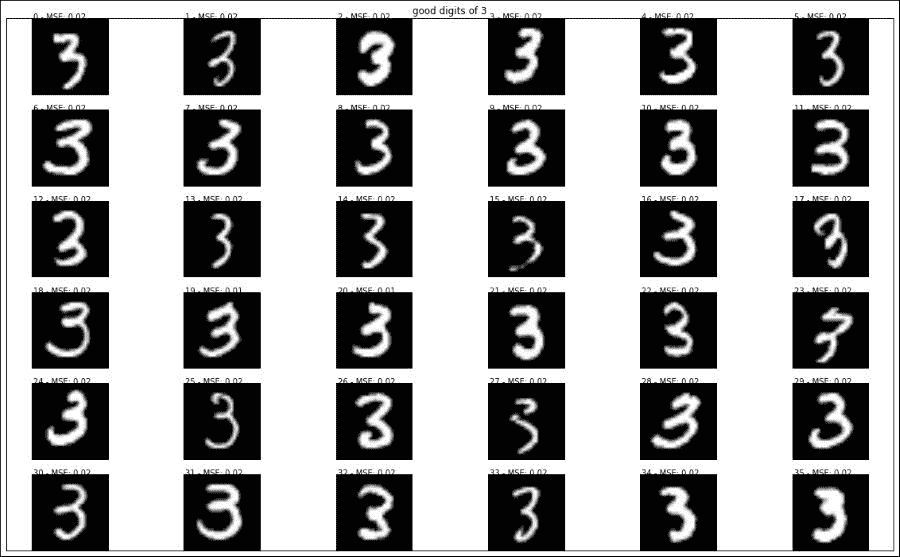

原始的数字三的好数字

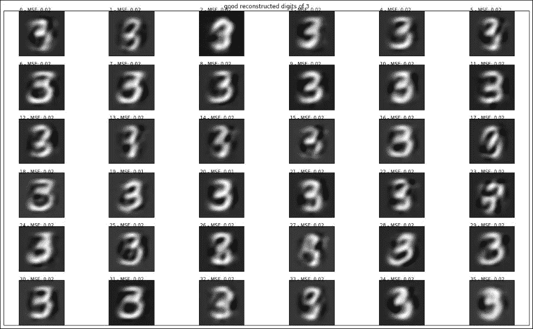

数字三的好数字的重构版本

乍一看，我们的异常值看起来与分类良好的图像并没有太大的不同。许多重构出来的图像看起来与它们的原始表示很相似。

如果我们仔细观察这些数字，我们会发现它们中没有一个数字具有几乎触及角落的底部左侧形状。

让我们选择索引为 1 的数字，得分为 0.02，并复制异常值图像的底部左侧部分（最后的 16 x 10 像素）。我们将重新计算修改后图像的异常分数：

```py
good_digit_of_3 = digits_of_3[1, :]
bottom_left_area = [(y * 28 + x) for y in range(11,28) for x in range (0, 11)]
good_digit_of_3[bottom_left_area] = outlier[bottom_left_area]
good_digit_of_3['Reconstruction.MSE'] = model.anomaly(good_digit_of_3)
plot_digit(good_digit_of_3, 'good digit of 3 with copied bottom left from outlier')
```

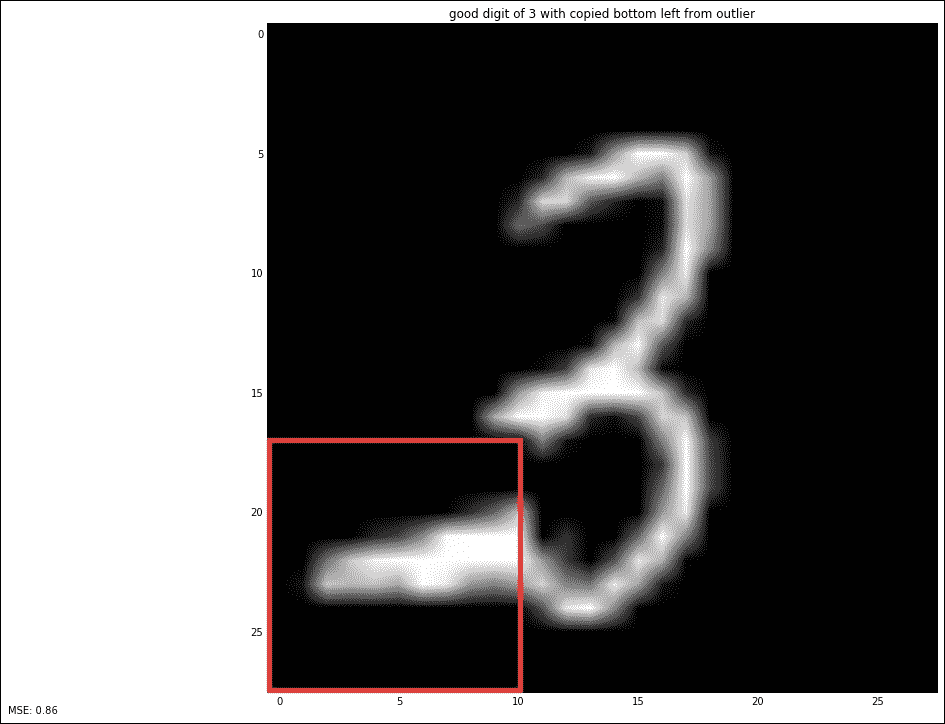

神奇的是，均方误差上升到了 0.86。高异常值分数（~1.62）的剩余贡献可能是由异常的书写风格解释的。

这个解释意味着模型对噪音过于敏感。它会因为训练数据不包含足够的样本，而将一个数字图像标记为异常，仅仅是因为它具有合法的特性。这就是异常值检测器的“异常值”，一个错误的正例示例。

一般情况下，可以使用去噪自动编码器来解决这个问题。为了发现更健壮的表示，我们可以训练模型从它的嘈杂版本中重构原始输入。我们可以在第四章，*无监督特征学习* 中找到更多理论解释。

在我们的用例中，我们可以使用二项式抽样掩盖每个数字，在这个过程中，我们以概率 *p* 随机将像素设为 0。损失函数将是从嘈杂版本和原始版本的重构图像的误差。在撰写本文时，H2O 没有提供这个功能，也没有损失函数的定制。因此，为了这个例子而实现它将会太过复杂。

我们的数据集包含数字的标签，但不幸的是，它没有关于它们质量的任何评估。我们将不得不进行手动检查，以确保我们的模型运行良好。

我们将抓取底部的 100 个（好的）和顶部的 100 个（丑的）点，并将它们可视化成一个 10 x 10 的网格：

```py
sorted_test_with_error_df = test_with_error.as_data_frame().sort_values(by='Reconstruction.MSE')
test_good = sorted_test_with_error_df[:100]
plot_multi_digits(test_good, 10, 10, "good digits")
```

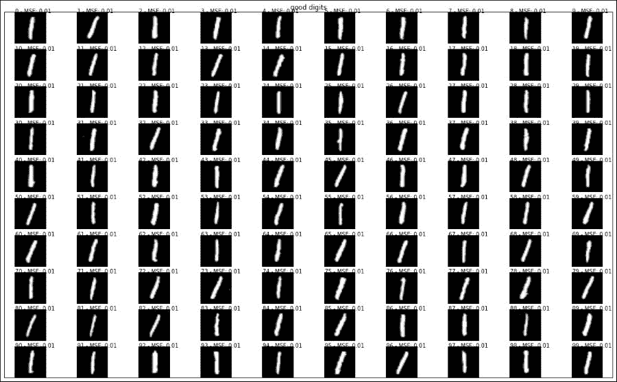

最佳数字的重构误差

```py
test_ugly = sorted_test_with_error_df.tail(100)
plot_multi_digits(test_ugly, 10, 10, "ugly digits")
```

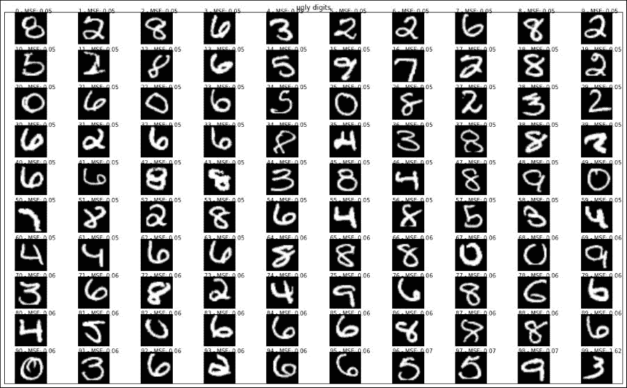

最糟糕的丑数字的重构误差

从图中很容易看出，“好的”代表数字 1，这是最容易写的数字，因为它的简单结构是一条直线。因此，数字 1 的数字不太容易写错。

底部的组别显然很丑陋。圆形的形状使得在类似数字之间更难区分，并且它非常依赖于特定人的手写风格。因此，它们很可能代表“异常”。它们很可能偏离大多数人口的书写风格。

请注意，不同的运行可能会因为引入了用于可扩展性的随机性而导致不同的结果，这是由于 Hogwild!算法在以下章节中解释的竞争条件引起的。为了使结果可重复，您应该指定一个 `seed` 并设置 `reproducibility=True`。 

### 心电图脉冲检测

在第二个例子中，我们将从 H2O 专门为异常检测用例准备的心电图时间序列数据中获取一份快照。

准备好的数据可从 H2O 公共存储库获取。原始数据集由[`www.physionet.org/`](http://www.physionet.org/)提供。其他参考资料可在[`www.cs.ucr.edu/~eamonn/discords/`](http://www.cs.ucr.edu/~eamonn/discords/)找到。

准备好的数据集包含 20 个正常心跳的心电图时间序列加上三个异常心跳。

每一行有 210 列，表示有序序列中的值样本。

首先，我们加载心电图数据并生成训练集和测试集：

```py
ecg_data = h2o.import_file("http://h2o-public-test-data.s3.amazonaws.com/smalldata/anomaly/ecg_discord_test.csv")
train_ecg = ecg_data[:20:, :]
test_ecg = ecg_data[:23, :]
```

让我们定义一个函数，堆叠并绘制时间序列：

```py
def plot_stacked_time_series(df, title):
    stacked = df.stack()
    stacked = stacked.reset_index()
    total = [data[0].values for name, data in stacked.groupby('level_0')]
    pd.DataFrame({idx:pos for idx, pos in enumerate(total)}, index=data['level_1']).plot(title=title)
    plt.legend(bbox_to_anchor=(1.05, 1))
```

然后绘制数据集：

```py
plot_stacked_time_series(ecg_data.as_data_frame(), "ECG data set")
```

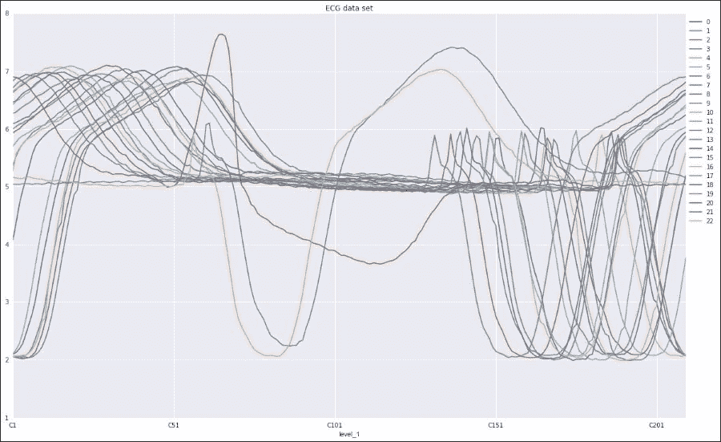

我们可以清楚地看到前 20 个时间序列是正常的，而最后三个（标记为 21、22 和 23）与其他时间序列非常不同。

因此，我们只想对前 20 个样本训练模型。这一次，我们将使用由 50 个、20 个和 20 个、50 个边缘和两个神经元组成的五个隐藏层的更深层架构。请记住，自编码器的拓扑结构总是对称的，并且通常随着层大小的减小。其思想是学会如何将原始数据编码到一个较低维度的空间中，最小化信息的丢失，然后能够从这种压缩表示中重建原始值。

这一次，我们将为可再现性固定种子的值：

```py
from h2o.estimators.deeplearning import H2OAutoEncoderEstimator
seed = 1
model = H2OAutoEncoderEstimator(
    activation="Tanh",
    hidden=[50,20, 2, 20, 50],
    epochs=100,
    seed=seed,
    reproducible=True)
model.train(
    x=train_ecg.names,
    training_frame=train_ecg
)
```

我们可以如下绘制重构信号：

```py
plot_stacked_time_series(model.predict(ecg
_data).as_data_frame(), "Reconstructed test set")

```

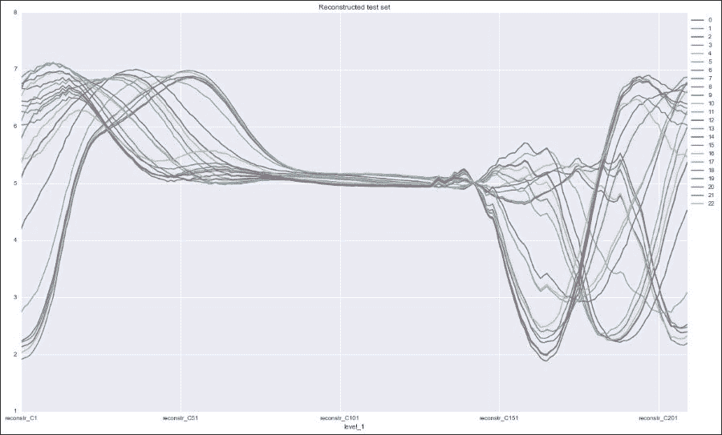

重构信号看起来都非常相似。异常点（20、21 和 23）现在无法区分，这意味着它们将具有更高的重构误差。

让我们计算并绘制重构误差：

```py
recon_error = model.anomaly(test_ecg)
plt.figure()
df = recon_error.as_data_frame(True)
df["sample_index"] = df.index
df.plot(kind="scatter", x="sample_index", y="Reconstruction.MSE", title = "reconstruction error")
```

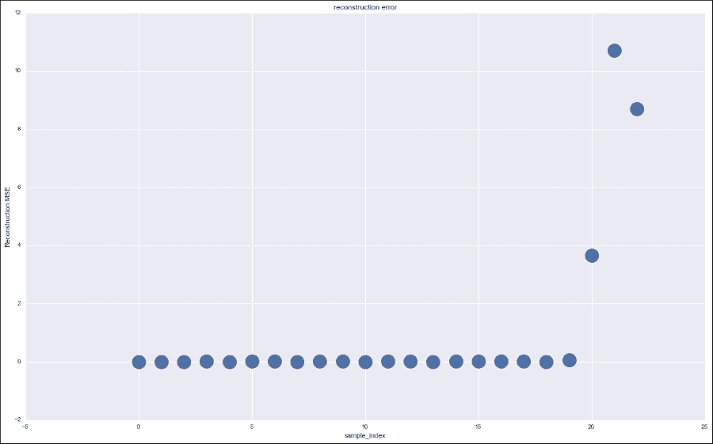

很容易将最后的三个点识别为异常点。

现在让我们尝试从不同的角度看问题。通过将中心层大小设置为二，我们可以使用编码器输出来压缩和可视化我们的点在二维图中。我们将使用训练模型的`deepfeatures` API 来绘制一个新的数据框，其中包含指定隐藏层索引的二维表示（从 0 开始，中间的索引为 2）：

```py
from matplotlib import cm
def plot_bidimensional(model, test, recon_error, layer, title):
    bidimensional_data = model.deepfeatures(test, layer).cbind(recon_error).as_data_frame()
    cmap = cm.get_cmap('Spectral')
    fig, ax = plt.subplots()
    bidimensional_data.plot(kind='scatter', 
                            x= 'DF.L{}.C1'.format(layer+1), 
                            y= 'DF.L{}.C2'.format(layer+1), 
                            s = 500,
                            c = 'Reconstruction.MSE',
                            title = title,
                            ax = ax,
                            colormap=cmap)
    layer_column = 'DF.L{}.C'.format(layer + 1)
    columns = [layer_column + '1', layer_column + '2']
    for k, v in bidimensional_data[columns].iterrows():
        ax.annotate(k, v, size=20, verticalalignment='bottom', horizontalalignment='left')
    fig.canvas.draw()
```

然后我们使用先前训练的种子为 1 的模型来可视化所有点：

```py
plot_bidimensional(model, test_ecg, recon_error, 2, "2D representation of data points seed {}".format(seed))
```

如果我们通过将种子设置为 2、3、4、5 和 6 重新训练模型重复相同的程序，我们可以得到如下结果：

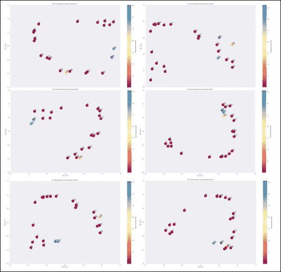

如你所见，每个种子给出了完全不同的二维表示。更有趣的是异常点（标记为 20、21 和 22）始终具有相同的重构误差（由它们的颜色给出）。对于模型来说，这些都是有效的二维压缩表示，其中包含相同数量的信息，并且可以解码为原始时间序列。

然后我们可以使用自编码器来降低维度，然后使用无监督方法（例如基于密度的聚类）来将相似点分组。通过对每个种子重复聚类，我们可以应用一致性聚类来确定哪些点最大程度上相互一致（总是被聚类在一起的点）。这种方法不一定告诉你异常在哪里，但它将帮助你了解数据并发现可以进一步调查的小维度聚类。越小且与其他聚类相隔越远，异常得分越高。

# 总结

异常检测是许多应用中常见的问题。

在本章的开始，我们描述了一些可能的用例，并根据上下文和应用需求突出了主要类型和区别。

我们简要介绍了使用浅层机器学习算法解决异常检测的一些流行技术。主要差异在于特征生成的方式。在浅层机器学习中，这通常是一个手动任务，也称为特征工程。使用深度学习的优势在于它可以以无监督的方式自动学习智能数据表示。良好的数据表示可以极大帮助检测模型发现异常。

我们概述了 H2O 并总结了其用于深度学习的功能，特别是自编码器。

我们实施了一些概念验证示例，以学习如何应用自编码器来解决异常检测问题。

对于数字识别，我们根据模型重构误差给出的异常分数对每个图像进行了排序。

类似的方法还可以进一步扩展到应用程序，如签名验证、手稿的作者手写识别或通过图像照片进行故障检测。

数字识别示例是一种单点异常检测。它使用了仅有一个隐藏层的浅层架构。

对于心电图（ECG）示例，我们使用了更深的架构，并展示了一种基于压缩特征表示而不是完全重构的附加检测技术。我们使用网络的编码器部分将原始数据的非线性关系压缩成更小的维度空间。然后可以将新的表示用作预处理步骤，以应用常规的异常检测算法，如高斯多元分布。通过减少到二维空间，甚至可以可视化数据点并识别主椭圆分布边界上的异常。

尽管如此，自编码器并不是使用深度学习进行异常检测的唯一方法。您也可以采用监督方法，从数据中剔除部分信息，并尝试根据剩余信息进行估计。预测值将代表您的正常预期行为，与该值偏离的部分将代表异常。例如，在时间序列的情况下，您可以使用循环神经网络（RNN）或其在长短期记忆（LSTM）中的演变作为回归模型，以预测时间序列的下一个数值，然后使用预测值和观察值之间的误差作为异常得分。

我们更倾向于专注于这种半监督方法，因为它可以应用于许多应用程序，并且还因为它在 H2O 中得到了很好的实现。

另一个重要的细节是，大部分代码片段是用于数据分析、操作和可视化的。通过使用 H2O，我们可以仅用几行代码就实现深度神经网络。与其他框架相比，这相当令人印象深刻。此外，H2O 的估计器和模型提供了各种可自定义的参数和不同的配置。另一方面，我们发现 H2O 在扩展其用途到目前不支持的范围方面相当有限。总的来说，这是一项非常有前景的技术，还有很大的改进空间。

请注意，本章涵盖的技术仅作为深度学习如何应用于异常检测的概念验证。在处理生产数据时，有许多技术和实际方面的注意事项和陷阱需要考虑。我们将在第十章, *构建一个生产就绪的入侵检测系统*中涵盖其中的一些。
