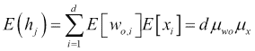
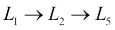
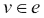

# 第十章：构建生产就绪的入侵检测系统

在前一章中，我们详细解释了异常检测是什么以及如何使用自动编码器来实现它。我们提出了一种半监督方法来进行新颖性检测。我们介绍了 H2O，并展示了一些在该框架之上实现的例子（MNIST 数字识别和 ECG 脉冲信号），这些例子在本地模式下运行。这些示例使用了一个已经清理和准备好用作概念验证的小型数据集。

现实世界的数据和企业环境工作方式大不相同。在本章中，我们将利用 H2O 和一般的常见做法来构建一个可扩展的分布式系统，准备好在生产环境中部署。

我们将以入侵检测系统为例，旨在检测网络环境中的入侵和攻击。

我们将提出一些实际和技术问题，这些问题在构建用于入侵检测的数据产品时可能会遇到。

特别是，你将学到：

+   数据产品是什么

+   如何更好地初始化深度网络的权重

+   如何使用 HOGWILD! 并行化多线程随机梯度下降算法

+   如何利用 Apache Spark 和 Sparkling Water 在 Map/Reduce 上分布计算

+   调整可扩展性和实现参数的一些经验法则

+   自适应学习的全面技术列表

+   如何在有和无地面真实情况下进行验证

+   如何在精度和减少误报之间选择正确的权衡

+   考虑技术和业务方面的详尽评估框架的一个例子

+   模型超参数和调整技术的摘要

+   如何将训练好的模型导出为 POJO 并部署在异常检测 API 中

# 什么是数据产品？

数据科学的最终目标是通过采用数据密集型解决方案来解决问题。重点不仅在于回答问题，而且在于满足业务需求。

仅构建数据驱动的解决方案是不够的。如今，任何应用程序或网站都由数据驱动。构建一个用于列出待售物品的 Web 平台确实会使用数据，但不一定是一个数据产品。

Mike Loukides 给出了一个很好的定义：

> *数据应用程序从数据本身获取其价值，并因此生成更多数据；它不仅仅是一个带有数据的应用程序；它是一个数据产品。数据科学使得能够创建数据产品。*
> 
> *来源于《什么是数据科学》([`www.oreilly.com/ideas/what-is-data-science`](https://www.oreilly.com/ideas/what-is-data-science))*

基本要求是系统能够从数据中提取价值——而不仅仅是消耗它——并生成知识（以数据或见解的形式）作为输出。数据产品是能够从原始数据中提取信息、建立知识并有效地消耗它以解决特定问题的自动化。

在异常检测章节中的两个示例定义了数据产品的概念。我们打开了一个笔记本，加载了一份数据快照，开始分析和尝试深度学习，并最终产生了一些证明我们可以应用自编码器来检测异常的图表。尽管整个分析是可重复的，在最好的情况下，我们可能已经建立了一个概念验证或玩具模型。这对解决现实世界的问题合适吗？这对你的业务来说是一个最小可行产品（MVP）吗？可能不是。

机器学习、统计学和数据分析技术并不是新事物。数学统计学的起源可以追溯到 17 世纪；机器学习是**人工智能**（**AI**）的一个子集，这是由艾伦·图灵在 1950 年通过他的*Turing Test*证明的。你可能会认为数据革命始于数据收集的增加和技术的进步。我认为这正是使数据革命能够顺利进行的原因。真正的转变可能发生在公司开始意识到他们可以通过信任他们的数据来创建新产品、提供更好的服务，并显著改进他们的决策。然而，创新不在于手动地在数据中寻找答案；而是在于整合从数据驱动系统中生成的信息流，这些信息流可以提取并提供能够推动人类行动的见解。

**数据产品**是科学和技术交汇的结果，旨在生成人工智能，能够在我们的代表进行规模化和不偏颇的决策。

因为数据产品通过消耗更多的数据而变得更好，而且它本身也会生成数据，所以生成效应理论上可以建立一个无限的信息流。因此，数据产品必须也是自适应的，并能在收集到新观测数据时逐步融合新知识。统计模型只是最终数据产品的一个组成部分。例如，在异常检测后的入侵检测系统会反馈一堆可用于后续模型训练的标记数据。

然而，数据分析在每个组织中也非常重要。在组织中经常会找到数据科学家和分析师混合团队。手动监督、检查和可视化中间结果对于构建成功的解决方案是必不可少的要求。我们的目标是消除有限产品的人工干预。换句话说，开发阶段涉及大量的探索性分析和手动检查点，但最终的交付通常是端到端的管道（或一堆独立的微服务），它以数据作为输入并产生数据作为输出。整个工作流最好是自动化、经过测试且可扩展的。理想情况下，我们希望在企业系统中集成实时预测，以便对每次检测做出反应。

例如，工厂中的一个大屏幕显示实时测量数据，来自活动机器，可以在出现问题时发出警报。这些数据产品不会替你修复机器，但会成为人类干预的支持工具。

人类互动通常应该是：

+   领域专业知识通过从经验中设置先验来

+   开发与测试

+   产品的最终消费

在我们的入侵检测系统中，我们将利用数据为安全分析团队推荐行动，以便他们能够优先考虑并做出更好的决策。

# 训练

训练网络意味着已经设计好了网络的拓扑结构。为此，我们建议参考第四章中的相应自编码器部分，对输入数据的类型和预期用例进行设计指南。

一旦我们定义了神经网络的拓扑结构，我们就处于起点了。模型现在需要在训练阶段进行拟合。我们将介绍一些适合于具有大型数据集的生产环境的训练算法的学习加速和扩展技术。

## 权重初始化

神经网络的最终收敛性可以受到初始权重的强烈影响。根据我们选择的激活函数，我们希望在最初的迭代中具有陡峭的斜率，以便梯度下降算法可以快速跳入最佳区域。

对于第一层（直接连接到输入层）的隐藏单元*j*，维度为*d*的训练样本*x*在第一次迭代的值之和为：


这里，*w*[*0,i*]是第*i*维的初始权重。

由于我们选择的权重是独立同分布的（*i.i.d.*），并且也独立于输入，单元*j*的均值为：



如果输入值*x*[*i*]被归一化为*µ*[*x*]*=0*和标准差*s*[*x*]*=1*，则均值为*E(h*[*j*]*)*，方差为：


隐藏单元*j*的输出将通过其激活函数转换为：


这里的*b*是偏置项，可以简单地初始化为 0 或非常接近 0 的值，例如在 ReLU 激活函数的情况下为 0.01。

在 sigmoid 函数的情况下，对于大值（正负），我们得到非常平坦的曲线。为了获得较大的梯度，我们希望处于*[-4，+4]*范围内。

如果我们从均匀分布中抽取初始权重，则单元*j*的方差变为：


*h*[*j*]落在[-4，+4]之外的概率非常小。我们有效地减少了过早饱和的概率，无论*d*的大小如何。

将初始权重分配为输入层节点数*d*的函数的技术称为均匀自适应初始化。H2O 默认应用均匀自适应选项，通常比固定均匀或正态分布更好。

如果我们只有一个隐藏层，只需初始化第一层的权重即可。在深度自动编码器的情况下，我们可以预先训练一堆单层自动编码器。也就是说，我们创建一堆浅自动编码器，其中第一个重建输入层，第二个重建第一个隐藏层的潜在状态，依此类推。

让我们使用标签*L*[*i*]来标识第*i*层，其中*L*[*0*]是输入层，最后一个是最终输出，其他所有层都是隐藏层。

例如，一个 5 层网络可以拆分为 2 个网络和。

第一个自动编码器，在训练后，将初始化*L*[*1*]的权重，并将输入数据转换为*L*[*1*]的潜在状态。这些状态用于训练第二个自动编码器，后者将用于初始化*L*[*2*]的权重。

解码层共享编码对应的初始权重和偏置。因此，我们只需要预训练网络的左半部分。

很可能，一个 7 层网络可以拆分为、和。

一般来说，如果深度自动编码器有 N 层，我们可以将其视为一堆堆叠的单层自动编码器：


预训练后，我们可以一起训练整个网络，使用指定的权重。

## 使用 HOGWILD!的并行 SGD

正如我们在前几章中所看到的，深度神经网络是通过反向传播给定损失函数产生的错误来进行训练的。反向传播提供了模型参数（每一层的权重 *W* 和偏差 *B*）的梯度。一旦我们计算出梯度，我们可以使用它来沿着最小化错误的方向移动。其中最流行的技术之一是**随机梯度下降**（**SGD**）。

SGD 可以总结如下。

1.  初始化 *W*, *B*。

1.  在收敛前：

    +   获取训练样本*i*

    +    对于任何的*W*

    +    对于任何的*B*

这里*W*是权重矩阵，*B*是偏置向量，是通过反向传播计算的梯度，*a*是学习率。

尽管 SGD 是许多机器学习模型最流行的训练算法，但它并不是高效的可并行化的。文献中提出了许多并行化版本，但大多数都受到处理器之间同步和内存锁限制的困扰，没有利用参数更新的稀疏性，这是神经网络的常见特性。

在大多数神经网络问题中，更新步骤通常是稀疏的。对于每个训练输入，只有少数与错误反应的神经元相关的权重被更新。一般来说，神经网络被构建成每个神经元只有在输入中存在特定特征时才激活。事实上，每次输入都激活的神经元并不是很有用。

**HOGWILD!** 是一种替代算法，允许每个线程覆盖其他线程的工作，并提供更好的性能。使用 HOGWILD!，多个核心可以异步处理训练数据的不同子集，并独立地对梯度更新做出贡献

如果我们把数据的维度 *d* 分成小的子集 *E*，然后是由*E*的坐标索引的向量*x*的部分，我们可以把整个成本函数 *L* 分解为：


我们利用的关键属性是成本函数在某种意义上是稀疏的，即，而*d*可能很大，但是*L*[*e*]只在输入向量（）的较小部分上计算。

如果我们有*p*个处理器，共享相同的内存，且都能访问向量*x*，则组件更新是原子的，因为具有加法性质：


这意味着我们可以更新单个单元的状态而无需单独的锁定结构。更新多个组件的情况则不同，在这种情况下，每个处理器都会异步重复以下循环：

在*E*中均匀随机采样*e*。

读取当前状态  并评估 。

对于  执行 。

这里  是梯度  乘以 。*b*[*v*]是一个位掩码向量，其中 1 对应于*e*的选定索引，*?*是步长，每个时期末会缩小一个因子ß。

因为梯度计算不是瞬时的，任何处理器可能随时修改*x*，我们可能会使用在许多时钟周期之前读取的旧值计算梯度来更新*x*。HOGWILD 的新颖之处在于提供了一种异步的、增量的梯度算法在其中收敛的条件。

特别是，已经证明梯度计算和使用之间的延迟始终小于或等于最大值$t$。$t$的上界值取决于处理器的数量，并且当我们接近算法的标准串行版本时，$t$收敛于 0。如果处理器的数量小于*d*^(*1/4*)，那么我们获得的梯度步数几乎与串行版本相同，这意味着我们在处理器数量方面实现了线性加速。此外，输入数据越稀疏，处理器之间的内存争用可能性就越小。

在最坏的情况下，即使梯度计算具有计算密集性，该算法也始终可以提供一些速度改进。

你可以在原始论文中找到更多细节：[`people.eecs.berkeley.edu/~brecht/papers/hogwildTR.pdf`](https://people.eecs.berkeley.edu/~brecht/papers/hogwildTR.pdf)。

总之，有许多优化学习速度、稳定性和陷入局部最优的概率的技术。非自适应学习率与动量结合可能会产生最好的结果，但这将需要调整更多的参数。Adadelta 是复杂性和性能之间的权衡，因为它只需要两个参数（ρ和ϵ），并且能够适应不同的场景。

## 自适应学习

在前面的段落中，我们已经看到了权重初始化的重要性和 SGD 算法的概述，其基本版本使用固定值的学习率 a。它们都是保证快速和准确收敛的重要条件。

可以采用一些先进的技术来动态优化学习算法。特别是，我们可以划分为两种类型的技术：一种旨在在任何方便的地方加快学习，另一种在接近局部最小值时减慢学习。

如果θ[t]表示我们在迭代*t*（权重和偏差参数）更新的数量，则一般 SGD 算法的更新如下：


### 学习率退火

我们需要选择α。学习率较低将需要很多迭代才能收敛，并且有搁置在局部最小值的风险。具有较高学习率会导致不稳定性。如果算法包含太多动能，那么最小化θ的步骤会导致其在周围跳来跳去。

学习率退火在训练期间消耗数据点时，会将α[*t*]缓慢降低。一种技术是在每*k*个样本更新一次：


因此，衰减率将对应于需要将学习率减半所需的训练样本数的倒数。

### 动量

动量考虑了前几次迭代的结果来影响当前迭代的学习。引入并定义一个新的速度向量*v*，如下所示：


这里µ是动量衰减系数。我们不再使用梯度来改变位置，而是使用梯度来改变速度。动量项负责加快学习，在梯度继续指向同一方向的维度上，减慢那些梯度符号交替的维度，也就是那些对应于局部最优解区域的区域。

这个额外的动量项将有助于更快地收敛。不过过多的动量可能会导致发散。假设我们运行带动量的 SGD 足够的 epochs，最终速度最终将是：


如果*µ*小于 1，则这是一个几何级数；那么极限将收敛到与以下成比例的某物：


在这个公式中，当*µ*接近 1 时，系统会移动得太快。

此外，在学习初期，可能已经存在大梯度（权重初始化的影响）。因此，我们希望以一个小的动量开始（例如 0.5）; 一旦大梯度消失，我们可以增加动量，直到它达到最终稳定值（例如 0.9），并保持恒定。

### Nesterov 的加速

标准动量计算当前位置的梯度，并放大累积梯度方向的步骤。就像把球推下山并盲目地跟随山坡斜率一样。由于我们可以近似地预测球会落在哪里，所以我们希望在计算梯度时考虑这个信息。

让我们记住时间*t*处参数*θ*的值是：


如果我们省略二阶导数，?t 的梯度可以近似为：


更新步骤将使用时间*t*处的梯度而不是*t – 1*处的梯度计算：


Nesterov 变化首先会朝着先前累积梯度的方向迈出一大步，然后再根据跳跃后计算的梯度进行校正。这种校正防止了它过快地行进并提高了稳定性。

在*球滚下山*的类比中，Nesterov 校正根据山坡调整速度，并且仅在可能的情况下加速。

### 牛顿方法

而单阶方法只使用梯度和函数评估来最小化*L*，二阶方法也可以使用曲率。在牛顿方法中，我们计算损失函数*L(θ)*的二阶偏导数的 Hessian 矩阵*HL(θ)* 。逆 Hessian 将定义 a 的值，最终步骤方程为：


这里使用对角线的绝对值来确保负梯度方向最小化*L*。参数?用于平滑具有小曲率的区域。

通过使用二阶导数，我们可以在更有效的方向上执行更新。特别是，在平缓（平坦）曲率上我们会有更激进的更新，而在陡峭的曲率上会有更小的步长。

该方法的最佳属性是它没有超参数，除了平滑参数被固定为一个小值；因此它是一个维度较少的调整。主要问题在于计算和内存成本。*H*的大小是神经网络大小的平方。

已经开发了许多拟牛顿方法来近似逆 Hessian。例如，**L-BFGS（Limited Memory Broyden-Fletcher-Goldfarb-Shanno）**只存储几个向量，这些向量隐含地表示近似和所有先前向量的最后更新的历史。由于 Hessian 是从以前的梯度评估中近似构建的，因此在优化过程中不改变目标函数非常重要。此外，朴素实现需要在单个步骤中计算完整数据集，并且不太适合小批量训练。

### Adagrad

**Adagrad**是 SGD 的另一种优化，根据先前所有计算梯度的 L2 范数每个维度进行学习率的调整。

α的值取决于时间*t*和第*i*个参数θ[*t,i*]：


这里*G*[*t*]是一个*d* x *d*大小的对角矩阵，元素*i, i*是*θ*[*k,i*]的梯度平方和直到迭代*t – 1*：


每个维度的学习率与梯度成反比。也就是说，较大的梯度将具有较小的学习率，反之亦然。

参数ϵ是一个平滑项，有助于避免除以零。它通常在 1e-4 和 1e-10 之间波动。

向量化更新步骤由按元素矩阵-向量乘法给出：


全局学习率*a*在分子上可以设置为默认值（例如 0.01），因为算法会在几次迭代后自动适应它。

现在我们已经获得了速率退火的相同衰减效果，但具有良好的性质，即每个维度随着时间的推移均匀化，就像二阶优化方法一样。

### Adadelta

Adagrad 的一个问题是非常敏感于初始状态。如果初始梯度很大，并且我们希望它们像权重初始化中描述的那样很大，那么相应的学习率将从训练开始就非常小。因此，我们必须通过设置*a*的高值来抵消这种效应。

Adagrad 的另一个问题是分母一直在积累梯度，并在每次迭代中增长。这使得学习率最终变得无限小，以至于算法不能再从剩余的训练数据中学到任何新东西。

Adadelta 旨在通过将累积的过去梯度数量固定为某个*W*值，而不是*t-1*来解决后一个问题。它不是存储*w*个先前的值，而是在时间*t*上以递减的方式执行正在运行的平均值。我们可以用过去梯度的递减平均值替换对角矩阵*G*[*t*]：


这里的*ρ*是衰减常数，通常在 0.9 和 0.999 之间波动。

我们真正需要的是的平方根，它近似了时间*t*下的**均方根**(**RMS**)：


更新步骤将是：


我们已经定义了Δ，即每次迭代时要添加到参数向量中的更新步骤。为了使这些方程正确，我们必须确保单位匹配。如果我们想象参数有一些假设的单位，Δ应具有相同的单位。到目前为止考虑的所有一阶方法都将Δ的单位与参数的梯度相关联，并假设成本函数*L*是无量纲的：


相比之下，牛顿法等二阶方法使用 Hessian 信息，或其近似值，来获取正确的更新步骤单位？：


对于方程，我们需要用某个与*t*的 RMS 成比例的量替换项*a*。

由于我们目前不知道?(*t*)，所以我们只能计算相同大小的窗口*w*上*t* – 1 的均方根值：


其中使用相同的常数 ?，其目的是在 ?(0) = 0 时启动第一次迭代，并确保即使由于累积梯度在分母上饱和效应导致之前的更新很小，也能保持进展。

如果曲率足够平滑，我们可以近似 ，这将改变 Adadelta 的方程为：


最终的 Adadelta 方程覆盖了讨论的许多方法的特性：

+   它是对对角 Hessian 的近似，但只使用 ?L 和 ? 的 RMS 度量，并且每次迭代只进行一次梯度计算。

+   它始终遵循负梯度，就像普通的 SGD 一样。

+   分子滞后于分母 1 次。这使得学习对突然出现的大梯度更加稳健，在分子能够反应之前，它会增加分母并降低学习率。

+   分子起到了加速项的作用，就像动量法一样。

+   分母的作用类似于 Adagrad 中的每个维度衰减，但是通过固定的窗口保证了在任何步骤中，每个维度总是取得进展。

## 通过 Map/Reduce 进行分布式学习

将训练并行化在多个并发线程中是一个很大的改进，但它受到单台机器中可用核心和内存的数量的约束。换句话说，我们只能通过购买更多资源丰富和更昂贵的机器来实现垂直扩展。

结合并行和分布式计算可以实现所需的水平可扩展性，只要我们有增加额外节点的能力，理论上是无限的。

我们选择 H2O 作为异常检测框架的两个原因是它提供了一个易于使用的内置自动编码器实现，以及它在功能（我们想要实现的内容）和实现（我们如何实现它）之间提供了一个抽象层。这个抽象层提供了透明和可扩展的实现，允许以 map/reduce 的方式进行计算和数据处理的分布。

如果我们的数据在每个节点上均匀分区在较小的分片中，我们可以将高级分布式算法描述如下：

1.  **初始化**：提供具有权重和偏置的初始模型。

1.  **洗牌**：数据可以完全在每个节点上可用，也可以进行引导采样。我们将在段落末尾解决这个数据复制问题。

1.  **映射**：每个节点将通过使用 HOGWILD!中的异步线程基于本地数据进行模型训练。

1.  **减少**：每个训练模型的权重和偏置被平均到最终模型中。这是一个蒙德运算和可交换操作；平均是可结合和可交换的。

1.  **验证**（可选）：当前的平均模型可以针对验证集进行评分，以进行监控、模型选择和/或提前停止准则。

1.  **迭代**：在满足收敛标准之前多次重复整个工作流程。

    H2O 深度学习架构

复杂度时间将会是每次迭代 o(n/p + log(p))，其中 n 是每个节点中数据点的数量，p 是处理器的数量（节点）。线性项是映射计算，对数项是减少计算。

在前述公式中，我们没有考虑内存占用和数据洗牌的昂贵性。我们可以忽略减少步骤中模型平均的复杂性，因为我们假设模型参数相对于数据大小足够小。特别是，模型的大小是网络的神经元数量加上隐藏层的数量（偏置项）对应的参数数量。假设你有一百万个神经元，模型的总大小将小于 8MB。

最终的可扩展性将取决于：

+   计算并行性

+   内存缓冲

+   网络流量和 I/O

我们的目标是在模型精度和训练速度之间找到合适的权衡。

我们将使用术语迭代来表示仅在指定数量的`train_samples_per_iteration`上训练的单个 Map/Reduce 步骤。参数`epochs`将定义完成训练所需的数据通行证数量。

`train_samples_per_iteration`参数可以对应整个数据集，也可以更小（无替换的随机采样），甚至更大（有替换的随机采样）。

`train_samples_per_iteration`的值将影响内存占用和模型平均时间，也就是训练速度。

另一个重要的参数是布尔标志`replicate_training_data`。如果启用，整个数据的副本将在每个节点上可用。这个选项将允许每个模型训练得更快。

另一个关联参数是`shuffle_trainingd_data`，它决定数据是否可以在节点之间进行洗牌。

如果 N 是可用节点的数量，n 是训练数据集的大小，我们可以通过`train_samples_per_iteration`的特殊值和`replicate_training_data`的激活来识别一些特定的操作模式：

| `train_samples_per_iteration` | `replicate_training_data` | 描述 |
| --- | --- | --- |
| 0 | False | 只进行一个 epoch，在本地数据平均构建 N 个模型。 |
| -1 | True | 每个节点每次迭代处理整个数据集。这导致 N 个节点中的每个并行训练 N 个 epoch。 |
| -1 | False | 所有节点只处理本地存储的数据。一个 epoch 对应一个迭代。你可以有很多 epochs。 |
| -2 | True | 根据计算时间和网络开销的自动调整迭代次数。完整数据集被复制，进行无替换采样。 |
| -2 | False | 基于计算时间和网络开销自动调整每次迭代的样本数。只有本地数据可用；可能需要有放回地进行采样。 |
| > 0 | true | 从完整数据集中抽样的每次迭代的固定样本数量。 |
| > 0 | false | 从只有本地可用数据中抽样的每次迭代的固定样本数量。 |

如果*n=1M*且*N=4*，每个节点平均将存储 25K 个本地数据。如果我们设置*samples_per_iteration=200K*，单个 Map/Reduce 迭代将处理 20 万条记录。也就是说，每个节点将处理 5 万行。为了完成一个 epoch，我们需要 5 个 Map/Reduce 迭代对应 20 个本地训练步骤。

在前面的例子中，每个节点都将从本地可用数据中获取这 50K 个样本，根据本地数据量与请求的数据量的大小，可以有或没有对数据进行采样。采用有放回抽样可能会对模型的准确性产生负面影响，因为我们将在数据的重复和有限的子集上进行训练。如果我们启用复制，我们在每个节点上始终具有最多的本地数据，假设可以放入内存。

当我们想要精确处理本地数据量而不对数据进行采样（*train_samples_per_iteration = -1*）时，也是一个特殊情况。在这种情况下，在每次迭代中，我们将反复迭代相同的数据集，这对于多次迭代来说是多余的。

另一个特殊情况是当`samples_per_iteration`接近或大于启用复制的 N * n。在这种情况下，每个节点在每次迭代中将几乎使用整个数据集或更多进行训练。同样，在每次迭代中几乎使用相同的数据。

对于这两种特殊情况，`shuffle_training_data`会自动开启。也就是说，在每次训练之前本地数据将被随机混洗。

总之，根据数据大小的不同，我们可能会在每个节点上复制或不复制数据。H2O 提供了一种智能的方式，通过平衡 CPU 成本和网络开销自动调整和适应每次迭代的大小。除非你对系统进行微调有特殊要求，你可能会想使用自动调整选项。

深度学习的分布式算法将在准确性和训练速度上使你的最终模型受益。即使你可能没有一个非常大的数据集，这种分布式方法也是你考虑用于生产系统的东西。

## Sparkling Water

尽管 H2O 可以在自己的独立集群上运行，但企业环境可能已经有一个分布式数据处理集群。即使物理上在相同的机器上，管理两个单独的集群也可能会很昂贵和冲突。

**Apache Spark**如今是处理大型数据集和构建可扩展数据产品的事实计算框架。H2O 包括 Sparkling Water，这是一个抽象层，让你可以将数据和算法模型与本机框架的所有功能和功能结合起来，同时还具有 Spark 的能力。

Sparkling Water 是用于进行机器学习的 ML 和 MLlib 框架的替代品，也是在 Spark 之上进行深度学习的少数替代品之一。

Spark 是用 Scala 设计和实施的。为了理解 H2O 和 Spark 的互操作性，我们需要参考本地 Scala API。

在 Sparkling Water 架构中，H2O 上下文与 Spark 上下文共存于驱动节点。此外，现在 Spark 2 有 SparkSession 作为主要入口点。很可能，H2O 和 Spark 执行器共存于工作节点。因此，它们共享相同的**Java 虚拟机**(**JVM**)和内存。资源分配和设置可以通过 YARN 来完成，YARN 是用于资源管理和作业调度的 Hadoop 组件。

你可以构建端到端的管道，结合了 Spark 和 MLlib 的优势以及 H2O 的特点。

例如，你可能会一起使用 Spark 和 H2O 进行数据整理并交替应用不同的转换函数。然后在 H2O 中进行深度学习建模。最终，你可以将训练好的模型返回，以在更大的应用程序中进行集成。

Spark 提供了三种 API 用于存储、建模和操纵数据。类型化的**RDD**(**弹性分布式数据**)、DataFrame 和最近统一的 DataSet API。**DataFrame**是`sql.Row`类型的 RDD；因此在这种集成中，它们被认为是类似的。

Sparkling Water 目前提供了在`H2OFrame`和 RDD 以及 DataFrame 之间的双向转换。将`H2OFrame`转换为 RDD 时，会创建一个包装器，将列名映射到在`Product` trait 中指定的类类型的相应元素。也就是说，你通常需要声明一个 Scala case 类，作为你从`H2OFrame`转换数据的容器。这种方法的局限性在于 case 类只能存储最多 21 个平面字段。对于更大的表，可以使用嵌套结构或字典。

将`H2OFrame`转换为 Spark DataFrame 不需要任何类型的参数。模式会动态地从`H2OFrame`的列名和类型中派生出来。

相反地，将现有的 RDD 或 DataFrame 转换成`H2OFrame`需要数据被复制和重新加载。由于`H2OFrame`被注册在键/值存储中，我们可以选择性地指定框架名称。在 RDD 的情况下，不需要指定明确的类型，因为 Scala 编译器可以推断出来。

列的基本类型必须与以下表格相匹配：

| Scala/Java 类型 | SQL 类型 | H2O 类型 |
| --- | --- | --- |
| 无 | 二进制类型 | 数值 |
| Byte | ByteType | Numeric |
| Short | ShortType | Numeric |
| Integer | IntegerType | Numeric |
| Long | LongType | Numeric |
| Float | FloatType | Numeric |
| Double | DoubleType | Numeric |
| String | StringType | String |
| Boolean | BooleanType | Numeric |
| java.sql.TimeStamp | TimestampType | Time |

RDD 和 `H2OFrame` 在执行器 JVM 中共享相同的内存空间；在转换和复制后取消持久化它们是方便的。

现在我们已经了解了与 Spark 的本地 Scala 集成的工作原理，我们可以考虑 Python 包装器。

在驱动程序中，Python `SparkContext` 将使用 `Py4J` 启动驱动程序 JVM 和相应的 Java `SparkContext`。后者将创建 `H2OContext`，然后在 Spark 集群中启动 H2O 云。在此设置阶段之后，可以使用 H2O 和 `PySpark` 的 Python API 与数据和算法进行交互。

虽然 `PySpark` 和 `PySparkling` 是在 Python 中开发 Spark 和 H2O 的良好选择，但请记住 Python API 是 JVM 执行器的包装器。在分布式环境中维护和调试复杂项目可能比坚持使用本地 API 更加繁琐。尽管如此，在大多数情况下，Python API 都能正常工作，您不必在 Python 和本地语言之间切换。

# 测试

在讨论数据科学中测试的含义之前，让我们总结一些概念。

首先，总的来说，在科学中什么是模型？我们可以引用以下定义：

> *在科学中，模型是用于描述和解释无法直接体验的现象的想法、对象、甚至过程或系统的表示。*
> 
> *科学建模, 科学学习中心, http://sciencelearn.org.nz/Contexts/The-Noisy-Reef/Science-Ideas-and-Concepts/Scientific-modelling*

还有这个：

> *科学模型是对现实世界现象的概念、数学或物理表示。当对象或过程至少部分理解但难以直接观察时，通常会构建模型。例如，用棍子和球表示分子，数学模型表示行星运动或概念原理如理想气体定律。由于实际自然界中的无限变化，除了最简单和最模糊的模型外，其他模型都是对真实世界现象的不完美表示。*
> 
> 在科学中，什么是模型？参考: https://www.reference.com/science/model-science-727cde390380e207

我们需要一个模型来简化系统的复杂性，以一种假设的形式。我们证明了深度神经网络可以描述复杂的非线性关系。尽管我们只是用比浅层模型更复杂的东西来逼近一个真实系统，但最终这只是另一个近似。我怀疑任何真实系统实际上都像神经网络一样工作。神经网络受到我们的大脑处理信息的方式的启发，但它们只是对它的巨大简化。

模型是根据一些参数（参数模型）来定义的。一方面，我们有一个将输入空间映射到输出的函数模型的定义。另一方面，我们需要一堆参数，函数需要这些参数来应用映射。例如，权重矩阵和偏差。

模型拟合和训练是指估计模型参数以使其最佳描述基础数据的过程。模型拟合通过定义依赖于模型参数和数据的损失函数的学习算法进行，然后尝试通过估计模型参数的最佳值集合来最小化这个函数。其中最常见的算法之一是梯度下降，以及它的所有变体。请参见之前的训练部分。对于自动编码器，你将最小化重构误差以及正则化惩罚（如果有的话）。

**验证**有时被与测试和评估混淆。验证和测试通常使用相同的技术和/或方法，但它们有两个不同的目的。

模型验证对应于一种假设验证。我们认为我们的数据可以被模型很好地描述。假设是，如果该模型是正确的，在经过训练（参数估计）后，它将以与训练集相同的方式描述未见过的数据。我们假设模型在我们将要使用的场景的限制下足够泛化。模型验证旨在找到一个量化模型如何拟合验证数据的度量（通常称为指标）。对于有标签数据，我们可以从验证数据上的异常分数计算的**受试者工作特征**（**ROC**）或精确率-召回率（**PR**）曲线中推导出一些指标。对于无标签数据，例如可以使用**异常质量**（**EM**）或**质量-体积**（**MV**）曲线。

尽管模型验证可以作为评估性能的一种方式，但它被广泛用于模型选择和调整。

**模型选择**是在一组候选模型中选择得分最高的模型的过程。候选模型可以是相同模型的不同配置，许多不同模型，选择不同特征、不同归一化和/或转换技术等。

在深度神经网络中，特征选择可能被省略，因为我们委托网络本身来扮演找出和生成相关特征的角色。此外，特征也通过学习过程中的正则化而被丢弃。

假设空间（模型参数）取决于拓扑选择、激活函数、大小和深度、预处理（例如图像白化或数据清洗）和后处理（例如，使用自动编码器减少维度，然后运行聚类算法）。我们可以将整个流程（给定配置上的组件集）看作模型，即使每个部分的拟合可能是独立进行的。

类似地，学习算法将引入一些参数（例如，学习率或衰减率）。特别是，因为我们希望最大化模型的泛化能力，通常在学习函数中引入正则化技术，这将引入额外的参数（例如，稀疏系数，噪声比或正则化权重）。

此外，算法的特定实施还具有一些参数（例如，周期，迭代次数）

我们可以使用相同的验证技术来量化模型和学习算法的性能。我们可以想象存在一个包括模型参数和超参数的单个大向量。我们可以调整所有内容以最小化验证度量标准。

在经过验证的模型选择和调整结束时，我们得到了一个系统，该系统：

+   取可用数据的一部分

+   分为训练和验证，确保不引入偏见或不平衡

+   创建由不同模型或不同配置、学习参数和实现参数构成的搜索空间

+   利用给定的损失函数（包括正则化）根据指定参数在训练数据上使用训练数据和学习算法对每个模型进行拟合

+   通过在验证数据上应用拟合模型来计算验证度量标准

+   选择使验证度量标准最小化的搜索空间中的一个点

选定的点将明确定义我们的最终理论。该理论表明我们的观察结果是从所选点对应的流程生成的模型生成的。

评估是验证最终理论的可接受性并从技术和业务角度量化其质量的过程。

科学文献显示了在历史进程中一个理论是如何取代另一个的。在不引入认知偏见的情况下选择正确的理论需要理性、准确的判断和逻辑解释。

确认理论，即指导科学推理而非演绎推理的研究，可以帮助我们定义一些原则。

在我们的情况下，我们想量化我们的理论的质量，并验证它是否足够好，并且与一个简单得多的理论（基线）相比具有显而易见的优势。基线可以是我们系统的一个天真的实现。在异常检测器的情况下，它可以简单地是一个基于规则的阈值模型，其中对于每个特征值超过静态阈值集的观察结果都标记为异常。这样一个基线可能是我们可以在一段时间内实现和维护的最简单的理论。它可能不会满足所有的接受标准，但它将帮助我们证明为什么我们需要另一个理论，即更高级的模型。

Colyvan，在他的书 *数学的不可或缺性* 中，总结了接受一个好的理论作为另一个理论替代品的四个主要标准：

1.  **简洁性**/**简约性**：如果实证结果可以比较的话，简单比复杂更好。只有在需要克服某些限制时才需要复杂性。否则，无论是数学形式还是本体论承诺，都应该更喜欢简单。

1.  **统一性**/**解释力**：能够一致解释现有和未来观察结果的能力。此外，统一性意味着尽量减少解释所需的*理论设备*数量。一个好的理论提供了一个直观的方法来解释为什么期望某个给定的预测。

1.  **大胆性**/**富有成效性**：一个大胆的理论是一个想法，如果它是真实的，就能够预测和/或解释我们正在建模的系统的更多内容。大胆性有助于我们拒绝那些对我们已知的知识贡献很少的理论。可以制定一些新颖而创新的内容，然后尝试用已知证据来反驳它。如果我们无法证明一个理论是正确的，我们可以证明证据并不证明相反。另一个方面是启发式潜力。一个好的理论可以促使更多的理论。在两个理论之间，我们希望更偏向于更富有成效的那一个：具有更多被重新使用或扩展的潜力的那一个。

1.  **形式优雅**：一个理论必须具有美学吸引力，并且应该足够强大，以便对一个失败的理论进行临时修改。优雅是以一种清晰、经济、简洁的方式解释某事的质量。优雅也能够更好地进行审查和维护。

在神经网络的情况下，这些标准被转化为以下内容：

1.  我们更喜欢具有少量层和小容量的浅层模型。正如我们在网络设计部分讨论的那样，我们从简单的东西开始，如果需要的话逐渐增加复杂性。最终，复杂性将收敛，并且任何进一步的增加都不会带来任何好处。

1.  我们将区分解释力和统一力：

    +   **解释力** 与模型验证类似，但使用不同的数据集进行评估。我们之前提到我们将数据分成三组：训练、验证和测试。我们将使用训练和验证来制定理论（模型和超参数），然后模型会重新训练在两者的联合上，成为新的训练集；最终，已经验证过的最终模型将与测试集进行评估。在这个阶段，考虑在训练集和测试集上的验证指标非常重要。我们期望模型在训练集上表现更好，但两者之间有太大差距意味着模型无法很好地解释未见观察。  

    +   **统一力** 可以通过模型的稀疏性来表示。解释意味着将输入映射到输出。统一意味着减少应用映射所需的元素数量。通过添加正则化惩罚，我们使特征更稀疏，这意味着我们可以使用更少的回归器（*理论设备*）来解释观察和其预测。  

1.  **果实性和果敢性** 也可以分为两个方面：  

    +   **果敢性** 由我们的测试驱动方法来代表。除了第 2 点，我们试图明确模型的功能和原因，并在测试驱动方法中，我们把系统视为黑盒，并检查在不同条件下的回应。对于异常检测，我们可以系统地创建一些不同程度异常性的失败场景，并测量系统在何种程度上能够检测和反应。或者对于时间反应探测器，我们可以测量检测数据漂移需要多长时间。如果测试通过，那么我们就可以确定它无论如何都能正常工作。这可能是机器学习中最常见的方法之一。我们尝试一切我们认为可能奏效的方法；当我们的关键努力未能成功时，我们会谨慎评估并暂时接受（即，测试通过）。

    +   **果实性** 来自于给定模型和系统的可重复性。它是否与特定用例过于紧密耦合？自编码器独立于底层数据表示的内容，它们使用非常少的领域知识。因此，如果理论是特定自编码器可用于解释系统在其工作条件下的情况，那么我们可以扩展它并在任何类型的系统中重复使用。如果我们引入一个预处理步骤（如图像白化），那么我们就假设输入数据是图像的像素，因此即使这个理论非常适合我们的用例，它对更大范围的可用性贡献度较小。然而，如果领域特定的预处理显著改善最终结果，那么我们将把它视为理论的重要部分。但如果贡献可以忽略不计，建议拒绝以换取更可重复的东西。  

1.  深度神经网络中优雅的一个方面可以被隐式地表示为从数据中学习特征而不是手动构建特征的能力。如果是这样，我们可以通过学习相关特征来衡量同一模型在不同场景下的自适应能力。例如，我们可以测试，在给定任何我们认为正常的数据集的情况下，我们是否可以构建一个始终学习正态分布的自动编码器。我们可以向同一数据集中添加或删除特征，或根据某些外部标准进行分组，从而生成具有不同分布的数据集。然后，我们可以检查学习到的表示，并测量模型的重构能力。与描述模型的具体输入特征和权重的函数相比，我们将其描述为具有学习能力的神经元实体。可以说，这是一个很好的优雅示例。

从商业角度来看，我们真的需要仔细考虑接受标准是什么。

我们至少要回答以下问题：

+   我们试图解决什么问题？

+   公司将如何从中受益？

+   在实际和技术层面上，模型将以何种方式集成到现有系统中？

+   最终的交付物如何才能具有可消化性和可执行性？

我们将尝试以入侵检测系统为例，并尝试回答这些问题。

我们想要实时监控网络流量，对每个单独的网络连接进行标记，标记为正常或可疑。这将使业务能够更好地防范入侵者。被标记的连接将被停止，并进入手动检查队列。安全专家团队将查看这些连接，并确定是否为误报，如果确认是攻击，则将该连接标记为其中一个可用的标签。因此，模型必须提供按异常分数排序的连接实时列表。列表中的元素数量不能超过安全团队的能力。此外，我们需要在允许攻击的成本、在发生攻击时的损害成本以及检查所需的成本之间取得平衡。为了以概率化方式限制最坏情况，最低要求是精确度和召回率。

所有这些评估策略都主要是定性而非定量定义的。很难比较和报告那些无法用数字衡量的内容。

数据科学从业者 Bryan Hudson 说：

> *如果你无法定义它，那就无法衡量它。如果无法测量，就不应该报告。首先定义，然后测量，再报告。*

首先定义，然后测量，再报告。但要小心。我们可以考虑定义一个新的评估指标，考虑到迄今讨论的每个可能的方面和场景。

虽然许多数据科学家可能会尝试使用单一的实用函数来量化模型的评估，就像您在验证过程中所做的那样，但对于真正的生产系统，这是不被建议的。正如专业数据科学宣言中所表达的那样：

> *产品需要一系列措施来评估其质量。一个单一数字无法捕捉现实的复杂性。*
> 
> *专业数据科学宣言，www.datasciencemanifesto.org*

即使在我们定义了**关键绩效指标** (**KPIs**)之后，与基准相比，它们的实际含义是相对的。我们必须考虑为什么我们需要对比更简单或现有的解决方案。

评估策略需要定义测试用例和 KPI，以便我们可以涵盖最科学的方面和业务需求。其中一些是聚合数字，其他可以用图表表示。我们的目标是在单个评估仪表板中总结所有这些内容并有效地呈现它们。

在接下来的几节中，我们将看到一些使用标记和未标记数据进行模型验证的技术。

接下来，我们将看看如何使用一些并行搜索空间技术来调整参数空间。

最后，我们将给出使用 A/B 测试技术进行网络入侵使用情况的最终评估的示例。

# 模型验证

模型验证的目标是评估所训练模型的假设估计/预测的数值结果是否是对独立数据集的可接受描述。主要原因是由于训练集上的任何测量都会存在偏见和乐观主义，因为模型已经看到了这些观察结果。如果我们没有不同的验证数据集，我们可以从训练数据中留出一部分并将其用作基准。另一个常见的技术是交叉折叠验证，及其分层版本，其中整个历史数据集被分成多个折叠。为简单起见，我们将讨论留一法; 同样的标准也适用于交叉折叠验证。

训练集和验证集的划分不能完全随机。验证集应代表我们将用模型进行评分的未来假设场景。重要的是不要用与训练集高度相关的信息（泄露）污染验证集。

可以考虑一系列标准。最简单的是时间。如果您的数据是按时间顺序排列的，那么您将希望选择验证集总是在训练集之后。

如果您的部署计划是每天重新训练一次，并对接下来 24 小时的所有观察结果进行评分，那么您的验证集应恰好为 24 小时。24 小时后的所有观察结果将永远不会使用最后训练的模型进行评分，而是使用包括额外过去 24 小时观察结果的模型进行评分。

当然，仅使用 24 小时观察来进行验证太过严格了。我们需要进行几次验证，在每个分割点，我们将在该点之前训练模型，并在随后的验证窗口中验证数据。

分割点的选择取决于可用资源的数量。理想情况下，我们希望能够映射模型训练的确切频率，也就是说，过去一年左右每天一个分割点。

在分割训练和验证集时需要考虑一些操作事项：

+   无论数据是否具有时间戳，时间顺序应该根据当时可用的时间来设定。换句话说，假设数据生成和将其转换为训练特征空间之间有 6 小时的延迟；你应该考虑后者的时间，以便过滤掉分割点之前或之后的数据。

+   训练过程需要多长时间？假设我们的模型需要 1 小时进行重新训练；我们将在之前模型过期的前一小时安排重新训练。在其训练间隔期间得分将由以前的模型覆盖。这意味着我们无法对在最后一次收集训练数据的后续一小时内发生的任何观察进行预测。这在训练集和验证集之间引入了一个间隙。

+   模型在 day-0 恶意软件（冷启动问题）上表现如何？在验证过程中，我们希望以最坏的情况来评估模型，而不是过于乐观。如果我们可以找到一个分区属性，例如设备 ID 或网络卡 MAC 地址，那么我们可以将用户分成代表不同验证 fold 的桶，并进行交叉 fold 验证，依次选择一个用户 fold 来验证使用其他用户 fold 训练的模型。通过这样做，我们总是验证我们以前从未见过历史的用户的预测结果。这有助于真正衡量对于那些训练集已经包含同一设备在过去连接中的异常信号的情况的泛化能力。在这种情况下，模型很容易发现异常，但他们不一定与实际用例相匹配。

+   应用分区的属性(主键)的选择并不简单。我们希望尽可能减少 fold 之间的相关性。如果我们简单地根据设备 ID 进行分区，我们将如何处理同一用户或同一台机器具有多个设备，都使用不同的标识符注册的情况？选择分区键是一个实体解析问题。解决这个问题的正确方法是首先对属于同一实体的数据进行聚类，然后分区使得属于同一实体的数据绝不会分隔在不同的 fold 中。实体的定义取决于特定的用例背景。

+   在执行交叉折叠验证时，我们仍然需要确保时间约束。也就是说，对于每个验证折叠，我们需要在与其他训练折叠的交集中找到一个时间分割点。在实体 ID 和时间戳上过滤训练集；然后根据验证窗口和间隔来过滤验证折叠中的数据。

+   交叉折叠验证引入了一个类别不平衡的问题。按定义；异常是罕见的；因此我们的数据集是高度倾斜的。如果我们随机抽样实体，那么我们可能会得到一些没有异常的折叠和一些有太多异常的折叠。因此，我们需要应用分层交叉折叠验证，我们希望在每个折叠中均匀保留相同的异常分布。这在未标记数据的情况下是一个棘手的问题。但是我们仍然可以对整个特征空间运行一些统计，并以最小化折叠之间的分布差异的方式进行分区。

我们刚刚列举了在定义分割策略时需要考虑的一些常见陷阱。现在我们需要计算一些度量标准。验证度量标准的选择应与真实操作用例显著相关。

我们将在接下来的几节中看到为标记和未标记数据定义的几个可能的度量。

## 标记数据

标记数据的异常检测可以被视为标准的二元分类器。

让成为我们的异常评分函数，其中分数越高，成为异常的概率就越高。对于自编码器来说，它可以简单地是重构误差上计算的 MSE，并重新缩放为[0,1]范围内。我们主要关心的是相对排序而不是绝对值。

我们现在可以使用 ROC 或 PR 曲线进行验证。

为此，我们需要设置一个与评分函数*s*对应的阈值*a*，并将具有评分*s(x) = a*的所有点*x*视为异常。

对于每个*a*值，我们可以计算混淆矩阵如下：

| 观察数量 n | 预测的异常 *s(x) = a* | 预测的非异常 *(s < a)* |
| --- | --- | --- |
| 真异常 | 真正例（TP） | 假负例（FN） |
| 真负例 | 假正例（FP） | 真负例（TN） |

从与 a 值对应的每个混淆矩阵中，我们可以推导出**真正例率**（**TPR**）和**假正例率**（**FPR**）的度量标准：


我们可以在二维空间中绘制每个*a*值，生成包含的 ROC 曲线。

我们解释图的方式如下：每个切断点告诉我们在 y 轴上我们在验证数据中发现的异常的比例（召回率）。x 轴是误报比率，标记为异常的观察值在所有正常观察值中的比例。

如果我们将阈值设定为接近 0，意味着我们将一切标记为异常，但所有正常的观察将产生虚警。如果我们将其设定为接近 1，我们将永远不会触发任何异常。

假设对于给定的 a 值，相应的 TPR = 0.9 和 FPR = 0.5；这意味着我们检测到了 90%的异常，但异常队列中也包含了一半的正常观察。

最佳阈值点将位于坐标（0,1）处，对应于 0 假阳性和 0 假阴性。这种情况从来不会发生，因此我们需要在召回率和虚警率之间找到一个折衷。

ROC 曲线的一个问题是它不能很好地展现高度偏斜的数据集的情况。如果异常只占数据的 1%，那么* x *轴很可能会很小，我们可能会放松阈值以增加召回率，而对* x *轴没有太大的影响。

**精确度-召回率**（**PR**）图交换轴，并用精确度替换 FPR 定义为：


精确度是一个更有意义的指标，它代表了检测到的异常中的异常部分。

现在的想法是最大化两个轴。在* y *轴上，我们可以观察到将要被检查的部分的预期结果，* x *轴告诉我们有多少异常将会遗漏，它们都取决于异常概率。

有一个二维图可以帮助我们理解检测器在不同场景下的行为，但为了应用模型选择，我们需要最小化一个单一的效用函数。

有一系列措施可以用来综合这一点。最常见的是**曲线下面积**（**AUC**），它是检测器在任何阈值下的平均性能指标。对于 ROC 曲线，AUC 可以解释为均匀抽取的随机异常观察排在均匀抽取的随机正常观察之前的概率。这对于异常检测并不是非常有用。

精确度和召回率的绝对值在同一尺度上被定义，可以使用调和平均值（也称为**F-score**）进行汇总：


在这里，*ß*是一个系数，它权衡了召回率比精确度更重要的程度。

为了将评分缩放在 0 和 1 之间，添加了术语。

对称的情况下，我们得到了 F1 分数：


安全分析员也可以根据精确度和召回率的最小要求设定偏好。在这种情况下，我们可以将偏好中心得分定义为：


PC 分数使我们能够选择一系列可接受的阈值，并根据 F1 分数优化中间点。第一个情况中的单位术语是添加的，因此它将始终优于第二个情况。

## 无标签的数据

不幸的是，大多数情况下数据都没有标签，而且需要太多的人力去对每个观察结果进行分类。

我们提出了两种不需要标签的 ROC 和 PR 曲线的替代品：**质量体积**（**MV**）和 **超额质量**（**EM**）曲线。

这次让  成为我们的逆异常评分函数，其中分数越小，异常的概率越高。在自动编码器的情况下，我们可以使用重构误差的倒数：


这里 ϵ 是一个小项，用于在接近零的重构误差情况下稳定。

评分函数将对每个观察结果进行排序。

让  成为一组 i.i.d. 观测值 X[1],…,X[n] 的正态分布的概率密度函数，*F* 是其累积密度函数。

函数 *f* 对于任何不属于正态分布的观察结果都会返回一个非常接近 0 的分数。我们想找到评分函数 *s* 与 *f* 的接近程度的度量。理想的评分函数将与 *f* 完全一致。我们将称这样的性能准则为 *C(s)*。

给定一组与勒贝格测度可积的评分函数 *S*。

*s* 的 MV-曲线是映射的绘图：


这里 。

集合 *X* 的勒贝格测度通过将集合分成桶（开区间序列）并求和每个桶的 n-体积得到。n-体积是每个维度的长度的乘积，定义为最大值和最小值之间的差异。如果 *X*[i] 是一堆 d 维点的子集，则它们在每个轴上的投影将给出长度，长度的乘积将给出 d 维体积。

*a* 处的 MV 测度对应于 *X* 的由阈值 *t* 定义的下确界子集的 n-体积，使得 *s(X)* 在 *t* 处的 c.d.f. 高于或等于 *a*。


来自“质量体积曲线与异常排名”的体积质量曲线，S. Clemencon，UMR LTCI No. 5141，Telecom ParisTech/CNRS

最佳的 MV 曲线将是在 *f* 上计算的曲线。我们希望找到最小化在感兴趣的区间 I*MV* 上点与 MVf 之间的逐点差异的得分函数 *s*，该区间表示大密度级集合（例如，[0.9, 1]）。

已经证明 。由于 *MV* *s* 总是在 *MV* *f* 下方，因此  将对应于 。我们的 MV 的性能准则为 。C*MV* 的值越小，评分函数的性能越好。

MV 曲线的一个问题是，如果分布的支持是无限的（可能值的集合没有界限），则曲线下的面积（AUC）在 *a* = 1 时会发散。

一个解决方法是选择区间 。

更好的变体是过剩质量（EM）曲线，定义为映射的绘制：


性能指标将是  和 ，其中 。*EM*[*s*] 现在总是有限的。


从《异常排名和过剩质量曲线》中的过剩质量曲线，N. Goix，A. Sabourin，S. Clemencon，UMR LTCI No. 5141，Telecom ParisTech/CNRS。

EM 的一个问题是，大级别集的区间与总支持体积的倒数数量级相同。对于具有大尺寸的数据集来说，这是一个问题。此外，对于 EM 和 MV，正常数据的分布 *f* 是未知的，必须进行估计。为了实用性，可以通过蒙特卡洛逼近来估计勒贝格体积，这仅适用于小尺寸。

为了适应大维数据，我们可以迭代地用替换子集的方式在随机固定数量的特征 *d'* 中进行训练和验证数据的子采样，以计算 EM 或 MV 性能指标分数。仅在我们为每个特征子集绘制样本后才进行替换。

最终的性能指标是通过对不同特征绘制的这些部分指标进行平均得到的。缺点是我们不能验证超过 *d'* 个特征的组合。另一方面，这种特征抽样使我们能够估计大维度下的 EM 或 MV，并且使我们能够比较从不同维度的数据输入空间产生的模型，假设我们想要在消耗不同视图的模型之间进行选择。

## 验证摘要

我们已经看到了如何在有标签和无标签数据的情况下绘制曲线图并计算聚合度量。

我们已经展示了如何选择得分函数的阈值子范围，以使聚合度量在异常检测中更具意义。对于 PR 曲线，我们可以设置精确度和召回率的最小要求；对于 EM 或 MV，即使它们没有直接对应的含义，我们也可以任意选择相应于大级别集的区间。

在我们的网络入侵示例中，我们对异常点进行评分并将其存储到队列中供进一步人工检查。在这种情况下，我们还需要考虑安全团队的吞吐量。假设他们每天只能检查 50 个连接；我们的性能指标应仅计算队列中的前 50 个元素。即使模型能够在前 1,000 个元素上达到 100% 的召回率，这些 1,000 个元素在实际情况下也不可检查。

这种情况有点简化了问题，因为我们将自动选择给出预期数量的预测异常的阈值，而与真正阳性或假阳性无关。这是模型可以做的最好的，鉴于最有可能是异常的前 N 个观察值。

在交叉折叠验证中，基于阈值的验证指标存在另一个问题，那就是聚合技术。聚合有两种主要方式：微观和宏观。

宏观聚合是最常见的一种；我们在每个验证折叠中计算阈值和指标，然后对它们求平均。微观聚合包括存储每个验证折叠的结果，将它们串联在一起，并在最后计算一个单一的阈值和指标。

宏观聚合技术还提供了稳定性的度量，以及如果我们通过使用不同样本进行扰动时系统性能的变化程度。另一方面，宏观聚合会给模型估计引入更多偏差，特别是在罕见类别（如异常检测）中。因此，一般偏向于微观聚合。

# 超参数调整

根据前面章节的深度神经网络设计，我们将得到一堆需要调整的参数。其中一些具有默认值或推荐值，并且不需要昂贵的微调。其他参数则严重依赖于底层数据、特定应用领域和一系列其他组件。因此，找到最佳值的唯一方法是执行模型选择，根据在验证数据折叠上计算的所需指标进行验证。

现在我们将列出一个表格，其中包含我们可能想要考虑调整的参数。请注意，每个库或框架可能有额外的参数和自定义设置方式。此表格源自于 H2O 中可用的调整选项。它总结了在生产中构建深度自动编码器网络时的常见参数，但不是全部：

| 参数 | 描述 | 推荐值 |
| --- | --- | --- |
| `activation` | 可微激活函数。 | 取决于数据的特性。流行函数包括：`Sigmoid`、`Tanh`、`Rectifier` 和 `Maxout`。每个函数都可以映射到相应的丢弃版本。请参考网络设计部分。 |
| hidden | 尺寸和层数。 | 当网络是自编码器时，层数始终是奇数，并且在编码和解码之间对称。尺寸取决于网络设计和正则化技术。没有正则化时，编码层应连续小于前一层。有了正则化，我们可以拥有比输入尺寸更高的容量。 |
| epochs | 对训练集进行的迭代次数。 | 一般来说，介于 10 和几百之间。根据算法的不同，可能需要额外的迭代来收敛。如果使用了早停法，就不需要担心迭代次数太多。对于使用网格搜索进行模型选择，最好将其保持足够小（小于 100）。 |
| `train_samples_per_iteration` | Map/Reduce 迭代中的训练样例数。 | 此参数仅适用于分布式学习的情况。这在很大程度上取决于实现方式。H2O 提供了自动调优选项。请参考*Distributed learning via Map/Reduce*部分。 |
| `adaptive_rate` | 启用自适应学习率。 | 每个库可能有不同的策略。H2O 的默认实现是`ADADELTA`。对于`ADADELTA`，还必须指定额外的参数 rho（介于 0.9 和 0.999 之间）和 epsilon（介于 1e-10 和 1e-4 之间）。请参考自适应学习部分。 |
| `rate`，`rate_decay` | 学习率的值和衰减系数（如果不是自适应学习）。 | 较高的学习率可能导致不稳定的模型，较低的值会减缓收敛速度。一个合理的值是 0.005。衰减系数表示学习率在各个层级上衰减的速率。 |
| `momentum_start`，`momentum_ramp`，`momentum_stable` | 动量技术的参数（如果不是自适应学习）。 | 当动量开始和稳定值之间存在间隔时，动量斜坡是以训练样例数量为单位衡量的。默认值通常较大，例如 1e6。 |
| `Input_dropout_ratio`，`hidden_dropout_ratio` | 每个层级中要在训练过程中省略的输入节点的比例。 | 输入（所有特征）的默认值为 0，隐藏层的值约为 0.5。 |
| `l1`，`l2` | L1 和 L2 正则化参数。 | 较大的 L1 值会导致许多权重变为 0，较大的 L2 值会减小但保留大部分权重。 |
| `max_w2` | 一个节点上所有权重的平方和的最大值。 | 对于无界激活函数（如 ReLU 或 Maxout）很有用的一个参数。 |
| `initial_weight_distribution` | 初始权重的分布。 | 典型的值有均匀分布（Uniform）、正态分布（Normal）或自适应均匀分布（UniformAdaptive）。通常更倾向于后者。 |
| `loss` | 后向传播过程中要使用的损失函数。 | 这取决于问题和数据的性质。常见的函数有交叉熵（CrossEntropy）、平方差（Quadratic）、绝对值（Absolute）、Huber。请参考网络设计部分。 |
| `rho_sparsity`，`beta_sparsity` | 稀疏自动编码器的参数。 | Rho 是平均激活频率，beta 是与稀疏惩罚相关的权重。 |

这些参数可以使用搜索空间优化技术来进行调优。H2O 支持的两个基本和流行的技术是网格搜索和随机搜索。

网格搜索是一种穷举的方法。每个维度指定了一系列可能的值，笛卡尔积生成了搜索空间。每个点将以并行方式进行评估，并选择得分最低的点。评分函数由验证指标定义。

一方面，我们的计算成本与维度的幂等于(维度的诅咒）。另一方面，它是尴尬地并行的。也就是说，每个点都是完全可以并行化的，它的运行与其他点是独立的。

另外，在密集搜索空间中随机选择点可能更有效，并且可以在需要更少的计算的情况下产生类似的结果。在一个特定数据集中，浪费的网格搜索尝试的数量与被证明对于某一个数据集是无关紧要的搜索维度的数量是指数级的。不是每个参数在调整过程中都具有相同的重要性。随机搜索不受这些低重要性维度的影响。

在随机搜索中，每个参数必须提供一个分布，取决于参数的值是连续的还是离散的。试验点是从这些分布中独立抽样的点。

随机搜索的主要优势包括：

+   您可以固定预算（最大探索点数或最大允许时间）。

+   您可以设置收敛标准。

+   添加不影响验证性能的参数不影响效率。

+   在调整过程中，您可以动态地添加额外的参数，而无需调整网格并增加尝试次数。

+   如果某次试验运行失败，由于任何原因，可以放弃或重新启动，而不会危及整个调整算法。

随机搜索的常见应用与早期停止有关。特别是在高维空间中有许多不同模型的情况下，收敛到全局最优解之前的尝试次数可能会很多。当学习曲线（训练）或验证曲线（调整）趋于平缓时，早期停止将停止搜索。

因为我们也可以限制计算预算，所以我们可以设置诸如：*当 RMSE 比最佳 5 个模型的移动平均改善少于 0.0001 时停止，但最多不超过 1 小时* 的标准。

基于度量的早期停止结合最大运行时一般给出最佳的权衡。

通常也会有多阶段的调整，例如，您可以运行随机搜索来识别可能存在最佳配置的子空间，然后仅在所选子空间中进行进一步的调整阶段。

更高级的技术还利用了顺序，自适应的搜索/优化算法，其中一个试验的结果影响下一个试验的选择和/或超参数是联合优化的。目前正在进行研究，试图预先确定超参数的*变量重要性*。此外，领域知识和手动微调对于那些自动技术难以收敛的系统可能是有价值的。

# **端到端评估**

从商业角度来看，真正重要的是最终的端到端性能。你的利益相关者都不会对你的训练误差、参数调整、模型选择等感兴趣。重要的是基于最终模型计算的关键绩效指标。评估可以被看作是最终的裁决。

此外，正如我们预期的那样，评估产品不能仅仅依靠单一指标。通常，构建一个内部仪表板是一个好的有效的做法，它可以以汇总数字或易于解释的可视化图表的形式实时报告或测量我们产品的一系列绩效指标。通过一瞥，我们希望理解整个图片并将其转化为我们在业务中产生的价值。

评估阶段通常包括与模型验证相同的方法。我们在前面的章节中看到了一些在有标签和无标签数据情况下验证的技术。这些可以作为起点。

除了那些，我们还应该包括一些具体的测试场景。例如：

+   **已知与未知检测性能**：这意味着衡量检测器对已知和未知攻击的性能。我们可以使用标签创建不同的训练集，其中一些根本没有攻击，而另一些则有小部分攻击；请记住，在训练集中有太多异常将违反异常的定义。我们可以根据训练集中异常百分比的函数来测量前 N 个元素的精度。这将为我们提供检测器相对于过去异常和假设的新异常的一般性的指示。取决于我们试图构建的内容，我们可能更感兴趣于新异常还是已知异常。

+   **相关性能**：只有得分达到阈值或者在优先级队列中被选择是重要的，但排名也很重要。我们希望最相关的异常总是排在队列的前面。在这里，我们可以定义不同标签的优先级，并计算排名系数（例如，Spearman 系数），或者使用一些用于推荐系统的评估技术。后者的一个例子是信息检索中使用的 k 个均值平均精度（MAP@k），用于评分查询引擎返回文档的相关性。

+   **模型稳定性**：我们在验证过程中选择最佳模型。如果我们以不同的方式抽样训练数据，或者使用略有不同的验证数据集（包含不同类型的异常），我们希望最佳模型始终保持相同，或者至少是在顶部选出的模型之一。我们可以创建直方图，显示给定模型被选择的频率。如果没有明显的获胜者或一组频繁候选模型，那么模型选择就有些不稳定。每天，我们可能会选择一个不同的模型，该模型可以很好地对新攻击做出反应，但代价是稳定性不好。

+   **攻击结果**：如果模型检测到一次得分非常高的攻击，并且分析师们确认了这次攻击，那么模型是否能够检测出系统是否已被入侵或恢复正常？一种测试方法是在发出警报后测量异常得分的分布。将新的分布与旧的分布进行比较，并测量其中的差距。一个好的异常检测器应该能够告诉你系统的状态。评估仪表板可以将最近检测到的异常可视化显示出来。

+   **故障案例模拟**：安全分析师可以定义一些场景并生成一些合成数据。其中一个业务目标可以是“能够保护免受未来这些类型的攻击”。可以从这个人工数据集中提取专用的性能指标。例如，对同一主机和端口的网络连接进行递增的斜坡可能是**拒绝服务** (**DOS**) 攻击的迹象。

+   **检测时间**：检测器通常独立地对每个数据点进行评分。对于上下文和基于时间的异常，同一实体可能会生成许多数据点。例如，如果我们打开一个新的网络连接，我们可以在连接仍然打开时对其进行评分，并且每隔几秒生成一个特征收集在不同时间间隔内的新数据点。通常，您会将多个连续的连接整合到一个数据点中进行评分。我们希望能够测量反应所需的时间。如果第一个连接不被视为异常，也许在连续尝试了 10 次之后，检测器将会有反应。我们可以将已知的异常拆分成连续增长的数据点，然后报告在经过多少个数据点后发现了上下文异常。

+   **损害成本**：如果我们能够以某种方式量化攻击造成的损害或由于检测而产生的节省，我们应该将其纳入最终评估中。我们可以以过去的一个月或一年作为基准，并估计节省的金额；希望这个平衡是正向的，如果我们自那时起部署了当前解决方案，或者如果当前解决方案是在最近这段时间部署的，这样可以获得真正的节省。

我们希望能够在单个仪表板中总结所有这些信息，以便我们可以发表如下的声明：*我们的异常检测器能够以 76%（+- 5%）的精度和平均反应时间为 10 秒来检测先前发现的异常，以及以 68%（+- 15%）的精度和 14 秒的反应时间来检测新异常。我们每天观察到平均 10 个异常。考虑到每天可以进行 1,000 次检查的能力，我们可以在队列的前 120 个元素中填充 80%的最相关检测，对应于仅将 6 个异常纳入其中。这些中仅有 2 个是危及系统的。然后我们可以将检查分为两个级别；第一级将立即响应前 120 个元素，第二级将处理剩下的。按照当前模拟的故障场景，我们在其中受到了 90%的保护。自去年以来的总节省额相当于 120 万美元*。

## A/B 测试

到目前为止，我们只考虑过基于过去历史数据（事后分析）和/或基于合成数据集模拟的评估。第二种方法是基于假设未来会发生特定故障场景的。仅基于历史数据进行评估假定了系统将始终在这些条件下运行，并且当前的数据分布也描述了未来数据流。此外，任何关键绩效指标都应相对于基线进行评估。产品负责人希望为该项目的投资提供理由。如果相同的问题可以以更便宜的方式解决呢？

出于这个原因，评估任何机器学习系统的唯一方法是 A/B 测试。A/B 测试是一种统计假设检验，有两种变体（控制组和变体组）的受控实验。A/B 测试的目标是确定两组之间的性能差异。在网站用户体验设计或广告/营销活动中广泛使用这种技术。在异常检测的情况下，我们可以将基线（最简单的基于规则的检测器）作为控制版本，当前选择的模型作为变体候选者。

下一步是找到一个有意义的评估，量化投资回报。

> *"我们必须找到一种让重要的事物可度量，而不是让可度量的事物变得重要的方法。"*
> 
> *罗伯特·麦克纳马拉，前美国国防部部长*

投资回报将由提升定义为：


两个 KPI 之间的差异量化了治疗效果。

为了公平比较，我们必须确保这两组共享相同的人口分布。我们希望消除数据样本选择所带来的任何偏见。在异常检测器的情况下，我们原则上可以将相同的数据流应用到这两个模型。虽然这样做并不推荐。通过应用一个模型，您可以影响给定过程的行为。一个典型的例子是一个入侵者首先被模型检测到，因此系统会通过中断他的开放连接来做出反应。一个聪明的入侵者会意识到他已被发现，不会再尝试连接。在这种情况下，由于第一个模型的影响，第二个模型可能永远不会观察到某个预期模式。

通过将两个模型分离到数据的两个不相交子集中，我们确保这两个模型不能相互影响。此外，如果我们的用例要求分析师进一步调查异常，那么它们不能被复制。

在这里，我们必须根据与数据验证中相同的标准进行分割：没有数据泄露和实体子采样。能够确认这两组实际上是相同分布的最终测试是 A/A 测试。

顾名思义，A/A 测试就是在两组上重新使用控制版。我们期望性能应该非常相似，相当于接近 0 的增益。这也是性能方差的指标。如果 A/A 增益不为零，则我们必须重新设计受控实验，使其更加稳定。

A/B 测试非常适合衡量两个模型之间性能的差异，但模型不是唯一影响最终性能的因素。如果我们考虑损耗成本模型，即业务核心，模型必须准确地生成一个优先级列表，以便调查异常，同时分析师必须擅长识别、确认和采取行动。

因此，我们有两个因素：模型准确性和安全团队的有效性。

我们可以将受控实验分成 A/B/C/D 测试，创建四个独立的组，如下所示：

|   | 基础模型 | 先进模型 |
| --- | --- | --- |
| **来自安全团队的无操作** | A 组 | B 组 |
| **来自安全团队的干预** | C 组 | D 组 |

我们可以计算一系列增益度量，量化模型准确性和安全团队的有效性。特别是：

+   `uplift(A,B)`: 先进模型单独的有效性

+   `uplift(D,C)`: 发生安全干预时先进模型的有效性

+   `uplift(D,A)`: 先进模型和安全干预一起的有效性

+   `uplift(C,A)`: 低准确性队列上的安全干预的有效性

+   `uplift(D,B)`: 安全干预对高准确性队列的有效性

这只是一个有意义的实验和评估的示例，您想进行这些评估以便以数字形式量化业务真正关心的内容。

此外，还有一堆用于 A/B 测试的高级技术。只是举一个例子，多臂老虎机算法允许您动态调整不同测试组的大小，以适应它们的性能并最小化由于性能低的组造成的损失。

## 测试摘要

总之，对于使用神经网络和标记数据的异常检测系统，我们可以定义以下内容：

+   模型作为网络拓扑的定义（隐藏层的数量和大小），激活函数，预处理和后处理转换。

+   模型参数作为隐藏单元的权重和隐藏层的偏置。

+   拟合模型作为具有参数估计值的模型，能够将样本从输入层映射到输出层。

+   学习算法（也称为训练算法）作为 SGD 或其变体（HOGWILD！，自适应学习）+损失函数+正则化。

+   训练集、验证集和测试集是可用数据的三个不相交且可能独立的子集，其中我们保留相同的分布。

+   模型验证作为在训练集上拟合的模型计算的 ROC 曲线上的最大 F-度量分数。

+   模型选择作为一组可能配置中的最佳验证模型（1 隐藏层 Vs. 3 隐藏层，50 个神经元 Vs. 1000 个神经元，Tanh Vs. Sigmoid，Z-scaling Vs. Min/Max 归一化等等...）。

+   超参数调整作为模型选择的延伸，使用算法和实现参数，如学习参数（epochs，批量大小，学习速率，衰减因子，动量...），分布式实现参数（每次迭代的样本），正则化参数（L1 和 L2 中的 lambda，噪声因子，稀疏性约束...），初始化参数（权重分布）等等。

+   模型评估，或测试，作为在测试集上计算的最终业务指标和验收标准，使用在训练集和验证集上拟合的模型合并在一起。一些示例是仅针对前 N 个测试样本的精确度和召回率，检测时间等等。

+   A/B 测试作为模型与基线之间的评估性能提升，基线是根据现场数据人群的两个不同但同质的子集计算的（对照组和变化组）。

我们希望我们已经澄清了在测试生产就绪的深度学习入侵检测系统时需要考虑的基本和最重要的步骤。这些技术、指标或调整参数可能对您的用例不同，但我们希望深思熟虑的方法论可以作为任何数据产品的指南。

一个关于构建既科学正确又对业务有价值的数据科学系统的指导方针和最佳实践的重要资源是专业数据科学宣言：[www.datasciencemanifesto.org](http://www.datasciencemanifesto.org)。推荐阅读并围绕列出的原则进行思考。

# 部署

在这个阶段，我们应该已经完成了几乎所有构建异常检测器或通用深度学习数据产品所需的分析和开发工作。

我们只剩下最后但同样重要的一步：部署。

部署通常非常特定于用例和企业基础架构。在本节中，我们将介绍一些在通用数据科学生产系统中使用的常见方法。

## POJO 模型导出

在测试部分，我们总结了机器学习管道中的所有不同实体。特别是，我们已经看到了模型、适配模型和学习算法的定义和区别。在我们训练、验证和选择了最终模型之后，我们得到了一个准备好使用的最终适配版本。在测试阶段（除了 A/B 测试），我们只对通常已经可用于训练模型的历史数据进行了评分。

在企业架构中，常见的是有一个数据科学集群，您在其中构建一个模型，以及用于部署和使用适配模型的生产环境。

一种常见的导出适配模型的方法是**纯旧的 Java 对象**（**POJO**）。POJO 的主要优点是它可以很容易地集成到 Java 应用程序中，并安排在特定数据集上运行或部署以实时进行评分。

H2O 允许您通过编程方式或从 Flow Web UI 中提取适配模型，这在本书中没有涵盖。

如果 `model` 是您的适配模型，您可以通过运行以下命令将其保存为指定路径中的 `POJO jar`：

```py
model.download_pojo(path)
```

POJO jar 包含了一个独立的 Java 类 `hex.genmodel.easy.EasyPredictModelWrapper`，不依赖于训练数据或整个 H2O 框架，而只依赖于 `h2o-genmodel.jar` 文件，该文件定义了 POJO 接口。它可以从任何在 JVM 中运行的东西中读取和使用。

POJO 对象将包含与在 H2O 中使用的模型 id（`model.id`）对应的模型类名称，以及用于异常检测的模型类别将是 `hex.ModelCategory.AutoEncoder`。

不幸的是，在撰写本章时，关于实现 AutoEncoder 的 Easy API 仍然存在一个未解决的问题：[`0xdata.atlassian.net/browse/PUBDEV-2232`](https://0xdata.atlassian.net/browse/PUBDEV-2232)。

来自 h2ostream 邮件列表的 Roberto Rösler 通过实现自己的 `AutoEncoderModelPrediction` 类解决了这个问题，如下所示：

```py
public class AutoEncoderModelPrediction extends AbstractPrediction {
  public double[] predictions;
  public double[] feature;
  public double[] reconstrunctionError;
  public double averageReconstructionError;
}
```

并修改了 `EasyPredictModelWrapper` 中的 `predictAutoEncoder` 方法，如下所示：

```py
public AutoEncoderModelPrediction predictAutoEncoder(RowData data) throws PredictException { double[] preds = preamble(ModelCategory.AutoEncoder, data);
  // save predictions
  AutoEncoderModelPrediction p = new AutoEncoderModelPrediction();
  p.predictions = preds;
  // save raw data
  double[] rawData = new double[m.nfeatures()];
  setToNaN(rawData);
  fillRawData(data, rawData);
  p.feature = rawData;
  //calculate and reconstruction error
  double[] reconstrunctionError = new double [rawData.length];
  for (int i = 0; i < reconstrunctionError.length; i++) {
  reconstrunctionError[i] = Math.pow(rawData[i] - preds[i],2); } p.reconstrunctionError = reconstrunctionError;
  //calculate mean squared error
  double sum = 0; for (int i = 0; i < reconstrunctionError.length; i++) {
    sum = sum + reconstrunctionError[i];
  } p.averageReconstructionError = sum/reconstrunctionError.length;
  return p;
 }
```

自定义修改的 API 将公开一种检索每个预测行的重构错误的方法。

为使 POJO 模型工作，我们必须指定与训练期间使用的相同的数据格式。数据应加载到`hex.genmodel.easy.RowData`对象中，这只是`java.util.Hashmap<String, Object>`的实例。

创建`RowData`对象时，必须确保以下事项：

+   使用相同的列名和`H2OFrame`的类型。对于分类列，必须使用 String。对于数值列，可以使用 Double 或 String。不支持不同的列类型。

+   对于分类特征，除非您将`convertUnknownCategoricalLevelsToNa`显式设置为模型包装器中的 true，否则值必须属于训练时使用的相同集合。

+   可以指定其他列，但将被忽略。

+   任何缺少的列都将被视为 NA。

+   数据也应该应用相同的预处理转换。

这最后一个要求可能是最棘手的。如果我们的机器学习流水线由一堆转换器组成，那么这些转换器必须在部署中完全复制。因此，`POJO`类是不够的，还应该与 H2O 神经网络以及流水线中的所有其他步骤一起使用。

下面是一个 Java 主函数的示例，它读取一些数据，并针对导出的`POJO`类进行评分：

```py
import java.io.*;
import hex.genmodel.easy.RowData;
import hex.genmodel.easy.EasyPredictModelWrapper;
import hex.genmodel.easy.prediction.*;

public class main {
  public static String modelClassName = "autoencoder_pojo_test";

  public static void main(String[] args) throws Exception {
    hex.genmodel.GenModel rawModel;
    rawModel = (hex.genmodel.GenModel) Class.forName(modelClassName).newInstance();
    EasyPredictModelWrapper model = new EasyPredictModelWrapper(rawModel);

    RowData row = new RowData();
    row.put("Feature1", "value1");
    row.put("Feature2", "value2");
    row.put("Feature3", "value3");

    AutoEncoderModelPrediction p = model.predictAutoEncoder(row);
    System.out.println("Reconstruction error is: " + p.averageReconstructionError);
  }
}
```

我们已经看到了如何将 POJO 模型实例化为 Java 类并将其用于评分模拟数据点的示例。我们可以重新调整此代码，以便将其集成到现有的基于 JVM 的企业系统中。如果您正在集成它到 Spark 中，您只需将我们在示例主类中实现的逻辑包装在一个函数中，并从 Spark 数据集的 map 方法中调用它。您所需要的只是将模型 POJO jar 加载到您想要进行预测的 JVM 中。或者，如果您的企业栈是基于 JVM 的，还有一些实用的入口点，例如`hex.genmodel.PredictCsv`。它允许您指定一个 csv 输入文件和一个用于存储输出的路径。由于 Easy API 尚不支持`AutoEncoder`，您将不得不根据我们之前看到的自定义补丁修改`PredictCsv`主类。另一种架构可能是使用 Python 构建模型并在生产部署中使用基于 JVM 的应用程序。

## 异常分数 API

将模型导出为 POJO 类是以程序方式将其包含在现有 JVM 系统中的一种方法，就像导入外部库一样。

在一些其他情况下，使用自包含的 API 进行集成会更好，比如在微服务架构或非 JVM-based 系统中。

H2O 可以将训练好的模型封装为一个 REST API，通过附加在 HTTP 请求中的 JSON 对象指定要评分的行数据来调用。 REST API 后端的实现可以执行您在 Python H2O API 中执行的所有操作，包括预处理和后处理步骤。

REST API 可从以下位置访问：

+   任何使用简单插件的浏览器，例如 Chrome 中的 Postman

+   curl，用于客户端 URL 传输的最流行工具之一

+   任何您选择的语言；REST API 完全与语言无关

尽管存在 POJO 类，但 H2O 提供的 REST API 依赖于运行中的 H2O 集群实例。您可以在`http://hostname:54321`后面加上 API 版本（最新为 3）和资源路径，例如，`http://hostname:54321/3/Frames`将返回所有 Frames 的列表。

`REST`API 支持五个动词或方法：`GET`、`POST`、`PUT`、`PATCH`和`DELETE`。

`GET`用于读取没有副作用的资源，`POST`用于创建新资源，`PUT`用于更新和完全替换现有资源，`PATCH`用于修改现有资源的一部分，`DELETE`用于删除资源。`H2O REST`API 不支持`PATCH`方法，并添加了一个称为`HEAD`的新方法。它类似于`GET`请求，但仅返回`HTTP`状态，可用于检查资源是否存在而无需加载它。

H2O 中的端点可以是 Frames、Models 或 Clouds，这些是与 H2O 集群中节点状态相关的信息片段。

每个端点将指定其自己的有效载荷和模式，并且文档可以在[`docs.h2o.ai/h2o/latest-stable/h2o-docs/rest-api-reference.html`](http://docs.h2o.ai/h2o/latest-stable/h2o-docs/rest-api-reference.html)上找到。

H2O 在 Python 模块中提供了一个连接处理程序，用于所有 REST 请求：

```py
with H2OConnection.open(url='http://hostname:54321') as hc:
 hc.info().pprint()
```

`hc`对象有一个名为`request`的方法，可以用来发送`REST`请求：

```py
hc.request(endpoint='GET /3/Frames')
```

对于`POST`请求的数据载荷可以使用`data`参数（x-www 格式）或`json`参数（json 格式），并指定一个键值对字典。通过指定`filename`参数映射到本地文件路径来上传文件。

在这个阶段，无论我们使用 Python 模块还是任何 REST 客户端，我们必须按照以下步骤上传一些数据并获取模型得分：

1.  使用`POST /3/ImportFiles`导入要评分的数据，使用`ImporFilesV3`模式，包括从哪里加载数据的远程路径（通过 http、s3 或其他协议）。相应的目标帧名称将是文件路径：

    ```py
    POST /3/ImportFiles HTTP/1.1
    Content-Type: application/json
    { "path" : "http://s3.amazonaws.com/my-data.csv" }
    ```

1.  猜测解析参数；它将返回从数据中推断出的一堆参数，用于最终解析（您可以跳过并手动指定这些参数）：

    ```py
    POST /3/ParseSetup HTTP/1.1
    Content-Type: application/json
    { "source_frames" : "http://s3.amazonaws.com/my-data.csv" }
    ```

1.  根据解析参数解析：

    ```py
    POST /3/Parse HTTP/1.1
    Content-Type: application/json
    { "destination_frame" : "my-data.hex" , source_frames : [ "http://s3.amazonaws.com/my-data.csv" ] , parse_type : "CSV" , "number_of_columns" : "3" , "columns_types" : [ "Numeric", "Numeric", "Numeric" ] , "delete_on_done" : "true" }
    ```

1.  从响应中获取作业名称，并轮询导入完成状态：

    ```py
    GET /3/Jobs/$job_name HTTP/1.1
    ```

1.  当返回状态为 DONE 时，您可以运行模型评分如下：

    ```py
    POST /3/Predictions/models/$model_name/frames/$frame_name HTTP/1.1
    Content-Type: application/json
    { "predictions_frame" : "$prediction_name" , "reconstruction_error" : "true" , "reconstruction_error_per_feature" : "false" , "deep_features_hidden_layer" : 2 }
    ```

1.  解析结果后，您可以删除输入和预测框架：

    ```py
    DELETE /3/Frames/$frame_name

    DELETE /3/Frames/$prediction_name
    ```

让我们分析 Predictions API 的输入和输出。 `reconstruction_error`、`reconstruction_error_per_feature` 和 `deep_features_hidden_layer` 是 AutoEncoder 模型的特定参数，并确定输出中将包含什么。输出是一个 `model_metrics` 数组，对于 AutoEncoder 将包含：

+   **MSE**：预测的均方误差

+   **RMSE**：预测的均方根误差

+   **得分时间**：自这次评分运行开始以来的毫秒数

+   **预测**：包含所有预测行的框架

## 部署的总结

我们已经看到两种导出和部署训练模型的选项：将其导出为 `POJO` 并将其合并到基于 JVM 的应用程序中，或者使用 REST API 调用已加载到运行中 H2O 实例中的模型。

一般来说，使用 `POJO` 是一个更好的选择，因为它不依赖于运行中的 H2O 集群。因此，您可以使用 H2O 构建模型，然后在任何其他系统上部署它。

如果您想要实现更大的灵活性，并且能够在任何客户端随时生成预测，只要 H2O 集群正在运行，那么 REST API 就会很有用。然而，这个过程需要比 `POJO` 部署更多的步骤。

另一个推荐的架构是使用导出的 `POJO` 并将其包装在使用 Jersey 进行 Java 或者 Play 或 `akka-http` 进行 Scala 的 JVM REST API 中。构建自己的 API 意味着您可以以编程方式定义接受输入数据的方式以及单个请求中要返回的内容，而不是 H2O 中的多个步骤。此外，您的 `REST` API 可以是无状态的。也就是说，您不需要将数据导入帧并在之后删除它们。

最终，如果您希望基于 POJO 的 REST API 能够轻松地移植和部署到任何地方，建议您使用 Docker 将其包装在虚拟容器中。Docker 是一个开源框架，允许您将软件包装在一个完整的文件系统中，其中包含运行所需的所有内容：代码、运行时、系统工具、库以及您需要安装的所有内容。这样，您就有了一个单一的轻量级容器，在任何环境中始终可以运行相同的服务。

Docker 化的 API 可以轻松地部署到您的任何生产服务器上。

# 部署摘要

在本章中，我们经历了一段漫长的优化、调整、测试策略和工程实践之旅，将我们的神经网络转化为入侵检测数据产品。

特别是，我们将数据产品定义为从原始数据中提取价值并将可操作的知识作为输出返回的系统。

我们看到了一些训练深度神经网络以获得更快、可扩展和更健壮性的优化方法。我们通过权重初始化解决了早期饱和问题。利用并行多线程版本的 SGD 和 Map/Reduce 中的分布式实现来提高可扩展性。我们看到了 H2O 框架如何通过 Sparkling Water 将 Apache Spark 作为计算后端来实现。

我们强调了测试的重要性，以及模型验证和完整端到端评估之间的区别。模型验证用于拒绝或接受给定模型，或选择性能最佳的模型。同样，模型验证指标可用于超参数调整。另一方面，端到端评估更全面地量化了完整解决方案如何解决实际业务问题。

最终，我们进行了最后一步——通过将测试过的模型直接部署到生产环境中，要么将其导出为 POJO 对象，要么通过`REST` API 将其转换为服务。

我们总结了在构建强大的机器学习系统和更深层次的架构方面所学到的一些经验教训。我们期望读者将这些作为进一步发展和根据每个使用案例定制解决方案的基础。
