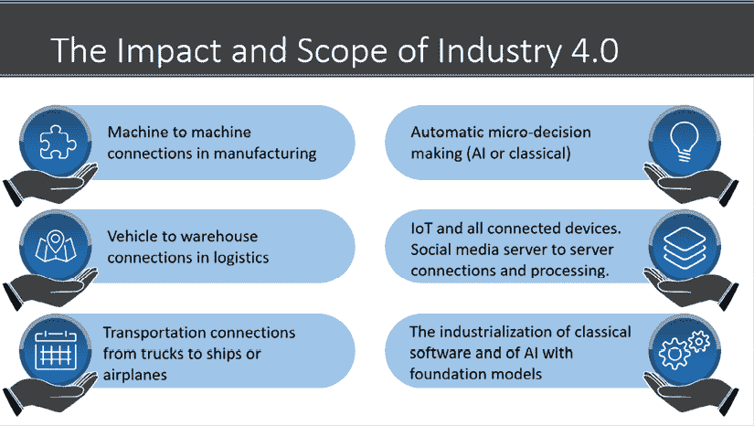
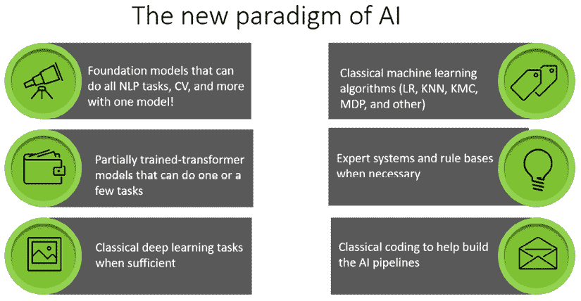
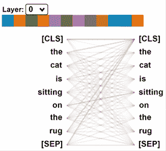
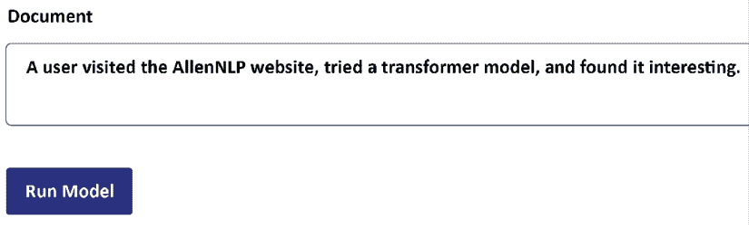
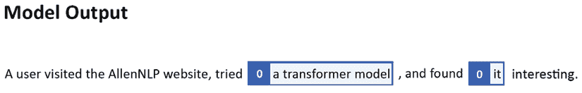
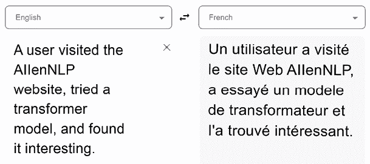

# 第一章：什么是Transformers？

Transformers是工业化、同质化的后深度学习模型，设计用于超级计算机上的并行计算。通过同质化，一个Transformers模型可以在不经过微调的情况下执行各种任务。Transformers可以对数十亿条原始未标记数据进行自监督学习，其参数达到数十亿个。

这些特殊的后深度学习架构被称为**基础模型**。基础模型Transformers代表了 2015 年开始的第四次工业革命的顶峰，即机器对机器自动化将一切连接到一切。人工智能总体上，特别是**自然语言处理**（**NLP**）对**工业 4.0**（**I4.0**）的发展已经远远超越了过去的软件实践。

在不到五年的时间里，人工智能已经成为一个具有无缝 API 的有效云服务。以前的下载库和开发范式在许多情况下已经成为一种教育练习。

工业 4.0 项目经理可以进入 OpenAI 的云平台，注册，获取 API 密钥，并在几分钟内开始工作。用户然后可以输入文本，指定 NLP 任务，并获得由 GPT-3 Transformers引擎发送的响应。最后，用户可以转到 GPT-3 Codex，并创建没有编程知识的应用程序。提示工程是从这些模型中出现的新技能。

但是，有时候 GPT-3 模型可能不适合特定的任务。例如，项目经理、顾问或开发人员可能希望使用由谷歌 AI、**亚马逊网络服务**（**AWS**）、艾伦人工智能研究所或 Hugging Face 提供的另一个系统。

项目经理应该选择在本地工作吗？还是应该直接在谷歌云、微软 Azure 或 AWS 上实施？开发团队应该选择 Hugging Face、Google Trax、OpenAI 还是 AllenNLP？人工智能专家或数据科学家是否应该使用几乎没有 AI 开发的 API？

答案是*以上全部*。您不知道未来的雇主、客户或用户可能想要或指定什么。因此，您必须准备好适应任何可能出现的需求。本书并未描述市场上存在的所有提供。但是，本书为读者提供了足够的解决方案，以适应工业 4.0 AI 驱动的 NLP 挑战。

本章首先从高层次解释了Transformers是什么。然后，本章解释了获取对实现Transformers的所有类型方法的灵活理解的重要性。平台、框架、库和语言的定义在市场上提供的 API 和自动化的数量下变得模糊。

最后，本章介绍了在嵌入式Transformers方面的工业 4.0 人工智能专家的角色。

在开始我们探索本书中描述的各种Transformers模型实现之前，我们需要解决这些关键概念。

本章涵盖以下主题：

+   第四次工业革命，工业 4.0 的出现

+   基础模型的范式变革

+   引入提示工程，一门新的技能

+   Transformers的背景

+   实施Transformers的挑战

+   颠覆性的Transformers模型 API

+   选择Transformers库的难度

+   选择Transformers模型的困难

+   工业 4.0 人工智能专家的新角色

+   嵌入式Transformers

我们的第一步将是探索Transformers的生态系统。

# Transformers的生态系统

Transformers模型代表了一种范式变革，需要一个新名称来描述它们：**基础模型**。因此，斯坦福大学创建了**基础模型研究中心**（**CRFM**）。2021 年 8 月，CRFM 发表了一份 200 页长的论文（见*参考文献*部分），由一百多位科学家和专业人士所写：《关于基础模型的机遇和风险》。

基础模型并不是由学术界而是由大型科技行业所创建。例如，谷歌发明了Transformers模型，从而导致了 Google BERT。微软与 OpenAI 合作生产了 GPT-3。

大型科技公司不得不找到一个更好的模型来应对其数据中心中流动的百万吉字节数据的指数增长。因此，Transformers由此诞生。

让我们首先考虑工业 4.0，以了解需要具有工业化人工智能模型的需求。

## 工业 4.0

农业革命引发了第一次工业革命，引入了机械。第二次工业革命诞生了电力、电话和飞机。第三次工业革命是数字化的。

第四次工业革命，或工业 4.0，产生了无限的机器之间的连接：机器人、机器人、连接设备、自动驾驶汽车、智能手机、从社交媒体存储库搜集数据的机器人等。

反过来，这些数百万台机器和机器人每天生成数十亿的数据记录：图像、声音、文字和事件，如*图 1.1*所示：



图 1.1：工业 4.0 的范围

工业 4.0 需要进行大规模的数据处理和决策的智能算法，以应对人类历史上前所未有的数据量而无需人为干预。

大型科技公司需要找到一个能够执行以往需要多个独立算法的各种任务的单一 AI 模型。

## 基础模型

Transformers具有两个显著特点：高度同质化和令人震惊的新兴特性。 *同质化* 使得可以使用一个模型执行各种任务。这些能力 *通过* 在超级计算机上训练千亿参数模型而得到。

这种范式变化使得基础模型成为深度学习后生态系统，如*图 1.2* 所示：



图 1.2：I4.0 人工智能专家的范围

基础模型，虽然设计了创新的架构，但是建立在人工智能的历史基础之上。因此，人工智能专家的技能范围正在拓展！

目前Transformers模型的生态系统与人工智能领域的任何其他演进都不同，并且可以总结为四个特性：

+   **模型架构**

    该模型是工业化的。模型的层是相同的，它们专门设计用于并行处理。我们将在*第二章* *Transformers模型架构入门*中详细介绍Transformers的架构。

+   **数据**

    大型科技公司拥有人类历史上最庞大的数据来源，首先由第三次工业革命（数字化）产生，并由工业 4.0 推动至不可想象的规模。

+   **计算能力**

    大型科技公司拥有前所未见规模的计算能力。例如，GPT-3 的训练速度约为 50 PetaFLOPS/秒，谷歌现在拥有领域特定的超级计算机，超过了 80 PetaFLOPS/秒。

+   **提示工程**

    经过高度训练的Transformers可以通过提示来执行任务。提示以自然语言输入。然而，所使用的单词需要一定的结构，这使得提示成为一种元语言。

因此，基础模型是在亿万条数据和亿级参数的超级计算机上进行训练的Transformers模型。该模型然后可以执行各种任务，而无需进一步的微调。因此，基础模型的规模是独一无二的。这些完全训练的模型通常被称为引擎。只有 GPT-3、Google BERT 和少数几个Transformers引擎可以被视为基础模型。

我在本书中只会在提及 OpenAI 的 GPT-3 或 Google 的 BERT 模型时提及基础模型。这是因为 GPT-3 和 Google BERT 是在超级计算机上进行完全训练的。尽管其他模型对于有限的用途来说很有趣且有效，但由于缺乏资源，其他模型并未达到基础模型的同质化水平。

现在让我们探究一个基础模型是如何工作的，并且如何改变了我们开发程序的方式。

### 编程现在是否成为 NLP 的一个子领域？

*Chen*等人（2021 年）于 2021 年 8 月发表了一篇爆炸性的论文，介绍了 Codex，这是一个能将自然语言转换为源代码的 GPT-3 模型。Codex 是在 5400 万个公共 GitHub 软件仓库上进行训练的。Codex 可以生成有趣的自然语言到源代码，我们将在*第十六章* *Transformers驱动共同合作者的出现* 中看到。

现在，编程是一种从自然语言到源代码语言的翻译任务吗？

编程是否正在成为 GPT-3 引擎的一项 NLP 任务？

在回答那个问题之前，让我们看一个例子。

请记住，Codex 是一种随机算法，所以元语言很棘手。如果您不小心正确地设计提示，可能不会生成您期望的结果。

当我试验 Codex 时，我创建了一些提示。这个例子只是为了让您了解 Codex 的工作原理，纯粹是为了教育目的。

我的提示是：

+   在 Python 中“生成 200 个介于 1 到 100 之间的随机整数的随机分布”

+   “使用 matplotlib 绘制数据”

+   “创建具有 3 个质心的 k 均值聚类模型并拟合模型”

+   “打印聚类标签”

+   “绘制聚类”

+   “绘制带有质心的聚类”

Codex 自动将我的自然元语言提示翻译成 Python！

Codex 是一种随机模型，因此如果您再次尝试，可能不会完全再现相同的代码。您将不得不通过实验来学习元语言，直到能像驾驶赛车一样驾驭它！

Python 程序将自动生成，并可复制和测试：

```py
import numpy as np
import matplotlib.pyplot as plt
from sklearn.cluster import KMeans
from sklearn.datasets.samples_generator import make_blobs
# generate random data
np.random.seed(0)
X, y = make_blobs(n_samples=200, centers=3, n_features=2, cluster_std=2, random_state=0)
# plot the data
plt.scatter(X[:, 0], X[:, 1], s=50)
plt.show()
# create the k-means model
kmeans = KMeans(n_clusters=3, random_state=0)
# fit the model to the data
kmeans.fit(X)
# print the cluster labels
print(kmeans.labels_)
#plot the clusters
plt.scatter(X[:, 0], X[:, 1], c=kmeans.labels_, cmap='rainbow')
plt.show()
# plot the clusters with centroids
plt.scatter(X[:, 0], X[:, 1], c=kmeans.labels_, cmap='rainbow')
plt.scatter(kmeans.cluster_centers_[:, 0], kmeans.cluster_centers_[:, 1], c='black', s=100, alpha=0.5)
plt.show() 
```

你可以复制粘贴这个程序。它有效。你也可以尝试 JavaScript，等等其他实验。

GitHub Copilot 现已与一些微软开发工具一起提供，我们将在*第十六章*《基于 Transformer 的协作工具的出现》中看到。如果您学会了提示工程元语言，您将在未来几年内缩短开发时间。

终端用户如果掌握了元语言，就能创建原型或小任务。未来，编码协助工具将会扩展。

我们将在*第十六章*中看到 Codex 在人工智能未来中的地位。

此时，让我们一睹人工智能专家美好未来的一瞥。

### 人工智能专家的未来

基础模型的社会影响不容小觑。提示工程已成为人工智能专家所需的一项技能。然而，人工智能专家的未来不能仅限于Transformers。人工智能和数据科学在 I4.0 中重叠。

AI 专家将参与使用经典人工智能、物联网、边缘计算等机器之间算法。AI 专家还将使用经典算法设计和开发有趣的机器人、服务器和各种连接设备之间的连接。

因此，这本书不仅限于提示工程，还涵盖了成为“工业 4.0 人工智能专家”或“I4.0 人工智能专家”所需的广泛设计技能。

提示工程是 AI 专家将必须开发的设计技能的子集。在这本书中，我将将未来的 AI 专家称为“工业 4.0 人工智能专家”。

现在让我们对Transformers如何优化 NLP 模型有一个总体了解。

# 使用Transformers优化 NLP 模型

**循环神经网络**（**RNNs**），包括 LSTMs，几十年来一直将神经网络应用于自然语言处理的序列模型。然而，当面对长序列和大量参数时，使用递归功能达到了极限。因此，现在最先进的转换器模型占据了主导地位。

本节将简要介绍导致Transformers的自然语言处理背景，我们将在*第二章*中更详细地描述这一点，*开始使用Transformers模型的架构*。然而，首先，让我们直观地看一下Transformers的注意头，它取代了自然语言处理神经网络的 RNN 层。

Transformers的核心概念可以粗略地总结为“混合标记”。自然语言处理模型首先将单词序列转换为标记。循环神经网络在递归函数中分析标记。Transformers不会按顺序分析标记，而是将每个标记与序列中的其他标记相关联，如*图 1.3*所示：



图 1.3：Transformers层的一个注意头

我们将在*第二章*详细讨论一个注意力头的细节。目前，*图 1.3*的要点是*序列的每个单词*（*标记*）*都与序列的所有其他单词相关*。这个模型为工业 4.0 的自然语言处理打开了大门。

让我们简要地了解一下Transformers的背景。

## Transformers的背景

在过去的 100 多年里，许多伟大的思想家都致力于序列模式和语言建模。因此，机器逐渐学会了预测可能的单词序列。要列出所有使这一切发生的巨人，需要一整本书。

在本节中，我将与您分享一些我喜欢的研究人员，为Transformers的到来奠定基础。 

在 20 世纪初，安德烈·马尔可夫介绍了随机值的概念，并创建了随机过程的理论。我们在人工智能中称之为**马尔可夫决策过程**（**MDP**）、**马尔可夫链**和**马尔可夫过程**。在 20 世纪初，马尔可夫证明了我们可以仅使用链的最后几个元素来预测链、序列的下一个元素。他将自己的方法应用到一个包含数千封信的数据集中，使用过去的序列来预测句子的后续字母。请记住，他没有计算机，但证明了一种至今在人工智能中仍在使用的理论。

1948 年，克劳德·香农出版了*通信的数学理论*。克劳德·香农奠定了基于源编码器、传输器和接收器或语义解码器的通信模型的基础。他创造了今天我们所知的信息论。

1950 年，艾伦·图灵发表了他的里程碑文章：*计算机与智能*。艾伦·图灵将这篇文章基于在二战期间解密德国消息的成功图灵机的机器智能。这些消息由一系列单词和数字组成。

1954 年，乔治城-IBM 实验使用计算机利用规则系统将俄语句子翻译成英语。 规则系统是一个运行规则列表的程序，该列表将分析语言结构。 规则系统仍然存在，并且无处不在。 但是，在某些情况下，机器智能可以通过自动学习模式来替代数十亿种语言组合的规则列表。

1956 年，约翰·麦卡锡首次使用了“人工智能”这个表达，当时确立了机器可以学习的事实。

1982 年，约翰·霍普菲尔德引入了一种称为霍普菲尔德网络或“联想”神经网络的**循环神经网络**（**RNN**）。 约翰·霍普菲尔德受到 W.A. Little 的启发，后者在 1974 年撰写了*大脑中持久状态的存在*，为学习过程奠定了几十年的理论基础。 RNN 不断发展，以及我们今天所知的 LSTM 也随之出现。

RNN 高效地记忆了序列的持久状态，如*图 1.4*所示：


图 1.4：RNN 过程

每个状态 *S*[n] 捕获 *S*[n-1] 的信息。 当网络的末端到达时，函数 *F* 将执行一个动作：转换、建模或任何其他类型的基于序列的任务。

在 1980 年代，Yann LeCun 设计了多功能的**卷积神经网络**（**CNN**）。 他将 CNN 应用于文本序列，它们还适用于序列转换和建模。 它们还基于 W.A. Little 的持久状态，该状态逐层处理信息。 在 1990 年代，总结了几年的工作后，Yann LeCun 制作了 LeNet-5，导致了我们今天所知道的许多 CNN 模型。 但是，在处理冗长且复杂序列中的长期依赖关系时，CNN 的有效架构面临问题。

我们可以提到许多其他的名字、论文和模型，这些都会让任何 AI 专家感到自愧不如。 AI 领域的每个人似乎都走在正确的轨道上。 马尔可夫场、RNN 和 CNN 发展成了多种其他模型。 注意力的概念出现了：窥视序列中的其他令牌，而不仅仅是最后一个。 它被添加到了 RNN 和 CNN 模型中。

之后，如果 AI 模型需要分析需要增加计算机功率的更长序列，AI 开发人员使用了更强大的机器，并找到了优化梯度的方法。

对于序列到序列模型进行了一些研究，但并未达到预期。

看起来似乎没有其他方法可以取得更多进展。 这样过了三十年。 然后，从 2017 年末开始，工业化的最先进的 Transformer 带来了它的注意力头子层等等。 RNN 不再被视为序列建模的先决条件。

在深入研究原始 Transformer 的架构之前，我们将在 *第二章*，*开始使用 Transformer 模型的架构* 中进行。让我们从高层次上审视一下学习和实现 transformer 模型应该使用的软件资源的范式变化。

# 我们应该使用什么资源？

工业 4.0 AI 已经模糊了云平台、框架、库、语言和模型之间的界限。Transformer 是新的，生态系统的范围和数量令人惊叹。Google Cloud 提供了可直接使用的 transformer 模型。

OpenAI 部署了一个几乎不需要编程的“Transformer” API。Hugging Face 提供了一个云库服务，列表是无穷无尽的。

本章将对我们将在本书中实施的一些 transformer 生态系统进行高层次的分析。

你选择的资源来实现 NLP 的 transformer 是至关重要的。这是一个在项目中生存的问题。想象一下现实生活中的面试或演示。想象一下你正在与你的未来雇主、你的雇主、你的团队或一个客户交谈。

你以一个出色的 PowerPoint 开始你的演示，比如说使用 Hugging Face。例如。 你可能会从一个经理那里得到一个负面的反应，他可能会说：“*对不起，但是我们在这种类型的项目中使用的是 Google Trax，而不是 Hugging Face。你能实现 Google Trax 吗？*” 如果你不这样做，那么游戏结束了。

专门从事 Google Trax 可能会出现同样的问题。但是，相反，你可能会得到一个希望使用 OpenAI 的 GPT-3 引擎和 API 而不进行开发的经理的反应。如果你专门使用 OpenAI 的 GPT-3 引擎和 API 而不进行开发，你可能会面临一个希望使用 Hugging Face 的 AutoML API 的项目经理或客户。最糟糕的事情是，一个经理接受了你的解决方案，但最终它根本不适用于该项目的 NLP 任务。

要牢记的关键概念是，如果你只关注你喜欢的解决方案，你很可能最终会随着船沉没。

关注你需要的系统，而不是你喜欢的那个。

这本书并不是为了解释市场上存在的每一个 transformer 解决方案。相反，这本书旨在为您解释足够的 transformer 生态系统，以便您能够灵活地适应您在 NLP 项目中面临的任何情况。

在本节中，我们将介绍您将面临的一些挑战。但首先，让我们从 API 开始。

## Transformer 4.0 无缝 API 的崛起

我们现在已经深入到人工智能的工业化时代。微软、谷歌、**亚马逊网络服务**（**AWS**）和 IBM 等公司提供的 AI 服务，没有任何开发人员或开发团队能够超越。科技巨头拥有百万美元的超级计算机，用于训练 transformer 模型和 AI 模型的大数据集。

大型科技巨头拥有广泛的企业客户群体，已经使用他们的云服务。因此，将Transformers API 添加到现有的云架构中所需的工作量比任何其他解决方案都要少。

一个小公司甚至一个个人都可以通过 API 访问最强大的Transformers模型，几乎不需要投资于开发。一名实习生可以在几天内实现 API。对于这样简单的实现，不需要成为工程师或拥有博士学位。

例如，OpenAI 平台现在为市场上一些最有效的Transformers模型提供 **SaaS** (**软件即服务**) API。

OpenAI Transformers模型如此有效且人性化，以至于目前的政策要求潜在用户填写请求表格。一旦请求被接受，用户就可以访问自然语言处理的宇宙！

OpenAI 的 API 的简单性令用户感到惊讶：

1.  一键获取 API 密钥

1.  在笔记本中导入 OpenAI 只需一行

1.  在 *提示* 中输入您希望的任何 NLP 任务

1.  您将以一定数量的 *令牌*（长度）作为 *完成* 收到响应

就是这样！欢迎来到第四次工业革命和 AI 4.0！

专注于仅代码解决方案的工业 3.0 开发者将进化为具有跨学科思维的工业 4.0 开发者。

4.0 开发者将学习如何设计一种方式来 *展示* Transformers模型期望的内容，而不是像 3.0 开发者那样直观地 *告诉* 它要做什么。我们将通过 *第七章*，*GPT-3 引擎崛起的超人类Transformers* 来探讨这种新方法。

AllenNLP 提供免费使用在线教育界面的Transformers。AllenNLP 还提供一个可以安装在笔记本中的库。例如，假设我们被要求实现共指消解。我们可以从在线运行示例开始。

共指消解任务涉及找到一个词所指的实体，就像在 *图 1.5* 中所示的句子中那样。



图 1.5：在线运行 NLP 任务

“它” 这个词可能指的是网站或Transformers模型。在这种情况下，类似 BERT 的模型决定将 “it” 链接到Transformers模型。AllenNLP 提供了格式化的输出，如 *图 1.6* 所示：



图 1.6：AllenNLP Transformers模型的输出

此示例可以在 [`demo.allennlp.org/coreference-resolution`](https://demo.allennlp.org/coreference-resolution) 上运行。Transformers模型不断更新，因此您可能会获得不同的结果。

虽然 API 可能满足许多需求，但它们也有限制。一个多用途的 API 可能在所有任务中都相当不错，但对于特定的 NLP 任务来说并不够好。使用Transformers进行翻译并不是一件容易的事情。在这种情况下，4.0 开发者、顾问或项目经理将不得不证明仅靠 API 无法解决所需的特定 NLP 任务。我们需要寻找一个可靠的库。

## 选择现成的 API 驱动库

在本书中，我们将探索几个库。例如，Google 在世界上拥有一些最先进的人工智能实验室。Google Trax 可以在 Google Colab 中只需几行代码进行安装。你可以选择免费或付费服务。我们可以获得源代码，调整模型，甚至在我们自己的服务器或谷歌云上进行训练。例如，从使用现成的 API 到为翻译任务定制转换器模型是一个逐步进行的过程。

但是，在某些情况下，这可能既具有教育意义，又彰显效果。我们将探索 Google 在翻译方面的最新发展，并在第六章《使用 Transformer 进行机器翻译》中实施 Google Trax。

我们已经看到像 OpenAI 这样的 API 需要有限的开发者技能，而像 Google Trax 这样的库则更深入地涉及代码。这两种方法表明，AI 4.0 API 将需要更多的开发，但在实施转换器时需要更少的工作。

其中应用了转换器的最著名的线上应用之一，除其他算法之外，就是 Google 翻译。Google 翻译可以在线使用，也可以通过 API 使用。

让我们尝试使用 Google 翻译将一个需要指代消解的句子从英语翻译成法语：



图 1.7：利用 Google 翻译进行指代消解的翻译

Google 翻译似乎已经解决了指代消解的问题，但是法语中的 *transformateur* 这个词是指电器设备。*transformer* 这个词是法语中的一个新词。在某些项目中可能需要人工智能专家具有语言和语言学技能。这种情况下并不需要进行重大开发。但是，在请求翻译之前，项目可能需要澄清输入。

这个例子表明，你可能需要与语言学家合作或者获取语言学技能来处理输入上下文。此外，可能需要进行大量开发来为上下文增加一个界面。

因此，我们可能仍然需要费一些力气才能使用 Google 翻译添加脚本。或者我们可能需要为特定的翻译需求找到一个转换器模型，比如 BERT、T5 或我们在本书中将要探索的其他模型。

随着解决方案范围的不断增加，选择一个模型并不是一件容易的事情。

## 选择一个转换器模型

大型科技公司主导着自然语言处理（NLP）市场。仅有谷歌、Facebook 和微软每天运行数十亿次 NLP 例程，增强了它们的人工智能模型无与伦比的力量。这些巨头现在提供了各种转换器模型，并拥有顶尖的基础模型。

然而，更小的公司看到庞大的自然语言处理市场后也加入了竞争。Hugging Face 现在也有免费或付费的服务方式。Hugging Face 要达到通过投入数十亿美元进入 Google 研究实验室和微软资助 OpenAI 而获得的效率水平将是一个挑战。基础模型的入口是在超级计算机上完全训练的Transformers，如 GPT-3 或 Google BERT。

Hugging Face 采取了不同的方法，为任务提供了广泛的Transformers模型选择，这是一种有趣的哲学。Hugging Face 提供灵活的模型。此外，Hugging Face 还提供高级 API 和开发者可控的 API。我们将在本书的几个章节中探讨 Hugging Face 作为一个教育工具和可能的特定任务解决方案。

然而，OpenAI 已经专注于全球最强大的少数几个Transformers引擎，并且可以以人类水平执行许多自然语言处理任务。我们将展示 OpenAI 的 GPT-3 引擎的威力在 *第七章*，*GPT-3 引擎崛起* 中。

这些相反而经常冲突的策略给我们留下了一系列可能的实现方案。因此，我们必须定义工业 4.0 人工智能专家的角色。

## 工业 4.0 人工智能专家的角色

工业 4.0 正将所有事物与所有事物连接起来，无处不在。机器直接与其他机器通信。由人工智能驱动的物联网信号触发自动决策，无需人类干预。自然语言处理算法发送自动报告、摘要、电子邮件、广告等。

人工智能专家将不得不适应这个新时代日益自动化的任务，包括Transformers模型的实现。人工智能专家将有新的功能。如果我们按照一个人工智能专家将要执行的Transformers自然语言处理任务列出来，从头到尾，似乎一些高级任务不需要人工智能专家做任何开发。一个人工智能专家可以成为一个人工智能大师，提供设计思路、解释和实现。

Transformers对于人工智能专家的实际定义将随着生态系统的变化而变化。

让我们通过一些例子来说明：

+   **API**：OpenAI API 不需要一个 AI 开发者。一个网页设计师可以创建一个表单，一个语言学家或者专业领域专家（SME）可以准备提示输入文本。一个 AI 专家的主要角色将需要语言学技能来向 GPT-3 引擎展示如何完成任务，而不仅仅是告诉它们。例如，展示涉及处理输入的上下文。这个新任务被称为 *提示工程*。*提示工程师* 在人工智能领域有着很好的发展前景！

+   **Library**：Google Trax 库需要一定量的开发工作才能开始使用预先训练好的模型。一个精通语言学和自然语言处理任务的 AI 专家可以处理数据集和输出。

+   **训练和调优**：一些 Hugging Face 功能需要有限的开发量，提供 API 和库。然而，在某些情况下，我们仍然需要细致入微。在这种情况下，训练、调优模型和找到正确的超参数将需要人工智能专家的专业知识。

+   **开发级技能**：在一些项目中，分词器和数据集不匹配，正如*第九章*中所解释的那样，*匹配分词器和数据集*。在这种情况下，与语言学家一起工作的人工智能开发人员可以发挥关键作用。因此，在这个层面上，计算语言学培训非常有用。

最近 NLP AI 的演进可以称为“嵌入式转换器”，正在扰乱 AI 开发生态系统：

+   GPT-3 转换器目前嵌入在几个 Microsoft Azure 应用程序中，例如 GitHub Copilot。正如本章节*基础模型*部分中所介绍的那样，Codex 是我们将在*第十六章*中探讨的另一个例子，*基于转换器的合作者的出现*。

+   嵌入式转换器不能直接访问，但提供自动开发支持，如自动代码生成。

+   嵌入式转换器的使用对于最终用户来说是无缝的，辅助文本自动完成。

要直接访问 GPT-3 引擎，您必须首先创建一个 OpenAI 账户。然后您可以使用 API 或直接在 OpenAI 用户界面中运行示例。

我们将在*第十六章*中探索这个迷人的嵌入式转换器的新世界。但要充分利用该章节，您首先应该掌握前几章的概念、示例和程序。

工业 4.0 AI 专家的技能需要灵活性、跨学科知识，尤其是*灵活性*。本书将为人工智能专家提供各种转换器生态系统，以适应市场的新模式。

在潜入原始 Transformer 的迷人架构之前，现在是总结本章思想的时候了。

# 摘要

第四次工业革命，或工业 4.0，迫使人工智能发生深刻的演变。第三次工业革命是数字化的。工业 4.0 建立在数字革命的基础上，将一切与一切、无处不在的连接起来。自动化流程正在取代人类在重要领域的决策，包括 NLP。

RNN 存在限制，这些限制减缓了在快速移动世界中所需的自动化 NLP 任务的进展。转换器填补了这一空白。一个公司需要摘要、翻译和各种 NLP 工具来应对工业 4.0 的挑战。

因此，工业 4.0（I4.0）推动了人工智能产业化的时代。平台、框架、语言和模型概念的演进对工业 4.0 开发者构成了挑战。基础模型通过提供可以在没有进一步训练或微调的情况下执行各种任务的同质模型，弥合了第三次工业革命和 I4.0 之间的差距。

例如，AllenNLP 等网站提供了不需要安装的教育性 NLP 任务，但它也提供了在定制程序中实现转换器模型的资源。OpenAI 提供了一个 API，只需几行代码就可以运行强大的 GPT-3 引擎之一。Google Trax 提供了一个端到端库，Hugging Face 提供了各种转换器模型和实现。我们将在本书中探索这些生态系统。

工业 4.0 是与以前的人工智能的根本偏差，具有更广泛的技能集。例如，项目经理可以决定通过询问网页设计师创建一个接口来实现转换器的项目，通过提示工程来实现 OpenAI 的 API。或者，在必要时，项目经理可以要求人工智能专家下载 Google Trax 或 Hugging Face 来开发一个完整的项目，并使用定制的转换器模型。

工业 4.0 对开发者来说是一个改变游戏规则的因素，他们的角色将会扩展，并且需要更多的设计而不是编程。此外，嵌入式转换器将提供辅助代码开发和使用。这些新的技能集是一个挑战，但也打开了新的激动人心的视野。

在*第二章*中，*开始使用 Transformer 模型的架构*，我们将开始使用原始 Transformer 的架构。

# 问题

1.  我们仍处于第三次工业革命中。（True/False）

1.  第四次工业革命正在将一切连接到一切。（True/False）

1.  工业 4.0 开发者有时不需要进行 AI 开发。（True/False）

1.  工业 4.0 开发者可能需要从零开始实现转换器。（True/False）

1.  没有必要学习超过一个转换器生态系统，例如 Hugging Face。（True/False）

1.  一个即用型的转换器 API 可以满足所有需求。（True/False）

1.  公司将接受开发者最擅长的转换器生态系统。（True/False）

1.  云转换器已经成为主流。（True/False）

1.  一个转换器项目可以在笔记本电脑上运行。（True/False）

1.  工业 4.0 人工智能专家将不得不更加灵活（True/False）

# 参考资料

+   *Bommansani*等人，2021 年，《基础模型的机遇和风险》，[`arxiv.org/abs/2108.07258`](https://arxiv.org/abs/2108.07258)

+   *Chen*等人，2021 年，《评估基于代码的大型语言模型》，[`arxiv.org/abs/2107.03374`](https://arxiv.org/abs/2107.03374)

+   微软人工智能：[`innovation.microsoft.com/en-us/ai-at-scale`](https://innovation.microsoft.com/en-us/ai-at-scale)

+   OpenAI：[`openai.com/`](https://openai.com/)

+   Google AI: [`ai.google/`](https://ai.google/)

+   Google Trax: [`github.com/google/trax`](https://github.com/google/trax)

+   AllenNLP: [`allennlp.org/`](https://allennlp.org/)

+   Hugging Face: [`huggingface.co/`](https://huggingface.co/)

# 加入我们书籍的 Discord 空间

参加书籍的 Discord 工作区，与作者进行每月的*问我任何*（Ask me Anything）的交流活动：

[`www.packt.link/Transformers`](https://www.packt.link/Transformers)


