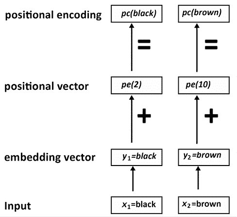
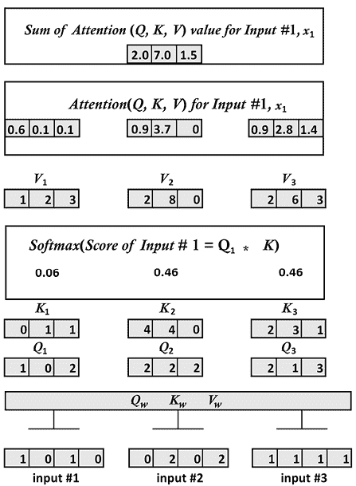

# 第二章：起步使用 Transformer 模型的架构

语言是人类交流的本质。如果没有形成语言的词序列，文明将永远不会诞生。现在，我们大多生活在语言的数字表示世界中。我们的日常生活依赖于 NLP 数字化语言功能：网络搜索引擎、电子邮件、社交网络、帖子、推文、智能手机短信、翻译、网页、流媒体网站上的语音转文字、热线服务上的文字转语音以及许多其他日常功能。

*第一章*，*什么是 Transformer？*，解释了 RNN 的局限性以及云 AI 转换器的诞生，占据了设计和开发的一部分份额。工业 4.0 开发者的角色是理解原始 Transformer 的架构以及随之而来的多个 transformer 生态系统。

2017 年 12 月，Google Brain 和 Google Research 发表了具有开创性意义的*瓦斯瓦尼*等人的*Attention is All You Need*论文。Transformer 诞生了。Transformer 超越了现有的最先进的 NLP 模型。Transformer 比以前的架构训练速度更快，并获得了更高的评估结果。因此，transformer 已成为 NLP 的关键组成部分。

Transformer 的注意头的思想是消除循环神经网络特征。在本章中，我们将揭开*瓦斯瓦尼*等人（2017）描述的 Transformer 模型的面纱，检查其架构的主要组件。我们将探索引人入胜的关注世界，并说明 Transformer 的关键组件。

本章涵盖以下主题：

+   Transformer 的架构

+   Transformer 的自注意力模型

+   编码和解码堆栈

+   输入和输出嵌入

+   位置嵌入

+   自注意力

+   多头注意力

+   掩模多头注意力

+   残差连接

+   规范化

+   前馈网络

+   输出概率

让我们直接深入原始 Transformer 架构的结构。

# Transformer 的崛起：Attention is All You Need

2017 年 12 月，*瓦斯瓦尼*等人（2017）发表了他们具有开创性意义的论文*Attention is All You Need*。他们在 Google Research 和 Google Brain 进行了这项工作。在本章和本书中，我将称*Attention is All You Need*中描述的模型为“原始 Transformer 模型”。

*附录 I*，*Transformer 模型术语*，可以帮助从深度学习词汇的经典用法过渡到 Transformer 词汇。*附录 I*总结了经典人工智能神经网络模型的一些变化。

在本节中，我们将看一下他们构建的 Transformer 模型的结构。在接下来的章节中，我们将探讨模型的每个组件内部的内容。

原始的 Transformer 模型是一个包含 6 个层叠的堆栈。第*l*层的输出是第*l*+1 层的输入，直到达到最终预测。左侧有一个 6 层编码器堆栈，右侧有一个 6 层解码器堆栈：


图 2.1：Transformer 的架构

在左侧，输入通过一个注意力子层和一个前馈子层进入 Transformer 的编码器侧。在右侧，目标输出通过两个注意力子层和一个前馈网络子层进入 Transformer 的解码器侧。我们立即注意到这个架构中没有 RNN、LSTM 或 CNN。在这种架构中已经放弃了循环。

注意力已经取代了需要随着两个单词之间距离增加而增加的循环函数。注意力机制是一种“单词对单词”的操作。实际上它是一个标记到标记的操作，但为了保持解释简单，我们将其保持在单词级别上。注意力机制将找到每个单词与序列中所有其他单词的关系，包括正在分析的单词本身。让我们来看一下以下序列：

```py
The cat sat on the mat. 
```

注意力将在单词向量之间运行点积，并确定一个单词与所有其他单词（包括自己）的最强关系（“猫”和“猫”）：


图 2.2：关注所有单词

注意机制将提供单词之间更深的关系并产生更好的结果。

对于每个注意子层，原始的 Transformer 模型不是运行一个而是运行八个并行的注意机制以加快计算速度。我们将在下一节“编码器堆栈”中探讨这种架构。这个过程被称为“多头注意力”，提供：

+   对序列的更广泛的深入分析

+   排除了减少计算操作的循环先验

+   并行化的实现，可以减少训练时间

+   每个注意机制学习相同输入序列的不同视角

*注意力取代了循环*。然而，Transformer 还有其他几个创造性方面，它们和注意力机制一样关键，当我们深入研究架构时，你将会看到。

我们刚刚从外部看了 Transformer 的结构。现在让我们深入了解 Transformer 的每个组件。我们将从编码器开始。

## 编码器堆栈

原始 Transformer 模型的编码器和解码器的层都是*层叠的层*。编码器堆栈的每一层都有以下结构：


图 2.3：Transformer 编码器堆栈的一层

原始编码器层结构对于 Transformer 模型的所有*N*=6 层保持不变。每一层包含两个主要的子层：一个多头注意力机制和一个完全连接的位置逐层前馈网络。

请注意，在 Transformer 模型中，每个主要子层*子层*(*x*)周围都有一个残差连接。这些连接将子层的未处理输入*x*传输到层标准化函数。这样，我们可以确定诸如位置编码之类的关键信息在传输过程中不会丢失。因此，每层的标准化输出如下：

*层标准化* (*x* + *子层*(*x*))

尽管编码器的*N*=6 层的结构是相同的，但每层的内容并不严格与上一层相同。

例如，嵌入子层仅出现在堆栈的底层。其他五层不包含嵌入层，这保证了经过所有层的编码输入是稳定的。

此外，多头注意力机制从第 1 层到第 6 层执行相同的功能。但它们并不执行相同的任务。每一层都从前一层学习，并探索关联序列中标记的不同方式。它寻找单词的不同关联，就像我们在解决填字游戏时寻找字母和单词的不同关联一样。

Transformer 的设计者引入了一个非常高效的约束。模型的每个子层的输出都具有恒定的维度，包括嵌入层和残差连接。该维度为*d*[model]，可以根据您的目标设置为另一个值。在原始的 Transformer 架构中，*d*[model] = 512。

*d*[model]具有强大的影响。几乎所有关键操作都是点积。因此，维度保持稳定，这减少了计算操作的数量，减少了机器的消耗，并使跟踪信息在模型中流动变得更容易。

编码器的这个全局视图展示了 Transformer 的高度优化的架构。在接下来的几节中，我们将深入研究每个子层和机制。

我们将从嵌入子层开始。

### 输入嵌入

输入嵌入子层使用原始 Transformer 模型中学习的嵌入将输入标记转换为维度为*d*[model] = 512 的向量。输入嵌入的结构是经典的：


图 2.4：Transformer 的输入嵌入子层

嵌入子层的工作方式类似于其他标准的转换模型。标记器将一个句子转换为标记。每个标记器都有其方法，如 BPE、单词片段和句子片段方法。Transformer 最初使用了 BPE，但其他模型使用其他方法。

目标是相似的，选择取决于选择的策略。例如，应用于序列 `Transformer is an innovative NLP model!`的标记器将在一种模型中产生以下标记：

```py
['the', 'transform', 'er', 'is', 'an', 'innovative', 'n', 'l', 'p', 'model', '!'] 
```

您会注意到这个分词器将字符串标准化为小写字母并将其截断为子部分。分词器通常会提供一个用于嵌入过程的整数表示。例如：

```py
text = "The cat slept on the couch.It was too tired to get up."
tokenized text= [1996, 4937, 7771, 2006, 1996, 6411, 1012, 2009, 2001, 2205, 5458, 2000, 2131, 2039, 1012] 
```

此时，标记化文本中没有足够的信息进行更深入的分析。标记化文本必须被嵌入。

Transformer 包含了一个学习到的嵌入子层。许多嵌入方法可以应用到标记化的输入中。

我选择了`word2vec`嵌入方法中谷歌在 2013 年发布的 skip-gram 架构来说明 Transformer 的嵌入子层。skip-gram 会关注窗口中的中心词，并预测*上下文*词。例如，如果 word(i)是一个两步窗口中的中心词，skip-gram 模型会分析 word(i-2)，word(i-1)，word(i+1)，和 word(i+2)。然后窗口会*滑动*并重复这个过程。skip-gram 模型通常包含输入层，权重，隐藏层，以及包含标记化输入词的词嵌入的输出。

假设我们需要为以下句子进行嵌入：

```py
The black cat sat on the couch and the brown dog slept on the rug. 
```

我们将专注于两个词，`black`和`brown`。这两个词的词嵌入向量应该是相似的。

由于我们必须为每个词生成一个大小为*d*[model] = 512 的向量，我们将为每个词获得大小为`512`的向量嵌入：

```py
black=[[-0.01206071  0.11632373  0.06206119  0.01403395  0.09541149  0.10695464 0.02560172  0.00185677 -0.04284821  0.06146432  0.09466285  0.04642421 0.08680347  0.05684567 -0.00717266 -0.03163519  0.03292002 -0.11397766 0.01304929  0.01964396  0.01902409  0.02831945  0.05870414  0.03390711 -0.06204525  0.06173197 -0.08613958 -0.04654748  0.02728105 -0.07830904
    …
0.04340003 -0.13192849 -0.00945092 -0.00835463 -0.06487109  0.05862355 -0.03407936 -0.00059001 -0.01640179  0.04123065 
-0.04756588  0.08812257 0.00200338 -0.0931043  -0.03507337  0.02153351 -0.02621627 -0.02492662 -0.05771535 -0.01164199 
-0.03879078 -0.05506947  0.01693138 -0.04124579 -0.03779858 
-0.01950983 -0.05398201  0.07582296  0.00038318 -0.04639162 
-0.06819214  0.01366171  0.01411388  0.00853774  0.02183574 
-0.03016279 -0.03184025 -0.04273562]] 
```

单词`black`现在用`512`维度表示。其他嵌入方法可以被使用，*d*[model]可以有更多维度。

`brown`的词嵌入也用`512`维度表示：

```py
brown=[[ 1.35794589e-02 -2.18823571e-02  1.34526128e-02  6.74355254e-02
   1.04376070e-01  1.09921647e-02 -5.46298288e-02 -1.18385479e-02
   4.41223830e-02 -1.84863899e-02 -6.84073642e-02  3.21860164e-02
   4.09143828e-02 -2.74433400e-02 -2.47369967e-02  7.74542615e-02
   9.80964210e-03  2.94299088e-02  2.93895267e-02 -3.29437815e-02
…
  7.20389187e-02  1.57317147e-02 -3.10291946e-02 -5.51304631e-02
  -7.03861639e-02  7.40829483e-02  1.04319192e-02 -2.01565702e-03
   2.43322570e-02  1.92969330e-02  2.57341694e-02 -1.13280728e-01
   8.45847875e-02  4.90090018e-03  5.33546880e-02 -2.31553353e-02
   3.87288055e-05  3.31782512e-02 -4.00604047e-02 -1.02028981e-01
   3.49597558e-02 -1.71501152e-02  3.55573371e-02 -1.77437533e-02
  -5.94457164e-02  2.21221056e-02  9.73121971e-02 -4.90022525e-02]] 
```

为了验证这两个词产生的词嵌入，我们可以使用余弦相似度来查看单词`black`和`brown`的词嵌入是否相似。

余弦相似度使用欧几里得（L2）范数在一个单位球中创建向量。我们比较的向量的点积是这两个向量之间的余弦。更多关于余弦相似度理论的内容，您可以查阅 scikit-learn 的文档，以及其他很多来源：[`scikit-learn.org/stable/modules/metrics.html#cosine-similarity`](https://scikit-learn.org/stable/modules/metrics.html#cosine-similarity)。

在示例的嵌入中，大小为*d*[model] = 512 的黑色向量与大小为*d*[model] = 512 的棕色向量之间的余弦相似度是：

```py
cosine_similarity(black, brown)= [[0.9998901]] 
```

skip-gram 产生了两个彼此接近的向量。它检测到 black 和 brown 形成了一个颜色子集的词典。

Transformer 的后续层并不是空手起步。它们已经学会了词嵌入，这些词嵌入已经提供了有关如何关联这些词的信息。

然而，由于没有额外的向量或信息指示序列中单词的位置，很多信息都缺失了。

Transformer 的设计者提出了另一个创新特性：位置编码。

让我们看看位置编码是如何工作的。

### 位置编码

我们进入 Transformer 的这个位置编码函数时并不知道词在序列中的位置：


图 2.5：位置编码

我们不能创建独立的位置向量，这将对 Transformer 的训练速度产生较高的成本，并使注意力子层过于复杂。这个想法是向输入嵌入中添加一个位置编码值，而不是添加额外的向量来描述序列中一个标记的位置。

工业 4.0 是实用的，且不受模型限制。原始 Transformer 模型只有一个包含词嵌入和位置编码的向量。我们将在 *第十五章，从自然语言处理到任务不可知的 Transformer 模型* 中探索使用一个独立的矩阵来进行位置编码的分离注意力。

Transformer 期望输出的每个向量都具有固定大小 *d*[model] = 512（或模型的其他常量值）。

如果我们回到我们在词嵌入子层中使用的句子，我们可以看到黑色和棕色可能在语义上相似，但在句子中相距甚远：

```py
The `black` cat sat on the couch and the `brown` dog slept on the rug. 
```

单词 `black` 处于位置 2，`pos=2`，而单词 `brown` 处于位置 10，`pos=10`。

我们的问题是找到一种方法，向每个单词的词嵌入中添加一个值，以便它具有该信息。但是，我们需要向 *d*[model] = 512 维度添加一个值！对于每个单词嵌入向量，我们需要找到一种方法，为 `black` 和 `brown` 的词嵌入向量的 `range(0,512)` 维度中的 `i` 提供信息。

*有许多方法可以实现位置编码*。本节将重点介绍设计者巧妙地使用单位球来表示位置编码，使用正弦和余弦值，因此保持小但有用。

*Vaswani* 等人（2017 年）提供了正弦和余弦函数，以便我们可以为每个位置和 *d*[model] = 512 的词嵌入向量的每个维度 *i* 生成不同的频率来生成位置编码 (**PE**)：


如果我们从词嵌入向量的开头开始，我们将从一个常数开始 (`512`)，`i=0`，并以 `i=511` 结束。这意味着正弦函数将应用于偶数，余弦函数将应用于奇数。一些实现方式可能不同。在这种情况下，正弦函数的定义域可能是 ，余弦函数的定义域可能是 。这将产生类似的结果。

在本节中，我们将使用 *Vaswani* 等人（2017 年）描述的函数方式。将其直译为 Python 伪代码产生了以下代码，用于表示位置向量 `pe[0][i]` 的位置 `pos`：

```py
def positional_encoding(pos,pe):
for i in range(0, 512,2):
         pe[0][i] = math.sin(pos / (10000 ** ((2 * i)/d_model)))
         pe[0][i+1] = math.cos(pos / (10000 ** ((2 * i)/d_model)))
return pe 
```

Google Brain Trax 和 Hugging Face 等公司提供了用于单词嵌入部分和现在位置编码部分的即用型库。因此，你不需要运行我在本节中分享的代码。但是，如果你想探索代码，你可以在 Google Colaboratory 的 `positional_encoding.ipynb` 笔记本和本章的 GitHub 仓库中的 `text.txt` 文件中找到它。

在继续之前，你可能想看一下正弦函数的图表，例如 `pos=2`。

例如，你可以谷歌以下图表：

```py
plot y=sin(2/10000^(2*x/512)) 
```

只需输入绘图请求：


图 2.6：使用 Google 绘图

你将获得以下图表：


图 2.7：图

如果我们回到这一部分正在解析的句子，我们可以看到 `black` 位于位置 `pos=2`，而 `brown` 位于位置 `pos=10`：

```py
The black cat sat on the couch and the brown dog slept on the rug. 
```

如果我们将正弦和余弦函数直接应用于 `pos=2`，我们将获得大小为`512`的位置编码向量：

```py
PE(2)= 
[[ 9.09297407e-01 -4.16146845e-01  9.58144367e-01 -2.86285430e-01
   9.87046242e-01 -1.60435960e-01  9.99164224e-01 -4.08766568e-02
   9.97479975e-01  7.09482506e-02  9.84703004e-01  1.74241230e-01
   9.63226616e-01  2.68690288e-01  9.35118318e-01  3.54335666e-01
   9.02130723e-01  4.31462824e-01  8.65725577e-01  5.00518918e-01
   8.27103794e-01  5.62049210e-01  7.87237823e-01  6.16649508e-01
   7.46903539e-01  6.64932430e-01  7.06710517e-01  7.07502782e-01
…
   5.47683925e-08  1.00000000e+00  5.09659337e-08  1.00000000e+00
   4.74274735e-08  1.00000000e+00  4.41346799e-08  1.00000000e+00
   4.10704999e-08  1.00000000e+00  3.82190599e-08  1.00000000e+00
   3.55655878e-08  1.00000000e+00  3.30963417e-08  1.00000000e+00
   3.07985317e-08  1.00000000e+00  2.86602511e-08  1.00000000e+00
   2.66704294e-08  1.00000000e+00  2.48187551e-08  1.00000000e+00
   2.30956392e-08  1.00000000e+00  2.14921574e-08  1.00000000e+00]] 
```

我们还为位置 10 获得了大小为`512`的位置编码向量，*pos=10*：

```py
PE(10)= 
[[-5.44021130e-01 -8.39071512e-01  1.18776485e-01 -9.92920995e-01
   6.92634165e-01 -7.21289039e-01  9.79174793e-01 -2.03019097e-01
   9.37632740e-01  3.47627431e-01  6.40478015e-01  7.67976522e-01
   2.09077001e-01  9.77899194e-01 -2.37917677e-01  9.71285343e-01
  -6.12936735e-01  7.90131986e-01 -8.67519796e-01  4.97402608e-01
  -9.87655997e-01  1.56638563e-01 -9.83699203e-01 -1.79821849e-01
…
  2.73841977e-07  1.00000000e+00  2.54829672e-07  1.00000000e+00
   2.37137371e-07  1.00000000e+00  2.20673414e-07  1.00000000e+00
   2.05352507e-07  1.00000000e+00  1.91095296e-07  1.00000000e+00
   1.77827943e-07  1.00000000e+00  1.65481708e-07  1.00000000e+00
   1.53992659e-07  1.00000000e+00  1.43301250e-07  1.00000000e+00
   1.33352145e-07  1.00000000e+00  1.24093773e-07  1.00000000e+00
   1.15478201e-07  1.00000000e+00  1.07460785e-07  1.00000000e+00]] 
```

当我们直观地将 *Vaswani* 等人（2017 年）的函数翻译成 Python 并查看结果时，我们希望检查结果是否有意义。

用于单词嵌入的余弦相似度函数对于更好地可视化位置的接近度非常方便：

```py
cosine_similarity(pos(2), pos(10))= [[0.8600013]] 
```

单词 `black` 和 `brown` 的位置之间的相似度以及词汇领域（一起使用的单词组）的相似度是不同的：

```py
cosine_similarity(black, brown)= [[0.9998901]] 
```

位置的编码显示出比单词嵌入相似度更低的相似度值。

位置编码已经将这些词分开。请记住，单词嵌入会随用于训练它们的语料库而变化。现在的问题是如何将位置编码添加到单词嵌入向量中。

#### 将位置编码添加到嵌入向量中

Transformer 的作者们发现了一种简单的方法，只需将位置编码向量简单地添加到单词嵌入向量中：



图 2.8：位置编码

如果我们回过头来，例如，提取 `black` 的单词嵌入，然后将其命名为 y[1] = *black*，我们就可以将其添加到通过位置编码函数获得的位置向量 *pe*(*2*)中。我们将获得输入单词 `black` 的位置编码 *pc*(*black*)：

*pc*(*black*) = y[1] + *pe*(2)

解决方案很简单。然而，如果我们按照所示应用它，我们可能会丢失单词嵌入的信息，这将被位置编码向量最小化。

有许多可能性来增加 y[1] 的价值，以确保单词嵌入层的信息可以在后续层中有效使用。

许多可能性之一是向 y[1]，即 `black` 的单词嵌入添加一个任意值：

y[1] * *math.sqrt*(*d_model*)

现在我们可以将单词`black`的位置向量加到其嵌入向量中，它们都是相同的大小（`512`）：

```py
for i in range(0, 512,2):
          pe[0][i] = math.sin(pos / (10000 ** ((2 * i)/d_model)))
          pc[0][i] = (y[0][i]*math.sqrt(d_model))+ pe[0][i]

          pe[0][i+1] = math.cos(pos / (10000 ** ((2 * i)/d_model)))
          pc[0][i+1] = (y[0][i+1]*math.sqrt(d_model))+ pe[0][i+1] 
```

得到的结果是维度为*d*[model] = 512*的最终位置编码向量：

```py
pc(black)=
[[ 9.09297407e-01 -4.16146845e-01  9.58144367e-01 -2.86285430e-01
   9.87046242e-01 -1.60435960e-01  9.99164224e-01 -4.08766568e-02
   …
  4.74274735e-08  1.00000000e+00  4.41346799e-08  1.00000000e+00
   4.10704999e-08  1.00000000e+00  3.82190599e-08  1.00000000e+00
   2.66704294e-08  1.00000000e+00  2.48187551e-08  1.00000000e+00
   2.30956392e-08  1.00000000e+00  2.14921574e-08  1.00000000e+00]] 
```

对单词`brown`和序列中的所有其他单词应用相同的操作。

我们可以将余弦相似性函数应用于`black`和`brown`的位置编码向量：

```py
cosine_similarity(pc(black), pc(brown))= [[0.9627094]] 
```

现在，通过我们应用的三个表示单词`black`和`brown`的余弦相似性函数，我们对位置编码过程有了清晰的认识：

```py
[[0.99987495]] word similarity
[[0.8600013]] positional encoding vector similarity
[[0.9627094]] final positional encoding similarity 
```

我们看到初始单词嵌入的相似性较高，值为`0.99`。然后我们看到位置编码向量的位置 2 和 10 使这两个单词的相似性值降低为`0.86`。

最后，我们将每个单词的单词嵌入向量添加到其相应的位置编码向量中。我们发现，这使得两个单词的余弦相似度为`0.96`。

每个单词的位置编码现在包含初始单词嵌入信息和位置编码值。

位置编码的输出导致了多头注意力子层。

### 子层 1：多头注意力

多头注意力子层包含八个头，并带有后层规范化，将在子层输出中添加残差连接并对其进行规范化：


图 2.9：多头注意力子层

本节开始讲解注意力层的架构。接着，以 Python 中的一个小模块实现了多头注意力的示例。最后，描述了后层规范化。

让我们从多头注意力的架构开始。

#### 多头注意力的架构

编码器堆叠的第一层的多头注意力子层的输入是包含每个单词的嵌入和位置编码的向量。堆叠的下一层不会重新开始这些操作。

输入序列每个单词*x*[n]的向量维度是 *d*[model] = 512：

*pe*(*x*[n])=[*d*[1]=9.09297407e^-01, *d*[2]=-4.16146845e^-01, .., *d*[512]=1.00000000e+00]

每个单词*x*[n]的表示现在已经变成了*512*维的向量 *d*[model] = 512。

每个单词都映射到所有其他单词，以确定它在序列中的位置。

在下面的句子中，我们可以看到它可能与序列中的`cat`和`rug`相关：

```py
Sequence =The cat sat on the rug and it was dry-cleaned. 
```

模型将训练以确定`it`是与`cat`还是`rug`相关联。我们可以通过使用当前的*512*维度训练该模型进行大量的计算。

但是，通过分析一个*d*[model]块的序列，我们只能得到一个观点。此外，使用现在的*512*维度将需要相当长的计算时间来找到其他观点。

一个更好的方法是将每个单词*x*[n]的*512*维度划分为*8*个*64*维度。

然后我们可以并行运行 8 个“头”来加速训练，并获得每个单词如何与另一个相关的 8 个不同表示子空间：


图 2.10：多头表示

现在可以看到有`8`个并行运行的头。其中一个头可能认为`it`和`cat`很合适，另一个认为`it`和`rug`很合适，另一个认为`rug`和`dry-cleaned`很合适。

每个头的输出是形状为*x* * *d*[k]的矩阵*Z*[i]。多头注意力输出*Z*定义为：

*Z* = (*Z*[0], *Z*[1], *Z*[2], *Z*[3], *Z*[4], *Z*[5], *Z*[6], *Z*[7])

然而，*Z*必须被连接，这样多头子层的输出不是尺寸的序列，而是*xm* * *d*[model]矩阵的一行。

在退出多头注意力子层之前，*Z*的元素被连接：

*MultiHead*(*output*) = *Concat*(*Z*[0], *Z*[1], *Z*[2], *Z*[3], *Z*[4], *Z*[5], *Z*[6], *Z*[7]) = *x*，*d*[model]

请注意，每个头都被连接成一个具有维度*d*[model] = 512 的*z*。多头层的输出遵循原始 Transformer 模型的约束。

在注意机制的每个头*h*[n]内，“单词”矩阵有三种表示：

+   一个查询矩阵(*Q*)的维度为*d*[q] = 64，它寻求所有“单词”矩阵的键-值对。

+   一个键矩阵(*K*)的维度为*d*[k] = 64，它将被训练以提供一个注意力值。

+   一个值矩阵(*V*)的维度为*d*[v] = 64，它将被训练以提供另一个注意力值。

注意力被定义为“缩放点积注意力”，它在下面的方程中表示，我们将*Q*、*K*和*V*代入其中：


所有矩阵都具有相同的维度，这样可以相对简单地使用缩放点积来获得每个头的注意力值，然后连接 8 个头的输出*Z*。

要获得*Q*、*K*和*V*，我们必须使用它们的权重矩阵*Q*[w]、*K*[w]和*V*[w]训练模型，它们具有*d*[k] = 64 列和*d*[model] = 512 行。例如，*Q*是通过*x*和*Q*[w]的点积获得的。*Q*将具有*d*[k] = 64 的维度。

您可以修改所有参数，例如层数、头部、*d*[model]、*d*[k]和 Transformer 的其他变量，以适应您的模型。本章描述了由*Vaswani*等人（2017 年）提出的原始 Transformer 参数。在修改或探索其他人设计的原始模型变体之前，了解原始架构是至关重要的。

Google Brain Trax、OpenAI 和 Hugging Face 等提供了可供我们在本书中使用的即用型库。

然而，让我们打开 Transformer 模型的机制，并在 Python 中动手实现来说明我们刚刚探索的架构，以便可视化该模型的代码并用中间图形表示出来。

我们将使用基本的 Python 代码，只用`numpy`和一个`softmax`函数在 10 个步骤中运行注意力机制的关键方面。

请记住，工业 4.0 开发者将面临同一算法的多种架构挑战。

现在让我们开始构建我们模型的*Step 1*以表示输入。

#### 步骤 1：表示输入

将`Multi_Head_Attention_Sub_Layer.ipynb`保存到你的 Google Drive（确保你有一个 Gmail 帐户），然后在 Google Colaboratory 中打开它。笔记本在本章的 GitHub 存储库中。

我们将从仅使用最小的 Python 函数开始，以低层次理解 Transformer 的工作原理。我们将使用基本代码探索多头注意力子层的内部工作：

```py
import numpy as np
from scipy.special import softmax 
```

我们正在构建的注意力机制的输入被缩小到*d*[模型]==4，而不是*d*[模型]=512。这将输入*x*的向量维度缩小到*d*[模型]=4，更容易可视化。

*x*包含每个具有 4 个维度的`3`个输入，而不是`512`个：

```py
print("Step 1: Input : 3 inputs, d_model=4")
x =np.array([[1.0, 0.0, 1.0, 0.0],   # Input 1
             [0.0, 2.0, 0.0, 2.0],   # Input 2
             [1.0, 1.0, 1.0, 1.0]])  # Input 3
print(x) 
```

输出显示我们有 3 个*d*[模型]=4 的向量：

```py
Step 1: Input : 3 inputs, d_model=4
[[1\. 0\. 1\. 0.]
 [0\. 2\. 0\. 2.]
 [1\. 1\. 1\. 1.]] 
```

我们模型的第一步准备好了：


图 2.11：多头注意力子层的输入

现在我们将权重矩阵添加到我们的模型中。

#### 步骤 2：初始化权重矩阵

每个输入都有 3 个权重矩阵：

+   *Q*[w]用来训练查询

+   *K*[w]用来训练键

+   *V*[w]用来训练值

这三个权重矩阵将应用于模型中的所有输入。

*Vaswani*等人(2017)描述的权重矩阵是*d*[K]==64 维。但是，让我们将矩阵缩小到*d*[K]==3。维度被缩小到`3*4`权重矩阵以更容易可视化中间结果并与输入*x*执行点积。

这个教育笔记本中矩阵的大小和形状是任意的。目标是通过注意力机制的整个过程。

三个权重矩阵是从查询权重矩阵开始初始化的：

```py
print("Step 2: weights 3 dimensions x d_model=4")
print("w_query")
w_query =np.array([[1, 0, 1],
                   [1, 0, 0],
                   [0, 0, 1],
                   [0, 1, 1]])
print(w_query) 
```

输出是`w_query`权重矩阵：

```py
w_query
[[1 0 1]
 [1 0 0]
 [0 0 1]
 [0 1 1]] 
```

现在我们将初始化关键权重矩阵：

```py
print("w_key")
w_key =np.array([[0, 0, 1],
                 [1, 1, 0],
                 [0, 1, 0],
                 [1, 1, 0]])
print(w_key) 
```

输出是关键权重矩阵：

```py
w_key
[[0 0 1]
 [1 1 0]
 [0 1 0]
 [1 1 0]] 
```

最后，我们初始化值权重矩阵：

```py
print("w_value")
w_value = np.array([[0, 2, 0],
                    [0, 3, 0],
                    [1, 0, 3],
                    [1, 1, 0]])
print(w_value) 
```

输出是值权重矩阵：

```py
w_value
[[0 2 0]
 [0 3 0]
 [1 0 3]
 [1 1 0]] 
```

我们模型的第二步准备好了：


图 2.12：添加到模型中的权重矩阵

现在我们将通过输入向量乘以权重矩阵来获得*Q*、*K*和*V*。

#### 步骤 3：矩阵乘法以获得 Q、K 和 V

我们现在将输入向量乘以权重矩阵，以获得每个输入的查询、键和值向量。

在这个模型中，我们假设所有输入都有一个`w_query`、`w_key`和`w_value`权重矩阵。其他方法也是可能的。

让我们首先将输入向量乘以`w_query`权重矩阵：

```py
print("Step 3: Matrix multiplication to obtain Q,K,V")
print("Query: x * w_query")
Q=np.matmul(x,w_query)
print(Q) 
```

输出是*Q*[1]==64 的向量=[1, 0, 2]，*Q*[2]=[2,2, 2]，*Q*[3]=[2,1, 3]：

```py
Step 3: Matrix multiplication to obtain Q,K,V
Query: x * w_query
[[1\. 0\. 2.]
 [2\. 2\. 2.]
 [2\. 1\. 3.]] 
```

现在我们将输入向量乘以`w_key`权重矩阵：

```py
print("Key: x * w_key")
K=np.matmul(x,w_key)
print(K) 
```

我们得到*K*[1]= [0, 1, 1]，*K*[2]= [4, 4, 0]，以及*K*[3]= [2 ,3, 1]的向量：

```py
Key: x * w_key
[[0\. 1\. 1.]
 [4\. 4\. 0.]
 [2\. 3\. 1.]] 
```

最后，我们将输入向量乘以`w_value`权重矩阵：

```py
print("Value: x * w_value")
V=np.matmul(x,w_value)
print(V) 
```

我们得到*V*[1]= [1, 2, 3]，*V*[2]= [2, 8, 0]，以及*V*[3]= [2 ,6, 3]的向量：

```py
Value: x * w_value
[[1\. 2\. 3.]
 [2\. 8\. 0.]
 [2\. 6\. 3.]] 
```

我们模型的第三步准备好了：


图 2.13：生成了*Q*、*K*和*V*

我们有了需要计算注意力分数的*Q*、*K*和*V*值。

#### 步骤 4：缩放注意力分数

注意力头现在实现了原始的 Transformer 方程：


*步骤 4* 关注*Q*和*K*：


对于这个模型，我们将四舍五入  =  = 1.75 为 1，并将值代入方程的*Q*和*K*部分：

```py
print("Step 4: Scaled Attention Scores")
k_d=1   #square root of k_d=3 rounded down to 1 for this example
attention_scores = (Q @ K.transpose())/k_d
print(attention_scores) 
```

中间结果显示为：

```py
Step 4: Scaled Attention Scores
[[ 2\.  4\.  4.]
 [ 4\. 16\. 12.]
 [ 4\. 12\. 10.]] 
```

*步骤 4* 现在已完成。例如，*x*[1]的分数为[2,4,4]跨越了*K*向量的头部显示为：


图 2.14：输入＃1 的缩放注意力分数

现在注意力方程将为每个向量的中间分数应用 softmax。

#### 步骤 5：每个向量的缩放 softmax 注意力分数

现在我们对每个中间注意力分数应用 softmax 函数。与进行矩阵乘法不同，让我们放大到每个单独的向量：

```py
print("Step 5: Scaled softmax attention_scores for each vector")
attention_scores[0]=softmax(attention_scores[0])
attention_scores[1]=softmax(attention_scores[1])
attention_scores[2]=softmax(attention_scores[2])
print(attention_scores[0])
print(attention_scores[1])
print(attention_scores[2]) 
```

我们为每个向量得到了缩放的 softmax 注意力分数：

```py
Step 5: Scaled softmax attention_scores for each vector
[0.06337894 0.46831053 0.46831053]
[6.03366485e-06 9.82007865e-01 1.79861014e-02]
[2.95387223e-04 8.80536902e-01 1.19167711e-01] 
```

*步骤 5* 现在已完成。例如，所有键的*x*[1]的分数的 softmax 是：


图 2.15：所有键的输入＃1 的 softmax 分数

现在我们可以用完整的方程计算最终的注意力值。

#### 步骤 6：最终的注意力表示

现在我们可以通过将*V*代入来完成注意力方程：


我们首先计算输入*x*[1]对*步骤 6* 和 *7* 的注意力分数。我们为一个词向量计算一个注意力值。当我们到达*步骤 8* 时，我们将将注意力计算推广到另外两个输入向量。

为了获得*x*[1]的 *Attention*(*Q,K,V*)，我们将中间注意力分数逐个与 3 个值向量相乘，以放大方程的内部工作：

```py
print("Step 6: attention value obtained by score1/k_d * V")
print(V[0])
print(V[1])
print(V[2])
print("Attention 1")
attention1=attention_scores[0].reshape(-1,1)
attention1=attention_scores[0][0]*V[0]
print(attention1)
print("Attention 2")
attention2=attention_scores[0][1]*V[1]
print(attention2)
print("Attention 3")
attention3=attention_scores[0][2]*V[2]
print(attention3)
Step 6: attention value obtained by score1/k_d * V
[1\. 2\. 3.]
[2\. 8\. 0.]
[2\. 6\. 3.]
Attention 1
[0.06337894 0.12675788 0.19013681]
Attention 2
[0.93662106 3.74648425 0\.        ]
Attention 3
[0.93662106 2.80986319 1.40493159] 
```

*步骤 6* 完成。例如，已计算了每个输入的*x*[1]的 3 个注意力值：


图 2.16：注意力表示

现在需要将注意力值相加。

#### 步骤 7：将结果求和

输入＃1 的 3 个注意力值现在将被求和以获得输出矩阵的第一行：

```py
print("Step 7: summed the results to create the first line of the output matrix")
attention_input1=attention1+attention2+attention3
print(attention_input1) 
```

输出是输入＃1 的输出矩阵的第一行：

```py
Step 7: summed the results to create the first line of the output matrix
[1.93662106 6.68310531 1.59506841]] 
```

第二行将是下一个输入，例如输入＃2 的输出。

我们可以在*图 2.17*中看到*x*[1]的求和注意力值：



图 2.17：一个输入的求和结果

我们已完成了输入＃1 的步骤。现在我们需要将所有输入的结果添加到模型中。

#### 步骤 8：所有输入的步骤 1 至步骤 7

现在，变压器可以使用与步骤 1 到步骤 7 描述的相同方法产生输入＃2 和输入＃3 的注意力值，用于一个注意力头。

从这一步开始，我们假设有 3 个学习权重的注意力值，*d*[model] = 64。现在我们想看到这些原始维度在达到子层输出时是什么样子的。

我们已经详细了解了小模型中的注意力表示过程。让我们直接看结果，假设我们已经生成了 3 个*d*[model]=64 维的注意力表示：

```py
print("Step 8: Step 1 to 7 for inputs 1 to 3")
#We assume we have 3 results with learned weights (they were not trained in this example)
#We assume we are implementing the original Transformer paper.We will have 3 results of 64 dimensions each
attention_head1=np.random.random((3, 64))
print(attention_head1) 
```

以下输出显示了*z*[0]的模拟，它代表了头 1 的*d*[model]=64 维的 3 个输出向量：

```py
Step 8: Step 1 to 7 for inputs 1 to 3
[[0.31982626 0.99175996…(61 squeezed values)…0.16233212]
 [0.99584327 0.55528662…(61 squeezed values)…0.70160307]
 [0.14811583 0.50875291…(61 squeezed values)…0.83141355]] 
```

运行笔记本时，由于向量生成的随机性质，结果将有所不同。

现在，变压器有一个头的输入的输出向量。下一步是生成 8 个头的输出，以创建注意力子层的最终输出。

#### 步骤 9：注意力子层的头部输出

我们假设我们已经训练了注意力子层的 8 个头。现在，变压器有 3 个输出向量（3 个输入向量，即单词或词片段）每个*d*[model] = 64 维：

```py
print("Step 9: We assume we have trained the 8 heads of the attention sublayer")
z0h1=np.random.random((3, 64))
z1h2=np.random.random((3, 64))
z2h3=np.random.random((3, 64))
z3h4=np.random.random((3, 64))
z4h5=np.random.random((3, 64))
z5h6=np.random.random((3, 64))
z6h7=np.random.random((3, 64))
z7h8=np.random.random((3, 64))
print("shape of one head",z0h1.shape,"dimension of 8 heads",64*8) 
```

输出显示了一个头的形状：

```py
Step 9: We assume we have trained the 8 heads of the attention sublayer
shape of one head (3, 64) dimension of 8 heads 512 
```

这 8 个头现在产生了*Z*：

*Z* = (*Z*[0], *Z*[1], *Z*[2], *Z*[3], *Z*[4], *Z*[5], *Z*[6], *Z*[7])

变压器将现在连接*Z*的 8 个元素以产生多头注意力子层的最终输出。

#### 步骤 10：连接头部的输出

变压器连接了*Z*的 8 个元素：

*MultiHead*(*Output*) = *Concat* (*Z*[0], *Z*[1], *Z*[2], *Z*[3], *Z*[4], *Z*[5], *Z*[6], *Z*[7]) *W*⁰ = *x*，*d*[model]

请注意，*Z*被乘以*W*⁰，它是一个被训练的权重矩阵。在这个模型中，我们将假设*W*⁰是被训练并集成到连接函数中的。

*Z*[0]到*Z*[7]被连接在一起：

```py
print("Step 10: Concantenation of heads 1 to 8 to obtain the original 8x64=512 ouput dimension of the model")
output_attention=np.hstack((z0h1,z1h2,z2h3,z3h4,z4h5,z5h6,z6h7,z7h8))
print(output_attention) 
```

输出是*Z*的连接：

```py
Step 10: Concatenation of heads 1 to 8 to obtain the original 8x64=512 output dimension of the model
[[0.65218495 0.11961095 0.9555153  ... 0.48399266 0.80186221 0.16486792]
 [0.95510952 0.29918492 0.7010377  ... 0.20682832 0.4123836  0.90879359]
 [0.20211378 0.86541746 0.01557758 ... 0.69449636 0.02458972 0.889699  ]] 
```

连接可以可视化为将*Z*的元素并排堆叠：


图 2.18：注意力子层输出

连接产生了一个标准的*d*[model]=512 维的输出：


图 2.19：连接 8 个头的输出

现在，层归一化将处理注意力子层。

#### 后层归一化

每个变压器的注意力子层和每个前馈子层之后都跟随**后层归一化**（**Post-LN**）：


图 2.20：后层归一化

后层归一化包含加法函数和层归一化过程。加法函数处理来自子层输入的残余连接。残余连接的目标是确保关键信息不会丢失。后层归一化或层归一化可以描述如下：

*LayerNormalization* (*x* + *Sublayer*(*x*))

*Sublayer*(*x*) 是子层本身。*x* 是 *Sublayer*(*x*) 输入步骤的可用信息。

*LayerNormalization* 的输入是由 *x* + *Sublayer*(*x*) 产生的向量 *v*。Transformer 的每个输入和输出都为 *d*[model] = 512，这标准化了所有过程。

存在许多层归一化方法，且从一个模型到另一个模型存在变化。*v* = *x* + *Sublayer*(*x*) 的基本概念可以由 *LayerNormalization* (*v*) 定义：


变量是：

+    是维度 *d* 的 *v* 的均值。因此：


+    是维度 *d* 的标准差 *v*。因此：


+    是一个缩放参数。

+    是一个偏置向量。

这个版本的 *LayerNormalization* (*v*) 展示了许多可能的后归一化方法的基本思想。下一个子层现在可以处理后归一化或 *LayerNormalization* (*v*) 的输出。在这种情况下，子层是一个前馈网络。

### 子层 2：前馈网络

**前馈网络** (**FFN**) 的输入是前一个子层的后归一化输出 *d*[model] = 512：


图 2.21：前馈子层

FFN 子层可以描述如下：

+   编码器和解码器中的 FFN 是全连接的。

+   FFN 是一种逐位置的网络。每个位置都是分别且相同方式处理的。

+   FFN 包含两个层，并应用 ReLU 激活函数。

+   FFN 层的输入和输出为 *d*[model] = 512，但内部层更大，为 *d*[ff] =2048。

+   FFN 可以被视为使用大小为 1 的卷积执行两次。

考虑到这个描述，我们可以描述优化和标准化的 FFN 如下：

*FFN*(*x*) = max (0, *xW*[1] + *b*[1]) *W*[2]+*b*[2]

FFN 的输出经过了后归一化，如前一节所述。然后输出被发送到编码器堆栈的下一层和解码器堆栈的多头注意力层。

现在让我们来探索解码器堆栈。

## 解码器堆栈

Transformer 模型的解码器层是与编码器层类似的层堆栈。每个解码器堆栈层具有以下结构：


图 2.22：Transformer 解码器堆栈的一层

对于 Transformer 模型的所有 *N*=6 层，解码器层的结构与编码器相同。每一层包含三个子层：多头掩码注意力机制，多头注意力机制和全连接的逐位置前馈网络。

解码器有一个第三个主要子层，即遮罩式多头注意力机制。在此子层的输出中，在给定位置，随后的单词被掩盖，以便 Transformer 在不看到序列的其余部分的情况下基于其推断。因此，在这个模型中，它无法看到序列的未来部分。

每个 Transformer 模型中的三个主要子层都被一个残差连接，*Sublayer*(*x*)，像编码器堆栈中一样：

*层归一化* (*x* + *Sublayer*(*x*))

嵌入层子层只存在于堆栈的底层，就像编码器堆栈一样。解码器堆栈的每个子层的输出都具有恒定的维度，*d*[model]，就像编码器堆栈一样，包括嵌入层和残差连接的输出。

我们可以看到，设计者们努力创建了对称的编码器和解码器堆栈。

每个子层的结构和解码器功能与编码器类似。在本节中，当我们需要时，我们可以参考编码器来获得相同的功能。我们只关注解码器和编码器之间的差异。

### 输出嵌入和位置编码

解码器子层的结构与编码器子层的大部分相同。输出嵌入层和位置编码函数与编码器堆栈中的相同。

在我们通过 *Vaswani* 等人 (2017) 提出的模型中探索 Transformer 的用法时，输出是我们需要学习的翻译。我选择使用法语翻译：

```py
Output=Le chat noir était assis sur le canapé et le chien marron dormait sur le tapis 
```

这个输出是英文输入句子的法语翻译：

```py
Input=The black cat sat on the couch and the brown dog slept on the rug. 
```

输出的词经过词嵌入层，然后是位置编码函数，就像编码器堆栈的第一层一样。

让我们看一下解码器堆栈的多头注意力层的具体属性。

### 注意力层

Transformer 是一个自回归模型。它使用先前的输出序列作为额外的输入。解码器的多头注意力层使用与编码器相同的过程。

然而，遮罩式多头注意力子层 1 只允许注意力应用到当前位置及其之前的位置。未来的词对 Transformer 是隐藏的，这迫使它学会预测。

在遮罩式多头注意力子层 1 之后，像在编码器中一样，遵循一个后层归一化过程。

多头注意力子层 2 也只关注到 Transformer 正在预测的当前位置之前的位置，以避免看到它必须预测的序列。

多头注意力子层 2 从编码器中汲取信息，在点积注意力操作期间考虑编码器 (*K*, *V*)。该子层还从掩码的多头注意力子层 1（掩码关注）中汲取信息，在点积注意力操作期间还考虑子层 1(*Q*)。因此，解码器使用编码器的训练信息。我们可以将解码器的自注意力多头子层的输入定义为：

*输入 _ 注意力* = (*输出 _ 解码器 _ 子层* – 1(*Q*), *输出 _ 编码器 _ 层*(*K*, *V*))

在编码器后，会跟随一个后层标准化过程。

然后 Transformer 会进入 FFN 子层，然后是一个后层标准化和线性层。

### FFN 子层，后层标准化和线性层

FFN 子层的结构与编码器堆栈的 FFN 相同。FFN 的后层标准化像编码器堆栈的层标准化一样工作。

Transformer 仅每次产生一个元素的输出序列：

*输出序列* = (*y*[1], *y*[2], … *y*[n])

线性层产生一个输出序列，其线性函数因模型而异，但依赖于标准方法：

*y* =*w* * *x* + *b*

*w*和*b*是学习参数。

线性层因此会产生序列的下一个可能元素，softmax 函数将其转换为概率元素。

解码器层，如编码器层，将从层*l*到*l+1*，一直到*6*层 Transformer 堆叠的顶层。

现在让我们看一下 Transformer 是如何训练的以及其性能如何。

# 训练和性能

最初的 Transformer 是在一个 450 万句对的英德数据集和一个 3600 万句对的英法数据集上进行训练的。

这些数据集来自**机器翻译研讨会** (**WMT**)，如果你希望探索 WMT 数据集，可以在以下链接找到：[`www.statmt.org/wmt14/`](http://www.statmt.org/wmt14/)

最初的 Transformer 基础模型在装有 8 个 NVIDIA P100 GPU 的计算机上进行了 100,000 步的训练，用时 12 个小时。大型模型则用了 3.5 天进行了 300,000 步的训练。

最初的 Transformer 在 WMT 英法数据集上取得了 41.8 的 BLEU 分数，优于所有以前的机器翻译模型。

BLEU 代表双语评估助手。它是一个评估机器翻译结果质量的算法。

Google 研究和 Google Brain 团队应用了优化策略来提高 Transformer 的性能。例如，使用了 Adam 优化器，但学习率通过首先经历线性增长的预热阶段，然后在之后降低。

应用了不同类型的正则化技术，如残差丢失和丢失，到嵌入之和上。此外，Transformer 应用了标签平滑，避免了通过过于自信的单热输出过拟合。它引入了更不准确的评估，并迫使模型更多、更好地训练。

几种其他 Transformer 模型变体导致了其他模型和用法，我们将在随后的章节中探讨。

在结束本章之前，让我们感受一下 Hugging Face 中可立即使用的变换器模型的简单性，例如。

# Hugging Face 中的变换器模型

这一章中所见的一切都可以压缩成一个可立即使用的 Hugging Face 变换器模型。

通过 Hugging Face，你可以用三行代码实现机器翻译！

在 Google Colaboratory 中打开 `Multi_Head_Attention_Sub_Layer.ipynb`。将笔记本保存到您的 Google Drive 中（确保您有一个 Gmail 帐户）。转到最后两个单元格。

我们首先确保安装了 Hugging Face transformers：

```py
!pip -q install transformers 
```

第一个单元导入了包含几个变换器用法的 Hugging Face 管道：

```py
#@title Retrieve pipeline of modules and choose English to French translation
from transformers import pipeline 
```

然后我们实现 Hugging Face 管道，其中包含了可立即使用的功能。在我们的案例中，为了说明本章的 Transformer 模型，我们激活了翻译模型并输入一句要从英语翻译成法语的句子：

```py
translator = pipeline("translation_en_to_fr")
#One line of code!
print(translator("It is easy to translate languages with transformers", max_length=40)) 
```

*voilà*！翻译显示出来了：

```py
[{'translation_text': 'Il est facile de traduire des langues à l'aide de transformateurs.'}] 
```

Hugging Face 展示了变换器架构如何在可立即使用的模型中使用。

# 摘要

在本章中，我们首先通过研究变换器架构可以揭示的令人震惊的远距离依赖关系入门。变换器可以执行从书面和口头序列到有意义表示的转换，这在**自然语言理解**（**NLU**）的历史上前所未有。

这两个维度，转换的扩展和实现的简化，将人工智能推向了前所未有的水平。

我们探索了从转换问题和序列建模中移除 RNN、LSTM 和 CNN 的大胆方法，以构建 Transformer 架构。编码器和解码器的标准化维度的对称设计使得从一个子层到另一个子层的流程几乎无缝连接。

我们看到，除了移除循环网络模型外，变换器还引入了并行化层，减少了训练时间。我们还发现了其他创新，例如位置编码和掩码多头注意力。

灵活的、原始的 Transformer 架构为许多其他创新变体提供了基础，为更强大的转换问题和语言建模打开了道路。

在接下来的章节中，当描述原始模型的许多变体时，我们将更深入地了解 Transformer 架构的一些方面。

Transformer 的到来标志着一个新一代即用型人工智能模型的开始。例如，Hugging Face 和 Google Brain 使人工智能易于使用，只需几行代码即可实现。

在下一章节，*Fine-Tuning BERT Models*，我们将探讨原始 Transformer 模型的强大进化。

# 问题

1.  NLP 转换可以编码和解码文本表示。（真/假）

1.  **自然语言理解**（**NLU**）是**自然语言处理**（**NLP**）的子集。（真/假）

1.  语言建模算法根据输入序列生成可能的单词序列。（真/假）

1.  一个 Transformer 是一个定制的 LSTM，带有一个 CNN 层。（真/假）

1.  一个 Transformer 不包含 LSTM 或 CNN 层。（真/假）

1.  注意力机制检查序列中的所有标记，而不仅仅是最后一个。（真/假）

1.  一个 Transformer 使用位置向量，而不是位置编码。（真/假）

1.  一个 Transformer 包含一个前馈网络。（真/假）

1.  Transformer 解码器的掩码多头注意力组件防止算法解析给定位置的序列其余部分正在处理的部分。（真/假）

1.  Transformers 能够比 LSTM 更好地分析长距离依赖关系。（真/假）

# 参考文献

+   *Ashish Vaswani*，*Noam Shazeer*，*Niki Parmar*，*Jakob Uszkoreit*，*Llion Jones*，*Aidan N. Gomez*，*Lukasz Kaiser*，*Illia Polosukhin*，*2017*，《Attention Is All You Need》，[`arxiv.org/abs/1706.03762`](https://arxiv.org/abs/1706.03762)

+   Hugging Face Transformer 使用说明：[`huggingface.co/transformers/usage.html`](https://huggingface.co/transformers/usage.html)

+   Tensor2Tensor（T2T）介绍：[`colab.research.google.com/github/tensorflow/tensor2tensor/blob/master/tensor2tensor/notebooks/hello_t2t.ipynb?hl=en`](https://colab.research.google.com/github/tensorflow/tensor2tensor/blob/master/tensor2tensor/notebooks/hello_t2t.ipynb?hl=en)

+   Manuel Romero 的笔记本，链接至 *Raimi Karim* 的解释：[`colab.research.google.com/drive/1rPk3ohrmVclqhH7uQ7qys4oznDdAhpzF`](https://colab.research.google.com/drive/1rPk3ohrmVclqhH7uQ7qys4oznDdAhpzF)

+   谷歌语言研究：[`research.google/teams/language/`](https://research.google/teams/language/)

+   Hugging Face 的研究：[`huggingface.co/transformers/index.html`](https://huggingface.co/transformers/index.html)

+   *The Annotated Transformer*：[`nlp.seas.harvard.edu/2018/04/03/attention.html`](http://nlp.seas.harvard.edu/2018/04/03/attention.html)

+   *Jay Alammar*，《The Illustrated Transformer》：[`jalammar.github.io/illustrated-transformer/`](http://jalammar.github.io/illustrated-transformer/)

# 加入我们书籍的 Discord 空间

加入书籍的 Discord 工作区，与作者进行每月的*问我任何事*会话：

[`www.packt.link/Transformers`](https://www.packt.link/Transformers)


