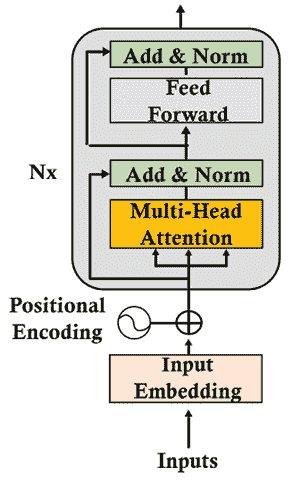
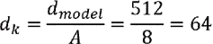
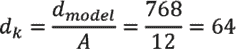
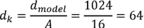
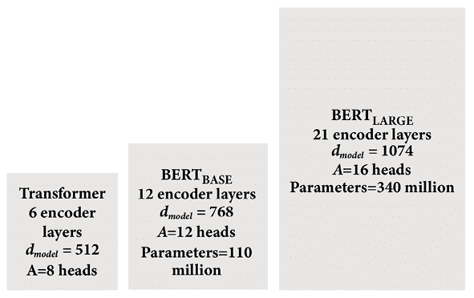
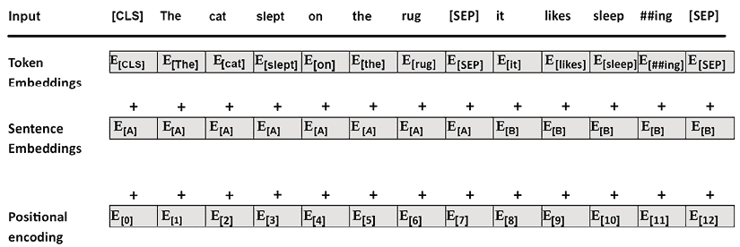
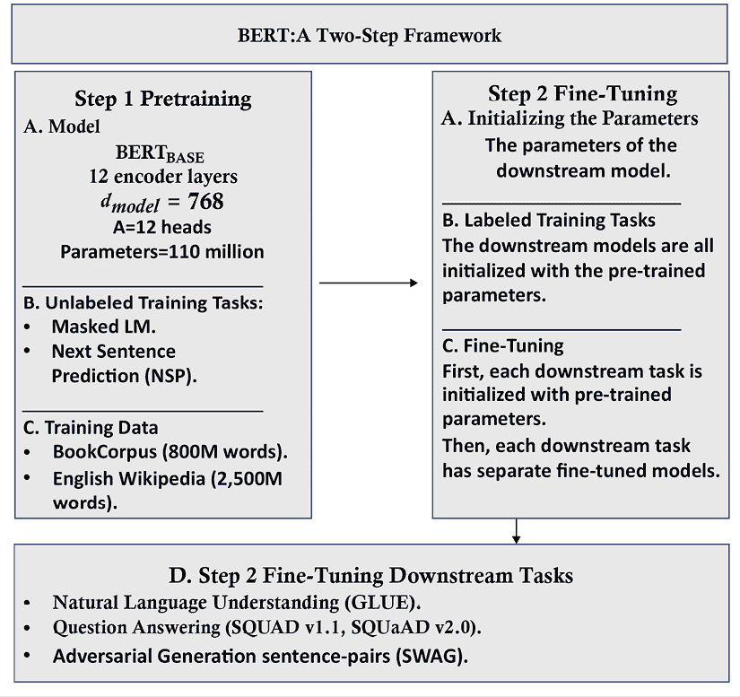
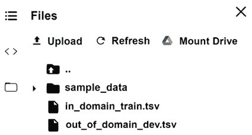
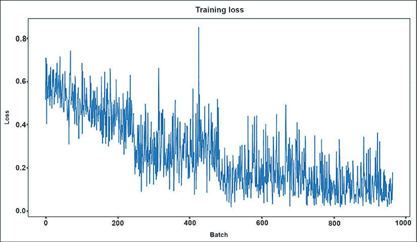
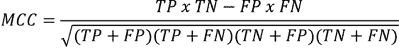

# 第三章：微调 BERT 模型

在*第二章*，*开始使用变压器模型的架构*中，我们定义了原始 Transformer 架构的构建块。 将原始 Transformer 想象成用乐高^® 砖块构建的模型。 构建套件包含编码器、解码器、嵌入层、位置编码方法、多头注意力层、掩码多头注意力层、后层规范化、前馈子层和线性输出层等砖块。

砖块有各种大小和形状。你可以花几个小时使用相同的建筑套件构建各种模型！一些构建只需要一些砖块。其他构建将添加一个新的部件，就像我们使用乐高^® 组件构建模型时获得额外的砖块一样。

BERT 向 Transformer 构建套件添加了一个新部件：双向多头注意力子层。 当我们人类在理解一个句子时遇到问题时，我们不仅仅查看过去的单词。 BERT 像我们一样，同时查看同一句子中的所有单词。

本章将首先探讨**来自变压器的双向编码表示**（**BERT**）的架构。 BERT 以一种新颖的方式仅使用变压器的编码器块，并且不使用解码器堆栈。

然后，我们将对预训练的 BERT 模型进行微调。 我们将对将进行微调的 BERT 模型进行预训练，该模型由第三方训练并上传到 Hugging Face。 变压器可以进行预训练。 然后，例如，可以在几个 NLP 任务上对预训练的 BERT 进行微调。 我们将通过使用 Hugging Face 模块进行下游 Transformer 使用的这种迷人经历。

本章涵盖以下主题：

+   来自变压器的双向编码表示（BERT）

+   BERT 的架构

+   两步 BERT 框架

+   准备预训练环境

+   定义预训练编码器层

+   定义微调

+   下游多任务处理

+   构建微调的 BERT 模型

+   加载可接受性判断数据集

+   创建注意力掩码

+   BERT 模型配置

+   衡量微调模型的性能

我们的第一步将是探索 BERT 模型的背景。

# BERT 的架构

BERT 将双向注意引入了变压器模型。 双向注意需要对原始 Transformer 模型进行许多其他更改。

我们将不会讨论*第二章*，*开始使用变压器模型的架构*中描述的变压器构建块。 您可以随时查阅*第二章*，以查看有关变压器构建块的某个方面的评论。 在本节中，我们将重点关注 BERT 模型的特定方面。

我们将重点关注*Devlin*等人（2018）设计的演进，描述了编码器堆栈。 我们将首先通过编码器堆栈，然后通过预训练输入环境的准备来描述 BERT 的两步框架：预训练和微调。

让我们首先探索编码器堆栈。

## 编码器堆栈

我们将从原始变换器模型中采用的第一个构建块是编码器层。正如在*第二章* *变换器模型架构入门* 中描述的那样，编码器层显示在*图 3.1*中：



图 3.1：编码器层

BERT 模型不使用解码器层。BERT 模型具有编码器堆栈，但没有解码器堆栈。掩码的标记（隐藏要预测的标记）位于编码器的注意力层中，我们将在后续部分中放大 BERT 编码器层时看到。

原始变换器包含一个*N*=6 层的堆栈。原始变换器的维度数为*d*[model] = 512。原始变换器的注意力头数为*A*=8。原始变换器的头部维度是：



BERT 编码器层比原始变换器模型更大。

两个 BERT 模型可以使用编码器层构建：

+   BERT[BASE]，其中包含*N*=12 编码器层。*d*[model] = 768，也可以表示为*H*=768，就像 BERT 论文中所述。多头注意力子层包含*A*=12 个头。每个头的维度*z*[A]与原始变换器模型中保持为 64：



+   在连接之前，每个多头注意力子层的输出将是 12 个头的输出：

*output_multi-head_attention={z*[0], *z*[1], *z*[2],…, *z*[11]*}*

+   BERT[LARGE]，其中包含*N*=24 编码器层。*d*[model] = 1024。多头注意力子层包含*A*=16 个头。每个头的维度*z*[A]与原始变换器模型中保持为 64：



+   在连接之前，每个多头注意力子层的输出将是 16 个头的输出：

*output_multi-head_attention={z*[0], *z*[1], *z*[2],…, *z*[15]*}*

模型的大小可以总结如下：



图 3.2：变换器模型

BERT 模型不仅限于这三种配置。这三种配置说明了 BERT 模型的主要方面。有许多变种是可能的。

尺寸和维度在 BERT 风格的预训练中起着至关重要的作用。BERT 模型就像人类一样。BERT 模型随着更多的工作内存（维度）和更多的知识（数据）产生更好的结果。学习大量数据的大型变换器模型将为下游自然语言处理任务更好地进行预训练。

让我们进入第一个子层，看看 BERT 模型中输入嵌入和位置编码的基本方面。

### 准备预训练输入环境

BERT 模型没有解码器层的堆栈。因此，它没有一个掩码的多头注意力子层。BERT 设计者指出，掩码了其余序列的掩码的多头注意力层妨碍了注意力过程。

掩码的多头注意力层掩盖了超出当前位置的所有标记。 例如，采用以下句子：

```py
The cat sat on it because it was a nice rug. 
```

如果我们刚到达单词`it`，编码器的输入可以是:

```py
The cat sat on it<masked sequence> 
```

这种方法的动机是防止模型看到它应该预测的输出。 这种从左到右的方法可以产生相当好的结果。

然而，模型不能通过这种方式学到很多。 要知道`it`指的是什么，我们需要看整个句子，达到`rug`这个词，并弄清楚`it`指的是地毯。

BERT 的作者想到了一个主意。为什么不预训练模型使用不同的方法来进行预测？

BERT 的作者提出了双向注意力，让一个注意力头同时从左到右和从右到左关注*所有*单词。 换句话说，编码器的自注意力屏蔽可以在不受解码器的掩码多头注意力子层的阻碍的情况下完成任务。

该模型经过了两项任务的训练。 第一种方法是**掩码语言建模**（**MLM**）。 第二种方法是**下一句预测**（**NSP**）。

让我们从掩码语言建模开始。

#### 掩码语言建模

掩码语言建模不需要训练模型，即可预测由可见单词序列后跟掩码序列。

BERT 引入了对句子的*双向*分析，其中对句子的一个单词进行随机掩盖。

需要注意的是，BERT 应用了`WordPiece`，一种子词分词的方法，以及学习的位置编码，而不是正弦-余弦方法。

一个潜在的输入序列可能是:

```py
The cat sat on it because it was a nice rug. 
```

当模型到达单词`it`后，解码器将掩码注意力序列:

```py
The cat sat on it <masked sequence>. 
```

但是 BERT 编码器会将一个随机标记进行掩码以进行预测:

```py
The cat sat on it [MASK] it was a nice rug. 
```

多重注意力子层现在可以看到整个序列，运行自注意力过程，并预测被掩码的标记。

输入标记以一种棘手的方式进行了掩码，*以便让模型训练时间更长，但产生更好的结果*，采用三种方法：

+   在数据集的 10%中，出其不意地不掩盖一个标记; 例如:

    ```py
    The cat sat on it [because] it was a nice rug. 
    ```

+   在数据集的 10%中，用随机标记替换标记来出其不意; 例如:

    ```py
    The cat sat on it [often] it was a nice rug. 
    ```

+   在 80%的数据集中，将一个标记替换为`[MASK]`标记; 例如:

    ```py
    The cat sat on it [MASK] it was a nice rug. 
    ```

作者们大胆的方法避免了过拟合，并迫使模型高效训练。

BERT 还经过训练用于执行下一句预测。

#### 下一句预测

第二种训练 BERT 的方法是**下一句预测**（**NSP**）。输入包含两个句子。 在 50%的情况下，第二个句子是文档的实际第二句。 在 50%的情况下，第二个句子是随机选择的，与第一个句子无关。

添加了两个新标记：

+   `[CLS]`是一个二元分类标记，添加到第一个序列的开头，以预测第二个序列是否跟随第一个序列。正样本通常是从数据集中取出的连续句子对。负样本是使用来自不同文档的序列创建的。

+   `[SEP]`是一个分隔标记，表示序列的结束。

例如，从一本书中摘录的输入句子可能是：

```py
The cat slept on the rug. It likes sleeping all day. 
```

这两个句子将成为一个完整的输入序列：

```py
[CLS] the cat slept on the rug [SEP] it likes sleep ##ing all day[SEP] 
```

这种方法需要额外的编码信息来区分序列 A 和序列 B。

如果我们将整个嵌入过程放在一起，我们得到：



图 3.3：输入嵌入

输入嵌入由标记嵌入、段（句子、短语、单词）嵌入和位置编码嵌入求和得到。

BERT 模型的输入嵌入和位置编码子层可以总结如下：

+   一系列单词被分解成`WordPiece`标记。

+   一个`[MASK]`标记将随机替换初始的单词标记，用于掩码语言建模训练。

+   为了分类目的，在序列的开头插入一个`[CLS]`分类标记。

+   一个`[SEP]`标记分隔两个句子（段落、短语）用于 NSP 训练。

+   将句子嵌入添加到标记嵌入中，使句子 A 的句子嵌入值与句子 B 不同。

+   学习位置编码。原始 Transformer 的正弦-余弦位置编码方法没有被应用。

还有一些额外的关键特性：

+   BERT 在其多头注意力子层中使用双向注意力，打开了广阔的学习视野，并理解标记之间的关系。

+   BERT 引入了无监督嵌入的场景，使用未标记的文本预训练模型。无监督场景迫使模型在多头注意力学习过程中更加努力思考。这使得 BERT 学习语言的构建方式，并将这些知识应用到下游任务中，而不必每次都进行预训练。

+   BERT 也使用监督学习，在预训练过程中涵盖了所有基础知识。

BERT 改进了 Transformer 的训练环境。现在让我们看看预训练的动机以及它如何帮助微调过程。

### 预训练和微调 BERT 模型

BERT 是一个两步框架。第一步是预训练，第二步是微调，如*图 3.4*所示：



图 3.4：BERT 框架

训练一个 Transformer 模型可能需要几个小时，甚至几天。设计架构和参数以及选择适当的数据集来训练 Transformer 模型需要相当长的时间。

预训练是 BERT 框架的第一步，可以分解为两个子步骤：

+   定义模型的架构：层数、头数、维度和模型的其他构建模块

+   在**MLM**和**NSP**任务上训练模型

BERT 框架的第二步是微调，也可以分解为两个子步骤：

+   用预训练的 BERT 模型的训练参数初始化所选的下游模型

+   针对特定下游任务（如**文本蕴涵识别**（**RTE**），问答（`SQuAD v1.1`，`SQuAD v2.0`）和**带有对抗生成的情境**（**SWAG**））微调参数

在本节中，我们介绍了微调 BERT 模型所需的信息。在接下来的章节中，我们将更深入地探讨本节提出的主题：

+   在*第四章*，*从头开始预训练 RoBERTa 模型*中，我们将从头开始预训练一个类似 BERT 的模型的 15 个步骤。我们甚至会编译我们的数据，训练一个分词器，然后训练模型。这一章旨在首先讨论 BERT 的特定构建模块，然后微调现有模型。

+   在*第五章*，*变形金刚进行下游自然语言处理任务*中，我们将遍历许多下游任务，探索`GLUE`，`SQuAD v1.1`，`SQuAD`，`SWAG`和其他几个自然语言处理评估数据集。我们将运行几个下游变形金刚模型来说明关键任务。本章的目标是微调一个下游模型。

+   在*第七章*，*GPT-3 引擎的超人变形金刚的崛起*中，将探讨 OpenAI `GPT-2`和`GPT-3`变形金刚的架构和使用方法。BERT[BASE]被配置得接近于 OpenAI `GPT`，以展示它产生了更好的性能。然而，OpenAI 变形金刚也在不断进化！我们将看到它们如何达到了超人类的自然语言处理水平。

在本章中，我们将对**语言可接受性语料库**（**CoLA**）上进行微调的 BERT 模型进行训练。下游任务基于*Alex Warstadt*，*Amanpreet Singh*和*Samuel R. Bowman*的*神经网络可接受性判断*。

我们将微调一个 BERT 模型，该模型将确定一个句子的语法可接受性。微调后的模型将获得一定水平的语言能力。

我们已经讨论了 BERT 的架构及其预训练和微调框架。现在让我们来微调一个 BERT 模型。

# 微调 BERT

本节将微调一个 BERT 模型，以预测*可接受性判断*的下游任务，并使用**马修斯相关系数**（**MCC**）来衡量预测，这将在本章的*使用马修斯相关系数进行评估*部分进行解释。

在 Google Colab 中打开`BERT_Fine_Tuning_Sentence_Classification_GPU.ipynb`（确保你有一个电子邮箱账户）。笔记本在本书的 GitHub 存储库的`Chapter03`中。

笔记本中每个单元格的标题也与本章的每个小节的标题相同或非常接近。

我们将首先探讨为什么变形金刚模型必须考虑硬件约束。

## 硬件约束

Transformer 模型需要多处理硬件。在 Google Colab 的**运行时**菜单中，选择**更改运行时类型**，并在**硬件加速器**下拉列表中选择**GPU**。

Transformer 模型是硬件驱动的。我建议在继续本章之前阅读*附录 II*，*Transformer 模型的硬件约束*。

程序将使用 `Hugging Face` 模块，接下来我们将安装它们。

## 安装 Hugging Face PyTorch 接口的 BERT

Hugging Face 提供了一个预训练的 BERT 模型。Hugging Face 开发了一个名为`PreTrainedModel`的基类。通过安装这个类，我们可以从预训练模型配置中加载模型。

Hugging Face 提供了 TensorFlow 和 PyTorch 模块。我建议开发者对两种环境都要熟悉。出色的人工智能研究团队会使用其中一种或两种环境。

在本章中，我们将按照以下方式安装所需的模块：

```py
#@title Installing the Hugging Face PyTorch Interface for Bert
!pip install -q transformers 
```

安装将运行，或者满足要求的消息将被显示。

现在我们可以导入程序所需的模块。

## 导入模块

我们将导入所需的预训练模块，如预训练的`BERT tokenizer`和 BERT 模型的配置。导入了`BERTAdam`优化器以及序列分类模块：

```py
#@title Importing the modules
import torch
import torch.nn as nn
from torch.utils.data import TensorDataset, DataLoader, RandomSampler, SequentialSampler
from keras.preprocessing.sequence import pad_sequences
from sklearn.model_selection import train_test_split
from transformers import BertTokenizer, BertConfig
from transformers import AdamW, BertForSequenceClassification, get_linear_schedule_with_warmup 
```

从`tqdm`导入一个漂亮的进度条模块：

```py
from tqdm import tqdm, trange 
```

现在我们可以导入广泛使用的标准 Python 模块：

```py
import pandas as pd
import io
import numpy as np
import matplotlib.pyplot as plt
% matplotlib inline 
```

如果一切顺利，不会显示任何消息，需要记住 Google Colab 已经在我们使用的虚拟机上预先安装了这些模块。

## 指定 CUDA 作为 torch 的设备

现在我们将指定 torch 使用**计算统一设备架构**（**CUDA**）来利用 NVIDIA 卡的并行计算能力，为我们的多头注意力模型工作：

```py
#@title Harware verification and device attribution
device = torch.device("cuda" if torch.cuda.is_available() else "cpu")
!nvidia-smi 
```

输出可能会随 Google Colab 的配置而变化。请参阅*附录 II*：*Transformer 模型的硬件约束*，了解解释和截图。

现在我们将加载数据集。

## 加载数据集

现在我们将基于 *Warstadt*等人（2018 年）的论文加载 *CoLA*。

**通用语言理解评估**（**GLUE**）将*语言可接受性*视为首要的自然语言处理任务。在*第五章*，*使用 Transformer 的下游自然语言处理任务*中，我们将探讨 Transformer 必须执行的关键任务，以证明其效率。

笔记本中的以下单元格会自动下载必要的文件：

```py
import os
!curl -L https://raw.githubusercontent.com/Denis2054/Transformers-for-NLP-2nd-Edition/master/Chapter03/in_domain_train.tsv --output "in_domain_train.tsv"
!curl -L https://raw.githubusercontent.com/Denis2054/Transformers-for-NLP-2nd-Edition/master/Chapter03/out_of_domain_dev.tsv --output "out_of_domain_dev.tsv" 
```

你应该看到它们出现在文件管理器中：



图 3.5：上传数据集

现在程序将加载数据集：

```py
#@title Loading the Dataset
#source of dataset : https://nyu-mll.github.io/CoLA/
df = pd.read_csv("in_domain_train.tsv", delimiter='\t', header=None, names=['sentence_source', 'label', 'label_notes', 'sentence'])
df.shape 
```

输出显示了我们导入的数据集的形状：

```py
(8551, 4) 
```

显示了 10 行样本以可视化*可接受性判断*任务，并查看序列是否合理：

```py
df.sample(10) 
```

输出显示了 `10`行标记数据集，每次运行后可能会更改：

|  | **sentence_source** | **label** | **label_notes** | **sentence** |
| --- | --- | --- | --- | --- |

|

```py
1742 
```

|

```py
r-67 
```

|

```py
1 
```

|

```py
NaN 
```

|

```py
they said that tom would n't pay up , but pay… 
```

|

|

```py
937 
```

|

```py
bc01 
```

|

```py
1 
```

|

```py
NaN 
```

|

```py
although he likes cabbage too , fred likes egg… 
```

|

|

```py
5655 
```

|

```py
c_13 
```

|

```py
1 
```

|

```py
NaN 
```

|

```py
wendy 's mother country is iceland . 
```

|

|

```py
500 
```

|

```py
bc01 
```

|

```py
0 
```

|

```py
* 
```

|

```py
john is wanted to win . 
```

|

|

```py
4596 
```

|

```py
ks08 
```

|

```py
1 
```

|

```py
NaN 
```

|

```py
i did n't find any bugs in my bed . 
```

|

|

```py
7412 
```

|

```py
sks13 
```

|

```py
1 
```

|

```py
NaN 
```

|

```py
the girl he met at the departmental party will... 
```

|

|

```py
8456 
```

|

```py
ad03 
```

|

```py
0 
```

|

```py
* 
```

|

```py
peter is the old pigs . 
```

|

|

```py
744 
```

|

```py
bc01 
```

|

```py
0 
```

|

```py
* 
```

|

```py
frank promised the men all to leave . 
```

|

|

```py
5420 
```

|

```py
b_73 
```

|

```py
0 
```

|

```py
* 
```

|

```py
i 've seen as much of a coward as frank . 
```

|

|

```py
5749 
```

|

```py
c_13 
```

|

```py
1 
```

|

```py
NaN 
```

|

```py
we drove all the way to buenos aires . 
```

|

`.tsv`文件中每个样本包含四个以制表符分隔的列：

+   第一列：句子的来源（代码）

+   第二列：标签（`0`=不可接受，`1`=可接受）

+   第三列：作者注释的标签

+   第四列：待分类的句子

你可以在本地打开`.tsv`文件，阅读数据集的一些样本。程序现在将处理数据用于 BERT 模型。

## 创建句子，标签列表，并添加 BERT 标记

程序现在会按照本章*准备预训练输入环境*部分的描述创建句子：

```py
#@ Creating sentence, label lists and adding Bert tokens
sentences = df.sentence.values
# Adding CLS and SEP tokens at the beginning and end of each sentence for BERT
sentences = ["[CLS] " + sentence + " [SEP]" for sentence in sentences]
labels = df.label.values 
```

`[CLS]`和`[SEP]`现在已经添加。

程序现在激活了分词器。

## 激活 BERT 分词器

在本节中，我们将初始化一个预训练的 BERT 分词器。这将节省从头开始训练它所需的时间。

程序选择了一个小写分词器，激活它，并显示了第一个标记化的句子：

```py
#@title Activating the BERT Tokenizer
tokenizer = BertTokenizer.from_pretrained('bert-base-uncased', do_lower_case=True)
tokenized_texts = [tokenizer.tokenize(sent) for sent in sentences]
print ("Tokenize the first sentence:")
print (tokenized_texts[0]) 
```

输出包含分类令牌和序列分割令牌：

```py
Tokenize the first sentence:
['[CLS]', 'our', 'friends', 'wo', 'n', "'", 't', 'buy', 'this', 'analysis', ',', 'let', 'alone', 'the', 'next', 'one', 'we', 'propose', '.', '[SEP]'] 
```

程序现在将处理数据。

## 处理数据

我们需要确定一个固定的最大长度并为模型处理数据。数据集中的句子很短。但为了确保这一点，程序将序列的最大长度设置为`128`，然后进行填充：

```py
#@title Processing the data
# Set the maximum sequence length. The longest sequence in our training set is 47, but we'll leave room on the end anyway. 
# In the original paper, the authors used a length of 512.
MAX_LEN = 128
# Use the BERT tokenizer to convert the tokens to their index numbers in the BERT vocabulary
input_ids = [tokenizer.convert_tokens_to_ids(x) for x in tokenized_texts]
# Pad our input tokens
input_ids = pad_sequences(input_ids, maxlen=MAX_LEN, dtype="long", truncating="post", padding="post") 
```

序列已经被处理，现在程序创建了注意力掩码。

## 创建注意力掩码

现在就是过程中的一个棘手部分了。在前一个单元格中，我们添加了填充的序列。但我们想阻止模型对这些填充的标记执行注意力！

想法是为每个标记应用一个值为`1`的掩码，0 将用于填充：

```py
#@title Create attention masks
attention_masks = []
# Create a mask of 1s for each token followed by 0s for padding
for seq in input_ids:
  seq_mask = [float(i>0) for i in seq]
  attention_masks.append(seq_mask) 
```

程序现在将分割数据。

## 将数据分割成训练集和验证集

程序现在执行标准的数据分割过程，将数据分成训练集和验证集：

```py
#@title Splitting data into train and validation sets
# Use train_test_split to split our data into train and validation sets for training
train_inputs, validation_inputs, train_labels, validation_labels = train_test_split(input_ids, labels, random_state=2018, test_size=0.1)
train_masks, validation_masks, _, _ = train_test_split(attention_masks, input_ids,random_state=2018, test_size=0.1) 
```

数据已经准备好训练，但仍需调整为 torch。

## 将所有数据转换为 torch 张量

微调模型使用 torch 张量。程序必须将数据转换为 torch 张量：

```py
#@title Converting all the data into torch tensors
# Torch tensors are the required datatype for our model
train_inputs = torch.tensor(train_inputs)
validation_inputs = torch.tensor(validation_inputs)
train_labels = torch.tensor(train_labels)
validation_labels = torch.tensor(validation_labels)
train_masks = torch.tensor(train_masks)
validation_masks = torch.tensor(validation_masks) 
```

转换结束了。现在我们需要创建一个迭代器。

## 选择批处理大小并创建迭代器

在这个单元格中，程序会选择批处理大小并创建一个迭代器。这个迭代器是避免加载所有数据到内存中并且配合 torch 的`DataLoader`巧妙的方式，可以批量训练大型数据集而不会使机器内存崩溃。

在这个模型中，批处理大小是`32`：

```py
#@title Selecting a Batch Size and Creating and Iterator
# Select a batch size for training. For fine-tuning BERT on a specific task, the authors recommend a batch size of 16 or 32
batch_size = 32
# Create an iterator of our data with torch DataLoader. This helps save on memory during training because, unlike a for loop, 
# with an iterator the entire dataset does not need to be loaded into memory
train_data = TensorDataset(train_inputs, train_masks, train_labels)
train_sampler = RandomSampler(train_data)
train_dataloader = DataLoader(train_data, sampler=train_sampler, batch_size=batch_size)
validation_data = TensorDataset(validation_inputs, validation_masks, validation_labels)
validation_sampler = SequentialSampler(validation_data)
validation_dataloader = DataLoader(validation_data, sampler=validation_sampler, batch_size=batch_size) 
```

数据已经被处理并且准备就绪。程序现在可以加载并配置 BERT 模型。

## BERT 模型配置

程序现在初始化了一个 BERT 小写配置:

```py
#@title BERT Model Configuration
# Initializing a BERT bert-base-uncased style configuration
#@title Transformer Installation
try:
  import transformers
except:
  print("Installing transformers")
  !pip -qq install transformers

from transformers import BertModel, BertConfig
configuration = BertConfig()
# Initializing a model from the bert-base-uncased style configuration
model = BertModel(configuration)
# Accessing the model configuration
configuration = model.config
print(configuration) 
```

输出包含主要的 Hugging Face 参数，类似于以下内容（该库经常更新）：

```py
BertConfig {
  "attention_probs_dropout_prob": 0.1,
  "hidden_act": "gelu",
  "hidden_dropout_prob": 0.1,
  "hidden_size": 768,
  "initializer_range": 0.02,
  "intermediate_size": 3072,
  "layer_norm_eps": 1e-12,
  "max_position_embeddings": 512,
  "model_type": "bert",
  "num_attention_heads": 12,
  "num_hidden_layers": 12,
  "pad_token_id": 0,
  "type_vocab_size": 2,
  "vocab_size": 30522
} 
```

来看看这些主要参数：

+   `attention_probs_dropout_prob`：`0.1`将`0.1`的丢失率应用于注意力概率。

+   `hidden_act`: `"gelu"` 是编码器中的非线性激活函数。这是一个*高斯误差线性单元*的激活函数。输入按其大小加权，这使其非线性。

+   `hidden_dropout_prob`: `0.1` 是应用于全连接层的 dropout 概率。在嵌入、编码器和池层中都可以找到全连接。输出并不总是对序列内容的良好反映。池化隐藏状态序列有助于改善输出序列。

+   `hidden_size`: `768` 是编码层和池层的维度。

+   `initializer_range`: `0.02` 是初始化权重矩阵的标准差值。

+   `intermediate_size`: `3072` 是编码器的前馈层的维度。

+   `layer_norm_eps`: `1e-12` 是层归一化层的 epsilon 值。

+   `max_position_embeddings`: `512` 是模型使用的最大长度。

+   `model_type`: `"bert"` 是模型的名称。

+   `num_attention_heads`: `12` 是头的数量。

+   `num_hidden_layers`: `12` 是层数的数量。

+   `pad_token_id`: `0` 是填充标记的 ID，以避免训练填充标记。

+   `type_vocab_size`: `2` 是`token_type_ids`的大小，它标识序列。例如，“the `dog[SEP]` The `cat.[SEP]`"可以用 token IDs `[0,0,0, 1,1,1]`表示。

+   `vocab_size`: `30522` 是模型用于表示`input_ids`的不同标记的数量。

有了这些参数，我们现在可以加载预训练模型。

## 加载 Hugging Face BERT uncased 基础模型

程序现在加载了预训练的 BERT 模型：

```py
#@title Loading the Hugging Face Bert uncased base model 
model = BertForSequenceClassification.from_pretrained("bert-base-uncased", num_labels=2)
model = nn.DataParallel(model)
model.to(device) 
```

我们已经定义了模型，定义了并行处理，并且将模型发送到设备。更多解释，请参见*附录 II*，*Transformer 模型的硬件限制*。

如果需要，该预训练模型可以进一步训练。通过详细探索架构，可以可视化每个子层的参数，就像下面的摘录所示：

```py
BertForSequenceClassification(
  (bert): BertModel(
    (embeddings): BertEmbeddings(
      (word_embeddings): Embedding(30522, 768, padding_idx=0)
      (position_embeddings): Embedding(512, 768)
      (token_type_embeddings): Embedding(2, 768)
      (LayerNorm): BertLayerNorm()
      (dropout): Dropout(p=0.1, inplace=False)
    )
    (encoder): BertEncoder(
      (layer): ModuleList(
        (0): BertLayer(
          (attention): BertAttention(
            (self): BertSelfAttention(
              (query): Linear(in_features=768, out_features=768, bias=True)
              (key): Linear(in_features=768, out_features=768, bias=True)
              (value): Linear(in_features=768, out_features=768, bias=True)
              (dropout): Dropout(p=0.1, inplace=False)
            )
            (output): BertSelfOutput(
              (dense): Linear(in_features=768, out_features=768, bias=True)
              (LayerNorm): BertLayerNorm()
              (dropout): Dropout(p=0.1, inplace=False)
            )
          )
          (intermediate): BertIntermediate(
            (dense): Linear(in_features=768, out_features=3072, bias=True)
          )
          (output): BertOutput(
            (dense): Linear(in_features=3072, out_features=768, bias=True)
            (LayerNorm): BertLayerNorm()
            (dropout): Dropout(p=0.1, inplace=False)
          )
        )
        (1): BertLayer(
          (attention): BertAttention(
            (self): BertSelfAttention(
              (query): Linear(in_features=768, out_features=768, bias=True)
              (key): Linear(in_features=768, out_features=768, bias=True)
              (value): Linear(in_features=768, out_features=768, bias=True)
              (dropout): Dropout(p=0.1, inplace=False)
            )
            (output): BertSelfOutput(
              (dense): Linear(in_features=768, out_features=768, bias=True)
              (LayerNorm): BertLayerNorm()
              (dropout): Dropout(p=0.1, inplace=False)
            )
          )
          (intermediate): BertIntermediate(
            (dense): Linear(in_features=768, out_features=3072, bias=True)
          )
          (output): BertOutput(
            (dense): Linear(in_features=3072, out_features=768, bias=True)
            (LayerNorm): BertLayerNorm()
            (dropout): Dropout(p=0.1, inplace=False)
          )
        ) 
```

现在让我们来看一下优化器的主要参数。

## 优化器分组参数

程序现在将初始化模型参数的优化器。微调模型的起始点是初始化预训练模型的参数值（而不是它们的名称）。

优化器的参数包括权重衰减率以避免过拟合，还有一些参数被筛选了出来。

目标是为了为训练循环准备模型的参数：

```py
##@title Optimizer Grouped Parameters
#This code is taken from:
# https://github.com/huggingface/transformers/blob/5bfcd0485ece086ebcbed2d008813037968a9e58/examples/run_glue.py#L102
# Don't apply weight decay to any parameters whose names include these tokens.
# (Here, the BERT doesn't have 'gamma' or 'beta' parameters, only 'bias' terms)
param_optimizer = list(model.named_parameters())
no_decay = ['bias', 'LayerNorm.weight']
# Separate the 'weight' parameters from the 'bias' parameters. 
# - For the 'weight' parameters, this specifies a 'weight_decay_rate' of 0.01\. 
# - For the 'bias' parameters, the 'weight_decay_rate' is 0.0\. 
optimizer_grouped_parameters = [
    # Filter for all parameters which *don't* include 'bias', 'gamma', 'beta'.
    {'params': [p for n, p in param_optimizer if not any(nd in n for nd in no_decay)],
     'weight_decay_rate': 0.1},

    # Filter for parameters which *do* include those.
    {'params': [p for n, p in param_optimizer if any(nd in n for nd in no_decay)],
     'weight_decay_rate': 0.0}
]
# Note - 'optimizer_grouped_parameters' only includes the parameter values, not the names. 
```

参数已经被准备并清理干净。它们已经为训练循环做好了准备。

## 训练循环的超参数

尽管似乎无害，但训练循环的超参数至关重要。例如，Adam 会激活权重衰减，并且还会经历一个温和的阶段。

学习率（`lr`）和温和率（`warmup`）在优化阶段的早期应该设为一个很小的值，并且在一定数量的迭代后逐渐增加。这可以避免大梯度和超出优化目标。

一些研究人员认为，在层归一化之前的子层输出水平上的梯度不需要预热率。解决这个问题需要进行多次实验运行。

优化器是一种称为`BertAdam`的 BERT 版本的 Adam：

```py
#@title The Hyperparameters for the Training Loop 
optimizer = BertAdam(optimizer_grouped_parameters,
                     lr=2e-5,
                     warmup=.1) 
```

程序添加了一个精度测量函数来比较预测和标签：

```py
#Creating the Accuracy Measurement Function
# Function to calculate the accuracy of our predictions vs labels
def flat_accuracy(preds, labels):
    pred_flat = np.argmax(preds, axis=1).flatten()
    labels_flat = labels.flatten()
    return np.sum(pred_flat == labels_flat) / len(labels_flat) 
```

数据准备就绪。参数准备就绪。现在是激活训练循环的时候了！

## 训练循环

训练循环遵循标准学习过程。epochs 数设置为`4`，并且损失和准确率的测量将被绘制。训练循环使用`dataloader`加载和训练批次。训练过程进行了测量和评估。

代码从初始化`train_loss_set`开始，它将存储将绘制的损失和准确率。它开始训练其 epochs 并运行标准训练循环，如下所示的摘录：

```py
#@title The Training Loop
t = [] 
# Store our loss and accuracy for plotting
train_loss_set = []
# Number of training epochs (authors recommend between 2 and 4)
epochs = 4
# trange is a tqdm wrapper around the normal python range
for _ in trange(epochs, desc="Epoch"):
…./…
    tmp_eval_accuracy = flat_accuracy(logits, label_ids)

    eval_accuracy += tmp_eval_accuracy
    nb_eval_steps += 1
  print("Validation Accuracy: {}".format(eval_accuracy/nb_eval_steps)) 
```

输出使用`trange`包装器为每个`epoch`显示信息，`for _ in trange(epochs, desc="Epoch")`：

```py
***output***
Epoch:   0%|          | 0/4 [00:00<?, ?it/s]
Train loss: 0.5381132976395461
Epoch:  25%|██▌       | 1/4 [07:54<23:43, 474.47s/it]
Validation Accuracy: 0.788966049382716
Train loss: 0.315329696132929
Epoch:  50%|█████     | 2/4 [15:49<15:49, 474.55s/it]
Validation Accuracy: 0.836033950617284
Train loss: 0.1474070605354314
Epoch:  75%|███████▌  | 3/4 [23:43<07:54, 474.53s/it]
Validation Accuracy: 0.814429012345679
Train loss: 0.07655430570461196
Epoch: 100%|██████████| 4/4 [31:38<00:00, 474.58s/it]
Validation Accuracy: 0.810570987654321 
```

Transformer 模型发展非常迅速，可能会出现废弃消息甚至错误。Hugging Face 也不例外，当发生这种情况时，我们必须相应地更新我们的代码。

模型已经训练。我们现在可以显示训练评估。

## 训练评估

损失和准确率数值存储在`train_loss_set`中，这在训练循环开始时定义。

程序现在绘制测量结果：

```py
#@title Training Evaluation
plt.figure(figsize=(15,8))
plt.title("Training loss")
plt.xlabel("Batch")
plt.ylabel("Loss")
plt.plot(train_loss_set)
plt.show() 
```

输出是一张图表，显示训练过程进行得很顺利和高效：



图 3.6：每批次训练损失

模型已经微调。我们现在可以进行预测。

## 使用留存数据集进行预测和评估

BERT 下游模型是使用`in_domain_train.tsv`数据集训练的。程序现在将使用`out_of_domain_dev.tsv`文件中的留存（测试）数据集进行预测。目标是预测句子是否语法正确。

以下代码摘录显示了应用于训练数据的数据准备过程在留存数据集部分的代码中被重复使用：

```py
#@title Predicting and Evaluating Using the Holdout Dataset 
df = pd.read_csv("out_of_domain_dev.tsv", delimiter='\t', header=None, names=['sentence_source', 'label', 'label_notes', 'sentence'])
# Create sentence and label lists
sentences = df.sentence.values
# We need to add special tokens at the beginning and end of each sentence for BERT to work properly
sentences = ["[CLS] " + sentence + " [SEP]" for sentence in sentences]
labels = df.label.values
tokenized_texts = [tokenizer.tokenize(sent) for sent in sentences]
.../... 
```

程序然后使用`dataloader`运行批次预测：

```py
# Predict 
for batch in prediction_dataloader:
  # Add batch to GPU
  batch = tuple(t.to(device) for t in batch)
  # Unpack the inputs from our dataloader
  b_input_ids, b_input_mask, b_labels = batch
  # Telling the model not to compute or store gradients, saving memory and speeding up prediction
  with torch.no_grad():
    # Forward pass, calculate logit predictions
    logits = model(b_input_ids, token_type_ids=None, attention_mask=b_input_mask) 
```

预测的 logits 和标签被移动到 CPU 上：

```py
 # Move logits and labels to CPU
  logits =  logits['logits'].detach().cpu().numpy()
  label_ids = b_labels.to('cpu').numpy() 
```

预测和它们的真实标签已存储：

```py
 # Store predictions and true labels
  predictions.append(logits)
  true_labels.append(label_ids) 
```

程序现在可以评估预测了。

## 使用马修斯相关系数进行评估

**马修斯相关系数**（**MCC**）最初是设计用来衡量二元分类的质量，并且可以修改为多类相关系数。每个预测可以使用四个概率进行二元分类：

+   TP = 真阳性

+   TN = 真阴性

+   FP = 假阳性

+   FN = 假阴性

*布莱恩·W·马修斯*，一位生物化学家，于 1975 年设计了它，受他的前辈的*phi*函数的启发。从那时起，它已经发展成为各种格式，如以下格式之一：



MCC 产生的值在`-1`和`+1`之间。 `+1`是预测的最大正值。 `-1`是反向预测。 `0`是平均随机预测。

GLUE 用 MCC 评估*语言可接受性*。

MCC 是导入自`sklearn.metrics`的：

```py
#@title Evaluating Using Matthew's Correlation Coefficient
# Import and evaluate each test batch using Matthew's correlation coefficient
from sklearn.metrics import matthews_corrcoef 
```

创建了一组预测：

```py
matthews_set = [] 
```

MCC 值被计算并存储在`matthews_set`中：

```py
for i in range(len(true_labels)):
  matthews = matthews_corrcoef(true_labels[i],
                 np.argmax(predictions[i], axis=1).flatten())
  matthews_set.append(matthews) 
```

由于库和模块版本更改，您可能会看到一些消息。 最终得分将基于整个测试集，但让我们看看各个批次的得分，以了解批次之间指标的变化。

## 各个批次的得分

让我们来看看各个批次的得分：

```py
#@title Score of Individual Batches
matthews_set 
```

输出产生了预期的`-1`和`+1`之间的 MCC 值：

```py
[0.049286405809014416,
 -0.2548235957188128,
 0.4732058754737091,
 0.30508307783296046,
 0.3567530340063379,
 0.8050112948805689,
 0.23329882422520506,
 0.47519096331149147,
 0.4364357804719848,
 0.4700159919404217,
 0.7679476477883045,
 0.8320502943378436,
 0.5807564950208268,
 0.5897435897435898,
 0.38461538461538464,
 0.5716350506349809,
 0.0] 
```

几乎所有的 MCC 值都是正值，这是个好消息。 让我们看看整个数据集的评估如何。

## 对整个数据集进行 Matthews 评估

MCC 是评估分类模型的一种实用方法。

该程序现在将为整个数据集聚合真实值：

```py
#@title Matthew's Evaluation on the Whole Dataset
# Flatten the predictions and true values for aggregate Matthew's evaluation on the whole dataset
flat_predictions = [item for sublist in predictions for item in sublist]
flat_predictions = np.argmax(flat_predictions, axis=1).flatten()
flat_true_labels = [item for sublist in true_labels for item in sublist]
matthews_corrcoef(flat_true_labels, flat_predictions) 
```

MCC 产生`-1`和`+1`之间的相关值。 `0`是平均预测，`-1`是反向预测，`1`是完美预测。 在这种情况下，输出证实 MCC 是正值，表明模型和数据集之间存在关联：

```py
0.45439842471680725 
```

在 BERT 模型的微调最终积极评估中，我们对 BERT 训练框架有了整体的认识。

# 摘要

BERT 为 transformers 引入了双向关注。 从左到右预测序列并屏蔽未来的标记以训练模型具有严格限制。 如果屏蔽的序列包含我们正在寻找的意义，模型将产生错误。 BERT 同时关注序列的所有标记。

我们探索了 BERT 的架构，它只使用 transformers 的编码器堆栈。 BERT 被设计为一个两步框架。 框架的第一步是预训练一个模型。 第二步是微调模型。 我们为*可接受性判断*下游任务构建了一个微调的 BERT 模型。 微调过程经历了所有阶段的过程。 首先，我们加载了数据集和加载了模型的必要预训练模块。 然后训练模型，并测量其性能。

对一个预训练模型进行微调所需的机器资源比从头开始训练下游任务要少。 细调模型可以执行各种任务。 BERT 证明我们只需对模型进行两项训练预处理就能实现这一点，这本身就是了不起的。但是基于 BERT 预训练模型的训练参数产生多任务微调模型是异常的。

*第七章*，*具有 GPT-3 引擎的超人变形金刚的兴起*，表明 OpenAI 已经达到了零调校水平。

在本章中，我们对 BERT 模型进行了微调。在下一章，*第四章*，*从头开始预训练 RoBERTa 模型*，我们将深入研究 BERT 框架，并从头构建一个预训练的类 BERT 模型。

# 问题

1.  BERT 代表双向编码器来自变压器。 (True/False)

1.  BERT 是一个两步框架。 *步骤 1* 是预训练。 *步骤 2* 是微调。 (True/False)

1.  对 BERT 模型进行微调意味着从头开始训练参数。 (True/False)

1.  BERT 仅通过所有下游任务进行预训练。 (True/False)

1.  BERT 预训练采用**掩码语言建模** (**MLM**)。 (True/False)

1.  BERT 预训练采用**下一句预测** (**NSP**)。 (True/False)

1.  BERT 预训练数学函数。 (True/False)

1.  问答任务是一个下游任务。 (True/False)

1.  BERT 预训练模型不需要标记化。 (True/False)

1.  对 BERT 模型进行微调所需时间比预训练少。 (True/False)

# 参考资料

+   *Ashish Vaswani*, *Noam Shazeer*, *Niki Parmar*, *Jakob Uszkoreit*, *Llion Jones*, *Aidan N. Gomez*, *Lukasz Kaiser*, *Illia Polosukhin*, 2017, *注意力全靠你*: [`arxiv.org/abs/1706.03762`](https://arxiv.org/abs/1706.03762)

+   *Jacob Devlin*, *Ming-Wei Chang*, *Kenton Lee*, 和 *Kristina Toutanova*, *2018*, *BERT：为语言理解预训练的深度双向变压器*: [`arxiv.org/abs/1810.04805`](https://arxiv.org/abs/1810.04805)

+   *Alex Warstadt*, *Amanpreet Singh*, 和 *Samuel R. Bowman*, 2018, *神经网络可接受性判断*: [`arxiv.org/abs/1805.12471`](https://arxiv.org/abs/1805.12471)

+   **语言可接受性语料库** (**CoLA**)：[`nyu-mll.github.io/CoLA/`](https://nyu-mll.github.io/CoLA/)

+   Hugging Face 模型文档：

    +   [`huggingface.co/transformers/pretrained_models.html`](https://huggingface.co/transformers/pretrained_models.html)

    +   [`huggingface.co/transformers/model_doc/bert.html`](https://huggingface.co/transformers/model_doc/bert.html)

    +   [`huggingface.co/transformers/model_doc/roberta.html`](https://huggingface.co/transformers/model_doc/roberta.html)

    +   [`huggingface.co/transformers/model_doc/distilbert.html`](https://huggingface.co/transformers/model_doc/distilbert.html)

# 加入我们书的 Discord 空间

加入书籍的 Discord 工作空间，与作者进行每月的 *向我提问* 会话：

[`www.packt.link/Transformers`](https://www.packt.link/Transformers)


