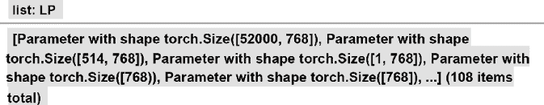

# 第四章：从头开始预训练 RoBERTa 模型

在本章中，我们将从头开始构建一个 RoBERTa 模型。该模型将使用我们在 BERT 模型中所需的Transformers构造工具的模块。此外，不会使用预训练的分词器或模型。RoBERTa 模型将按照本章描述的十五步过程构建。

我们将利用在之前章节中获得的Transformers知识，逐步构建一个可以对遮蔽标记执行语言建模的模型。在*第二章*，*开始使用Transformers模型的体系结构*中，我们研究了原始Transformers的构建模块。在*第三章*，*对 BERT 模型进行微调*中，我们微调了一个预训练的 BERT 模型。

本章将重点介绍如何使用基于 Hugging Face 无缝模块的 Jupyter 笔记本从头开始构建一个预训练的Transformers模型。该模型被命名为 KantaiBERT。

KantaiBERT 首先加载了专门为本章创建的伊曼纽尔·康德的书籍的合集。您将看到数据是如何获取的。您还将看到如何为此笔记本创建自己的数据集。

KantaiBERT 从头训练自己的分词器。它将构建自己的合并和词汇文件，在预训练过程中使用。

然后 KantaiBERT 处理数据集，初始化一个训练师，并训练模型。

最后，KantaiBERT 使用训练好的模型执行一个实验性的下游语言建模任务，并使用伊曼纽尔·康德的逻辑填充掩码。

到本章结束时，您将了解如何从头开始构建一个Transformers模型。您将拥有足够的Transformers知识，以应对使用强大的预训练Transformers（如 GPT-3 引擎）的第四次工业革命挑战，这需要不仅有开发技能，还需要实施能够实现它们的技能。本章为*第七章*，*GPT-3 引擎崛起的超人类Transformers*做好了准备。

本章涵盖以下主题：

+   类似 RoBERTa 和 DistilBERT 的模型

+   如何从头训练一个分词器

+   字节级字节对编码

+   将训练好的分词器保存到文件中

+   重新创建用于预训练过程的分词器

+   从头初始化 RoBERTa 模型

+   探索模型的配置

+   探索模型的 8000 万参数

+   为训练师构建数据集

+   初始化训练师

+   预训练模型

+   保存模型

+   将模型应用于**遮蔽语言建模**（**MLM**）的下游任务

我们的第一步将是描述我们将要构建的Transformers模型。

# 训练分词器并预训练Transformers

在本章中，我们将使用 Hugging Face 提供的用于类似 BERT 模型的构建模块来训练一个名为 KantaiBERT 的Transformers模型。我们在*第三章*，*对 BERT 模型进行微调*中介绍了我们将使用的模型构建模块的理论。

我们将在之前章节中获得的知识基础上描述 KantaiBERT。

KantaiBERT 是一种基于 BERT 架构的**鲁棒优化 BERT 预训练方法**（**RoBERTa**）-风格的模型。

最初的 BERT 模型为初始的Transformers模型带来了创新特性，正如我们在*第三章*中看到的那样。RoBERTa 通过改进预训练过程的机制来提高Transformers对下游任务的性能。

例如，它不使用`WordPiece`分词，而是下降到字节级别的**字节对编码**（**BPE**）。这种方法为各种 BERT 和类似 BERT 的模型铺平了道路。

在本章中，与 BERT 一样，KantaiBERT 将使用**掩码语言建模**（**MLM**）进行培训。MLM 是一种语言建模技术，它会在序列中掩盖一个单词。Transformers模型必须训练以预测被掩盖的单词。

KantaiBERT 将作为一个小型模型进行培训，包括 6 层、12 个头和 84,095,008 个参数。也许 8400 万个参数看起来很多。然而，这些参数分布在 12 个头上，使其成为一个相对较小的模型。一个小模型将使预训练体验得以顺畅进行，以便每一步都可以实时查看，而不必等待数小时才能看到结果。

KantaiBERT 是一种类似 DistilBERT 的模型，因为它具有相同的 6 层和 12 个头的架构。DistilBERT 是 BERT 的精简版本。如其名所示，DistilBERT 比 RoBERTa 模型包含更少的参数。因此，它运行速度更快，但与 RoBERTa 模型相比，结果略微不够准确。

我们知道，大型模型能够取得出色的性能。但是，如果你想在智能手机上运行一个模型会怎样呢？微型化一直是技术发展的关键。在实施过程中，Transformers有时必须遵循相同的路径。Hugging Face 提出使用 BERT 的精简版本是迈出的一大步。因此，通过使用更少的参数或其他类似方法进行精炼，是将预训练的最佳内容变得有效用于许多下游任务的巧妙方式。

显示所有可能的架构很重要，包括在智能手机上运行一个小型模型。然而，Transformers的未来也将是准备好的可用 API，正如我们将在*第七章*的*超人类Transformers与 GPT-3 引擎的崛起*中所看到的那样。

KantaiBERT 将实现一种类似 GPT-2 所使用的字节级字节对编码分词器。特殊的分词将使用 RoBERTa 所使用的分词。BERT 模型通常使用 WordPiece 分词器。

没有标记类型 ID 来指示标记属于哪个片段的哪个部分。片段将用分隔标记`</s>`来分隔。

KantaiBERT 将使用自定义数据集，训练分词器，训练Transformers模型，保存它，并在 MLM 示例中运行它。

让我们开始从头构建一个Transformers。

# 从头构建 KantaiBERT

我们将从头构建 KantaiBERT，并在 MLM 示例中运行它的 15 个步骤。

打开 Google Colaboratory（你需要一个 Gmail 帐号）。然后上传`KantaiBERT.ipynb`，它在本章的 GitHub 目录中。

本节的 15 个步骤的标题与笔记本单元格的标题类似，这使得它们易于跟踪。

让我们从加载数据集开始。

## 步骤 1：加载数据集

预先准备好的数据集提供了一个客观的方法来训练和比较 transformers。在*第五章*，*使用 Transformers 进行下游 NLP 任务*中，我们将探讨几个数据集。然而，本章旨在理解一个 transformer 的训练过程，使用可以实时运行的笔记本单元格，而不需要等待数小时才能获得结果。

我选择使用伊曼纽尔·康德（1724-1804）的作品，他是德国哲学家，是*启蒙时代*的典范。这个想法是为下游推理任务引入类似于人类的逻辑和预训练推理。

Project Gutenberg，[`www.gutenberg.org`](https://www.gutenberg.org)，提供了大量免费的可以以文本格式下载的电子书。如果你想基于书籍创建自定义数据集，可以使用其他书籍。

我将以下三本伊曼纽尔·康德的书编译成名为`kant.txt`的文本文件：

+   *纯粹理性批判*

+   *实践理性批判*

+   *道德形而上学基本原理*

`kant.txt`为本章的 transformer 模型提供了一个小的训练数据集。所得到的结果仍然是试验性的。对于一个真实的项目，我会添加伊曼纽尔·康德、勒内·笛卡尔、帕斯卡尔和莱布尼茨等人的全部作品，例如。

文本文件包含书籍的原始文本：

```py
`…For it is in reality vain to profess _indifference_ in regard to such`
`inquiries, the object of which cannot be indifferent to humanity.` 
```

数据集将在`KantaiBERT.ipynb`笔记本的第一个单元格中自动从 GitHub 下载。

你也可以使用 Colab 的文件管理器加载`kant.txt`，它位于本章在 GitHub 上的目录中。在这种情况下，使用 `curl` 从 GitHub 检索它：

```py
#@title Step 1: Loading the Dataset
#1.Load kant.txt using the Colab file manager
#2.Downloading the file from GitHub
!curl -L https://raw.githubusercontent.com/Denis2054/Transformers-for-NLP-2nd-Edition/master/Chapter04/kant.txt --output "kant.txt" 
```

一旦加载或下载，你可以在 Colab 文件管理器窗格中看到它出现：


图 4.1：Colab 文件管理器

请注意，当您重新启动 VM 时，Google Colab 将删除文件。

数据集被定义并加载。

不要在没有`kant.txt`的情况下运行后续单元格。训练数据是先决条件。

现在，程序将安装 Hugging Face transformers。

## 步骤 2：安装 Hugging Face transformers

我们需要安装 Hugging Face transformers 和分词器，但在这个 Google Colab VM 实例中我们不需要 TensorFlow：

```py
#@title Step 2:Installing Hugging Face Transformers
# We won't need TensorFlow here
!pip uninstall -y tensorflow
# Install 'transformers' from master
!pip install git+https://github.com/huggingface/transformers
!pip list | grep -E 'transformers|tokenizers'
# transformers version at notebook update --- 2.9.1
# tokenizers version at notebook update --- 0.7.0 
```

输出显示已安装的版本：

```py
Successfully built transformers
tokenizers               0.7.0          
transformers             2.10.0 
```

Transformer 版本发展得非常迅速。你运行的版本可能会有所不同，并且显示方式也可能不同。

程序现在将通过训练一个分词器来开始。

## 步骤 3：训练分词器

在本节中，程序不使用预训练的分词器。例如，可以使用预训练的 GPT-2 分词器。但是，本章的训练过程包括从头开始训练一个分词器。

使用 Hugging Face 的 `ByteLevelBPETokenizer()` 将使用 `kant.txt` 进行训练。 BPE 标记器将字符串或单词分解为子字符串或子词。这有两个主要优点，其中之一是：

+   标记器可以将单词分解为最小组件。然后它将这些小组件合并成统计学上有趣的组件。例如，“`smaller" and smallest`" 可以变成“`small`,”，“`er`,” 和“`est`。” 标记器可以进一步操作。例如，我们可以得到“`sm`" 和“`all`。” 无论如何，单词都被分解成子词标记和子词部分的更小单位，例如“`sm`" 和“`all`"，而不仅仅是“`small`。”

+   使用 `WordPiece` 级别编码，将被分类为未知的字符串块 `unk_token`，实际上会消失。

在此模型中，我们将使用以下参数训练标记器：

+   `files=paths` 是数据集的路径

+   `vocab_size=52_000` 是我们标记器模型长度的大小

+   `min_frequency=2` 是最小频率阈值

+   `special_tokens=[]` 是特殊标记的列表

在这种情况下，特殊标记列表是：

+   `<s>`：一个开始标记

+   `<pad>`：一个填充标记

+   `</s>`：一个结束符号

+   `<unk>`：一个未知标记

+   `<mask>`：语言建模的掩码标记

标记器将被训练以生成合并的子字符串标记并分析它们的频率。

在句子中间拿这两个词来说：

```py
...the tokenizer... 
```

第一步是将字符串标记化：

```py
'Ġthe', 'Ġtoken',   'izer', 
```

字符串现在被标记为带有 `Ġ`（空格）信息的标记。

下一步是用它们的索引替换它们：

| ‘Ġthe’ | ‘Ġtoken’ | ‘izer’ |
| --- | --- | --- |
| 150 | 5430 | 4712 |

表 4.1：三个标记的索引

程序如预期般运行标记器：

```py
#@title Step 3: Training a Tokenizer
%%time
from pathlib import Path
from tokenizers import ByteLevelBPETokenizer
paths = [str(x) for x in Path(".").glob("**/*.txt")]
# Initialize a tokenizer
tokenizer = ByteLevelBPETokenizer()
# Customize training
tokenizer.train(files=paths, vocab_size=52_000, min_frequency=2, special_tokens=[
    "<s>",
    "<pad>",
    "</s>",
    "<unk>",
    "<mask>",
]) 
```

标记器输出训练时间：

```py
CPU times: user 14.8 s, sys: 14.2 s, total: 29 s
Wall time: 7.72 s 
```

标记器已经训练完成并准备保存。

## 第 4 步：将文件保存到磁盘中

当训练完成时，标记器将生成两个文件：

+   `merges.txt`，其中包含合并的标记化子字符串

+   `vocab.json`，其中包含标记化子字符串的索引

程序首先创建 `KantaiBERT` 目录，然后保存两个文件：

```py
#@title Step 4: Saving the files to disk
import os
token_dir = '/content/KantaiBERT'
if not os.path.exists(token_dir):
  os.makedirs(token_dir)
tokenizer.save_model('KantaiBERT') 
```

程序输出显示两个文件已保存：

```py
['KantaiBERT/vocab.json', 'KantaiBERT/merges.txt'] 
```

这两个文件应该出现在文件管理器窗格中：


图 4.2：Colab 文件管理器

此示例中的文件很小。您可以双击它们以查看其内容。`merges.txt` 包含按计划标记化的子字符串：

```py
#version: 0.2 - Trained by 'huggingface/tokenizers'
Ġ t
h e
Ġ a
o n
i n
Ġ o
Ġt he
r e
i t
Ġo f 
```

`vocab.json` 包含以下索引：

```py
[…,"Ġthink":955,"preme":956,"ĠE":957,"Ġout":958,"Ġdut":959,"aly":960,"Ġexp":961,…] 
```

训练好的标记化数据集文件已准备好进行处理。

## 第 5 步：加载训练好的标记器文件

我们本可以加载预训练的标记器文件。 但是，我们训练了自己的标记器，现在准备加载文件：

```py
#@title Step 5 Loading the Trained Tokenizer Files 
from tokenizers.implementations import ByteLevelBPETokenizer
from tokenizers.processors import BertProcessing
tokenizer = ByteLevelBPETokenizer(
    "./KantaiBERT/vocab.json",
    "./KantaiBERT/merges.txt",
) 
```

标记器可以对序列进行编码：

```py
tokenizer.encode("The Critique of Pure Reason.").tokens 
```

“`The Critique of Pure Reason`” 将变成：

```py
['The', 'ĠCritique', 'Ġof', 'ĠPure', 'ĠReason', '.'] 
```

我们还可以要求看到此序列中的标记数：

```py
tokenizer.encode("The Critique of Pure Reason.") 
```

输出将显示序列中有 6 个标记：

```py
Encoding(num_tokens=6, attributes=[ids, type_ids, tokens, offsets, attention_mask, special_tokens_mask, overflowing]) 
```

分词器现在处理这些标记以适应本笔记本中使用的 BERT 模型变体。后处理器将添加一个开始和结束标记；例如：

```py
tokenizer._tokenizer.post_processor = BertProcessing(
    ("</s>", tokenizer.token_to_id("</s>")),
    ("<s>", tokenizer.token_to_id("<s>")),
)
tokenizer.enable_truncation(max_length=512) 
```

让我们对一个后处理序列进行编码：

```py
tokenizer.encode("The Critique of Pure Reason.") 
```

输出显示我们现在有 8 个标记：

```py
Encoding(num_tokens=8, attributes=[ids, type_ids, tokens, offsets, attention_mask, special_tokens_mask, overflowing]) 
```

如果我们想看看添加了什么，我们可以要求分词器对后处理序列进行编码，运行以下单元格：

```py
tokenizer.encode("The Critique of Pure Reason.").tokens 
```

输出显示已添加了开始和结束标记，这将标记数增加到了 8，包括开始和结束标记：

```py
['<s>', 'The', 'ĠCritique', 'Ġof', 'ĠPure', 'ĠReason', '.', '</s>'] 
```

用于训练模型的数据现在已经准备好了。我们现在将检查运行笔记本的机器的系统信息。

## 步骤 6：检查资源限制：GPU 和 CUDA

KantaiBERT 在 **图形处理单元**（**GPU**）上以最佳速度运行。

我们首先运行一个命令来查看 NVIDIA GPU 卡是否存在：

```py
#@title Step 6: Checking Resource Constraints: GPU and NVIDIA 
!nvidia-smi 
```

输出显示了卡的信息和版本：


图 4.3：NVIDIA 卡信息

输出可能随着每个 Google Colab VM 配置而变化。

我们现在将检查 `PyTorch` 是否看到 CUDA：

```py
#@title Checking that PyTorch Sees CUDA
import torch
torch.cuda.is_available() 
```

结果应该是 `True`：

```py
True 
```

**CUDA**（**计算统一设备体系结构**）是由 NVIDIA 开发的，用于利用其 GPU 的并行计算能力。

对于更多关于 NVIDIA GPU 和 CUDA 的信息，请参阅 *附录 II*，*Transformer 模型的硬件限制*。

我们现在准备定义模型的配置。

## 步骤 7：定义模型的配置

我们将使用与 DistilBERT Transformers相同数量的层和头部来预训练 RoBERTa 类型的Transformers模型。模型的词汇量设置为 52,000，具有 12 个注意力头和 6 个层：

```py
#@title Step 7: Defining the configuration of the Model
from transformers import RobertaConfig
config = RobertaConfig(
    vocab_size=52_000,
    max_position_embeddings=514,
    num_attention_heads=12,
    num_hidden_layers=6,
    type_vocab_size=1,
) 
```

我们将更详细地探讨配置，见 *步骤 9：从零开始初始化模型*。

让我们首先在我们的模型中重新创建分词器。

## 步骤 8：在 transformers 中重新加载分词器

我们现在准备加载我们训练过的分词器，这是我们预训练的分词器 `RobertaTokenizer.from_pretained()`：

```py
#@title Step 8: Re-creating the Tokenizer in Transformers
from transformers import RobertaTokenizer
tokenizer = RobertaTokenizer.from_pretrained("./KantaiBERT", max_length=512) 
```

现在我们加载了我们的训练过的分词器，让我们从零开始初始化一个 RoBERTa 模型。

## 步骤 9：从零开始初始化模型

在本节中，我们将从零开始初始化一个模型，并检查模型的大小。

程序首先导入一个 RoBERTa 掩码模型进行语言建模：

```py
#@title Step 9: Initializing a Model From Scratch
from transformers import RobertaForMaskedLM 
```

该模型使用 *步骤 7* 中定义的配置进行初始化：

```py
model = RobertaForMaskedLM(config=config) 
```

如果我们打印模型，我们可以看到它是一个具有 6 层和 12 个头的 BERT 模型：

```py
print(model) 
```

原始 Transformer 模型的编码器的构建模块以不同的尺寸存在，如输出摘录所示：

```py
RobertaForMaskedLM(
  (roberta): RobertaModel(
    (embeddings): RobertaEmbeddings(
      (word_embeddings): Embedding(52000, 768, padding_idx=1)
      (position_embeddings): Embedding(514, 768, padding_idx=1)
      (token_type_embeddings): Embedding(1, 768)
      (LayerNorm): LayerNorm((768,), eps=1e-12, elementwise_affine=True)
      (dropout): Dropout(p=0.1, inplace=False)
    )
    (encoder): BertEncoder(
      (layer): ModuleList(
        (0): BertLayer(
          (attention): BertAttention(
            (self): BertSelfAttention(
              (query): Linear(in_features=768, out_features=768, bias=True)
              (key): Linear(in_features=768, out_features=768, bias=True)
              (value): Linear(in_features=768, out_features=768, bias=True)
              (dropout): Dropout(p=0.1, inplace=False)
            )
            (output): BertSelfOutput(
              (dense): Linear(in_features=768, out_features=768, bias=True)
              (LayerNorm): LayerNorm((768,), eps=1e-12, elementwise_affine=True)
              (dropout): Dropout(p=0.1, inplace=False)
            )
          )
          (intermediate): BertIntermediate(
            (dense): Linear(in_features=768, out_features=3072, bias=True)
          )
          (output): BertOutput(
            (dense): Linear(in_features=3072, out_features=768, bias=True)
            (LayerNorm): LayerNorm((768,), eps=1e-12, elementwise_affine=True)
            (dropout): Dropout(p=0.1, inplace=False)
          )
        )
…/… 
```

在继续之前，请花一些时间仔细阅读配置的输出详情。您将从内部了解模型。

Transformers的 LEGO^® 类型构建模块使得分析变得有趣。例如，您将注意到在子层中存在辍学正则化。

现在，让我们探索参数。

### 探索参数

该模型小巧，含有 84,095,008 个参数。

我们可以检查其大小：

```py
print(model.num_parameters()) 
```

输出显示大约的参数数量，这可能因Transformers版本而异：

```py
84095008 
```

现在让我们查看参数。我们首先将参数存储在`LP`中，并计算参数列表的长度：

```py
#@title Exploring the Parameters
LP=list(model.parameters())
lp=len(LP)
print(lp) 
```

输出显示大约有`108`个矩阵和向量，这可能因Transformers模型而异：

```py
108 
```

现在，让我们显示张量中的`108`个矩阵和向量：

```py
for p in range(0,lp):
  print(LP[p]) 
```

输出显示所有参数，如下所示：

```py
Parameter containing:
tensor([[-0.0175, -0.0210, -0.0334,  ...,  0.0054, -0.0113,  0.0183],
        [ 0.0020, -0.0354, -0.0221,  ...,  0.0220, -0.0060, -0.0032],
        [ 0.0001, -0.0002,  0.0036,  ..., -0.0265, -0.0057, -0.0352],
        ...,
        [-0.0125, -0.0418,  0.0190,  ..., -0.0069,  0.0175, -0.0308],
        [ 0.0072, -0.0131,  0.0069,  ...,  0.0002, -0.0234,  0.0042],
        [ 0.0008,  0.0281,  0.0168,  ..., -0.0113, -0.0075,  0.0014]],
       requires_grad=True) 
```

花几分钟时间来观察参数，以了解Transformers是如何构建的。

参数数量是通过取模型中的所有参数并相加来计算的；例如：

+   词汇表 (52,000) x 维度 (768)

+   向量的大小为`1 x 768`

+   发现许多其他维度

你会注意到* d *[model] = 768。模型中有 12 个头。因此，每个头的* d *[k]维度将是。

再次展示了Transformers优化的 LEGO^®概念，其构建快速。

现在我们将看一下模型的参数数量是如何计算，以及如何得到图中的 84,095,008。

如果我们在笔记本中悬停在**LP**上，我们将看到 torch 张量的一些形状：



图 4.4：LP

请注意，数字可能会根据您使用的 transformers 模块的版本而变化。

我们将进一步计算每个张量的参数数量。首先，程序初始化了一个名为`np`（参数数量）的参数计数器，并遍历了参数列表`lp`（`108`）中的元素：

```py
#@title Counting the parameters
np=0
for p in range(0,lp):#number of tensors 
```

参数是不同大小的矩阵和向量；例如：

+   768 x 768

+   768 x 1

+   768

我们可以看到一些参数是二维的，而一些是一维的。

查看列表中的参数`LP[p]`是否有两个维度的简便方法是：

```py
 PL2=True
  try:
    L2=len(LP[p][0]) #check if 2D
  except:
    L2=1             #not 2D but 1D
    PL2=False 
```

如果参数有两个维度，那么它的第二个维度将是`L2>0`且`PL2=True (2 dimensions=True)`。如果参数只有一个维度，那么它的第二个维度将是`L2=1`且`PL2=False (2 dimensions=False)`。

`L1`是参数的第一个维度大小。`L3`是由下列定义的参数大小：

```py
L1=len(LP[p])      
L3=L1*L2 
```

现在我们可以在循环的每一步中添加参数：

```py
np+=L3             # number of parameters per tensor 
```

我们将获得参数的总和，但我们也想看到Transformers模型的参数数量是如何计算的：

```py
 if PL2==True:
    print(p,L1,L2,L3)  # displaying the sizes of the parameters
  if PL2==False:
    print(p,L1,L3)  # displaying the sizes of the parameters
print(np)              # total number of parameters 
```

请注意，如果参数只有一个维度，那么`PL2=False`，那么我们只显示第一个维度。

输出是所有张量中参数数量的列表，如下所示：

```py
0 52000 768 39936000
1 514 768 394752
2 1 768 768
3 768 768
4 768 768
5 768 768 589824
6 768 768
7 768 768 589824
8 768 768
9 768 768 589824
10 768 768 
```

RoBERTa 模型的总参数数量显示在列表的末尾：

```py
84,095,008 
```

参数数量可能会随所使用的库版本而变化。

现在我们精确地知道转换模型中参数的数量代表什么。花几分钟回头看看配置的输出，参数的内容以及参数的大小。在这一点上，你将对模型的构建块有一个精确的心理表征。

程序现在构建数据集。

## 第 10 步：构建数据集

程序现在将逐行加载数据集以生成用于批量训练的样本，使用`block_size=128`限制一个示例的长度：

```py
#@title Step 10: Building the Dataset
%%time
from transformers import LineByLineTextDataset
dataset = LineByLineTextDataset(
    tokenizer=tokenizer,
    file_path="./kant.txt",
    block_size=128,
) 
```

输出显示 Hugging Face 已经投入了大量资源来优化处理数据所需的时间：

```py
CPU times: user 8.48 s, sys: 234 ms, total: 8.71 s
Wall time: 3.88 s 
```

墙时间，处理器实际活动的时间，已经被优化。

程序现在将定义一个数据收集器来创建一个反向传播的对象。

## 第 11 步：定义数据收集器

在初始化训练器之前，我们需要运行一个数据收集器。数据收集器将从数据集中取样并将其汇集成批次。结果类似于字典对象。

我们通过设置`mlm=True`为 MLM 准备了一个批处理样本过程。

我们还将训练的蒙版标记数目设置为`mlm_probability=0.15`。这将决定在预训练过程中屏蔽的标记的百分比。

现在我们使用我们的分词器初始化`data_collator`，MLM 被激活，并且蒙版标记的比例设置为`0.15`：

```py
#@title Step 11: Defining a Data Collator
from transformers import DataCollatorForLanguageModeling
data_collator = DataCollatorForLanguageModeling(
    tokenizer=tokenizer, mlm=True, mlm_probability=0.15
) 
```

现在我们准备好初始化训练器了。

## 第 12 步：初始化训练器

前面的步骤已经准备好初始化训练器所需的信息。数据集已经被分词化和加载。我们的模型已经构建完成。数据收集器已经被创建。

程序现在可以初始化训练器了。出于教育目的，程序快速训练模型。训练的轮次数被限制为一个。GPU 非常方便，因为我们可以共享批次并多进程处理训练任务：

```py
#@title Step 12: Initializing the Trainer
from transformers import Trainer, TrainingArguments
training_args = TrainingArguments(
    output_dir="./KantaiBERT",
    overwrite_output_dir=True,
    num_train_epochs=1,
    per_device_train_batch_size=64,
    save_steps=10_000,
    save_total_limit=2,
)
trainer = Trainer(
    model=model,
    args=training_args,
    data_collator=data_collator,
    train_dataset=dataset,
) 
```

现在模型已经准备好进行训练。

## 第 13 步：预训练模型

一切准备就绪。通过一行代码启动训练器：

```py
#@title Step 13: Pre-training the Model
%%time
trainer.train() 
```

输出显示了实时的训练过程，显示了`loss`、`learning rate`、`epoch`和步骤：

```py
Epoch: 100%
1/1 [17:59<00:00, 1079.91s/it]
Iteration: 100%
2672/2672 [17:59<00:00, 2.47it/s]
{"loss": 5.6455852394104005, "learning_rate": 4.06437125748503e-05, "epoch": 0.18712574850299402, "step": 500}
{"loss": 4.940259679794312, "learning_rate": 3.12874251497006e-05, "epoch": 0.37425149700598803, "step": 1000}
{"loss": 4.639936000347137, "learning_rate": 2.1931137724550898e-05, "epoch": 0.561377245508982, "step": 1500}
{"loss": 4.361462069988251, "learning_rate": 1.2574850299401197e-05, "epoch": 0.7485029940119761, "step": 2000}
{"loss": 4.228510192394257, "learning_rate": 3.218562874251497e-06, "epoch": 0.9356287425149701, "step": 2500}
CPU times: user 11min 36s, sys: 6min 25s, total: 18min 2s
Wall time: 17min 59s
TrainOutput(global_step=2672, training_loss=4.7226536670130885) 
```

模型已经训练完毕。现在是保存我们工作成果的时候了。

## 第 14 步：将最终模型（+分词器+配置）保存到磁盘上

现在我们将保存模型和配置：

```py
#@title Step 14: Saving the Final Model(+tokenizer + config) to disk
trainer.save_model("./KantaiBERT") 
```

点击文件管理器中的**刷新**，文件应该会出现：


图 4.5：Colab 文件管理器

`config.json`、`pytorh_model.bin`和`training_args.bin`现在应该出现在文件管理器中。

`merges.txt`和`vocab.json`包含数据集的预训练标记化。

我们从零开始构建了一个模型。让我们导入管道来执行一个语言建模任务，使用我们预训练的模型和分词器。

## 第 15 步：使用 FillMaskPipeline 进行语言建模

现在我们将导入一个语言建模的`fill-mask`任务。我们将使用我们训练过的模型和训练过的分词器来执行 MLM：

```py
#@title Step 15: Language Modeling with the FillMaskPipeline
from transformers import pipeline
fill_mask = pipeline(
    "fill-mask",
    model="./KantaiBERT",
    tokenizer="./KantaiBERT"
) 
```

现在我们可以让我们的模型像康德一样思考：

```py
fill_mask("Human thinking involves human <mask>.") 
```

输出可能会在每个运行中发生变化，因为我们正在从有限的数据量中从头预训练模型。然而，在这次运行中获得的输出很有趣，因为它引入了概念语言建模：

```py
[{'score': 0.022831793874502182,
  'sequence': '<s> Human thinking involves human reason.</s>',
  'token': 393},
 {'score': 0.011635891161859035,
  'sequence': '<s> Human thinking involves human object.</s>',
  'token': 394},
 {'score': 0.010641072876751423,
  'sequence': '<s> Human thinking involves human priori.</s>',
  'token': 575},
 {'score': 0.009517930448055267,
  'sequence': '<s> Human thinking involves human conception.</s>',
  'token': 418},
 {'score': 0.00923212617635727,
  'sequence': '<s> Human thinking involves human experience.</s>',
  'token': 531}] 
```

预测可能在每次运行和每次 Hugging Face 更新其模型时都会有所变化。

然而，经常会得到以下输出：

```py
Human thinking involves human reason 
```

这里的目标是看如何训练一个转换器模型。我们可以看到有趣的类人预测是可能的。

这些结果是实验性的，在训练过程中可能会有变化。每次重新训练模型时，它们都会改变。

这个模型需要来自其他*启蒙时代*思想家的更多数据。

*然而，这个模型的目标是展示我们可以创建数据集来训练一个特定类型的复杂语言建模任务的转换器*。

由于转换器，我们只是处于人工智能新时代的开端！

# 下一步

你已经从零开始训练了一个转换器模型。花些时间想象一下你可以在个人或公司环境中做些什么。你可以为特定任务创建一个数据集，并从头开始训练。利用你感兴趣的领域或公司项目来探索转换器构建工具的迷人世界！

一旦你有了喜欢的模型，就可以与 Hugging Face 社区分享。你的模型将出现在 Hugging Face 模型页面上：[`huggingface.co/models`](https://huggingface.co/models)

你可以按照本页描述的说明，用几个步骤上传你的模型：[`huggingface.co/transformers/model_sharing.html`](https://huggingface.co/transformers/model_sharing.html)

你也可以下载 Hugging Face 社区共享的模型，以获取个人和专业项目的新思路。

# 摘要

在这一章中，我们使用了 Hugging Face 提供的构建块从零开始构建了 `KantaiBERT`，一个类似 RoBERTa 的模型转换器。

我们首先开始加载一个关于伊曼纽尔·康德作品相关主题的定制数据集。根据你的目标，你可以加载现有数据集或创建自己的数据集。我们发现使用定制数据集可以帮助我们了解转换器模型的思维方式。然而，这种实验方法是有局限性的。要训练一个超越教育目的的模型，需要更大规模的数据集。

KantaiBERT 项目被用来在`kant.txt`数据集上训练一个分词器。训练好的`merges.txt`和`vocab.json`文件被保存。用我们预训练的文件重新创建了一个分词器。KantaiBERT 建立了定制数据集，并定义了一个数据收集器来处理反向传播的训练批次。训练器被初始化，我们详细探索了 RoBERTa 模型的参数。模型被训练并保存。

最后，保存的模型被加载，用于一个下游语言建模任务。目标是用伊曼纽尔·康德的逻辑来填补空白。

现在大门已经敞开，你可以尝试现有或定制的数据集来看看你得到了什么结果。你可以与 Hugging Face 社区分享你的模型。Transformers是数据驱动的。你可以利用这一点来发现使用Transformers的新方法。

现在，你已经准备好了解如何运行无需预训练或微调的 API 的现成Transformers引擎。 *第七章*, *超人Transformers与 GPT-3 引擎的崛起*，将带领你走进人工智能的未来。通过学习这一章和之前的章节，你将做好准备！

在下一章，*用Transformers进行下游 NLP 任务*，我们将继续准备实施Transformers。

# 问题

1.  RoBERTa 使用字节级字对编码分词���。(True/False)

1.  经过训练的 Hugging Face 分词器会生成 `merges.txt` 和 `vocab.json`。 (True/False)

1.  RoBERTa 不使用 token-type ID。(True/False)

1.  DistilBERT 有 6 层和 12 个头。(True/False)

1.  一个拥有 8000 万参数的Transformers模型是庞大的。(True/False)

1.  我们无法训练分词器。(True/False)

1.  BERT-风格的模型有 6 个解码器层。(True/False)

1.  **掩盖语言建模** (**MLM**) 预测句子中掩盖的标记中包含的单词。(True/False)

1.  BERT-风格的模型没有自注意力子层。(True/False)

1.  数据收集器对反向传播很有帮助。(True/False)

# 参考

+   *Yinhan Liu*, *Myle Ott*, *Naman Goyal*, *Jingfei Du*, *Mandar Joshi*, *Danqi Chen*, *Omer Levy*, *Mike Lewis*, *Luke Zettlemoyer*, 和 *Veselin Stoyano*, 2019, *RoBERTa: 一个鲁棒性优化的 BERT 预训练方法*：[`arxiv.org/abs/1907.11692`](https://arxiv.org/abs/1907.11692)

+   Hugging Face 分词器文档：[`huggingface.co/transformers/main_classes/tokenizer.html?highlight=tokenizer`](https://huggingface.co/transformers/main_classes/tokenizer.html?highlight=tokenizer)

+   Hugging Face 参考笔记本：[`colab.research.google.com/github/huggingface/blog/blob/master/notebooks/01_how_to_train.ipynb`](https://colab.research.google.com/github/huggingface/blog/blob/master/notebooks/01_how_to_train.ipynb)

+   Hugging Face 参考博客：[`colab.research.google.com/github/huggingface/blog/blob/master/notebooks/01_how_to_train.ipynb`](https://colab.research.google.com/github/huggingface/blog/blob/master/notebooks/01_how_to_train.ipynb)

+   更多关于 BERT：[`huggingface.co/transformers/model_doc/bert.html`](https://huggingface.co/transformers/model_doc/bert.html)

+   更多 DistilBERT：[`arxiv.org/pdf/1910.01108.pdf`](https://arxiv.org/pdf/1910.01108.pdf)

+   更多关于 RoBERTa：[`huggingface.co/transformers/model_doc/roberta.html`](https://huggingface.co/transformers/model_doc/roberta.html)

+   更多关于 DistilBERT：[`huggingface.co/transformers/model_doc/distilbert.html`](https://huggingface.co/transformers/model_doc/distilbert.html)

# 加入我们书的 Discord 空间

加入该书的 Discord 工作空间，每月与作者进行*问我任何事*会话：

[`www.packt.link/Transformers`](https://www.packt.link/Transformers)


