# 第五章：使用转换器的下游 NLP 任务

当我们释放预训练模型并观察它们在下游**自然语言理解**（**NLU**）任务中表现时，转换器展现出其全部潜力。对一个庞大的参数转换器模型进行预训练和微调需要大量时间和精力，但当我们看到一个模型在一系列 NLU 任务中发挥作用时，这些努力是值得的。

我们将从超越人类基线的探索开始这一章。人类基线代表人类在 NLU 任务上的表现。人类在幼年时学会了转导，并迅速发展出归纳思维。我们人类通过感官直接感知世界。机器智能完全依赖我们的感知被转录为文字来理解我们的语言。

我们随后将看到如何衡量转换器的性能。衡量**自然语言处理**（**NLP**）任务仍然是一种直观的方法，涉及基于真假结果的各种形式的准确性得分。这些结果是通过基准任务和数据集获得的。例如，SuperGLUE 是一个很好的例子，展示了谷歌 DeepMind、Facebook AI、纽约大学、华盛顿大学等共同努力设定了用于衡量 NLP 性能的高标准。

最后，我们将探索几个下游任务，如**标准情感树库**（**SST-2**）、语言可接受性和温格拉德模式。

转换器正在通过在设计良好的基准任务上胜过其他模型来迅速将 NLP 推向下一级。替代的转换器体系结构将继续出现和演化。

本章涵盖以下主题：

+   机器与人类智能的转导和归纳比较

+   自然语言处理的转导和归纳过程

+   衡量转换器性能与人类基线

+   测量方法（准确性、F1 分数和 MCC）

+   基准任务和数据集

+   SuperGLUE 下游任务

+   使用 CoLA 进行语言可接受性评估

+   使用 SST-2 进行情感分析

+   温格拉德模式

让我们首先了解人类和机器如何表示语言。

# 转导和变压器的归纳继承

**自动机器学习**（**AutoML**）的出现，意味着自动化云 AI 平台中的 API，已经深刻改变了每个 AI 专家的工作描述。例如，Google Vertex 宣称实现 ML 所需的开发量减少了 80%。这表明任何人都可以使用现成的系统实现 ML。这是否意味着开发人员的工作减少了 80%？我认为不是。我认为工业 4.0 AI 专家会组装具有附加价值的 AI 项目。

工业 4.0。NLP AI 专家更多地投资于知识而不是源代码，以成为团队中的 AI 专家。

变压器拥有独特的能力，可以将它们的知识应用于它们没有学习过的任务。例如，BERT 变压器通过序列到序列和掩码语言建模获得语言。然后可以对 BERT 变压器进行微调，以执行它从头开始没有学习的下游任务。

在本节中，我们将进行一次心灵实验。我们将使用变压器的图表来表示人类和机器如何使用语言理解信息。机器以与人类不同的方式理解信息，但达到了非常高效的结果。

*图 5.1*，一个使用变压器架构层和子层设计的心灵实验，显示了人类和机器之间的欺骗性相似性。让我们研究变压器模型的学习过程，以了解下游任务：

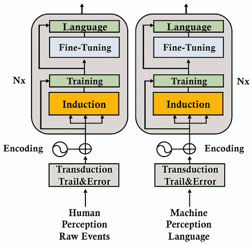

图 5.1: 人类和 ML 方法

对于我们的例子，`N=2`。这个概念性表示有两层。这两层显示了人类从一代到下一代积累的知识。机器只处理我们给它们的东西。机器将我们的输出用作输入。

## 人类智能栈

在 *图 5.1* 的左侧，我们可以看到人类的输入是层 0 的原始事件的感知，输出是语言。我们首先作为孩子用感官感知事件。逐渐地，输出变成了潺潺的语言，然后是结构化的语言。

对于人类来说，*转导* 经历了一个反复试错的过程。转导意味着我们将我们感知到的结构并用模式来表示它们，例如。我们制作了我们应用于归纳思维的世界的表示。我们的归纳思维依赖于我们转导的质量。

例如，作为孩子，我们经常被迫在下午早些时候午睡。著名的儿童心理学家皮亚杰发现，这可能导致一些孩子说，例如，“我没有午睡，所以现在还不是下午。”孩子看到两个事件，用转导之间创建了链接，然后进行推理概括和归纳。

起初，人类通过转导注意到这些模式，并通过 *归纳* 将它们概括。我们通过反复试错来训练，以理解许多事件是相关的：

*已训练的相关事件 = {日出 – 光，日落 – 黑暗，乌云 – 雨，蓝天 – 跑步，食物 – 好，火 – 温暖，雪 – 寒冷}*

随着时间的推移，我们被训练去理解数百万相关事件。新一代人类不必从头开始。他们只是由上一代对许多任务进行了 *微调*。例如，他们被教导“火会烧伤你”。从那时起，一个孩子就知道这个知识可以被微调为任何形式的“火”：蜡烛、森林火灾、火山和每一种“火”的实例。

最后，人类将他们所知道、想象到的或预测到的一切都记录到书面 *语言* 中。第 0 层的输出诞生了。

对于人类来说，下一层（第 1 层）的输入是大量经过训练和微调的知识。此外，人类感知大量事件，然后通过转导、归纳、训练和微调子层以及先前的转录知识。

这些事件很多源自气味、情绪、情境、经历，以及构成人类独特性的一切。机器无法获取这种个体身份。人类对单词有一种个人的感知方式，对每个人来说都是特定的。

机器接收我们通过大量异质未经过滤的非个人数据给予它的内容。机器的目标是执行非个人的高效任务。人类的目标是个人的福祉。

我们的无限方法循环从第 0 层到第 1 层，然后回到第 0 层，带着更多的原始和处理后的信息。

结果令人着迷！我们不需要从头学习（训练）我们的母语就能获得摘要能力。我们利用预先训练的知识来调整（微调）以适应摘要任务。

变压器通过不同的方式经历相同的过程。

## 机器智能栈

机器学习基本任务，就像本章描述的任务一样，然后使用它们学习如何预测的序列来执行数百个任务。

在*图 5.1*的右侧，我们可以看到机器的输入是语言形式的二手信息。*我们的输出是机器分析语言的唯一输入*。

在人类和机器历史的这一阶段，计算机视觉识别图像，但没有包含语言的语法结构。语音识别将声音转换成单词，这将我们带回书面语言。音乐模式识别不能导致用单词表达的客观概念。

机器起步有点吃力。我们对它们施加了人为的劣势。机器必须依赖我们的随机质量语言输出来：

+   执行连接语言序列中所有一起出现的令牌（子词）的转导

+   从这些转导中建立归纳

+   基于令牌训练这些归纳，以产生令牌的模式

让我们在这一点上停下来，窥探一下注意子层的过程，它努力产生有效的归纳：

+   变压器模型排除了以前基于循环的学习操作，并使用自注意力来提高模型的视野

+   注意子层在这一点上比人类有优势：它们可以处理数百万个示例来进行归纳思维操作

+   像我们一样，它们通过转导和归纳在序列中找到模式

+   它们使用存储在模型中的参数来记忆这些模式。

通过利用其能力：大量数据、优秀的 NLP 变压器算法和计算能力，它们已经获得了语言理解。*由于它们对语言的深刻理解，它们已经准备好运行数百个它们未经过训练的任务*。

像人类一样，变压器通过有限数量的任务来获得语言理解。像我们一样，它们通过转导检测到连接，然后通过归纳操作对其进行概括。

当变压器模型达到机器智能的微调子层时，它的反应就像我们一样。它不是从头开始训练以执行新任务。像我们一样，它认为这只是一个只需要微调的下游任务。如果它需要学习如何回答问题，它不会从头开始学习一种语言。变压器模型只是像我们一样微调其参数。

在本节中，我们看到变压器模型在学习方式上存在困难。一旦它们依赖于我们用语言转录的感知，它们就从一开始就处于劣势。然而，它们可以利用无限多的数据和大量的计算能力。

现在让我们看看如何衡量变压器性能与人类基线。

# 变压器性能与人类基线

像人类一样，变压器可以通过继承预训练模型的属性来进行微调，以执行下游任务。预训练模型通过其参数提供其架构和语言表示。

预训练模型在关键任务上训练，以获得对语言的一般知识。微调模型在下游任务上训练。并非每个变压器模型都使用相同的任务进行预训练。潜在地，所有任务都可以预先训练或微调。

每个 NLP 模型都需要使用标准方法进行评估。

本节首先将介绍一些关键的测量方法。然后，我们将介绍一些主要的基准任务和数据集。

让我们从一些关键的度量方法开始。

## 使用度量标准评估模型

没有使用度量标准的通用测量系统，不可能将一个变压器模型与另一个变压器模型（或任何其他 NLP 模型）进行比较。

在本节中，我们将分析 GLUE 和 SuperGLUE 使用的三种测量评分方法。

### 准确度得分

无论您使用的是哪种变体，准确度得分都是一个实用的评估标准。得分函数为给定子集的每个结果计算一个简单的真值或假值。要么模型的输出，，与给定样本集的正确预测，，匹配，要么不匹配。基本函数为：

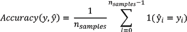

如果子集的结果是正确的，则我们将获得`1`，如果是错误的，则为`0`。

现在让我们来看看更灵活的 F1 分数。

### F1 分数

F1 分数引入了一种更灵活的方法，可以在面对包含不均匀类分布的数据集时提供帮助。

F1 分数使用精确率和召回率的加权值。它是精确率和召回率值的加权平均值：

*F1score= 2** (*precision * recall*)/(*precision + recall*)

在这个方程中，真正例（*p*）、假正例（*p*）和假负例（*n*）被放入精确率（*P*）和召回率（*R*）的方程中：

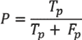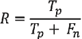

因此，F1 分数可以视为精确率（*P*）和召回率（*R*）的调和平均值（算术平均值的倒数）：

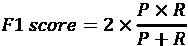

现在让我们回顾一下 MCC 方法。

### Matthews 相关系数（MCC）

MCC 在 *Fine-Tuning BERT Models* 章节的 *Evaluating using Matthews Correlation Coefficient* 部分进行了描述和实现。MCC 计算出一个值，其中包括真正例（*T*[P]）、真负例（*T*[N]）、假正例（*F*[P]）和假负例（*F*[N]）。

MCC 可以用以下方程总结：

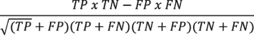

MCC 为二元分类模型提供了一个出色的度量标准，即使类别的大小不同也可以。

现在我们已经很好地了解了如何衡量给定 transformer 模型的结果，并将其与其他 transformer 模型或 NLP 模型进行比较。

有了测量评分方法的考虑，现在让我们来看看基准任务和数据集。

## 基准任务和数据集

有三个前提条件需要证明变压器已经达到了最先进的性能水平：

+   一个模型

+   一个以数据集驱动的任务

+   在本章的 *Evaluating models with metrics* 部分描述的度量标准

我们将从探索 SuperGLUE 基准开始，以说明一个 transformer 模型的评估过程。

### 从 GLUE 到 SuperGLUE

SuperGLUE 基准是由 *Wang* 等人（2019 年）设计并公开的。*Wang* 等人（2019 年）首次设计了 **General Language Understanding Evaluation** (**GLUE**) 基准。

GLUE 基准的动机是要表明，为了有用，NLU 必须适用于广泛的任务。相对较小的 GLUE 数据集旨在鼓励 NLU 模型解决一系列任务。

然而，随着变压器的到来，NLU 模型的性能开始超越平均人类水平，正如我们可以在 GLUE 排行榜（2021 年 12 月）中看到的。GLUE 排行榜可在 [`gluebenchmark.com/leaderboard`](https://gluebenchmark.com/leaderboard) 查看，展示了 NLU 天才的显著表现，保留了一些以前的 RNN/CNN 思想，同时主要关注突破性的变压器模型。

排行榜的下面摘录显示了顶尖领导者和 GLUE 人类基线的位置：

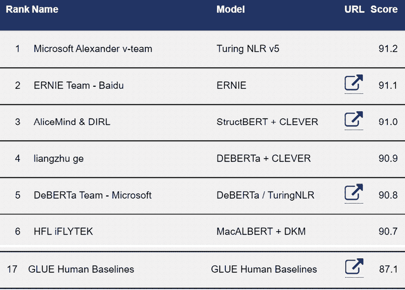

图 5.2：GLUE 排行榜 - 2021 年 12 月

新模型和人类基线的排名将不断变化。这些排名只是给出了经典 NLP 和变压器带领我们走向何方的一个概念！

我们首先注意到 GLUE 人类基线并不处于顶级位置，这表明自然语言理解模型已经在 GLUE 任务上超越了非专业人类。人类基线代表了我们人类能够达到的水平。人工智能现在能够胜过人类。到了 2021 年 12 月，人类基线仅排在第 17 位。这是一个问题。如果没有一个要超越的标准，就很难盲目地寻找基准数据集来改进我们的模型。

我们还注意到 transformer 模型已经领先。

我喜欢将 GLUE 和 SuperGLUE 看作是语言理解从混乱到有序的转折点。对我来说，理解是让词语彼此契合并形成一种语言的粘合剂。

随着自然语言理解的进步，GLUE 排行榜将不断发展。然而，*Wang* 等人（2019）引入 SuperGLUE 是为了为人类基线设立更高的标准。

### 引入更高的人类基线标准

*Wang* 等人（2019）认识到了 GLUE 的局限性。他们为更困难的自然语言理解任务设计了 SuperGLUE。

SuperGLUE 立即将人类基线重新确定为第一名（2020 年 12 月），如下面排行榜摘录所示，[`super.gluebenchmark.com/leaderboard`](https://super.gluebenchmark.com/leaderboard)：

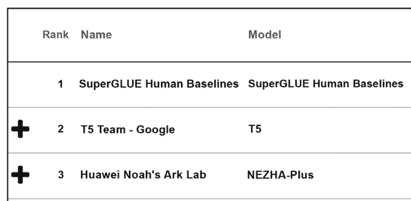

图 5.3：SuperGLUE 排行榜 2.0 – 2020 年 12 月

然而，随着我们生产出更好的自然语言理解（NLU）模型，SuperGLUE 排行榜也在发展。在 2021 年，transformers 已经超过了人类基线。到了 2021 年 12 月，人类基线已经下降到第 5 位，如 *图 5.4* 所示：

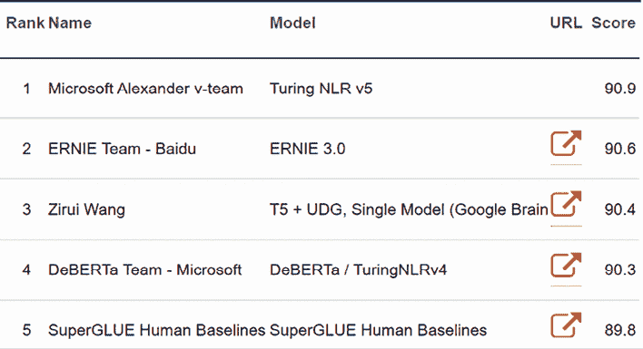

图 5.4：SuperGLUE 排行榜 2.0 – 2021 年 12 月

随着新的创新模型的到来，人工智能算法排名将不断变化。这些排名只是给出了自然语言处理至高无上的战斗有多么艰难的一个概念！

现在让我们看看评估过程是如何工作的。

### SuperGLUE 评估过程

Wang 等人（2019）为他们的 SuperGLUE 基准选择了八个任务。这些任务的选择标准比 GLUE 更严格。例如，这些任务不仅要理解文本，还要进行推理。推理的水平不是顶级专家的水平。然而，性能水平已足以替代许多人类任务。

这八个 SuperGLUE 任务被呈现在一个现成的列表中：

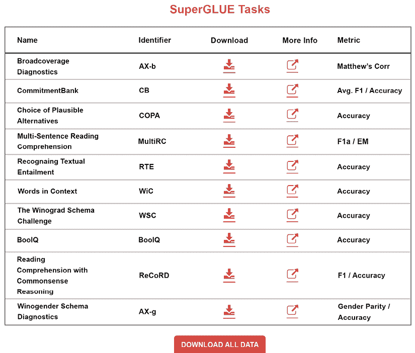

图 5.5：SuperGLUE 任务

任务列表是交互式的：[`super.gluebenchmark.com/tasks`](https://super.gluebenchmark.com/tasks)。

每个任务都包含执行该任务所需信息的链接：

+   **名称** 是一个微调、预训练模型的下游任务的名称

+   **标识符** 是名称的缩写或简称

+   **下载** 是数据集的下载链接

+   **更多信息** 通过链接到设计数据集驱动任务的团队的论文或网站提供更多细节

+   **度量** 是用于评估模型的测量分数

SuperGLUE 提供任务说明、软件、数据集以及描述要解决问题的论文或网站。一旦团队运行基准任务并达到排行榜，结果将显示如下：

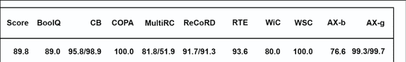

图 5.6：SuperGLUE 任务分数

SuperGLUE 显示了整体评分以及每个任务的评分。

例如，让我们看看*王*等人(2019 年)在他们的论文的*表 6*中为**选择合理答案**(**COPA**)任务提供的说明。

第一步是阅读由*Roemmele*等人(2011 年)撰写的杰出论文。简言之，目标是让 NLU 模型展示它的机器思考能力（当然不是人类思考）。在我们的案例中，transformer 必须选择最合理的答案来回答问题。数据集提供前提，transformer 模型必须找出最合理的答案。

例如：

`前提：我敲了敲邻居的门。`

`结果是什么？`

`另一种选择：我的邻居邀请我进去了。`

`另一种选择：我的邻居离开了他的房子。`

这个问题需要人类花上一两秒钟来回答，这表明它需要一些常识机器思考。`COPA.zip`是一个可以直接从 SuperGLUE 任务页面下载的现成数据集，所提供的度量使得这个过程对于所有参与基准竞赛的人员都是公平和可靠的。

这些例子可能看起来很困难。然而，如果我们考虑所有的任务，transformers 接近了 COPA 人类基准线(*图 5.7*)，它只排在第 5 名：

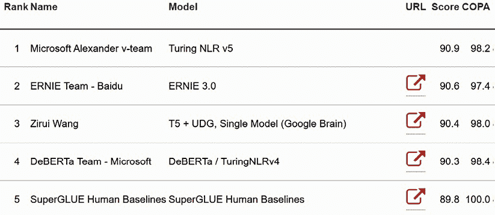

图 5.7：COPA 的 SuperGLUE 结果

看上去难以置信，transformers 在很短的时间内就攀登到了排行榜梯子上！而且这只是一个开始。新的想法几乎每个月都在出现！

我们已经介绍了 COPA。让我们定义另外七个 SuperGLUE 基准任务。

## 定义 SuperGLUE 基准任务

一个任务可以是一个用于生成训练模型的预训练任务。同一个任务可以是另一个模型的下游任务，该模型将对其进行微调。然而，SuperGLUE 的目标是展示给定的 NLU 模型可以执行多个下游任务并进行微调。多任务模型证明了 transformers 的思考能力。

任何 transformer 的力量都在于它能够使用预训练模型执行多个任务，然后将其应用于微调的下游任务。原始 Transformer 模型及其变体现在所有 GLUE 和 SuperGLUE 任务中处于领先地位。我们将继续关注 SuperGLUE 下游任务，而人类基准线很难击败。

在上一部分，我们介绍了 COPA。在本节中，我们将介绍*王*等人(2019 年)在其论文的*表 2*中定义的其他七个任务。

让我们继续进行一个布尔问题任务。

### BoolQ

BoolQ 是一个布尔型的是或否回答任务。如在 SuperGLUE 中所定义的，数据集包含 15,942 个自然发生的例子。`train.jsonl` 数据集的第 3 行原始样本包含一段文章、一个问题和答案（`true`）：

```py
{`"question"`: "is windows movie maker part of windows essentials"
`"passage"`: "Windows Movie Maker -- Windows Movie Maker (formerly known as Windows Live Movie Maker in Windows 7) is a discontinued video editing software by Microsoft. It is a part of Windows Essentials software suite and offers the ability to create and edit videos as well as to publish them on OneDrive, Facebook, Vimeo, YouTube, and Flickr.", "idx": 2, "label": true} 
```

提供的数据集可能会随时间改变，但概念保持不变。

现在，让我们来看看 CB，这是一个需要人类和机器共同关注的任务。

### Commitment Bank（CB）

**承诺银行**（**CB**）是一个困难的*蕴含*任务。我们要求变压器模型阅读一个*前提*，然后检验基于前提构建的一个*假设*。例如，假设会确认前提或与之矛盾。然后变压器模型必须将假设标记为*中性*、*蕴含*或*矛盾*，例如。

数据集包含自然语篇。

以下示例中的 `#77`，取自 `train.jsonl` 训练数据集，展示了 CB 任务的难度：

```py
{`"premise"`: "The Susweca. It means ''dragonfly'' in Sioux, you know. Did I ever tell you that's where Paul and I met?"
`"hypothesis"`: "Susweca is where she and Paul met,"
`"label"`: `"entailment"`, "idx": 77} 
```

我们现在来看看多句问题。 

### 多句阅读理解（MultiRC）

**多句阅读理解**（**MultiRC**）要求模型阅读一段文本，并从几个可能的选择中作出选择。这个任务对人类和机器来说都很困难。模型需要面对一个*文本*，多个*问题*，以及每个问题可能对应的*答案*，并带有 `0`（错误）或 `1`（正确）的*标签*。

让我们来看 `train.jsonl` 中的第二个样本：

```py
"Text": "text": "The rally took place on October 17, the shooting on February 29\. Again, standard filmmaking techniques are interpreted as smooth distortion: \"Moore works by depriving you of context and guiding your mind to fill the vacuum -- with completely false ideas. It is brilliantly, if unethically, done.\" As noted above, the \"from my cold dead hands\" part is simply Moore's way to introduce Heston. Did anyone but Moore's critics view it as anything else? He certainly does not \"attribute it to a speech where it was not uttered\" and, as noted above, doing so twice would make no sense whatsoever if Moore was the mastermind deceiver that his critics claim he is. Concerning the Georgetown Hoya interview where Heston was asked about Rolland, you write: \"There is no indication that [Heston] recognized Kayla Rolland's case.\" This is naive to the extreme -- Heston would not be president of the NRA if he was not kept up to date on the most prominent cases of gun violence. Even if he did not respond to that part of the interview, he certainly knew about the case at that point. Regarding the NRA website excerpt about the case and the highlighting of the phrase \"48 hours after Kayla Rolland is pronounced dead\": This is one valid criticism, but far from the deliberate distortion you make it out to be; rather, it is an example for how the facts can sometimes be easy to miss with Moore's fast pace editing. The reason the sentence is highlighted is not to deceive the viewer into believing that Heston hurried to Flint to immediately hold a rally there (as will become quite obvious), but simply to highlight the first mention of the name \"Kayla Rolland\" in the text, which is in this paragraph. " 
```

样本包含四个问题。为了说明这个任务，我们只研究其中两个。模型必须预测正确的标签。请注意，模型被要求获取的信息分布在整个文本中：

```py
`"question"`: "When was Kayla Rolland shot?"
`"answers"`:
[{"text": "February 17", "idx": 168, "label": 0}, 
`{"text": "February 29", "idx": 169, "label": 1},` 
{"text": "October 29", "idx": 170, "label": 0},
{"text": "October 17", "idx": 171, "label": 0},
{"text": "February 17", "idx": 172, "label": 0}], "idx": 26},
`{"question"`: "Who was president of the NRA on February 29?", 
`"answers": [{"text": "Charleton Heston", "idx": 173, "label": 1}`,
{"text": "Moore", "idx": 174, "label": 0},
{"text": "George Hoya", "idx": 175, "label": 0},
{"text": "Rolland", "idx": 176, "label": 0},
{"text": "Hoya", "idx": 177, "label": 0}, {"text": "Kayla", "idx": 178, "label": 0}], "idx": 27}, 
```

在这一点上，人们只能欣赏一个优秀的、经过精确调校的预训练模型在这些困难的下游任务上的表现。

现在，让我们来看看阅读理解任务。

### Reading Comprehension with Commonsense Reasoning Dataset（ReCoRD）

**通用常识推理数据集**（**ReCoRD**）代表着另一个具有挑战性的任务。该数据集包含来自超过 70,000 篇新闻文章的 120,000 多个查询。变压器必须运用常识推理来解决这个问题。

让我们来查看 `train.jsonl` 中的一个样本：

```py
`"source"`: "Daily mail"
A passage contains the text and indications as to where the entities are located.
A passage begins with the text:
`"passage"`: {
    `"text"`: "A Peruvian tribe once revered by the Inca's for their fierce hunting skills and formidable warriors are clinging on to their traditional existence in the coca growing valleys of South America, sharing their land with drug traffickers, rebels and illegal loggers. Ashaninka Indians are the largest group of indigenous people in the mountainous nation's Amazon region, but their settlements are so sparse that they now make up less than one per cent of Peru's 30 million population. Ever since they battled rival tribes for territory and food during native rule in the rainforests of South America, the Ashaninka have rarely known peace.\n@highlight\nThe Ashaninka tribe once shared the Amazon with the like of the Incas hundreds of years ago\n@highlight\nThey have been forced to share their land after years of conflict forced rebels and drug dealers into the forest\n@highlight\n. Despite settling in valleys rich with valuable coca, they live a poor pre-industrial existence", 
```

*实体*如下摘录所示：

```py
 `"entities": [{"start": 2,"end": 9}, …,"start": 711,"end": 715}]` 
```

最后，模型必须通过找到适当的值来*回答*一个*查询*，填写*占位符*：

```py
{`"``query"`: "Innocence of youth: Many of the `@placeholder's` younger generations have turned their backs on tribal life and moved to the cities where living conditions are better", 
`"answers"`:[{"start":263,"end":271,"text":"Ashaninka"},{"start":601,"end":609,"text":"Ashaninka"},{"start":651,"end":659,"text":"Ashaninka"}],"idx":9}],"idx":3} 
```

一旦变压器模型经历了这个问题，它现在必须面对一个包含的任务。

### 文本蕴含识别（RTE）

对于**文本蕴涵识别**（**RTE**），变压器模型必须阅读*前提*，检查一个*假设*，并预测*蕴含假设状态*的*标签*。

让我们来看看 `train.jsonl` 数据集的样本 `#19`：

```py
{`"premise"`: "U.S. crude settled $1.32 lower at $42.83 a barrel.", 
`"hypothesis"`: "Crude the light American lowered to the closing 1.32 dollars, to 42.83 dollars the barrel.", "label": `"not_entailment"`, >"idx": 19} 
```

RTE 需要理解和逻辑推理。现在让我们来看 Words in Context 任务。

### Words in Context（WiC）

**上下文中的词语**（**WiC**）和以下的 Winograd 任务测试模型处理模棱两可的词语的能力。在 WiC 中，多任务 transformer 必须分析两个句子，并确定目标词在两个句子中是否具有相同的含义。

让我们检查`train.jsonl`数据集的第一个样本。

首先指定目标词：

```py
 "word": `"place"` 
```

模型必须读取包含目标词的两个句子：

```py
 "sentence1": "Do you want to come over to my place later?",
  "sentence2": "A political system with no `place` for the less prominent groups." 
```

`train.jsonl`指定了样本索引、标签的值以及`sentence1(start1, end1)`和`sentence2(start2, end2)`中目标词的位置：

```py
 "idx": 0,
  "label": false,
  "start1": 31,
  "start2": 27,
  "end1": 36,
  "end2": 32, 
```

在完成这个艰巨的任务后，transformer 模型将面临 Winograd 任务。

### Winograd 模式挑战（WSC）

Winograd 模式任务以 Terry Winograd 命名。如果一个 transformer 经过良好训练，它应该能够解决消歧问题。

该数据集包含针对代词性别细微差异的句子。

这构成了一个共指解析问题，这是执行的最具挑战性的任务之一。然而，允许自注意的 transformer 架构对于这个任务来说是理想的。

每个句子包含一个*职业*、一个*参与者*和一个*代词*。要解决的问题是找出代词是否与职业或参与者*共指*。

让我们看看从`train.jsonl`中取出的样本。

首先，样本要求模型阅读一段*文本*：

```py
{`"text"`: >"I poured water from the bottle into the cup until it was full.",
The WSC ask the model to find the target pronoun token number 10 starting at 0: 
`"target"`: {`"span2_index"`: 10, 
Then it asks the model to determine if "it" refers to "the cup" or not: 
`"span1_index"`: 7,
`"span1_text"`: "the cup", 
`"span2_text"`: "it"}, 
For sample index #4, the label is true:
"idx": 4, `"label"`: true} 
```

我们已经了解了一些主要的 SuperGLUE 任务。还有许多其他任务。

然而，一旦你了解 transformer 的架构和基准任务的机制，你将迅速适应任何模型和基准。

现在让我们运行一些下游任务。

# 运行下游任务

在本节中，我们将随便选几辆 transformer 车，开一下看看它们是如何运行的。有许多模型和任务。我们将在本节运行其中几个。一旦你了解了运行几个任务的过程，你会很快理解所有任务。*毕竟，所有这些任务的人类基线就是我们自己！*

下游任务是从预训练 transformer 模型继承模型和参数的微调 transformer 任务。

因此，下游任务是一个从预训练模型运行微调任务的视角。这意味着，根据模型的不同，如果任务没有用于完全预训练该模型，则该任务是下游任务。在本节中，我们将考虑所有任务都是下游任务，因为我们没有预训练它们。

模型将会发展，数据库也会发展，基准方法、准确性测量方法和排行榜标准也会发展。但是反映在本章的下游任务中的人类思维结构将会保持不变。

让我们从 CoLA 开始。

## 语言接受性语料库（CoLA）

**语言接受性语料库** (**CoLA**)，一个 GLUE 任务，[`gluebenchmark.com/tasks`](https://gluebenchmark.com/tasks)，包含了标记为语法接受性的英语句子的成千上万个样本。

*Alex Warstadt*等人（2019）的目标是评估 NLP 模型对句子的语言能力，以判断句子的语言可接受性。NLP 模型应该按照预期对句子进行分类。

句子被标记为语法正确或不符合语法规范。如果句子不符合语法规范，则标记为 `0`。如果句子在语法上是正确的，则标记为 `1`。例如：

分类 = `1` 代表 ‘我们喊得嘶哑了.’

分类 = `0` 代表 ‘我们在喊.’

你可以在 *第三章*，*Fine-Tuning BERT Models* 中查看我们在 CoLA 数据集上对 BERT 模型进行微调的内容，打开 `BERT_Fine_Tuning_Sentence_Classification_GPU.ipynb`。我们使用了 CoLA 数据：

```py
#@title Loading the Dataset
#source of dataset : https://nyu-mll.github.io/CoLA/
df = pd.read_csv("in_domain_train.tsv", delimiter='\t', header=None, names=['sentence_source', 'label', 'label_notes', 'sentence'])
df.shape 
```

我们还加载了一个预训练的 BERT 模型：

```py
#@title Loading the Hugging Face Bert Uncased Base Model 
model = BertForSequenceClassification.from_pretrained("bert-base-uncased", num_labels=2) 
```

最后，我们使用的度量方法是 MCC，在 *第三章*，*Fine-Tuning BERT Models* 的 *使用 Matthews 相关系数进行评估* 部分和本章中有详细描述。

如果需要，您可以参考该部分以获取 MCC 的数学描述，并有必要时重新运行源代码。

一句话在语法上可能不可接受，但仍然传达情绪。情感分析可以为机器增加某种程度的同理心。

## 斯坦福情感树库（**SST-2**）

**斯坦福情感树库**（**SST-2**）包含电影评论。在这一部分，我们将描述 SST-2（二元分类）任务。然而，数据集远不止如此，可以将情感分类为 *0*（负面）到 *n*（正面）。

*Socher*等人(2013)将情感分析发展到了超越二元积极-消极 NLP 分类的程度。我们将在 *第十二章*，*检测客户情绪以做出预测* 中使用 Transformer 模型探索 SST-2 多标签情感分类。

在这一部分，我们将在 Hugging Face transformer pipeline 模型上运行从 SST 中取出的样本以说明二元分类。

打开`Transformer_tasks.ipynb`并运行以下单元格，其中包含从**SST**获取的正面和负面电影评论：

```py
#@title SST-2 Binary Classification
from transformers import pipeline
nlp = pipeline("sentiment-analysis")
print(nlp("If you sometimes like to go to the movies to have fun , Wasabi is a good place to start."),"If you sometimes like to go to the movies to have fun , Wasabi is a good place to start.")
print(nlp("Effective but too-tepid biopic."),"Effective but too-tepid biopic.") 
```

输出是准确的：

```py
[{'label': 'POSITIVE', 'score': 0.999825656414032}] If you sometimes like to go to the movies to have fun , Wasabi is a good place to start .
[{'label': 'NEGATIVE', 'score': 0.9974064230918884}] Effective but too-tepid biopic. 
```

**SST-2** 任务使用准确度指标进行评估。

我们对一个序列的情感进行分类。现在让我们看看一个序列中的两个句子是否是释义。

## 微软研究释义语料库（MRPC）

**微软研究释义语料库**（**MRPC**），一个 GLUE 任务，包含从网上新闻来源中提取的句子对。每对句子都经过人工标注，标明句子是否基于两个密切相关属性等价：

+   解释等价

+   语义等价

让我们使用 Hugging Face BERT 模型运行一个样本。打开`Transformer_tasks.ipynb`并前往以下单元格，然后运行从 MRPC 中提取的样本：

```py
#@title Sequence Classification : paraphrase classification
from transformers import AutoTokenizer, TFAutoModelForSequenceClassification
import tensorflow as tf
tokenizer = AutoTokenizer.from_pretrained("bert-base-cased-finetuned-mrpc")
model = TFAutoModelForSequenceClassification.from_pretrained("bert-base-cased-finetuned-mrpc")
classes = ["not paraphrase", "is paraphrase"]
sequence_A = "The DVD-CCA then appealed to the state Supreme Court."
sequence_B = "The DVD CCA appealed that decision to the U.S. Supreme Court."
paraphrase = tokenizer.encode_plus(sequence_A, sequence_B, return_tensors="tf")
paraphrase_classification_logits = model(paraphrase)[0]
paraphrase_results = tf.nn.softmax(paraphrase_classification_logits, axis=1).numpy()[0]
print(sequence_B, "should be a paraphrase")
for i in range(len(classes)):
    print(f"{classes[i]}: {round(paraphrase_results[i] * 100)}%") 
```

输出是准确的，尽管可能会收到警告消息，表明模型需要更多的下游训练：

```py
The DVD CCA appealed that decision to the U.S. Supreme Court. should be a paraphrase
not paraphrase: 8.0%
is paraphrase: 92.0% 
```

**MRPC** 任务使用 F1/准确率分数方法进行度量。

现在让我们运行一个**Winograd schema**。

## Winograd 模式

我们在本章的*The Winograd schema challenge (WSC)*部分描述了 Winograd 模式。训练集是英文的。

但是，如果我们要求变压器模型解决英法翻译中的代词性别问题会发生什么？法语对具有语法性别（阴性、阳性）的名词有不同的拼写。

以下句子包含代词*it*，可以指代*car*或*garage*。变压器能消除这个代词的歧义吗？

打开`Transformer_tasks.ipynb`，转到`#Winograd`单元格，并运行我们的示例：

```py
#@title Winograd
from transformers import pipeline
translator = pipeline("translation_en_to_fr")
print(translator("The car could not go in the garage because it was too big.", max_length=40)) 
```

翻译是完美的：

```py
[{'translation_text': "La voiture ne pouvait pas aller dans le garage parce qu'elle était trop grosse."}] 
```

变压器检测到单词*it*指的是单词*car*，这是女性形式。女性形式适用于*it*和形容词*big*：

*elle*在法语中意味着*she*，这是*it*的翻译。阳性形式将是*il*，意思是*he*。

*grosse*是单词*big*的翻译的女性形式。否则，阳性形式将是*gros*。

我们给变压器一个困难的 Winograd 模式来解决，它给出了正确的答案。

还有许多基于数据集的 NLU 任务可用。我们将在本书中探索其中一些，以将更多构建块添加到我们的 transformer 工具箱中。

# 概要

本章分析了人类语言表征过程与机器智能执行传导的方式之间的差异。我们看到，变压器必须依赖于我们在书面语言中表达的极其复杂的思维过程的输出。语言仍然是表达大量信息的最精确的方式。机器没有感觉，必须将语音转换为文本，以从原始数据集中提取含义。

然后，我们探讨了如何衡量多任务变压器的性能。变压器在下游任务中获得顶级结果的能力在 NLP 历史上是独一无二的。我们经历了许多艰难的 SuperGLUE 任务，这些任务将变压器带到了 GLUE 和 SuperGLUE 排行榜的前列。

BoolQ、CB、WiC 等我们涵盖的许多任务，甚至对人类来说都不容易处理。我们通过几个下游任务的示例展示了变压器模型在证明其效率时面临的困难。

变压器已经通过胜过以前的 NLU 架构证明了其价值。为了说明实施下游微调任务是多么简单，我们在 Google Colaboratory 笔记本中使用 Hugging Face 的 transformers 管道运行了几个任务。

在*Winograd 模式*中，我们给变压器一个困难的任务，即解决英法翻译中的 Winograd 消歧问题。

在下一章，*第六章*，*使用变压器进行机器翻译*，我们将进一步开展翻译任务，并使用 Trax 构建翻译模型。

# 问题

1.  机器智能使用与人类相同的数据进行预测。（是/否）

1.  对于 NLP 模型来说，SuperGLUE 比 GLUE 更难。（是/否）

1.  BoolQ 期望一个二进制答案。（True/False）

1.  WiC 代表上下文中的单词。（True/False）

1.  **文本蕴含识别**（**RTE**）检测一个序列是否蕴含另一个序列。（True/False）

1.  Winograd 模式预测动词是否拼写正确。（True/False）

1.  Transformer 模型现在占据了 GLUE 和 SuperGLUE 的前几名。（True/False）

1.  人类基准标准并非一劳永逸。它们被 SuperGLUE 制定得更难达到。（True/False）

1.  Transformer 模型永远不会达到 SuperGLUE 人类基准标准。（True/False）

1.  变种的 Transformer 模型已经超过了 RNN 和 CNN 模型。（True/False）

# 参考资料

+   *Alex Wang*、*Yada Pruksachatkun*、*Nikita Nangia*、*Amanpreet Singh*、*Julian Michael*、*Felix Hill*、*Omer Levy*、*Samuel R. Bowman*，2019 年，《SuperGLUE：通用语言理解系统的更棘手的基准》：[`w4ngatang.github.io/static/papers/superglue.pdf`](https://w4ngatang.github.io/static/papers/superglue.pdf)

+   *Alex Wang*, *Yada Pruksachatkun*, *Nikita Nangia*, *Amanpreet Singh*, *Julian Michael*, *Felix Hill*, *Omer Levy*, *Samuel R. Bowman*, 2019, *GLUE：用于自然语言理解的多任务基准和分析平台*

+   *Yu Sun*、*Shuohuan Wang*、*Yukun Li*、*Shikun Feng*、*Hao Tian*、*Hua Wu*、*Haifeng Wang*，2019 年，《ERNIE 2.0：语言理解的持续预训练框架》：[`arxiv.org/pdf/1907.12412.pdf`](https://arxiv.org/pdf/1907.12412.pdf)

+   *Melissa Roemmele*、*Cosmin Adrian Bejan*和*Andrew S. Gordon*，2011 年，《可选择的合理替代方案：常识因果推理评估》：[`people.ict.usc.edu/~gordon/publications/AAAI-SPRING11A.PDF`](https://people.ict.usc.edu/~gordon/publications/AAAI-SPRING11A.PDF)

+   *Richard Socher*、*Alex Perelygin*、*Jean Y. Wu*、*Jason Chuang*、*Christopher D. Manning*、*Andrew Y. Ng*和*Christopher Potts*，2013 年，《递归深度模型用于情感树库的语义组合》：[`nlp.stanford.edu/~socherr/EMNLP2013_RNTN.pdf`](https://nlp.stanford.edu/~socherr/EMNLP2013_RNTN.pdf)

+   *Thomas Wolf*、*Lysandre Debut*、*Victor Sanh*、*Julien Chaumond*、*Clement Delangue*、*Anthony Moi*、*Pierric Cistac*、*Tim Rault*、*Rémi Louf*、*Morgan Funtowicz*和*Jamie Brew*，2019 年，《HuggingFace 的 Transformer：最先进的自然语言处理》：[`arxiv.org/abs/1910.03771`](https://arxiv.org/abs/1910.03771)

+   Hugging Face Transformer 用法: [`huggingface.co/transformers/usage.html`](https://huggingface.co/transformers/usage.html)

# 加入我们书籍的 Discord 空间

加入该书的 Discord 工作区，与作者进行每月的*问我任何事*会话：

[`www.packt.link/Transformers`](https://www.packt.link/Transformers)


