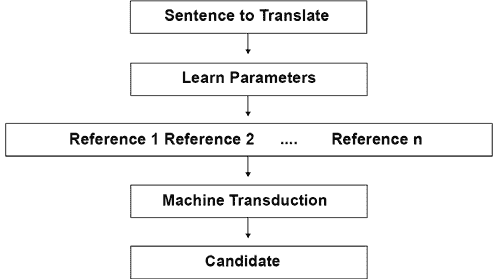
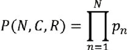
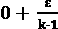

# 第六章：使用 Transformer 进行机器翻译

人类精通序列转换，将表示转移到另一个对象上。我们可以轻松想象一个序列的心理表示。如果有人说*我的花园里的花很漂亮*，我们可以轻松地想象出一个有花的花园。我们看到花园的图像，尽管我们可能从未见过那个花园。我们甚至可能想象出鸟鸣和花香。

机器必须从头开始学习用数字表示进行转换。循环或卷积方法产生了有趣的结果，但还没有达到显著的 BLEU 翻译评估分数。翻译需要将语言 *A* 的表示转换成语言 *B*。

变压器模型的自注意创新提高了机器智能的分析能力。在尝试将语言 *A* 的序列翻译成语言 *B* 之前，必须对其进行充分的表示。自注意带来了机器获得更好 BLEU 分数所需的智能水平。

*注意力全靠你* 变压器在 2017 年的英语-德语和英语-法语翻译中取得了最佳结果。从那以后，其他变压器的得分已经有所提高。

在本书的这一部分，我们已经涵盖了变压器的基本方面：Transformer 的 *架构*，从头开始 *训练* 一个 RoBERTa 模型，*微调* 一个 BERT，*评估* 一个经过微调的 BERT，并探索一些变压器示例中的 *下游任务*。

在本章中，我们将通过三个额外的主题来介绍机器翻译。我们首先会定义什么是机器翻译。然后，我们将预处理一个**机器翻译研讨会**（**WMT**）数据集。最后，我们将看到如何实现机器翻译。

本章涵盖以下主题：

+   定义机器翻译

+   人类转换和翻译

+   机器转换和翻译

+   预处理 WMT 数据集

+   使用 BLEU 评估机器翻译

+   几何评估

+   Chencherry 平滑

+   介绍 Google 翻译的 API

+   使用 Trax 初始化英语-德语问题

我们的第一步将是定义机器翻译。

# 定义机器翻译

*Vaswani* 等人（2017 年）在设计 Transformer 时解决了 NLP 中最困难的问题之一。机器翻译的人类基线似乎对我们这些人类-机器智能设计者来说是遥不可及的。这并没有阻止 *Vaswani* 等人（2017 年）发布 Transformer 的架构并取得最先进的 BLEU 结果。

在本节中，我们将定义机器翻译。机器翻译是通过机器转换和输出来复制人类翻译的过程：



*图 6.1*：机器翻译过程

*图 6.1* 中的一般思想是让机器在几个步骤中执行以下操作：

+   选择要翻译的句子

+   学习单词如何相互关联以及数以亿计的参数

+   学习单词之间相互指代的多种方式

+   使用机器传导将学习的参数传递给新的序列

+   为单词或序列选择候选翻译

这个过程总是以从源语言*A*翻译的句子开始。过程以包含语言*B*中翻译的句子的输出结束。中间计算涉及传导。

## 人类传导和翻译

例如，欧洲议会的人类口译员不会逐字逐句地翻译句子。逐字翻译通常毫无意义，因为它们缺乏适当的*语法结构*，并且无法产生正确的翻译，因为忽略了每个词的*上下文*。

人类传导将语言*A*中的一句话构建成一种认知*表征*这句话的含义。欧洲议会的口译员（口头翻译）或翻译员（书面翻译）只有在此之后才会将该传导转化为语言*B*中对该句话的解释。

我们将口译员或翻译员在语言*B*中完成的翻译称为*参考*句子。

在*图 6.1*中描述的*机器翻译过程*中，您会注意到几个参考资料。

人类翻译员在现实生活中不会将句子*A*翻译为句子*B*多次，而只会翻译一次。然而，在现实生活中可能会有不止一个翻译员翻译句子*A*。例如，你可以找到蒙田的《论文》的多个法语到英语的翻译。如果你从原始法语版本中取出句子*A*，你会发现被标注为引用`1`到`n`的句子*B*的几个版本。

如果有一天你去欧洲议会，你可能会注意到口译员只会在有限的时间内翻译两个小时，例如。然后另一个口译员接替。没有两个口译员有相同的风格，就像作家有不同的风格一样。源语言中的句子*A*可能由同一个人在一天中重复几次，但会被翻译成几个参考句子*B*版本：

*参考* = {*参考 1*, *参考 2*,…*参考 n*}

机器必须找到一种以与人类翻译员相同的方式思考的方法。

## 机器传导和翻译

原始 Transformer 架构的传导过程使用编码器堆栈、解码器堆栈和所有模型参数来表示一个*参考序列*。我们将称之为*参考*的输出序列。

为什么不直接说“输出预测”？问题在于没有单一的输出预测。Transformer，就像人类一样，将产生一个我们可以参考的结果，但如果我们对其进行不同的训练或使用不同的 Transformer 模型，结果可能会改变！

我们立即意识到人类语言序列转换的基线是一个相当大的挑战。然而，已经取得了很大的进步。

机器翻译的评估证明了自然语言处理的进步。为了确定一个解决方案是否比另一个更好，每个自然语言处理挑战者、实验室或组织必须参考相同的数据集，以便比较是有效的。

现在让我们探索一个 WMT 数据集。

# 预处理一个 WMT 数据集

*Vaswani* 等人（2017）展示了 Transformer 在 WMT 2014 英译德和 WMT 2014 英译法任务上的成就。Transformer 实现了最先进的 BLEU 分数。BLEU 将在本章的*使用 BLEU 评估机器翻译*部分进行描述。

2014 年的 WMT 包含了几个欧洲语言数据集。其中一个数据集包含了从欧洲议会语料库第 7 版中获取的数据。我们将使用来自*欧洲议会会议平行语料库*1996-2011 年的法语-英语数据集（[`www.statmt.org/europarl/v7/fr-en.tgz`](https://www.statmt.org/europarl/v7/fr-en.tgz)）。

一旦你下载了文件并解压缩它们，我们将预处理这两个平行文件：

+   `europarl-v7.fr-en.en`

+   `europarl-v7.fr-en.fr`

我们将加载、清理并缩小语料库的大小。

让我们开始预处理。

## 预处理原始数据

在本节中，我们将预处理`europarl-v7.fr-en.en`和`europarl-v7.fr-en.fr`。

打开本章的 GitHub 目录中的`read.py`。确保两个 europarl 文件与`read.py`在同一目录中。

程序开始使用标准的 Python 函数和`pickle`来转储序列化输出文件：

```py
import pickle
from pickle import dump 
```

然后我们定义将文件加载到内存中的函数：

```py
# load doc into memory
def load_doc(filename):
        # open the file as read only
        file = open(filename, mode='rt', encoding='utf-8')
        # read all text
        text = file.read()
        # close the file
        file.close()
        return text 
```

文档加载后被分割成句子：

```py
# split a loaded document into sentences
def to_sentences(doc):
        return doc.strip().split('\n') 
```

检索到最短和最长的长度：

```py
# shortest and longest sentence lengths
def sentence_lengths(sentences):
        lengths = [len(s.split()) for s in sentences]
        return min(lengths), max(lengths) 
```

导入的句子行必须经过清理以避免训练无用和嘈杂的标记。行被规范化，以空格分词，并转换为小写。从每个标记中删除标点符号，删除不可打印的字符，并排除包含数字的标记。清理后的行被存储为字符串。

程序运行清理函数并返回干净的附加字符串：

```py
# clean lines
import re
import string
import unicodedata
def clean_lines(lines):
        cleaned = list()
        # prepare regex for char filtering
        re_print = re.compile('[^%s]' % re.escape(string.printable))
        # prepare translation table for removing punctuation
        table = str.maketrans('', '', string.punctuation)
        for line in lines:
                # normalize unicode characters
                line = unicodedata.normalize('NFD', line).encode('ascii', 'ignore')
                line = line.decode('UTF-8')
                # tokenize on white space
                line = line.split()
                # convert to lower case
                line = [word.lower() for word in line]
                # remove punctuation from each token
                line = [word.translate(table) for word in line]
                # remove non-printable chars form each token
                line = [re_print.sub('', w) for w in line]
                # remove tokens with numbers in them
                line = [word for word in line if word.isalpha()]
                # store as string
                cleaned.append(' '.join(line))
        return cleaned 
```

我们已经定义了将调用来准备数据集的关键函数。首先加载并清理英文数据：

```py
# load English data
filename = 'europarl-v7.fr-en.en'
doc = load_doc(filename)
sentences = to_sentences(doc)
minlen, maxlen = sentence_lengths(sentences)
print('English data: sentences=%d, min=%d, max=%d' % (len(sentences), minlen, maxlen))
cleanf=clean_lines(sentences) 
```

数据集现在已经干净，`pickle`将其转储到名为`English.pkl`的序列化文件中：

```py
filename = 'English.pkl'
outfile = open(filename,'wb')
pickle.dump(cleanf,outfile)
outfile.close()
print(filename," saved") 
```

输出显示关键统计信息，并确认`English.pkl`已保存：

```py
English data: sentences=2007723, min=0, max=668
English.pkl  saved 
```

现在我们用相同的过程处理法语数据，并将其转储到名为`French.pkl`的序列化文件中：

```py
# load French data
filename = 'europarl-v7.fr-en.fr'
doc = load_doc(filename)
sentences = to_sentences(doc)
minlen, maxlen = sentence_lengths(sentences)
print('French data: sentences=%d, min=%d, max=%d' % (len(sentences), minlen, maxlen))
cleanf=clean_lines(sentences)
filename = 'French.pkl'
outfile = open(filename,'wb')
pickle.dump(cleanf,outfile)
outfile.close()
print(filename," saved") 
```

输出显示法语数据集的关键统计信息，并确认`French.pkl`已保存。

```py
French data: sentences=2007723, min=0, max=693
French.pkl saved 
```

主要的预处理已经完成。但我们仍需要确保数据集不包含嘈杂和混乱的标记。

## 完成数据集的预处理

现在，在与`read.py`相同目录中打开`read_clean.py`。我们的流程现在定义了一个函数，该函数将加载前一部分清理过的数据集，然后在预处理完成后保存它们：

```py
from pickle import load
from pickle import dump
from collections import Counter

# load a clean dataset
def load_clean_sentences(filename):
        return load(open(filename, 'rb'))

# save a list of clean sentences to file
def save_clean_sentences(sentences, filename):
        dump(sentences, open(filename, 'wb'))
        print('Saved: %s' % filename) 
```

我们现在定义一个函数，该函数将创建一个词汇计数器。知道我们将解析的序列中每个单词的使用次数非常重要。例如，如果一个词在包含两百万行的数据集中只使用一次，我们将浪费我们的能量使用宝贵的 GPU 资源来学习它。让我们定义计数器：

```py
# create a frequency table for all words
def to_vocab(lines):
        vocab = Counter()
        for line in lines:
                tokens = line.split()
                vocab.update(tokens)
        return vocab 
```

词汇计数器将检测频率低于`min_occurrence`的单词：

```py
# remove all words with a frequency below a threshold
def trim_vocab(vocab, min_occurrence):
        tokens = [k for k,c in vocab.items() if c >= min_occurrence]
        return set(tokens) 
```

在这种情况下，`min_occurrence=5`，低于或等于此阈值的单词已被移除，以避免浪费训练模型分析它们的时间。

现在我们必须处理**Out-Of-Vocabulary**（**OOV**）单词。 OOV 词可以是拼写错误的单词，缩写词或任何不符合标准词汇表示的单词。我们可以使用自动拼写，但它不会解决所有问题。在本例中，我们将简单地用`unk`（未知）标记替换 OOV 词：

```py
# mark all OOV with "unk" for all lines
def update_dataset(lines, vocab):
        new_lines = list()
        for line in lines:
                new_tokens = list()
                for token in line.split():
                        if token in vocab:
                                new_tokens.append(token)
                        else:
                                new_tokens.append('unk')
                new_line = ' '.join(new_tokens)
                new_lines.append(new_line)
        return new_lines 
```

现在我们将运行针对英语数据集的函数，保存输出，然后显示`20`行：

```py
# load English dataset
filename = 'English.pkl'
lines = load_clean_sentences(filename)
# calculate vocabulary
vocab = to_vocab(lines)
print('English Vocabulary: %d' % len(vocab))
# reduce vocabulary
vocab = trim_vocab(vocab, 5)
print('New English Vocabulary: %d' % len(vocab))
# mark out of vocabulary words
lines = update_dataset(lines, vocab)
# save updated dataset
filename = 'english_vocab.pkl'
save_clean_sentences(lines, filename)
# spot check
for i in range(20):
        print("line",i,":",lines[i]) 
```

输出函数首先显示了获得的词汇压缩：

```py
English Vocabulary: 105357
New English Vocabulary: 41746
Saved: english_vocab.pkl 
```

预处理的数据集已保存。输出函数然后显示`20`行，如下摘录所示：

```py
line 0 : resumption of the session
line 1 : i declare resumed the session of the european parliament adjourned on friday december and i would like once again to wish you a happy new year in the hope that you enjoyed a pleasant festive period
line 2 : although, as you will have seen, the dreaded millennium bug failed to materialise still the people in a number of countries suffered a series of natural disasters that truly were dreadful
line 3 : you have requested a debate on this subject in the course of the next few days during this partsession 
```

现在让我们运行针对法语数据集的函数，保存输出，然后显示`20`行：

```py
# load French dataset
filename = 'French.pkl'
lines = load_clean_sentences(filename)
# calculate vocabulary
vocab = to_vocab(lines)
print('French Vocabulary: %d' % len(vocab))
# reduce vocabulary
vocab = trim_vocab(vocab, 5)
print('New French Vocabulary: %d' % len(vocab))
# mark out of vocabulary words
lines = update_dataset(lines, vocab)
# save updated dataset
filename = 'french_vocab.pkl'
save_clean_sentences(lines, filename)
# spot check
for i in range(20):
        print("line",i,":",lines[i]) 
```

输出函数首先显示了获得的词汇压缩：

```py
French Vocabulary: 141642
New French Vocabulary: 58800
Saved: french_vocab.pkl 
```

预处理的数据集已保存。输出函数然后显示`20`行，如下摘录所示：

```py
line 0 : reprise de la session
line 1 : je declare reprise la session du parlement europeen qui avait ete interrompue le vendredi decembre dernier et je vous renouvelle tous mes vux en esperant que vous avez passe de bonnes vacances
line 2 : comme vous avez pu le constater le grand bogue de lan ne sest pas produit en revanche les citoyens dun certain nombre de nos pays ont ete victimes de catastrophes naturelles qui ont vraiment ete terribles
line 3 : vous avez souhaite un debat a ce sujet dans les prochains jours au cours de cette periode de session 
```

此部分显示了在训练之前必须处理原始数据的方法。数据集现在已准备好插入变压器进行训练。

法语数据集的每一行都是要翻译的*句子*。 英语数据集的每一行都是机器翻译模型的*参考*。 机器翻译模型必须产生一个与*参考*匹配的*英文候选翻译*。

BLEU 提供了一种评估机器翻译模型生成的`候选`翻译的方法。

# 使用 BLEU 评估机器翻译

*Papineni*等人（2002 年）提出了一种评估人类翻译的高效方法。定义人类基线很困难。但是，他们意识到，如果我们逐字比较人类翻译和机器翻译，我们可以获得有效的结果。

*Papineni*等人（2002 年）将他们的方法命名为**双语评估助手分数**（**BLEU**）。

在本节中，我们将使用**自然语言工具包**（**NLTK**）实现 BLEU：

[`www.nltk.org/api/nltk.translate.html#nltk.translate.bleu_score.sentence_bleu`](http://www.nltk.org/api/nltk.translate.html#nltk.translate.bleu_score.sentence_bleu)

我们将从几何评估开始。

## 几何评估

BLEU 方法将候选句子的部分与参考句子或多个参考句子进行比较。

打开这本书的 GitHub 存储库的章节目录中的`BLEU.py`。

程序导入了`nltk`模块：

```py
from nltk.translate.bleu_score import sentence_bleu
from nltk.translate.bleu_score import SmoothingFunction 
```

然后，它模拟了机器翻译模型生成的候选翻译与数据集中实际翻译参考之间的比较。 请记住，一句话可能已经多次重复，并且以不同的方式被不同的译者翻译，这使得找到有效的评估策略变得具有挑战性。

该程序可以评估一个或多个参考：

```py
#Example 1
reference = [['the', 'cat', 'likes', 'milk'], ['cat', 'likes' 'milk']]
candidate = ['the', 'cat', 'likes', 'milk']
score = sentence_bleu(reference, candidate)
print('Example 1', score)
#Example 2
reference = [['the', 'cat', 'likes', 'milk']]
candidate = ['the', 'cat', 'likes', 'milk']
score = sentence_bleu(reference, candidate)
print('Example 2', score) 
```

这两个例子的得分都是`1`：

```py
Example 1 1.0
Example 2 1.0 
```

候选*C*、参考*R*以及在*C(N)*中找到的正确令牌数量的简单评估*P*可以表示为几何函数：



如果您正在寻找 3 克重叠，例如：

```py
#Example 3
reference = [['the', 'cat', 'likes', 'milk']]
candidate = ['the', 'cat', 'enjoys','milk']
score = sentence_bleu(reference, candidate)
print('Example 3', score) 
```

如果您正在寻找 3 克重叠，则输出会很严重：

```py
Warning (from warnings module):
  File
"C:\Users\Denis\AppData\Local\Programs\Python\Python37\lib\site-packages\nltk\translate\bleu_score.py", line 490
    warnings.warn(_msg)
UserWarning: 
Corpus/Sentence contains 0 counts of 3-gram overlaps.
BLEU scores might be undesirable; use SmoothingFunction().
Example 3 0.7071067811865475 
```

一个人可以看出得分应该是`1`而不是`0.7`。 超参数可以更改，但方法仍然保持不变。

上面代码中的警告是一个很好的警告，它预告了下一节的内容。

每个程序版本和每次运行的消息可能会有所不同，因为这是一个随机过程。

*Papineni*等人（2002 年）提出了一种修改过的一元方法。 思路是统计参考句子中的词出现次数，并确保在候选句子中不会过度评估该词。

考虑由*Papineni*等人（2002 年）解释的以下示例：

`参考 1：地板上有一只猫。`

`参考 2：垫子上有一只猫。`

现在考虑以下候选序列：

`候选：the the the the the the the`

现在我们来找出候选句子中的单词数（相同单词“the”的`7`次出现）在`参考 1`句子中（单词“the”的`2`次出现）的情况。

标准的一元精确度将是`7/7`。

修改后的一元精确度为`2/7`。

请注意，BLEU 函数的输出警告表示同意并建议使用平滑。

让我们将平滑技术添加到 BLEU 工具包中。

## 应用平滑技术

*Chen*和*Cherry*（2014 年）引入了一种平滑技术，可以改进标准 BLEU 技术的几何评估方法。

标签平滑是一种非常有效的方法，可以在训练阶段改进变压器模型的性能。 这对困惑度产生了负面影响。 然而，它迫使模型更加不确定。 这反过来对准确性产生积极影响。

例如，假设我们必须预测以下序列中的掩码单词是什么：

`猫[mask]了牛奶。`

想象一下输出以 softmax 向量的形式出现：

```py
candidate_words=[drinks, likes, enjoys, appreciates]
candidate_softmax=[0.7, 0.1, 0.1,0.1]
candidate_one_hot=[1,0,0,0] 
```

这将是一个残酷的方法。 标签平滑可以通过引入 epsilon =  使系统更开放。

`candidate_softmax`的元素数量为*k=4*。

对于标签平滑，我们可以将  设置为 `0.25`，例如。

标签平滑的几种方法之一可以是一个直观的函数。

首先，将 `candidate_one_hot` 的值减小 。

通过 `0` 值增加 。

如果我们应用这种方法，我们将得到以下结果：

`candidate_smoothed=[0.75,0.083,0.083,0.083]`，使输出对未来的变换和更改开放。

变换器使用标签平滑的变体。

BLEU 的一个变体是 chencherry 平滑。

### Chencherry 平滑

*Chen* 和 *Cherry*（2014）介绍了一种通过将  添加到否则为 `0` 的值来平滑候选评估的有趣方法。有几种 chencherry（Boxing Chen + Colin Cherry）方法：[`www.nltk.org/api/nltk.translate.html`](https://www.nltk.org/api/nltk.translate.html)。

让我们首先评估一个带有平滑的法语 - 英语示例：

```py
#Example 4
reference = [['je','vous','invite', 'a', 'vous', 'lever','pour', 'cette', 'minute', 'de', 'silence']]
candidate = ['levez','vous','svp','pour', 'cette', 'minute', 'de', 'silence']
score = sentence_bleu(reference, candidate)
print("without soothing score", score) 
```

尽管人类可以接受候选者，但输出分数较低：

```py
without smoothing score 0.37188004246466494 
```

现在，让我们对评估添加一些开放的平滑：

```py
chencherry = SmoothingFunction()
r1=list('je vous invite a vous lever pour cette minute de silence')
candidate=list('levez vous svp pour cette minute de silence')

#sentence_bleu([reference1, reference2, reference3], hypothesis2,smoothing_function=chencherry.method1)
print("with smoothing score",sentence_bleu([r1], candidate,smoothing_function=chencherry.method1)) 
```

分数未达到人类可接受程度：

```py
with smoothing score 0.6194291765462159 
```

我们现在已经看到了数据集是如何预处理的以及 BLEU 如何评估机器翻译。

# 使用谷歌翻译进行翻译

谷歌翻译，[`translate.google.com/`](https://translate.google.com/)，提供了一个用于翻译的即用界面。谷歌正在逐步将变换器编码器引入其翻译算法中。在接下来的部分中，我们将使用谷歌 Trax 实现一个翻译任务的变换器模型。

但是，可能根本不需要 AI 专家。

如果我们在谷歌翻译中输入前一节中分析的句子，`Levez-vous svp pour cette minute de silence`，我们将实时获得英文翻译：


图 6.2：谷歌翻译

翻译是正确的。

工业 4.0 是否仍需要 AI 专家进行翻译任务，或者只需要一个网络界面开发人员？

谷歌在其谷歌翻译平台上提供了翻译所需的每项服务：[`cloud.google.com/translate`](https://cloud.google.com/translate)：

+   一个翻译 API：一个网络开发人员可以为客户创建一个接口

+   可以翻译流媒体内容的媒体翻译 API

+   一个 AutoML 翻译服务，将为特定领域训练一个定制模型

一个谷歌翻译项目需要一个网络开发人员来处理界面，一个**专业主题专家**（**SME**），也许还需要一个语言学家。但是，AI 专家不是必需的。

工业 4.0 正朝着 AI 作为一种服务的方向发展。那么为什么要费心学习具有变换器的 AI 开发呢？成为工业 4.0 AI 专家有两个重要的原因：

+   在现实生活中，AI 项目经常遇到意想不到的问题。例如，谷歌翻译可能无论投入多少善意都无法满足特定需求。在这种情况下，谷歌 Trax 将会派上用场！

+   要使用谷歌 Trax 进行 AI，您需要是一个 AI 开发者！

你永远不知道！第四次工业革命正在将一切与一切连接起来。一些 AI 项目可能会顺利运行，而一些则需要 AI 专业知识来解决复杂问题。例如，在*第十四章*中，*解释黑匣子变压器模型*，我们将展示有时需要 AI 开发来实现 Google 翻译。

现在我们已经准备好使用 Trax 进行翻译。

# 使用 Trax 进行翻译

谷歌大脑开发了**Tensor2Tensor**（**T2T**）来使深度学习开发更容易。T2T 是 TensorFlow 的一个扩展，包含了一个深度学习模型库，其中包含许多变压器示例。

虽然 T2T 是一个很好的开始，但谷歌大脑随后推出了 Trax，一个端到端的深度学习库。Trax 包含一个可以应用于翻译的变压器模型。谷歌大脑团队目前负责维护 Trax。

这一部分将重点介绍初始化由*瓦斯瓦尼*等人（2017 年）描述的英德问题所需的最小功能，以说明变压器的性能。

我们将使用预处理的英语和德语数据集来表明变压器架构是语言无关的。

打开`Trax_Translation.ipynb`。

我们将开始安装我们需要的模块。

## 安装 Trax

谷歌大脑已经使 Trax 易于安装和运行。我们将导入基础知识和 Trax，可以在一行中安装：

```py
#@title Installing Trax
import os
import numpy as np
!pip install -q -U trax
import trax 
```

是的，就是这么简单！

现在，让我们创建我们的变压器模型。

## 创建原始的变压器模型

我们将创建原始的变压器模型，就像*第二章*，*开始使用变压器模型架构*中描述的那样。

我们的 Trax 函数将在几行代码中检索预训练模型配置：

```py
#@title Creating a Transformer model.
# Pre-trained model config in gs://trax-ml/models/translation/ende_wmt32k.gin
model = trax.models.Transformer(
    input_vocab_size=33300,
    d_model=512, d_ff=2048,
    n_heads=8, n_encoder_layers=6, n_decoder_layers=6,
    max_len=2048, mode='predict') 
```

模型是一个具有编码器和解码器堆栈的变压器。每个堆栈包含`6`层和`8`个头。`d_model=512`，与原始变压器的架构相同。

变压器需要预训练的权重才能运行。

## 使用预训练权重初始化模型

预训练权重包含变压器的智能。权重构成了变压器对语言的表示。权重可以表示为将产生某种形式的*机器智能 IQ*的参数数量。

让我们通过初始化权重来给模型赋予生命：

```py
#@title Initializing the model using pre-trained weights
model.init_from_file('gs://trax-ml/models/translation/ende_wmt32k.pkl.gz',
                     weights_only=True) 
```

机器配置及其*智能*现已准备就绪。让我们对一个句子进行分词。

## 对句子进行分词

我们的机器翻译器已准备好对句子进行分词。笔记本使用由`Trax`预处理的词汇表。预处理方法类似于本章中描述的*预处理 WMT 数据集*部分。

现在，这个句子将被分词：

```py
#@title Tokenizing a sentence.
sentence = 'I am only a machine but I have machine intelligence.'
tokenized = list(trax.data.tokenize(iter([sentence]), # Operates on streams.
                                   vocab_dir='gs://trax-ml/vocabs/',
                                   vocab_file='ende_32k.subword'))[0] 
```

程序现在将解码句子并产生一个翻译。

## 从变压器解码

变压器将句子编码为英语，然后将其解码为德语。模型及其权重构成了其能力集。

`Trax`已经使解码函数变得直观易用：

```py
#@title Decoding from the Transformer
tokenized = tokenized[None, :]  # Add batch dimension.
tokenized_translation = trax.supervised.decoding.autoregressive_sample(
    model, tokenized, temperature=0.0)  # Higher temperature: more diverse results. 
```

请注意，较高的温度会产生多样化的结果，就像人类翻译者一样，在本章的*定义机器翻译*部分有详细解释。

最终，程序将解密并显示翻译。

## 解密并显示翻译

Google Brain 用`Trax`开发了一个主流、颠覆性和直观的 Transformer 实现。

程序现在将解密并显示翻译的结果：

```py
#@title De-tokenizing and Displaying the Translation
tokenized_translation = tokenized_translation[0][:-1]  # Remove batch and EOS.
translation = trax.data.detokenize(tokenized_translation,
                                   vocab_dir='gs://trax-ml/vocabs/',
                                   vocab_file='ende_32k.subword')
print("The sentence:",sentence)
print("The translation:",translation) 
```

输出相当令人印象深刻：

```py
The sentence: I am only a machine but I have machine intelligence.
The translation: Ich bin nur eine Maschine, aber ich habe Maschinenübersicht. 
```

转换器将`machine intelligence`翻译为`Maschinenübersicht`。

如果我们将`Maschinenübersicht`拆分为`Maschin（机器）`+ `übersicht（智能）`，我们可以看到：

+   `über`的字面意思是“over”

+   `sicht`的意思是“视野”或“视图”

转换器告诉我们，尽管它是一台机器，它能够有视觉。机器智能通过 Transformer 不断增长，但它不是人类智能。机器用自身的智能学习语言。

这结束了我们对 Google Trax 的实验。

# 总结

在本章中，我们探讨了原始 Transformer 的三个重要方面。

我们首先定义了机器翻译。人工翻译为机器设立了一个极高的基准。我们看到，英语-法语和英语-德语翻译意味着需要解决大量问题。Transformer 解决了这些问题，并创造了最先进的 BLEU 记录。

然后，我们对来自欧洲议会的 WMT 法语-英语数据集进行了预处理，并进行了数据清理。我们必须将数据集转换成行并清理数据。做完这些之后，我们通过消除低于频率阈值的单词来减小数据集的大小。

机器翻译 NLP 模型需要相同的评估方法。在 WMT 数据集上训练模型需要进行 BLEU 评估。我们看到了几何评估是打分翻译的一个很好的基础，但即使是修改后的 BLEU 也有其局限性。因此，我们添加了一种平滑技术来增强 BLEU。

我们看到，Google 翻译提供了标准的翻译 API、媒体流 API 和自定义的自动机器学习模型训练服务。如果项目顺利进行，实施 Google 翻译 API 可能不需要进行 AI 开发。如果不顺利，我们将不得不像从前一样动手做！

我们使用了 Trax，Google Brain 的端到端深度学习库，实现了英语到德语的翻译转换器。

现在我们已经介绍了构建转换器的主要构件：架构、预训练、训练、数据预处理和评估方法。

在下一章，*GPT-3 引擎崛起的超人类 Transformer*中，我们将探索使用我们在前几章中探讨的构件实现 Transformer 的令人惊叹的方式。

# 问题

1.  机器翻译现在已经超过了人类基准。（是/否）

1.  机器翻译需要大规模的数据集。（是/否）

1.  没有必要使用相同的数据集比较变压器模型。（True/False）

1.  BLEU 是法语单词*蓝色*的缩写，也是 NLP 度量的首字母缩写。（True/False）

1.  平滑技术增强了 BERT。（True/False）

1.  德英与英德的机器翻译相同。（True/False）

1.  原始的 Transformer 多头注意力子层有 2 个头。（True/False）

1.  原始的 Transformer 编码器有 6 层。（True/False）

1.  原始的 Transformer 编码器有 6 层，但只有 2 层解码器。（True/False）

1.  你可以训练没有解码器的转换器。（True/False）

# 参考资料

+   英德 BLEU 分数与参考论文和代码：[`paperswithcode.com/sota/machine-translation-on-wmt2014-english-german`](https://paperswithcode.com/sota/machine-translation-on-wmt2014-english-german)

+   2014 年**机器翻译研讨会**（**WMT**）：[`www.statmt.org/wmt14/translation-task.html`](https://www.statmt.org/wmt14/translation-task.html)

+   *欧洲议会议事录 1996-2011*，法英平行语料库：[`www.statmt.org/europarl/v7/fr-en.tgz`](https://www.statmt.org/europarl/v7/fr-en.tgz)

+   *Jason Brownlee*，*博士*，*如何准备法语至英语的机器翻译数据集*：[`machinelearningmastery.com/prepare-french-english-dataset-machine-translation/`](https://machinelearningmastery.com/prepare-french-english-dataset-machine-translation/)

+   *Kishore Papineni*，*Salim Roukos*，*Todd Ward* 和 *Wei-Jing Zhu*，*2002 年*，*BLEU：自动评估机器翻译的方法*：[`aclanthology.org/P02-1040.pdf`](https://aclanthology.org/P02-1040.pdf)

+   *Jason Brownlee*，*博士*，*用 Python 计算文本的 BLEU 得分的简介*：[`machinelearningmastery.com/calculate-bleu-score-for-text-python/`](https://machinelearningmastery.com/calculate-bleu-score-for-text-python/)

+   *Boxing Chen* 和 *Colin Cherry*，2014 年，*句子级 BLEU 平滑技术的系统比较*：[`acl2014.org/acl2014/W14-33/pdf/W14-3346.pdf`](http://acl2014.org/acl2014/W14-33/pdf/W14-3346.pdf)

+   *Ashish Vaswani*，*Noam Shazeer*，*Niki Parmar*，*Jakob Uszkoreit*，*Llion Jones*，*Aidan N. Gomez*，*Lukasz Kaiser* 和 *Illia Polosukhin*，2017 年，*注意力就是一切*：[`arxiv.org/abs/1706.03762`](https://arxiv.org/abs/1706.03762)

+   Trax 存储库：[`github.com/google/trax`](https://github.com/google/trax)

+   Trax 教程：[`trax-ml.readthedocs.io/en/latest/`](https://trax-ml.readthedocs.io/en/latest/)

# 加入我们书籍的 Discord 空间

加入该书的 Discord 工作区，与作者进行每月的*Ask me Anything*会话：

[`www.packt.link/Transformers`](https://www.packt.link/Transformers)


