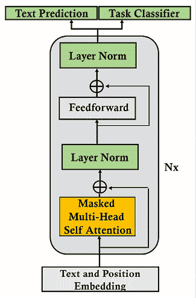
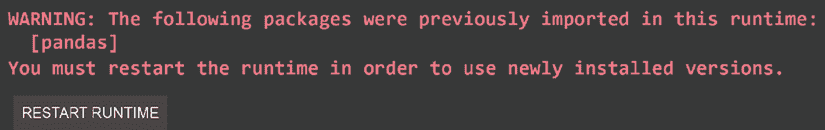
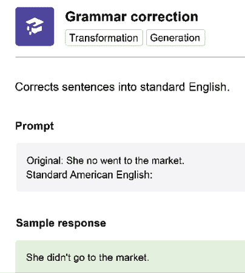
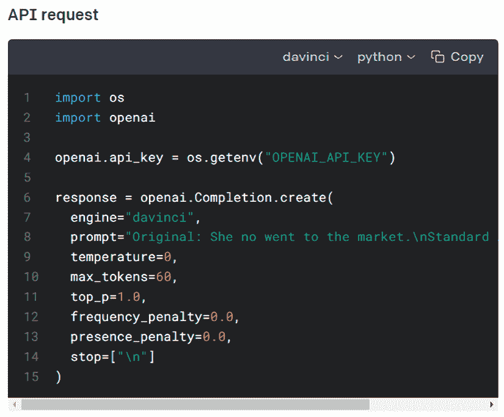

# 7

# 超人类变压器与 GPT-3 引擎的崛起

在 2020 年，*Brown* 等人（2020）描述了一个包含 1750 亿个参数的 OpenAI GPT-3 模型的训练，该模型使用了诸如从 Common Crawl 数据中提取的 4000 亿个字节对编码的令牌等庞大的数据集进行了学习。OpenAI 在一个拥有 285,000 个 CPU 和 10,000 个 GPU 的 Microsoft Azure 超级计算机上进行了训练。

OpenAI 的 GPT-3 引擎的机器智能和超级计算机使 *Brown* 等人（2020）进行了零次实验。这个想法是使用一个训练好的模型进行下游任务，而不需要进一步训练参数。目标是让一个训练好的模型直接进入多任务生产，使用甚至可以执行它没有经过训练的任务的 API。

超人类云 AI 引擎的时代已经到来。OpenAI 的 API 不需要高级软件技能或 AI 知识。你可能想知道为什么我使用了“超人类”这个词。你会发现，在许多情况下，GPT-3 引擎可以执行许多任务，就像人类一样。目前，*理解 GPT 模型是如何构建和运行的是至关重要的*。

本章将首先研究变压器模型的架构和规模的演变。我们将探讨使用经过训练的变压器模型进行零次调优的挑战，对模型的参数进行几乎没有或没有任何调优的下游任务。我们将探讨 GPT 变压器模型的创新架构。OpenAI 提供了他们模型的特别训练版本，称为引擎。

我们将使用 OpenAI 仓库中的 TensorFlow 中的 345M 参数的 GPT-2 变压器。我们必须亲自动手去理解 GPT 模型。我们将与模型进行交互，以生成通用调节句子的文本补全。

我们将继续使用一个 117M 参数的定制 GPT-2 模型。我们将对我们在*第四章*，*从零开始预训练 RoBERTa 模型*中使用的高级概念 `Kant` 数据集进行标记化。

该章节将探讨使用一个不需要数据科学家、人工专家甚至是经验丰富的开发人员就可以*开始使用*的 GPT-3 引擎。然而，这并不意味着在今后不会需要数据科学家或人工智能专家。

我们将看到 GPT-3 引擎有时确实需要微调。我们将运行一个 Google Colab 笔记本来微调一个 GPT-3 Ada 引擎。

该章节将以工业 4.0 AI 专家的新思维方式和技能集结束。

在本章结束时，你将了解到一个 GPT 模型是如何构建的，以及如何使用无缝的 GPT-3 API。你将理解到在 2020 年代，一个工业 4.0 的 AI 专家可以完成令人满意的任务！

本章涵盖以下主题：

+   开始使用 GPT-3 模型

+   OpenAI GPT 模型的架构

+   定义零次训练的变压器模型

+   从少次到一次的路径

+   构建一个接近人类的 GPT-2 文本补全模型

+   实现一个 345M 参数的模型并运行它

+   与一个标准模型交互使用 GPT-2

+   训练一个具有 117M 参数模型的语言建模 GPT-2

+   导入一个定制的特定数据集

+   对一个定制数据集进行编码

+   对模型进行条件调节

+   条件转换一个 GPT-2 模型以执行特定的文本完成任务

+   对一个 GPT-3 模型进行微调

+   工业 4.0 人工智能专家的角色

让我们通过探索 GPT-3 转换器模型开始我们的旅程。

# 使用 GPT-3 转换器模型进行超人类 NLP

GPT-3 建立在 GPT-2 架构之上。然而，一个完全训练的 GPT-3 转换器是一个基础模型。基础模型可以执行许多它没有训练过的任务。GPT-3 完成应用于所有 NLP 任务甚至编程任务。

GPT-3 是少数几个符合基础模型资格的完全训练的转换器模型之一。GPT-3 毫无疑问将产生更强大的 OpenAI 模型。Google 将为其在超级计算机上训练的 Google BERT 版本之外的基础模型提供更多。基础模型代表了对人工智能的一种新思考方式。

公司很快就会意识到，他们不需要数据科学家或人工智能专家才能开始一个具有像 OpenAI 提供的 API 那样的 NLP 项目。

为什么还要麻烦使用任何其他工具？拥有访问世界上最强大的超级计算机之一上训练过的最有效的转换器模型之一的 OpenAI API。

如果存在只有深腰包和世界上最好的研究团队才能设计的 API，比如 Google 或 OpenAI，为什么要开发工具、下载库或使用任何其他工具？

对于这些问题的答案非常简单。启动 GPT-3 引擎就像启动一辆一级方程式赛车或印第 500 赛车一样简单。没问题。但是，要驾驶这样的车几乎是不可能的，如果没有几个月的培训！GPT-3 引擎是强大的人工智能赛车。你可以通过几次点击让它们运行。然而，要掌握它们令人难以置信的动力需要你从本书的开始到现在所学到的知识，以及你将在接下来的章节中发现的东西！

我们首先需要了解 GPT 模型的架构，以了解开发者、人工智能专家和数据科学家在超人类 NLP 模型时代的定位。

# OpenAI GPT 转换器模型的架构

在 2017 年底至 2020 年初的不到三年时间里，转换器模型从训练、微调，最终到零冲击模型。零冲击 GPT-3 转换器模型不需要微调。训练的模型参数不会为下游多任务更新，这为 NLP/NLU 任务开启了一个新时代。

在本部分中，我们将首先了解设计 GPT 模型的 OpenAI 团队的动机。我们将从零冲击模型的微调开始。然后我们将看到如何使一个转换器模型调节以生成令人惊叹的文本完成。最后，我们将探索 GPT 模型的架构。

我们首先将了解 OpenAI 团队的创建过程。

## 十亿参数变压器模型的崛起

变压器从用于自然语言处理任务的小型模型迅速发展到几乎不需要微调的模型的速度令人震惊。

*瓦斯瓦尼*等人（2017 年）介绍了变压器，它在 BLEU 任务中超越了 CNN 和 RNN。 *拉德福德*等人（2018 年）引入了**生成式预训练**（**GPT**）模型，可以通过微调执行下游任务。 *德夫林*等人（2019 年）通过 BERT 模型完善了微调。 *拉德福德*等人（2019 年）进一步推出了 GPT-2 模型。

*布朗*等人（2020 年）定义了一个 GPT-3 零-shot 方法来处理变压器，不需要微调！

同时，*王*等人（2019 年）创建了 GLUE 来评估自然语言处理模型。但是变压器模型发展如此迅速，以至于超过了人类基线！

*王*等人（2019 年，2020 年）迅速创建了 SuperGLUE，将人类基线设定得更高，并使得 NLU/NLP 任务更具挑战性。变压器发展迅速，一些模型在写作时已经超越了 SuperGLUE 排行榜上的人类基线。

这是如何如此迅速地发生的？

我们将研究一个方面，即模型的大小，以了解这种演变是如何发生的。

## 变压器模型尺寸的增加

仅在 2017 年至 2020 年，参数数量就从原始变压器模型的 65M 个增加到了 GPT-3 模型的 175B 个，如*表 7.1*所示：

| **变压器模型** | **论文** | **参数** |
| --- | --- | --- |
| 变压器基础 | *瓦斯瓦尼*等人（2017 年） | 65M |
| 变压器大型 | *瓦斯瓦尼*等人（2017 年） | 213M |
| BERT-Base | *德夫林*等人（2019 年） | 110M |
| BERT-Large | *德夫林*等人（2019 年） | 340M |
| GPT-2 | *拉德福德*等人（2019 年） | 117M |
| GPT-2 | *拉德福德*等人（2019 年） | 345M |
| GPT-2 | *拉德福德*等人（2019 年） | 1.5B |
| GPT-3 | *布朗*等人（2020 年） | 175B |

表 7.1：变压器参数数量的演变

*表 7.1*只包含了那个短时间内设计的主要模型。出版日期在实际设计模型的日期之后。此外，作者还更新了论文。例如，一旦原始变压器启动了市场，谷歌 Brain、OpenAI 和 Facebook AI 等机构都推出了新模型。

此外，一些 GPT-2 模型比较较小的 GPT-3 模型还要大。例如，GPT-3 Small 模型包含 125M 个参数，比 345M 参数的 GPT-2 模型小。

架构大小同时也在演变：

+   一个模型的层数从原始变压器模型的 6 层增加到了 GPT-3 模型的 96 层

+   一个层的头数从原始变压器模型的 8 个增加到了 GPT-3 模型的 96 个

+   原始变压器模型的上下文大小从 512 个令牌增加到了 GPT-3 模型的 12,288 个令牌

模型架构的规模解释了为什么具有 96 层的 GPT-3 175B 模型比只有 40 层的 GPT-2 1,542M 模型产生了更令人印象深刻的结果。这两种模型的参数可比拟，但层数倍增了。

让我们关注一下上下文大小，以了解 transformer 的快速演变的另一个方面。

### 上下文大小和最大路径长度

transformer 模型的基础在于注意力子层。而注意力子层的关键属性则是处理上下文大小的方法。

上下文大小是人类和机器学习语言的主要方式之一。上下文大小越大，我们就能越好地理解呈现给我们的序列。

然而，上下文大小的缺点是理解一个词所指内容所需的距离。分析长期依赖性所需的路径需要从循环转换为注意力层。

以下句子需要经过很长的路径才能找到“它”所指的内容：

“我们的*房子*太小了，无法容纳一张大沙发，一张大桌子和我们想在如此小的空间中放置的其他家具。我们考虑过留下一段时间，但最终决定把*它*卖掉。”

如果要解释“它”的意思，只有在回到句子开头的“房子”一词时才能理解。这对于机器来说是一段相当长的路径！

定义最大路径长度的函数顺序如 Big *O* 表 7.2 中所示：

| **层类型** | **最大路径长度** | **上下文大小** |
| --- | --- | --- |
| 自注意力 | 0(1) | 1 |
| 循环 | 0(n) | 100 |

表 7.2：最大路径长度

*Vaswani* 等人（2017）对原始 Transformer 模型中的上下文分析设计进行了优化。自注意力将操作缩减为一对一的标记操作。所有层都相同，这使得扩大 transformer 模型的规模变得更加容易。具有 100 个上下文窗口大小的 GPT-3 模型具有与大小为 10 的上下文窗口大小相同的最大长度路径。

例如，RNN 中的一个循环层必须逐步存储整个上下文的长度。最大路径长度就是上下文大小。处理 GPT-3 模型的上下文大小的 RNN 的最大长度大小将是 0(n) 倍长。此外，RNN 无法将上下文分割成 96 个在并行化机器架构上运行的头，例如将操作分布在 96 个 GPU 上。

transformer 的灵活和优化的架构对其他几个因素产生了影响：

+   *Vaswani* 等人（2017）训练了一个包含 36M 个句子的最新 transformer 模型。*Brown* 等人（2020）则从 Common Crawl 数据中提取了 4000 亿字节对编码的标记来训练 GPT-3 模型。

+   训练大型 transformer 模型需要世界上一小部分团队才拥有的计算机实力。*Brown* 等人（2020）训练 GPT-3 175B 需要总共 2.14*10²³ FLOPS。

+   设计转换器的架构需要高素质的团队，这些团队只能由世界上少数机构资助。

大小和架构将继续发展，可能在不久的将来增加到万亿参数模型。超级计算机将继续提供必要的资源来训练转换器。

我们现在将看到零-shot 模型是如何实现的。

## 从微调到零-shot 模型

从一开始，由*Radford*等人(2018 年)带领的 OpenAI 研究团队就希望把转换器从经过训练的模型转变为 GPT 模型。其目标是在未标记数据上训练转换器。让注意层从无监督数据中学习语言是一个聪明的举措。OpenAI 决定训练转换器学习语言，而不是教会它们执行特定的 NLP 任务。

OpenAI 希望创建一个任务无关的模型。因此，他们开始对原始数据进行转换器模型的训练，而不是依赖专家标记的数据。标记数据耗时，并且显著减慢了转换器的训练过程。

第一步是从一个转换器模型的无监督训练开始。然后，他们只会对模型进行监督学习的微调。

OpenAI 选择了在“叠加解码层”部分描述的只解码转换器。结果的度量是令人信服的，并很快达到了同行 NLP 研究实验室最佳 NLP 模型水平。

第一个版本的 GPT 转换器模型的有希望的结果很快就促使*Radford*等人(2019 年)提出了零-shot 转移模型。他们的核心哲学是继续训练 GPT 模型从原始文本中学习。然后，他们进一步深入研究，聚焦于通过无监督分布的语言建模示例：

示例=(*x*[1], *x*[2], *x*[3], ,*x*[n])

示例由符号序列组成：

序列=(*s*[1], *s*[2], *s*[3], ,*s*[n])

这导致了一个可以表示为任何类型输入的概率分布的元模型：

*p* (*输出*/*输入*)

目标是一旦训练的 GPT 模型通过深入训练理解了语言，就将这个概念推广到任何类型的下游任务。

GPT 模型从 117M 参数迅速发展到 345M 参数，然后到其他大小，然后到 1,542M 参数。10 亿+参数的转换器诞生了。微调量急剧减少。结果再次达到了最先进的指标。

这鼓励 OpenAI 更进一步，更远。*Brown*等人(2020 年)假设有条件概率转换器模型可以进行深度训练，并且能够在几乎不进行进一步微调的情况下产生出色的结果：

*p* (*输出*/*多任务*)

OpenAI 正在实现其目标，即训练模型，然后直接运行下游任务，而无需进一步微调。这一巨大的进步可以分为四个阶段：

+   **微调**（**FT**）是指按照我们在之前章节探讨过的方式进行。一个变压器模型被训练，然后在下游任务上进行微调。*Radford*等人（2018 年）设计了许多微调任务。然后，OpenAI 团队在接下来的步骤中逐渐将任务数减少到`0`。

+   **少样本**（**FS**）代表了一个巨大的进步。GPT 已经训练好了。当模型需要进行推理时，它会以任务的演示为条件。条件替代了权重更新，GPT 团队在过程中排除了这一步骤。我们将通过我们在本章中将要进行的笔记本中提供的上下文来对我们的模型进行条件设定，以获得文本完成。

+   **单样本**（**1S**）将进程推至更远。训练后的 GPT 模型仅需要一个下游任务的演示来表现。同时也不允许进行权重更新。

+   **零样本**（**ZS**）是最终目标。训练后的 GPT 模型在没有演示所需下游任务的情况下进行表现。

这些方法各自具有不同的效率水平。OpenAI GPT 团队已经努力开发出这些最先进的变压器模型。

现在我们可以解释导致 GPT 模型架构的动机：

+   教授变压器模型如何通过广泛的培训学习语言。

+   通过上下文条件对语言建模进行重点关注。

+   变压器以一种新颖的方式接受上下文并生成文本完成。它不会浪费资源学习下游任务，而是致力于理解输入并进行推理，无论任务是什么。

+   找到训练模型的高效方法，通过掩盖输入序列的部分来迫使变压器以机器智能的方式进行思考。因此，尽管不是人类，但机器智能是高效的。

我们了解到了导致 GPT 模型架构的动机。现在让我们来看看仅解码器层的 GPT 模型。

## 堆叠解码器层

现在我们明白了 OpenAI 团队专注于语言建模。因此，保留掩盖注意力子层是有意义的。因此，选择保留解码器堆叠并排除编码器堆叠的选择。*Brown*等人（2020 年）显著增加了仅解码器变压器模型的规模，取得了出色的结果。

GPT 模型的结构与*Vaswani*等人（2017 年）设计的原始变压器的解码器堆栈相同。我们在*第二章*中描述了解码器的堆栈，*开始使用变压器模型的架构*。如果需要的话，请花几分钟回顾一下原始变压器的架构。

GPT 模型具有仅解码器的架构，如*图 7.1*所示：



图 7.1：GPT 仅解码器架构

我们可以识别文本和位置嵌入子层、蒙版多头自注意层、规范化子层、前馈子层和输出。此外，还有一种同时进行文本预测和任务分类的 GPT-2 版本。

OpenAI 团队通过模型定制和调整了解码模型。*Radford* 等人（2019）给出了至少四种 GPT 模型，*Brown* 等人（2020）描述了至少八种模型。

GPT-3 175B 模型已经达到了很少团队可以访问的独特规模，需要大量的计算资源：

*n*[参数] = 175.0B，*n*[层数] = 96，*d*[模型] = 12288，*n*[头] = 96

让我们看看越来越多的 GPT-3 引擎。

## GPT-3 引擎

GPT-3 模型可以被训练来完成不同规模的特定任务。目前 OpenAI 记录了可用的引擎列表：[`beta.openai.com/docs/engines`](https://beta.openai.com/docs/engines)

基本系列的引擎具有不同的功能 - 例如：

+   达芬奇引擎能够分析复杂意图

+   居里引擎速度快，具有很好的摘要能力

+   巴比奇引擎擅长语义检索

+   阿达引擎擅长解析文本

OpenAI 正在生产更多的引擎投放市场：

+   Instruct 系列根据描述提供指令。此章节的 *更多 GPT-3 示例* 中有一个例子可供参考。

+   Codex 系列可以将语言翻译成代码。我们将在 *第十六章* *Transformer 驱动合作伙伴的出现* 中探索这个系列。

+   内容过滤系列可以过滤不安全或敏感的文本。我们将在 *第十六章* *Transformer 驱动合作伙伴的出现* 中探索这个系列。

我们已经探索了从微调到零样本 GPT-3 模型的过程。我们已经看到 GPT-3 可以生成各种引擎。

现在是时候看看 GPT 模型的源代码是如何构建的。尽管目前 GPT-3 变压器模型的源代码并不公开，但 GPT-2 模型已经足够强大，可以理解 GPT 模型的内部工作原理。

我们已经准备好与 GPT-2 模型进行交互和训练。

我们首先将使用训练好的 GPT-2 345M 模型进行文本完成，它包括 24 个解码层和 16 个自注意子层的自注意。

然后，我们将对 12 个解码层和 12 个自注意层的 GPT-2 117M 模型进行定制文本完成训练。

让我们首先与一个预训练的 345M 参数 GPT-2 模型进行交互。

# 使用 GPT-2 进行通用文本完成

我们将从上到下探讨使用 GPT-2 通用模型的例子。*我们要运行的例子的目标是确定 GPT 模型能达到的抽象推理水平*。

本节描述了与 GPT-2 模型进行文本完成的交互。我们将重点关注 *OpenAI_GPT_2.ipynb* 中详细描述的 *附录 III* 中的 *使用 GPT-2 进行通用文本完成的第 9 步*。

你可以先阅读本节，看看通用预训练的 GPT-2 模型对特定示例的反应如何。然后阅读 *附录 III*，*使用 GPT-2 进行通用文本补全*，以深入了解通用 GPT-2 模型如何在 Google Colab 笔记本中实现。

你也可以直接阅读 *附录 III*，其中包含下面描述的 *Step 9* 的交互。

首先，让我们了解应用预训练 GPT-2 的具体示例。

## 第 9 步：与 GPT-2 交互

在本节中，我们将与 GPT-2 345M 模型进行交互。

要与模型交互，请运行 `interact_model` 单元格：

```py
#@title Step 9: Interacting with GPT-2
interact_model('345M',None,1,1,300,1,0,'/content/gpt-2/models') 
```

你将被提示输入一些上下文：


图 7.2：文本补全的上下文输入

你可以尝试任何类型的上下文，因为这是一个标准的 GPT-2 模型。

我们可以尝试一句由康德写的句子：

```py
Human reason, in one sphere of its cognition, is called upon to
consider questions, which it cannot decline, as they are presented by
its own nature, but which it cannot answer, as they transcend every
faculty of the mind. 
```

按下 *Enter* 生成文本。由于 GPT-2 模型未在我们的数据集上进行训练，并且我们无论如何都在运行随机模型，因此输出将相对随机。

让我们看看我运行时 GPT 模型生成的前几行：

```py
"We may grant to this conception the peculiarity that it is the only causal logic. 
In the second law of logic as in the third, experience is measured at its end: apprehension is afterwards closed in consciousness.
The solution of scholastic perplexities, whether moral or religious, is not only impossible, but your own existence is blasphemous." 
```

要停止单元格，请双击单元格的运行按钮。

你还可以按下 *Ctrl* + *M* 停止生成文本，但这可能会将代码转换为文本，你将不得不将其复制回程序单元格。

输出丰富。我们可以观察到几个事实：

+   我们输入的上下文 *条件了* 模型生成的输出。

+   上下文是模型的演示。它从上下文中学习要说什么，而不修改其参数。

+   文本补全受上下文条件限制。这为不需要微调的转换器模型打开了大门。

+   从语义角度来看，输出可能更有趣。

+   从语法角度来看，输出是令人信服的。

我们能做得更好吗？下一节介绍了自定义文本补全的交互。

# 训练自定义 GPT-2 语言模型

在本节中，我们将继续采用自上而下的方法，探讨一个在特定数据集上训练的 GPT-2 自定义模型的示例。*目标仍然是确定 GPT 模型可以达到的抽象推理水平*。

本节描述了与特定数据集训练的 GPT-2 模型进行文本补全的交互。我们将重点放在详细描述在 *附录 IV* 中的 *Training_OpenAI_GPT_2.ipynb* 笔记本中的 *Step 12*，即 *自定义文本补全与 GPT-2*。

你可以先阅读本节，看看带有自定义 GPT-2 模型的示例将如何改进响应。然后阅读 *附录 IV*，*自定义文本补全与 GPT-2*，以了解如何训练 GPT-2 来获得特定的响应。

你也可以决定直接阅读 *附录 IV*，其中也包含下面描述的 *Step 12* 的交互。

首先，让我们了解通过训练 GPT-2 改进的交互方式。

## 第 12 步：交互式上下文和补全示例

现在我们将运行一个有条件的样本。我们输入的上下文将导致模型按照我们想要的方式思考，通过生成定制的段落来完成文本。

运行单元格并探索魔法：

```py
#@title Step 12: Interactive Context and Completion Examples
import os # import after runtime is restarted
os.chdir("/content/gpt-2/src")
!python interactive_conditional_samples.py --temperature 0.8 --top_k 40 --model_name '117M' 
```

如果需要，可以花几分钟回到*附录 III*的*第 9 步*，*与 GPT-2 交互*，以查看响应的差异。该程序提示我们输入上下文：


图 7.3：文本补全的上下文输入

让我们输入与易卢泊儿·康德所写的相同段落，就像我们在本章的*通用* *GPT-2 的文本补全*部分的*第 9 步*中所做的那样：

```py
Human reason, in one sphere of its cognition, is called upon to
consider questions, which it cannot decline, as they are presented by
its own nature, but which it cannot answer, as they transcend every
faculty of the mind. 
```

按*Enter*生成文本，就像我们之前所做的那样。尽管结构化和逻辑，但输出可能会因为每次运行而有所不同，这使得变压器很有吸引力。这一次，结果并不是随机的，而是令人印象深刻的。

让我们来看看 GPT-2 模型生成的前几行：

```py
"Now, what is the nature of the reason, except that it is of a kind and power of mind that is so called on to think, and to understand?
The reason is the thing which apprehends, and seeks to understand, the objects of its minds, which apprehend and apprehend the things of itself. No one can speak of this reason without the understanding and the understanding of the human reason. But that knowledge and understanding which is the most natural of all the faculties, which, because it is understood by the human reason, is the most natural of all the faculties, is not without reason, but only without understanding. The human reason, who sees and knows the things which the natural sense, which, though in the natural sense, does not understand, is the source of every other knowledge which we understand. The reason is the thing which does not understand, but understands the things which we comprehend, and therefore, is not to be understood. I mean that the reason is the thing which does not understand, but knows only the things which we do understand…." 
```

要停止运行单元格，请双击单元格的运行按钮或按下*Ctrl* + *M*。

哇！我怀疑有人能看出我们训练过的 GPT-2 模型生成的文本补全和人类的区别。它也可能在每次运行时生成不同的输出。

实际上，我认为我们的模型在哲学、推理和逻辑的抽象练习中，可能会超越许多人类！

我们可以从我们的实验中得出一些结论：

+   经过良好训练的变压器模型能以人类水平产生文本补全

+   在复杂和抽象推理中，GPT-2 模型几乎可以达到人类水平的文本生成能力

+   文本背景是通过演示预期结果的一种有效的方式来给模型制定条件

+   文本补全是基于文本条件的文本生成，如果提供了上下文的句子。

您可以输入条件文本背景示例来尝试文本补全。您还可以使用自己的数据来训练模型。只需用自己的数据替换`dset.txt`文件的内容，看看会发生什么！

请记住我们训练过的 GPT-2 模型会像人类一样反应。如果您输入一个简短、不完整、无趣或棘手的上下文，您将得到困惑或糟糕的结果。这是因为 GPT-2 希望我们做到最好，正如现实生活中一样！

让我们去 GPT-3 playground 看看训练过的 GPT-3 对使用 GPT-2 测试的示例做出何种反应。

# 运行 OpenAI GPT-3 任务

在本节中，我们将以两种不同的方式运行 GPT-3：

+   我们将首先在线运行 GPT-3 任务而不需要任何代码

+   然后我们将在 Google Colab 笔记本中实现 GPT-3

在本书中我们将使用 GPT-3 引擎。当您注册 GPT-3 API 时，OpenAI 会提供您一个免费的预算来开始使用。这个免费预算应该足以覆盖这本书中示例的大部分成本，如果不是全部。

让我们从在线运行 NLP 任务开始。

## 在线运行 NLP 任务

我们现在将不使用 API 直接向 GPT-3 提出要求，让我们来看看一些工业 4.0 的例子。

让我们定义一种提示和回应的标准结构，如下:

+   *N* = NLP 任务的名称（输入）。

+   *E* = GPT-3 引擎的解释。*E* 在 *T* 之前（输入）。

+   *T* = 我们希望 GPT-3 查看的文本或内容（输入）。

+   *S* = 显示给 GPT-3 期望的内容。*S* 在必要时跟随 *T* 并添加（输入）。

+   *R* = GPT-3 的回应（输出）。

上述提示的结构是一个指南。然而，GPT-3 非常灵活，有许多变体可行。

我们现在准备在线运行一些教育示例，无需 API：

+   现有知识的问题与答案（**Q&A**）：

    *E* = `Q`

    *T* = `1965 年美国总统是谁？`

    *S* = 无

    *R* = `A`

    提示和回答：

    `Q: 1965 年美国总统是谁？`

    `A: 1965 年林登·约翰逊是美国总统。`

    `Q: 谁是第一个登上月球的人类？`

    `A: 尼尔·阿姆斯特朗是第一个登上月球的人类。`

+   **电影到表情符号**：

    *E* = 一些电影标题的示例

    *T* = 无

    *S* = 通过例子隐含

    *R* = 一些表情符号的示例

    提示和回答：

    

    新的提示和回答：

    

+   给二年级学生总结（**给二年级学生总结**）：

    *E* = `我的二年级孩子问我这段话是什么意思：`

    *T* = `"""初始结论……。"""`

    *S* = `我用通俗易懂的语言给他解释了一下："""`

    *R* = 摘要

    提示和回答：

    `我的二年级孩子问我这段话是什么意思：`

    `"""初始结论可以分为两类：事实和虚构。事实是 OpenAI 拥有世界上最强大的自然语言处理服务之一。主要事实是：OpenAI 引擎是强大的零-shot，无需寻找各种变压器模型，无需预训练和微调。用于训练模型的超级计算机是独一无二的。如果提示设计得当，我们会得到令人惊讶的准确响应。在本节中实施 NLP 任务需要执行复制粘贴操作，任何软件初学者都可以执行。虚构从反乌托邦和炒作的断言开始，AI 将取代数据科学家和 AI 专家。这是真的吗？在回答这个问题之前，首先问问自己关于我们刚刚运行的示例的以下问题：我们如何知道句子起初是错误的？如果没有我们人类读取和确认，我们如何知道答案是正确的？引擎是如何知道这是一个语法校正任务的？如果响应不正确，我们如何理解发生了什么以帮助改进提示或在设计良好的人机界面中恢复手动模式？事实是人类将需要手动干预来回答这些问题，使用基于规则的方法、质量控制自动流水线以及许多其他工具。事实是令人信服的。运行 NLP 任务确实需要很少的开发。虚构不令人信服。人类仍然是必需的。OpenAI 引擎并不是为了取代人类，而是为了帮助他们执行更多高水平的令人满足的任务。现在你可以驾驶喷气机而不必自己建造它！"""`

    `我为他重新表述了一下，用小学二年级孩子都能理解的简单语言："""`

    `OpenAI 的第一个结论是，它拥有世界上最强大的自然语言处理服务之一。最重要的事实是：OpenAI 引擎非常强大，零-shot，无需寻找各种变压器模型，无需预训练和微调。用于训练模型的超级计算机是独一无二的。如果提示设计得当，我们会得到令人惊讶的准确响应。`

结果令人印象深刻，是自然语言处理历史上的一大进步。

我们可以使用由 OpenAI 提供的零-shot GPT-3 引擎实现的 NLP 任务的数量是无穷无尽的，因为我们控制着如何展示我们对变压器模型的期望。

然而，真正的行业 4.0 人工智能专家必须在使用即用型 API 之前先动手。我们现在将探索 OpenAI GPT 模型的架构，然后构建 GPT-2 模型，看看这些引擎是如何工作的。

我们对 GPT 模型了解得越多，行业 4.0 的自然语言处理专家就越能将它们应用到现实项目中。

让我们继续我们的自上而下的方法，深入研究 OpenAI GPT 变压器模型的架构。

## 使用 GPT-3 引擎入门

OpenAI 拥有世界上一些最强大的变压器引擎。一个 GPT-3 模型可以执行数百个任务。GPT-3 可以完成许多它没有接受训练的任务。

本节将在`Getting_Started_GPT_3.ipynb`中使用 API。

要使用 GPT-3，您必须首先转到 OpenAI 的网站[`openai.com/`](https://openai.com/)并注册。

OpenAI 为每个人提供了一个试验场，就像 Google 翻译或任何用户友好型在线服务一样。因此，让我们尝试一些任务。

### 运行我们的第一个 NLP 任务与 GPT-3

让我们从几个步骤开始使用 GPT-3。

转到 Google Colab 并打开 GitHub 上书籍的章节目录`Getting_Started_GPT_3.ipynb`。

您无需更改笔记本的设置。我们正在使用一个 API，因此在本节中不需要太多的本地计算能力。

本节的步骤与笔记本中的步骤相同。

运行 NLP 分为三个简单的步骤：

#### 步骤 1：安装 OpenAI

使用以下命令安装`openai`：

```py
try:
  import openai
except:
  !pip install openai
  import openai 
```

如果未安装`openai`，则必须重新启动运行时。当需要这样做时，会显示一条消息，如下所示：



重新启动运行时，然后再次运行此单元格，以确保已导入`openai`。

#### 步骤 2：输入 API 密钥

提供了一个可以在 Python、C#、Java 和许多其他选项中使用的 API 密钥。在本节中，我们将使用 Python：

```py
openai.api_key=[YOUR API KEY] 
```

您现在可以使用您的 API 密钥更新下一个单元格：

```py
import os
import openai
os.environ['OPENAI_API_KEY'] ='[YOUR_KEY or KEY variable]'
print(os.getenv('OPENAI_API_KEY'))
openai.api_key = os.getenv("OPENAI_API_KEY") 
```

现在让我们运行一个 NLP 任务。

#### 步骤 3：使用默认参数运行 NLP 任务

我们复制并粘贴了一个 OpenAI 的**语法校正**任务示例：

```py
response = openai.Completion.create(
 engine="davinci",
 prompt="Original: She no went to the market.\nStandard American English:",
  temperature=0,
  max_tokens=60,
  top_p=1.0,
  frequency_penalty=0.0,
  presence_penalty=0.0,
  stop=["\n"]
) 
```

任务是纠正这个语法错误：`She no went to the market`。

我们可以通过解析来按需处理响应。OpenAI 的响应是一个字典对象。OpenAI 对象包含了有关任务的详细信息。我们可以要求该对象显示：

```py
#displaying the response object
print(response) 
```

我们可以探索对象：

```py
{
  "choices": [
    {
      "finish_reason": "stop",
      "index": 0,
      "logprobs": null,
      "text": " She didn't go to the market."
    }
  ],
  "created": 1639424815,
  "id": "cmpl-4ElZfXLl9jGRNQoojWRRGof8AKr4y",
  "model": "davinci:2020-05-03",
  "object": "text_completion"} 
```

“创建”的编号和“id”，以及“model”名称在每次运行时都可能会有所不同。

然后，我们可以要求对象字典显示“`text`”，并打印处理后的输出：

```py
#displaying the response object
r = (response["choices"][0])
print(r["text"]) 
```

字典中的“`text`”的输出是语法正确的句子：

```py
She didn't go to the market. 
```

### NLP 任务和示例

现在我们将介绍一种工业化的 GPT-3 引擎使用方法。例如，OpenAI 提供了一个交互式教育界面，不需要 API。因此，一个学校教师、顾问、语言学家、哲学家或任何希望将 GPT-3 引擎用于教育目的的人都可以这样做，而且完全不需要 AI 方面的经验。

我们首先将在笔记本中使用 API。

#### 语法校正

如果我们回到`Getting_Started_GPT_3.ipynb`，我们可以在本章的*开始使用 GPT-3 引擎*部分开始探索的内容中，用不同的提示语试验语法校正。

打开笔记本，转到*步骤 4：示例 1：语法校正*：

```py
#Step 6: Running an NLP task with custom parameters
response = openai.Completion.create(
  #defult engine: davinci
  engine="davinci",
  #default prompt for task:"Original"
  prompt="Original: She no went to the market.\n Standard American English:",
  temperature=0, 
  max_tokens=60,
  top_p=1.0,
  frequency_penalty=0.0,
  presence_penalty=0.0,
  stop=["\n"]
) 
```

请求体不限于提示。请求体包含几个关键参数：

+   `engine="davinci"`。选择要使用的 OpenAI GPT-3 引擎，以及将来可能的其他模型。

+   `temperature=0`。像`0.9`这样的较高值会促使模型更冒险。不要同时修改 temperature 和`top_p`。

+   `max_tokens=60`。响应的最大 token 数。

+   `top_p=1.0`。另一种控制抽样的方法，类似于`temperature`。在这种情况下，`top_p`的百分比的 token 概率质量将被考虑。`0.2`会使系统仅考虑 20%的最高概率质量。

+   `frequency_penalty=0.0`。值介于`0`和`1`之间，限制了给定响应中 token 的频率。

+   `presence_penalty=0.0`。值介于`0`和`1`之间，强制系统使用新 token 并产生新想法。

+   `stop=["\n"]`。向模型发出停止生成新 token 的信号。

这些参数中的一些在*附录 III*，*使用 GPT-2 进行通用文本完成*中的*步骤 7b-8：导入和定义模型*部分以源代码级别进行描述。

如果你获得访问权限，你可以在 GPT-3 模型中或在*附录 III*，*使用 GPT-2 进行通用文本完成*中的 GPT-2 模型中玩弄这些参数。在这两种情况下概念是相同的。

本节将专注于提示：

```py
`prompt="Original: She no went to the market.\n Standard American English:"` 
```

提示可以分为三个部分：

+   `原始：`这表明模型接下来将处理的是原始文本，模型将对其进行某种处理

+   `她没去市场。\n`：提示的这部分向模型表明这是原始文本

+   `标准美式英语`：这向模型显示了期望的任务是什么

让我们看看通过改变任务我们能达到什么程度：

+   标准美式英语产生：

    `prompt="原始：她没去市场。\n 标准美式英语："`

    响应中的文本是：

    `"text": " 她没去市场。"`

    那很好，但如果我们不想要句子中的缩写呢？

+   不带缩写的英语产生：

    `prompt="原始：她没去市场。\n 不带缩写的英语："`

    响应中的文本是：

    `"text": " 她没有去市场。"`

    哇！这很令人印象深刻。让我们尝试另一种语言。

+   没有缩写的法语产生：

    `"text": " 她没有去市场。"`

    这很令人印象深刻。`\u00e9`只需进行后处理成`é`。

还有更多选项可供选择。您的工业 4.0 跨学科想象力是极限！

#### 更多的 GPT-3 示例

OpenAI 包含许多示例。OpenAI 提供了一个在线平台来探索任务。OpenAI 还为每个示例提供了源代码：[`beta.openai.com/examples`](https://beta.openai.com/examples)

点击一个示例，比如我们在*语法纠错*部分探讨过的语法示例：


图 7.4：OpenAI 的语法纠错部分

OpenAI 将为每个任务描述提示和样本响应。



图 7.5：样本响应纠正了提示

你可以选择去游乐场在线运行，就像我们在本章的 *在线运行 NLP 任务* 部分中所做的那样。要这样做，请单击 **在游乐场中打开** 按钮：


图 7.6：游乐场按钮中的 Open

你可以选择复制并粘贴代码来运行 API，就像我们在本章的 Google Colab 笔记本中所做的那样：



图 7.7：使用 Davinci 引擎运行代码

`Getting_Started_GPT_3.ipynb` 包含了十个示例，你可以运行以练习实现 OpenAI GPT-3。

对于每个示例：

+   首先，你可以阅读由 OpenAI 提供的解释链接。每个单元格上方都提供了文档链接。

+   你可以运行单元格以观察 GPT-3 的行为。

在笔记本中运行这十个示例：

+   示例 1：语法纠正

+   示例 2：英语到法语的翻译

+   示例 3：提供说明的系列

+   示例 4：电影到表情符号

+   示例 5：将编程语言转换为另一种语言。例如，从 Python 到 JavaScript。警告：你可能需要获得 OpenAI 的特别许可才能运行这个示例，该示例使用了 Davinci Codex 引擎，即代码生成器。如果此示例在你的笔记本中无法运行，请联系 OpenAI 请求 Codex 的访问权限。

+   示例 6：高级推文分类器

+   示例 7：问答

+   示例 8：总结一段文本

+   示例 9：解析非结构化数据

+   示例 10：计算时间复杂度

你可以在示例页面上运行许多其他任务：[`beta.openai.com/examples`](https://beta.openai.com/examples)

现在让我们比较一下 GPT-2 和 GPT-3 的输出。

# 比较 GPT-2 和 GPT-3 的输出

在我们继续之前，我们的好奇心必须得到满足。强大的 GPT-3 模型可以使用我们提交给预训练 GPT-2 模型的示例，然后使用我们自定义训练的 GPT-2 模型产生什么？

我们用于 GPT-2 模型的示例：

```py
`Human reason, in one sphere of its cognition, is called upon to consider questions, which it cannot decline, as they are presented by its own nature, but which it cannot answer, as they transcend every faculty of the mind.` 
`GPT-3's response:`
`What is meant by this is that there are some things in our experience that are beyond reason. It is not that reason is a bad guide or is insufficient, but that there are some things that are beyond its reach. An example of this would be the existence of God.` 
```

结果令人震惊！它解释了文本的含义，包括一些深刻的哲学思考！

我们在本章证明了我们的观点。Transformer 模型可以实现抽象推理，这有助于在我们飞速发展的世界中做出微决策。

OpenAI GPT-3 是一个完全训练好的模型。但是，GPT-3 可以进行微调。我们来看看如何进行微调。

# 对 GPT-3 进行微调

本节展示了如何对 GPT-3 进行微调以学习逻辑。Transformer 需要学习逻辑、推理和蕴含，以便以人类水平理解语言。

微调是使 GPT-3 成为你自己应用的关键，是将其定制为适应项目需求的钥匙。这是一个赋予你的应用 AI 自由的机会，以消除偏见，教它你想让它知道的东西，并在 AI 上留下你的足迹。

在本节中，将使用 `kantgpt.csv` 对 GPT-3 进行 Immanuel Kant 的作品进行训练。我们使用了类似的文件来训练第四章 *从头开始预训练 RoBERTa 模型* 中的 BERT 类型模型。

一旦掌握了对 GPT-3 进行微调的技巧，就可以使用其他类型的数据来教授它特定领域、知识图和文本。

OpenAI 提供了一个高效、文档完善的服务，可以对 GPT-3 引擎进行微调。它已经训练了 GPT-3 模型，使其成为不同类型的引擎，正如本章中*十亿参数变压器模型的崛起*部分所示。

Davinci 引擎功能强大，但使用起来可能更昂贵。Ada 引擎成本较低，并且产生的结果足以在我们的实验中探索 GPT-3。

GPT-3 的微调涉及两个阶段：

+   准备数据

+   对 GPT-3 模型进行微调

## 准备数据

在 GitHub 章节目录中在 Google Colab 中打开`Fine_Tuning_GPT_3.ipynb`。

OpenAI 详细记录了数据准备过程：

[`beta.openai.com/docs/guides/fine-tuning/prepare-training-data`](https://beta.openai.com/docs/guides/fine-tuning/prepare-training-data)

### 第 1 步：安装 OpenAI

*第 1 步* 是安装和导入`openai`：

```py
try:
  import openai
except:
  !pip install openai
  import openai 
```

一旦安装完成，请重新启动运行时，然后再次运行单元格，确保已执行`import openai`。

```py
import openai 
```

您也可以安装 wand 来可视化日志：

```py
try:
  import wandb
except:
  !pip install wandb
  import wandb 
```

现在我们将输入 API 密钥

### 第 2 步：输入 API 密钥

*第 2 步* 是输入您的密钥：

```py
openai.api_key="[YOUR_KEY]" 
```

### 第 3 步：激活 OpenAI 的数据准备模块

首先，加载您的文件。在此部分加载`kantgpt.csv`。现在，`kantgpt.csv`.是一个原始的非结构化文件。OpenAI 有一个内置数据清理器，会在每个步骤问问题。

OpenAI 检测到文件是 CSV 文件，将其转换为`JSONL`文件。`JSONL`包含纯结构化文本中的行。

OpenAI 跟踪我们批准的所有更改：

```py
Based on the analysis we will perform the following actions:
- [Necessary] Your format 'CSV' will be converted to 'JSONL'
- [Necessary] Remove 27750 rows with empty completions
- [Recommended] Remove 903 duplicate rows [Y/n]: y
- [Recommended] Add a suffix separator ' ->' to all prompts [Y/n]: y
- [Recommended] Remove prefix 'completion:' from all completions [Y/n]: y
- [Recommended] Add a suffix ending '\n' to all completions [Y/n]: y
- [Recommended] Add a whitespace character to the beginning of the completion [Y/n]: y 
```

OpenAI 将转换文件保存为`kantgpt_prepared.jsonl`。

我们已经准备好对 GPT-3 进行微调。

## GPT-3 的微调

您可以将笔记本分成两个独立的笔记本：一个用于数据准备，另一个用于微调。

### 第 4 步：创建一个操作系统环境

*微调* 过程中的*第 4 步* 为 API 密钥创建了一个`os`环境：

```py
import openai
import os
os.environ['OPENAI_API_KEY'] =[YOUR_KEY]
print(os.getenv('OPENAI_API_KEY')) 
```

### 第 5 步：微调 OpenAI 的 Ada 引擎

*第 5 步* 触发了使用数���准备后保存的 JSONL 文件来微调 OpenAI Ada 引擎：

```py
!openai api fine_tunes.create -t "kantgpt_prepared.jsonl" -m "ada" 
```

OpenAI 有很多请求。

如果您的流程中断，OpenAI 将指示如何继续微调。执行 fine_tunes.follow 指令：

```py
!openai api fine_tunes.follow -i [YOUR_FINE_TUNE] 
```

### 第 6 步：与微调模型互动

*第 6 步* 是与微调模型互动。提示是接近*伊曼纽尔·康德*可能会说的内容的序列：

```py
!openai api completions.create -m ada:[YOUR_MODEL INFO] "Several concepts are a priori such as" 
```

在您的微调任务结束时，OpenAI 经常显示运行完成任务与`[YOUR_MODEL INFO]`的指令。您可以复制并粘贴到一个单元格中（在命令行前加上`"!"`）或将您的`[YOUR_MODEL INFO]`插入到下一个单元格。

完成结果相当令人信服：

```py
Several concepts are a priori such as the term  freedom and the concept of _free will_.substance 
```

我们已经对 GPT-3 进行了微调，这显示了理解变压器和设计具有 API 的人工智能流程的重要性。让我们看看这如何改变 AI 专家的角色。

# Industry 4.0 人工智能专家的角色

简而言之，工业 4.0 开发人员的角色是成为跨学科 AI 专家。开发人员、数据科学家和 AI 专家将逐步学习有关语言学、业务目标、专业专业知识等更多领域。工业 4.0 AI 专家将引导团队具备实践的跨学科知识和经验。

在实施变压器时，人类专家在三个领域中是必不可少的：

+   **道德和伦理**

    一个工业 4.0 的 AI 专家确保在实施类似于人类的变压器时执行道德和伦理实践。例如，欧洲法规严格要求必要时向用户解释自动决策。美国有反歧视法律保护公民免受自动偏见影响。

+   **提示和响应**

    用户和 UI 开发人员将需要工业 4.0 AI 专家解释如何为 NLP 任务创建正确的提示，展示变压器模型如何执行任务，并验证响应。

+   **质量控制和理解模型**

    当模型即使调整超参数后仍不如预期时会发生什么？我们将在*第十四章*《解释黑匣子变压器模型》中更深入地探讨这类问题。

## 初步结论

初步结论可分为两类：事实和虚构。

一个事实是，OpenAI 拥有全球最强大的 NLP 服务之一。其他事实包括：

+   OpenAI 引擎是强大的零样本引擎，不需要寻找各种变压器模型，也不需要预训练和微调。

+   用于训练模型的超级计算机是独特的

+   如果提示设计良好，我们可以获得令人惊讶的准确答案

+   在本章中实施 NLP 任务只需要拷贝和粘贴操作，任何软件初学者都可以执行

许多人相信 AI 将取代数据科学家和 AI 专家。这是真的吗？在回答这个问题之前，首先问问自己关于本章运行的例子的以下问题：

+   我们如何知道一个句子是不正确的？

+   我们如何确定一个答案是正确的，而不需要我们人类阅读和确认？

+   引擎如何知道这是一个语法校对任务？

+   如果响应不正确，我们如何理解发生了什么，以帮助改进提示或在设计良好的人机界面中恢复手动模式？

实际情况是人类需要手动干预回答这些问题，通过规则基础、质量受控的自动流水线和许多其他工具。

事实令人信服。在许多情况下，使用变压器运行 NLP 任务只需要很少的开发。

人类仍然是必需的。OpenAI 引擎不是为了取代人类，而是帮助他们执行更多高水平令人满意的任务。现在你可以驾驶喷气式飞机而不必自己建造！

我们需要回答本节提出的激动人心的问题。所以让我们现在探索你在迈向 AI 未来的精彩工业 4.0 角色中的新奇旅程！

让我们总结本章并继续下一个探索！

# 摘要

在本章中，我们发现了超级计算机上训练数十亿参数的变压器模型的新时代。OpenAI 的 GPT 模型正在将 NLU 推动到大多数 NLP 开发团队的视野之外。

我们看到了 GPT-3 零-shot 模型如何通过 API 进行许多 NLP 任务，甚至可以直接在线进行而无需 API。Google 翻译的在线版本已经为 AI 的主流在线使用铺平了道路。

我们探索了 GPT 模型的设计，这些模型都是构建在原始变压器的解码器堆叠上的。掩码式注意力子层延续了从左到右训练的思想。然而，计算的绝对能力和随后的自注意力子层使其非常高效。

然后，我们使用 TensorFlow 实现了一个包含 345M 个参数的 GPT-2 模型。目标是与训练模型互动，看看我们能达到什么程度。我们看到所提供的上下文条件了输出。然而，当输入特定来自`Kant` 数据集的输入时，结果并没有达到预期的结果。

我们对一个包含 117M 个参数的定制数据集进行了训练的 GPT-2 模型。与这个相对较小的训练模型的交互产生了令人着迷的结果。

我们使用 OpenAI 的 API 在线运行了 NLP 任务，并对 GPT-3 模型进行了微调。本章展示了完全预训练的变压器及其引擎可以在很少有工程师的帮助下自动完成许多任务。

这是否意味着用户将不再需要 AI NLP 开发人员、数据科学家和 AI 专家？而是用户只需将任务定义和输入文本上传到云变压器模型中，然后下载结果？

不，一点也不意味着。工业 4.0 数据科学家和 AI 专家将演变为强大 AI 系统的领航员。他们的角色将越来越重要，以确保输入是合乎道德和安全的。这些现代化的 AI 飞行员还将了解变压器是如何构建的，并调整 AI 生态系统的超参数。

在下一章《将变压器应用于法律和金融文件进行 AI 文本摘要》中，我们将将变压器模型推到极限，作为多任务模型并探索新的领域。

# 问题

1.  一种零-shot 方法只需训练参数一次。（True/False）

1.  运行零-shot 模型时进行梯度更新。（True/False）

1.  GPT 模型只有一个解码器堆叠。（True/False）

1.  在本地机器上训练包含 117M 个参数的 GPT 模型是不可能的。（True/False）

1.  不能使用特定数据集训练 GPT-2 模型。（True/False）

1.  不能将 GPT-2 模型调节为生成文本。（True/False）

1.  一个 GPT-2 模型可以分析输入的上下文并生成完成的内容。（True/False）

1.  我们在少于 8 个 GPU 的机器上不能与包含 345M 个参数的 GPT 模型互动。（True/False）

1.  拥有 285,000 个 CPUs 的超级计算机并不存在。（True/False）

1.  拥有成千上万个 GPU 的超级计算机在 AI 中起着决定性的作用。（True/False）

# 参考资料

+   OpenAI 和 GPT-3 引擎: [`beta.openai.com/docs/engines/engines`](https://beta.openai.com/docs/engines/engines)

+   `BertViz` 由 *Jesse Vig* 创建的 GitHub 仓库: [`github.com/jessevig/bertviz`](https://github.com/jessevig/bertviz)

+   OpenAI 的超级计算机: [`blogs.microsoft.com/ai/openai-azure-supercomputer/`](https://blogs.microsoft.com/ai/openai-azure-supercomputer/)

+   *Ashish Vaswani*, *Noam Shazeer*, *Niki Parmar*, *Jakob Uszkoreit*, *Llion Jones*, *Aidan N. Gomez*, *Lukasz Kaiser*, *Illia Polosukhin*, 2017, *Attention is All You Need*: [`arxiv.org/abs/1706.03762`](https://arxiv.org/abs/1706.03762)

+   *Alec Radford*, *Karthik Narasimhan*, *Tim Salimans*, *Ilya Sutskever*, 2018, *Improving* *Language Understanding by Generative Pre-Training*: [`cdn.openai.com/research-covers/language-unsupervised/language_understanding_paper.pdf`](https://cdn.openai.com/research-covers/language-unsupervised/language_understanding_paper.pdf)

+   *Jacob Devlin*, *Ming-Wei Chang*, *Kenton Lee*, 和 *Kristina Toutanova*, 2019, *BERT: Pre-training of Deep Bidirectional Transformers for Language Understanding*: [`arxiv.org/abs/1810.04805`](https://arxiv.org/abs/1810.04805)

+   *Alec Radford*, *Jeffrey Wu*, *Rewon Child*, *David Luan*, *Dario Amodei*, *Ilya Sutskever*, 2019, *Language Models are Unsupervised Multitask Learners*: [`cdn.openai.com/better-language-models/language_models_are_unsupervised_multitask_learners.pdf`](https://cdn.openai.com/better-language-models/language_models_are_unsupervised_multitask_learners.pdf)

+   *Tom B. Brown*, *Benjamin Mann*, *Nick Ryder*, *Melanie Subbiah*, *Jared Kaplany*, *Prafulla Dhariwal*, *Arvind Neelakantan*, *Pranav Shyam*, *Girish Sastry*, *Amanda Askell*, *Sandhini Agarwal*, *Ariel Herbert-Voss*, *Gretchen Krueger*, *Tom Henighan*, *Rewon Child*, *Aditya Ramesh*, *Daniel M. Ziegler*, *Jeffrey Wu*, *Clemens Winter*, *Christopher Hesse*, *Mark Chen*, *Eric Sigler*, *Mateusz Litwin*, *Scott Gray*, *Benjamin Chess*, *Jack Clark*, *Christopher Berner*, *Sam McCandlish*, *Alec Radford*, *Ilya Sutskever*, *Dario Amodei*, 2020, *Language Models are Few-Shot Learners*: [`arxiv.org/abs/2005.14165`](https://arxiv.org/abs/2005.14165)

+   *Alex Wang*, *Yada Pruksachatkun*, *Nikita Nangia*, *Amanpreet Singh*, *Julian Michael*, *Felix Hill*, *Omer Levy*, *Samuel R. Bowman*, 2019, *SuperGLUE: A Stickier Benchmark for General-Purpose Language Understanding Systems*: [`w4ngatang.github.io/static/papers/superglue.pdf`](https://w4ngatang.github.io/static/papers/superglue.pdf)

+   *Alex Wang*, *Yada Pruksachatkun*, *Nikita Nangia*, *Amanpreet Singh*, *Julian Michael*, *Felix Hill*, *Omer Levy*, *Samuel R. Bowman*, 2019, *GLUE: A Multi-Task Benchmark and Analysis Platform for Natural Language Understanding*: [`arxiv.org/pdf/1804.07461.pdf`](https://arxiv.org/pdf/1804.07461.pdf)

+   OpenAI GPT-2 GitHub 仓库: [`github.com/openai/gpt-2`](https://github.com/openai/gpt-2)

+   N. Shepperd 的 GitHub 仓库：[`github.com/nshepperd/gpt-2`](https://github.com/nshepperd/gpt-2)

+   Common Crawl 数据：[`commoncrawl.org/big-picture/`](https://commoncrawl.org/big-picture/)

# 加入我们书籍的 Discord 空间

加入书籍的 Discord 工作空间，与作者进行每月的 *问答环节*：

[`www.packt.link/Transformers`](https://www.packt.link/Transformers)


