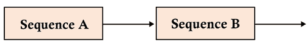
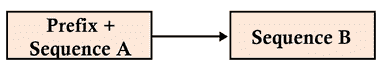
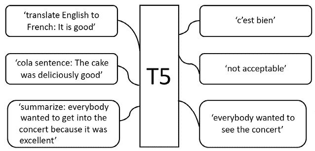
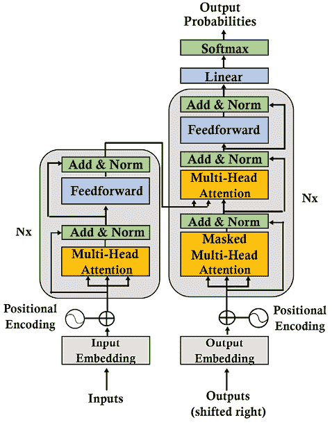
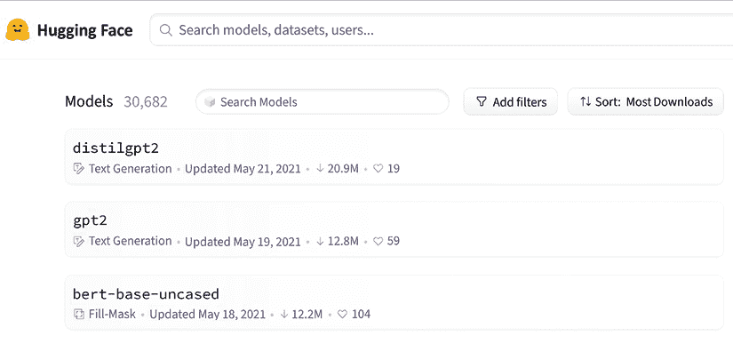
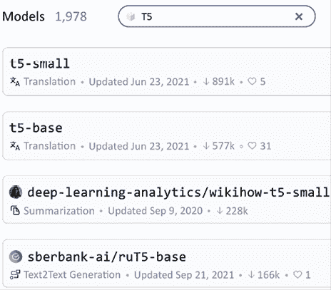
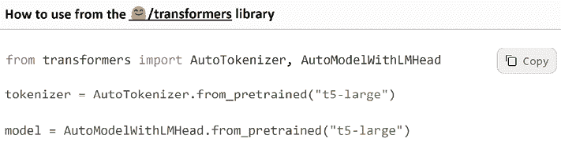

# 第八章：将变压器应用于法律和金融文件以进行人工智能文本摘要

我们在前七章中探索了几个变压器生态系统的架构训练、微调和使用。在*第七章*，*超人类变压器的崛起与 GPT-3 引擎*中，我们发现 OpenAI 已经开始尝试零样本模型，它们不需要微调、不需要开发，并且可以用几行代码实现。

这样一种演进的基本概念在于变压器模型如何努力教会机器如何理解语言，并以类似人类的方式表达自己。因此，我们已经从训练模型转变为教会机器语言。

*Raffel*等人（2019）设计了一个基于简单断言的变压器元模型：每个自然语言处理问题都可以表示为文本到文本函数。每种类型的自然语言处理任务都需要一些文本上下文，生成一些形式的文本响应。

任何自然语言处理任务的文本到文本表示都提供了一个独特的框架来分析变压器的方法和实践。这一思想是，通过文本到文本的方法，在训练和微调阶段，变压器可以通过迁移学习学习一种语言。

*Raffel*等人（2019）将这种方法命名为**T**ext-**T**o-**T**ext **T**ransfer **T**ransformer。这 5 个 T 成为了**T5**，一个新模型诞生了。

我们将从 T5 变压器模型的概念和架构开始本章。然后我们将运用 T5 来总结使用 Hugging Face 模型的文件。

最后，我们将文本到文本的方法转化为 GPT-3 引擎使用的展示和上下文过程。令人惊叹的，虽然不完美，零样本响应超过了人类所能想象的任何事物。

本章涵盖以下主题：

+   文本到文本变压器模型

+   T5 模型的架构

+   T5 方法论

+   从训练到学习的变压器模型的演进

+   Hugging Face 的变压器模型

+   实现一个 T5 模型

+   对法律文本进行摘要

+   对金融文本进行摘要

+   变压器模型的限制

+   GPT-3 的使用

我们的第一步将是探索由*Raffel*等人（2019）定义的文本到文本的方法论。

# 设计一个通用的文本到文本模型

谷歌的自然语言处理技术革命始于*Vaswani*等人（2017）的研究，即 2017 年的原始变压器。《注意力就是一切》颠覆了 30 多年的人工智能信仰，即循环神经网络和卷积神经网络应用于自然语言处理任务。它将我们从自然语言处理/理解的石器时代带到了 21 世纪，这是一个早就应该发生的演进。

*第七章*，*超人类变压器的崛起与 GPT-3 引擎*，总结了谷歌的*Vaswani*等人（2017）原始变压器和 OpenAI 的*Brown*等人（2020）GPT-3 变压器之间涌现出的第二次革命。原始变压器专注于性能，以证明注意力是我们处理自然语言处理/理解任务所需要的唯一因素。

OpenAI 的第二次革命，通过 GPT-3，着重将 transformer 模型从微调的预训练模型提升到无需微调的 few-shot 训练模型。第二次革命是为了证明机器可以学习一种语言，并将其应用于下游任务，就像我们人类一样。

要理解 T5 模型代表什么，理解这两次革命是至关重要的。第一次革命是注意力技术。第二次革命是教会机器理解语言（NLU），然后让它像我们一样解决 NLP 问题。

2019 年，Google 的想法与 OpenAI 的想法一致，即将 transformers 从技术考虑的层面提升到自然语言理解的抽象水平。

这些革命变得颠覆性。是时候平静下来，忘记源代码和机器资源，以更高的层次分析 transformers。

*Raffel*等人（2019）设计了一个概念上的文本到文本模型，然后加以实施。

让我们来看看第二次转换革命的代表：抽象模型。

## 文本到文本 transformer 模型的崛起

*Raffel*等人（2019）以一种目标为先驱们开始了一段旅程：*探索统一文本到文本 transformer 的迁移学习的极限*。该团队强调他们使用的这种方法从一开始就不会修改原始 Transformer 的基本架构。

在那时，*Raffel*等人（2019）想要关注概念，而不是技术。因此，他们对产生最新的 transformer 模型没有兴趣，正如我们经常看到的所谓的具有*n*参数和层的灵丹妙药 transformer 模型。这一次，T5 团队想要找出 transformers 在理解语言方面有多好。

人类学习一种语言，然后通过迁移学习将这些知识应用于各种 NLP 任务。T5 模型的核心概念是寻找一个可以像我们一样做事情的抽象模型。

当我们交流时，我们总是以一个序列（A）开头，然后是另一个序列（B）。B 又成为另一个序列的开始，如*图 8.1*所示：



图 8.1：沟通的序列到序列的表示

我们还通过音乐与有组织的声音进行交流。我们通过舞蹈与有组织的身体动作进行交流。我们通过绘画以形状和颜色进行表达。

*我们通过称为“文本”的一个词或一组词进行语言交流。* 当我们试图理解一段文本时，我们在*所有*方向上都会注意到句子中的所有词。我们尝试衡量每个术语的重要性。当我们不理解一个句子时，我们会专注于一个词并*查询*句子中的其余*关键词*，以确定它们的*值*和我们必须支付的*注意力*。这定义了 transformer 的注意力层。

花几秒钟，让这个思想深入。看起来似乎非常简单，对吧？然而，推翻围绕 RNN、CNN 及其相应思维过程的旧信念花了 35+ 年的时间！

观察 T5 学习、进步，甚至有时帮助我们更好地思考，这非常迷人！

同时关注序列中所有标记的注意力层的技术革命导致了 T5 概念的革命。

T5 模型可以概括为一个**T**ext-**T**o-**T**ext **T**ransfer **T**ransformer。因此，每个 NLP 任务都被表达为一个文本到文本的问题来解决。

## 一个前缀而不是任务特定格式

*Raffel* 等人（2019）仍然有一个问题需要解决：统一任务特定格式。想法是找到一种方法，使每个提交给 transformer 的任务都有一个输入格式。这样，模型参数将用一个文本到文本格式训练所有类型的任务。

谷歌 T5 团队提出了一个简单的解决方案：在输入序列中添加前缀。如果没有一位早已被遗忘的天才发明了*前缀*，我们在许多语言中都需要成千上万个额外的词汇。例如，如果我们不使用“pre”作为前缀，我们就需要找到词来描述预付款、史前的、前寒武纪等成千上万的其他词。

*Raffel* 等人（2019）提议向输入序列添加一个*前缀*。T5 前缀不仅仅是一些 transformer 模型中用于分类的标记或指示器，比如`[CLS]`。相反，T5 前缀包含了一个 transformer 需要解决的任务的本质。前缀传达意义，如下面的例子所示，还有其他例子：

+   `translate English to German: + [sequence]` 用于翻译，就像我们在*第六章*的*使用 Transformer 进行机器翻译*中所做的那样

+   `cola sentence: + [sequence]` 用于*语言可接受性语料库（CoLA）*，就像我们在*第三章*的*微调 BERT 模型*时使用 BERT transformer 模型时所做的那样

+   `stsb sentence 1:+[sequence]` 用于语义文本相似性基准。自然语言推理和蕴含是相似的问题，如*第五章*的*带 Transformer 的下游 NLP 任务*中所述

+   `summarize + [sequence]` 用于文本摘要问题，就像我们在本章的*使用 T5 进行文本摘要*部分中所做的那样

我们现在已经得到了一个统一的格式，用于广泛的 NLP 任务，在*图 8.2*中表达：



图 8.2：统一 transformer 模型的输入格式

统一的输入格式导致了一个变压器模型，无论要解决什么问题，在**T5**中都会产生一个结果序列。许多自然语言处理任务的输入和输出已经被统一，如*图 8.3*所示：



图 8.3：T5 文本到文本框架

统一的处理流程使得可以在广泛的任务中使用相同的模型、超参数和优化器。

我们已经通过了标准的文本到文本输入输出格式。现在让我们来看看 T5 变压器模型的架构。

## T5 模型

*Raffel*等人（2019 年）专注于设计一个标准的输入格式以获得文本输出。Google T5 团队不希望尝试从原始 Transformer 派生的新架构，如仅包含编码器层的 BERT 样式或仅包含解码器层的 GPT 样式。相反，团队专注于以标准格式定义自然语言处理任务。

他们选择使用我们在*第二章*中定义的原始 Transformer 模型，正如我们在*图 8.4*中所看到的：



图 8.4：T5 使用的原始 Transformer 模型

*Raffel*等人（2019 年）保留了大部分原始 Transformer 架构和术语。但是，他们强调了一些关键方面。此外，他们进行了一些轻微的词汇和功能性的更改。以下列表包含 T5 模型的一些主要方面：

+   编码器和解码器保留在模型中。编码器和解码器层变成了“块”，子层变成了包含自注意层和前馈网络的“子组件”。在类似 LEGO^®的语言中使用“块”和“子组件”一词，使您可以组装“块”、“片”和组件来构建您的模型。变压器组件是您可以以许多方式组装的标准构建块。一旦您理解了我们在*第二章*中介绍的基本构建块，您就可以理解任何变压器模型的运作方式。

+   自注意力是“无序的”，意味着它对集合进行操作，正如我们在*第二章*中看到的那样。自注意力使用矩阵的点积，而不是递归。它探索序列中每个单词与其他单词之间的关系。在进行点积之前，将位置编码添加到单词的嵌入中。

+   原始 Transformer 将正弦和余弦信号应用于变压器。或者它使用了学习到的位置编码。T5 使用相对位置编码，而不是将任意位置添加到输入中。在 T5 中，位置编码依赖于自注意力的扩展，以进行成对关系的比较。更多内容，请参见本章的*参考文献*中的*Shaw*等人（2018 年）。

+   位置编码在模型的所有层中共享并重新评估。

我们通过文本对文本方法定义了 T5 变压器模型输入的标准化。

现在让我们使用 T5 来总结文档。

# 使用 T5 进行文本摘要

NLP 总结任务提取了文本的简洁部分。本节将首先介绍我们在本章中将要使用的 Hugging Face 资源。然后我们将初始化一个 T5-large 变压器模型。最后，我们将看到如何使用 T5 来总结任何文档，包括法律和公司文件。

让我们开始介绍 Hugging Face 的框架。

## Hugging Face

Hugging Face 设计了一个高级别实现变压器的框架。我们在*第三章*中使用 Hugging Face 来微调 BERT 模型，并在*第四章*中训练了一个 RoBERTa 模型。

为了扩展我们的知识，我们需要探索其他方法，例如*第六章*中的 Trax 和*第七章*中的 OpenAI 模型。本章将再次使用 Hugging Face 框架，并更多地解释在线资源。我们以 GPT-3 引擎的独特潜力结束本章。

Hugging Face 在其框架内提供了三个主要资源：模型、数据集和指标。

### Hugging Face 变换资源

在本小节中，我们将选择将在本章中实现的 T5 模型。

可以在 Hugging Face 模型页面上找到各种模型，就像我们在*图 8.5*中看到的那样：



图 8.5：Hugging Face 模型

在这个页面上，[`huggingface.co/models`](https://huggingface.co/models)，我们可以搜索一个模型。在我们的情况下，我们正在寻找**t5-large**，一个我们可以在 Google Colaboratory 中顺利运行的模型。

我们首先键入`T5`来搜索 T5 模型，并获取我们可以选择的 T5 模型列表：



图 8.6：搜索 T5 模型

我们可以看到原始 T5 变压器中提供了几种模型，其中包括：

+   **基础**，是基线模型。它的设计与 BERT[BASE]类似，有 12 层和大约 2.2 亿个参数

+   **small**，一个更小的模型，有 6 层和 6 千万参数

+   **large**的设计类似于具有 12 层和 7.7 亿参数的 BERT[LARGE]

+   **3B**和**11B**使用 24 层的编码器和解码器，大约有 28 亿和 110 亿个参数

要了解更多关于 BERT[BASE]和 BERT[LARGE]的描述，您现在或以后可以花几分钟在*第三章*中查看这些模型。

在我们的情况下，我们选择**t5-large**：



图 8.7：如何使用 Hugging Face 模型

*图 8.7* 展示了我们将要编写的代码中如何使用该模型。我们还可以查看模型中的文件列表和基本配置文件。我们在本章的 *初始化 T5-large transformer 模型* 部分将查看配置文件。

Hugging Face 还提供了数据集和指标：

+   数据集可用于训练和测试您的模型：[`huggingface.co/datasets`](https://huggingface.co/datasets)

+   指标资源可用于测量您的模型的性能：[`huggingface.co/metrics`](https://huggingface.co/metrics)

数据集和指标是自然语言处理的经典方面。在本章中，我们不会实现这些数据集或指标。相反，我们将专注于如何实现任何文本摘要。

让我们从初始化 T5 transformer 模型开始。

## 初始化 T5-large transformer 模型

在本小节中，我们将初始化一个 T5-large 模型。打开以下笔记本，在本章的 GitHub 目录中找到 `Summarizing_Text_with_T5.ipynb`。

让我们开始使用 T5！

### 开始使用 T5

在本小节中，我们将安装 Hugging Face 的框架，然后初始化一个 T5 模型。

我们首先安装 Hugging Face 的 transformers：

```py
!pip install transformers 
```

注意：Hugging Face transformers 不断演进，更新库和模块以适应市场。如果默认版本不起作用，您可能需要使用 `!pip install transformers==[与笔记本中其他功能兼容的版本]` 固定一个版本。

我们固定了 `sentencepiece` 的版本为 `0.1.94`，以尽可能使使用 Hugging Face 的笔记本保持稳定：

```py
!pip install sentencepiece==0.1.94 
```

Hugging Face 有一个可以克隆的 GitHub 仓库。但是，Hugging Face 的框架提供了一系列我们可以实现的高级 transformer 函数。

我们可以选择在初始化模型时显示模型的架构或不显示：

```py
display_architecture=False 
```

如果将 `display_architecture` 设置为 `True`，则将显示编码器层、解码器层和前向子层的结构。

程序现在导入了 `torch` 和 `json`：

```py
import torch
import json 
```

*从事 transformer 工作意味着要对研究实验室与我们分享的许多 transformer 架构和框架持开放态度*。我也建议尽可能多地使用 PyTorch 和 TensorFlow 来熟悉两种环境。重要的是 transformer 模型的抽象级别（特定任务模型或零-shot 模型）及其整体性能。

让我们导入 tokenizer、generation 和 configuration 类：

```py
from transformers import T5Tokenizer, T5ForConditionalGeneration, T5Config 
```

我们将在这里使用 `T5-large` 模型，但您可以在本章的 *Hugging Face* 部分中选择其他 T5 模型。

现在，我们将导入 `T5-large` 有条件生成模型以生成文本和 T5-large tokenizer：

```py
model = T5ForConditionalGeneration.from_pretrained('t5-large')
tokenizer = T5Tokenizer.from_pretrained('t5-large') 
```

仅需一行即可初始化一个预训练的分词器。但是，并没有证明标记化的词典包含所有我们需要的词汇。我们将在*第九章* *匹配分词器和数据集*中调查分词器和数据集之间的关系。

程序现在使用`'cpu'`初始化了`torch.device`。这部分笔记足够用了一个 CPU。`torch.device`对象是 torch 张量分配的设备：

```py
device = torch.device('cpu') 
```

我们准备好探索 T5 模型的体系结构了。

### 探索 T5 模型的体系结构

在这一小节中，我们将探索 T5-large 模型的架构和配置。

如果`display_architecture==true`，我们可以看到模型的配置:

```py
if display_architecture==True:
  print(model.config) 
```

例如，我们可以看到模型的基本参数：

```py
.../...
"num_heads": 16,
"num_layers": 24,
.../... 
```

该模型是一个带有 16 个头和 24 层的 T5 变压器。

我们还可以看到 T5 的文本到文本实现，它将一个输入句子添加一个*前缀*来触发任务执行。*前缀*使得能够在不修改模型参数的情况下以文本到文本格式表示各种任务。在我们的情况下，前缀是`summarization`：

```py
"task_specific_params": {
    "summarization": {
      "early_stopping": true,
      "length_penalty": 2.0,
      "max_length": 200,
      "min_length": 30,
      "no_repeat_ngram_size": 3,
      "num_beams": 4,
      "prefix": "summarize: "
    }, 
```

我们可以看到 T5：

+   实施*波束搜索*算法，它将扩展四个最重要的文本完成预测

+   当每批完成`num_beam`句子时，应用早停止

+   确保不重复出现 n 克，n 的大小等于 `no_repeat_ngram_size`

+   使用 `min_length` 和 `max_length` 控制样本的长度

+   应用长度惩罚

另一个有趣的参数是词汇量大小：

```py
"vocab_size": 32128 
```

词汇量本身就是一个话题。太多的词汇将导致表示稀疏。另一方面，词汇量太少会扭曲 NLP 任务。我们将在*第九章* *匹配分词器和数据集*中进一步探讨这一点。

通过简单地打印`model`，我们还可以看到变压器堆栈的细节：

```py
if(display_architecture==True):
  print(model) 
```

例如，我们可以通过仅运行您希望运行的单元来查看模型的一个块（`层`）：

```py
(12): T5Block(
        (layer): ModuleList(
          (0): T5LayerSelfAttention(
            (SelfAttention): T5Attention(
              (q): Linear(in_features=1024, out_features=1024, bias=False)
              (k): Linear(in_features=1024, out_features=1024, bias=False)
              (v): Linear(in_features=1024, out_features=1024, bias=False)
              (o): Linear(in_features=1024, out_features=1024, bias=False)
            )
            (layer_norm): T5LayerNorm()
            (dropout): Dropout(p=0.1, inplace=False)
          )
          (1): T5LayerFF(
            (DenseReluDense): T5DenseReluDense(
              (wi): Linear(in_features=1024, out_features=4096, bias=False)
              (wo): Linear(in_features=4096, out_features=1024, bias=False)
              (dropout): Dropout(p=0.1, inplace=False)
            )
            (layer_norm): T5LayerNorm()
            (dropout): Dropout(p=0.1, inplace=False)
          )
        )
      ) 
```

我们可以看到模型在注意子层上运行了`1,024`个特征，在前馈网络子层的内部计算中运行了 `4,096` 个特征，这将产生`1,024`个特征的输出。变压器的对称结构在所有层中都得到了保持。

您可以花几分钟时间浏览编码器堆栈、解码器堆栈、注意子层和前馈子层。

您也可以选择仅运行您希望的单元来选择模型的特定方面：

```py
if display_architecture==True:
  print(model.encoder)
if display_architecture==True:
  print(model.decoder)
if display_architecture==True:
  print(model.forward) 
```

我们已经初始化了 T5 变压器。现在让我们来总结文件。

## 用 T5-large 来总结文件

本节将创建一个总结函数，您可以用任何您希望总结的文本来调用。我们将总结法律和金融示例。最后，我们将定义方法的限制。

首先，我们将创建一个总结函数。

### 创建一个总结函数

首先，让我们创建一个名为`summarize`的摘要函数。这样，我们只需将要总结的文本发送到我们的函数即可。该函数接受两个参数。第一个参数是`preprocess_text`，即要总结的文本。第二个参数是`ml`，即摘要的最大长度。这两个参数是您每次调用函数时发送到函数的变量：

```py
def summarize(text,ml): 
```

Hugging Face 等提供了现成的摘要函数。但是，我建议在有必要的时候学习如何构建自己的函数来定制这一关键任务。

根据上下文文本或真实内容，去掉了`\n`字符：

```py
preprocess_text = text.strip().replace("\n","") 
```

然后我们将创新的`T5`任务*前缀*`summarize`应用于输入文本：

```py
t5_prepared_Text = "summarize: "+preprocess_text 
```

T5 模型采用统一的结构，通过*前缀 + 输入序列*的方式来处理任务。这看起来可能很简单，但它将自然语言处理变换模型更接近通用训练和零-shot 下游任务。

我们可以展示处理（去掉）和准备好的文本（任务前缀）：

```py
print ("Preprocessed and prepared text: \n", t5_prepared_Text) 
```

简单吧？嗯，需要 35 年以上的时间才能从循环神经网络 (RNNs) 和卷积神经网络 (CNNs) 转向变换模型。然后需要世界上一些最优秀的研究团队才能从为特定任务设计的变换模型转向几乎不需要微调的多任务模型。最后，谷歌研究团队创建了一个标准格式，以包含指示需解决的自然语言处理问题的前缀的输入文本。这真是了不起的成就！

显示的输出包含预处理并准备好的文本：

```py
Preprocessed and prepared text: 
summarize: The United States Declaration of Independence 
```

我们可以看到`summarize`前缀，表示需要解决的任务。

文本现在已经编码为令牌 ID，并将它们作为 torch 张量返回：

```py
tokenized_text = tokenizer.encode(t5_prepared_Text, return_tensors="pt").to(device) 
```

编码文本已经准备好发送到模型中，以使用我们在*开始使用 T5*部分描述的参数生成摘要：

```py
# Summarize
  summary_ids = model.generate(tokenized_text,
                                      num_beams=4,
                                      no_repeat_ngram_size=2,
                                      min_length=30,
                                      max_length=ml,
                                      early_stopping=True) 
```

这里的横梁数量与我们导入的模型相同。但是`no_repeat_ngram_size`已经从`3`降到了`2`。

生成的输出现在使用`tokenizer`进行解码：

```py
output = tokenizer.decode(summary_ids[0], skip_special_tokens=True)
return output 
```

我们导入，初始化并定义了摘要化功能。现在让我们用一个一般性主题来试验 T5 模型。

### 一个一般性主题样本

在这一小节中，我们将通过 T5 模型运行由*Project Gutenberg*撰写的文本。我们将使用样本来测试我们的总结功能。您可以复制并粘贴任何其他您希望的文本，也可以通过添加代码加载文本。您还可以加载自己选择的数据集，并在循环中调用摘要。

本章节的程序目标是运行一些样本来看看 T5 是如何工作的。输入文本是*Project Gutenberg*电子书中包含*美利坚合众国独立宣言*开头的部分内容：

```py
text ="""
The United States Declaration of Independence was the first Etext
released by Project Gutenberg, early in 1971\.  The title was stored
in an emailed instruction set which required a tape or diskpack be
hand mounted for retrieval.  The diskpack was the size of a large
cake in a cake carrier, cost $1500, and contained 5 megabytes, of
which this file took 1-2%.  Two tape backups were kept plus one on
paper tape.  The 10,000 files we hope to have online by the end of
2001 should take about 1-2% of a comparably priced drive in 2001.
""" 
```

然后我们调用我们的`summarize`函数，并发送我们想要总结的文本以及摘要的最大长度：

```py
print("Number of characters:",len(text))
summary=summarize(text,50)
print ("\n\nSummarized text: \n",summary) 
```

输出显示我们发送了`534`个字符，原始文本（真实内容）经过预处理，还有摘要（预测）：

```py
Number of characters: 534
Preprocessed and prepared text: 
 summarize: The United States Declaration of Independence...
Summarized text: 
 the united states declaration of independence was the first etext published by project gutenberg, early in 1971\. the 10,000 files we hope to have online by the end of2001 should take about 1-2% of a comparably priced drive in 2001\. the united states declaration of independence was the first Etext released by project gutenberg, early in 1971 
```

现在让我们使用 T5 来进行更困难的摘要。

### 《权利法案》样本

下一个样本取自*权利法案*，更困难，因为它表达的是一个人的特权：

```py
#Bill of Rights,V
text ="""
No person shall be held to answer for a capital, or otherwise infamous crime,
unless on a presentment or indictment of a Grand Jury, except in cases arising
 in the land or naval forces, or in the Militia, when in actual service
in time of War or public danger; nor shall any person be subject for
the same offense to be twice put in jeopardy of life or limb;
nor shall be compelled in any criminal case to be a witness against himself,
nor be deprived of life, liberty, or property, without due process of law;
nor shall private property be taken for public use without just compensation.
"""
print("Number of characters:",len(text))
summary=summarize(text,50)
print ("\n\nSummarized text: \n",summary) 
```

*记住，变压器是随机算法，因此每次运行时输出可能会有所不同。* 话虽如此，我们可以看到 T5 并没有真正对输入文本进行总结，而只是简单地缩短了它：

```py
Number of characters: 591
Preprocessed and prepared text: 
 summarize: No person shall be held to answer..
Summarized text: 
 no person shall be held to answer for a capital, or otherwise infamous crime. except in cases arisingin the land or naval forces or in the militia, when in actual service in time of war or public danger 
```

这份样本意义重大，因为它展示了任何变压器模型或其他 NLP 模型面对这样的文本时所面临的限制。我们不能只展示总是有效的样本，并让用户相信变压器已经解决了我们所面临的所有 NLP 挑战，无论它们有多么创新。

也许我们应该提供更长的文本来总结，使用其他参数，使用更大的模型，或者改变 T5 模型的结构。然而，无论你如何努力用 NLP 模型总结复杂的文本，你总会发现模型总结失败的文档。

当模型在一个任务上失败时，我们必须谦卑地承认。超级粘性人类基线是一个难以超越的基线。我们需要耐心、更加努力，改进变压器模型，直到它们能比今天表现得更好。还有很多进步空间。

*Raffel*等人（2018）选择了一个适合描述 T5 方法的标题：*探索统一文本到文本变压器的迁移学习极限*。

花时间来尝试你在法律文件中发现的自己的示例。将迁移学习的极限作为现代 NLP 先驱的领域来探索！有时你会发现令人兴奋的结果，有时你会发现需要改进的地方。

现在，让我们尝试一份公司法样本。

### 一份公司法样本

公司法包含许多法律细微之处，使得总结任务非常棘手。

此样本的输入是美国蒙大纳州的公司法节选：

```py
#Montana Corporate Law
#https://corporations.uslegal.com/state-corporation-law/montana-corporation-law/#:~:text=Montana%20Corporation%20Law,carrying%20out%20its%20business%20activities.
text ="""The law regarding corporations prescribes that a corporation can be incorporated in the state of Montana to serve any lawful purpose.  In the state of Montana, a corporation has all the powers of a natural person for carrying out its business activities.  The corporation can sue and be sued in its corporate name.  It has perpetual succession.  The corporation can buy, sell or otherwise acquire an interest in a real or personal property.  It can conduct business, carry on operations, and have offices and exercise the powers in a state, territory or district in possession of the U.S., or in a foreign country.  It can appoint officers and agents of the corporation for various duties and fix their compensation.
The name of a corporation must contain the word "corporation" or its abbreviation "corp."  The name of a corporation should not be deceptively similar to the name of another corporation incorporated in the same state.  It should not be deceptively identical to the fictitious name adopted by a foreign corporation having business transactions in the state.
The corporation is formed by one or more natural persons by executing and filing articles of incorporation to the secretary of state of filing.  The qualifications for directors are fixed either by articles of incorporation or bylaws.  The names and addresses of the initial directors and purpose of incorporation should be set forth in the articles of incorporation.  The articles of incorporation should contain the corporate name, the number of shares authorized to issue, a brief statement of the character of business carried out by the corporation, the names and addresses of the directors until successors are elected, and name and addresses of incorporators.  The shareholders have the power to change the size of board of directors.
"""
print("Number of characters:",len(text))
summary=summarize(text,50)
print ("\n\nSummarized text: \n",summary) 
```

结果令人满意：

```py
Number of characters: 1816
Preprocessed and prepared text: 
 summarize: The law regarding the corporation prescribes that a corporation...
Summarized text: 
 a corporations can be incorporated in the state of Montana to serve any lawful purpose. a corporation can sue and be sued in its corporate name, and it has perpetual succession. it can conduct business, carry on operations and have offices 
```

这一次，T5 找到了文本摘要的一些关键方面。花一些时间加入自己的样本来看看会发生什么。用参数玩耍，看看它是否会影响结果。

我们已经实施了 T5 来进行文本总结。现在是时候通过 OpenAI GPT-3 引擎进行总结实验了。

# 使用 GPT-3 进行摘要

了解 T5 变压器的体系结构非常重要。我们还将看到 GPT-3 引擎在其中一篇文章上的表现。目标*不是*对公司和模型进行基准测试。目标是让工业 4.0 人工智能领域的研究专家了解 NLP 的广泛知识。

首先，转到[`openai.com/`](https://openai.com/)并注册登录。

然后转到示例页面并选择**为二年级学生总结**：


图 8.8：GPT-3 示例页面

一个窗口会弹出，我们可以输入我们的提示。

我们将前一节公司样本的文本*T*提交给 GPT-3 模型。

提示为*P* = *E* + *T* + *S*：

+   *E*告诉模型要简化解释：

    `我的二年级学生问我这段话是什么意思：`

+   文本*T*与前一节相同，用引号括起来：

    `"""关于公司的法律规定，公司可以在蒙大拿州成立以服务于任何合法目的。在蒙大拿州，公司具有进行业务活动的自然人的所有权利。`

    `.../...`

    `股东有权改变董事会的规模。"""`

+   *S*显示了预期的任务类型：

    `我用一个二年级学生可以理解的简单语言为他重新表述了："""`

    GPT-3 DaVinci 引擎生成的响应相当令人信服：

`公司就是一个企业。`

`公司就是一个人。`

`公司可以做人能做的一切。`

`公司可以被起诉。`

`公司可以购买、出售或交易物品。`

`公司有自己的名称，与拥有它的人的名称不同。`

`公司是由想要创业的人成立的，并向政府提交文件以使其正式化。`

我们可以保留*T*并修改*E*和*S*：

+   *E*可以改为：

    `我的工商管理硕士学生问我这段话是什么意思：`

+   *S*可以改为：

    `我用工商管理硕士学院的语言重新表述了这段话：`

GPT-3 引擎生成了上一个请求的响应，但为大学生添加了有用的信息：

`公司可以有负责业务决策的董事会。董事会由股东选举产生。股东可以改变董事会的规模。`

GPT-3 模型相当令人信服，并代表了云人工智能的崛起力量。在第十六章《变压器驱动的合作伙伴的出现》中，我们将更深入地总结提示。然而，在我们这样做之前，还有更多，更多的探索。

# 摘要

在本章中，我们看到了 T5 变压器模型如何标准化原始变压器的编码器和解码器堆栈的输入。原始变压器架构对于编码器和解码器堆栈的每个块（或层）具有相同的结构。然而，原始变压器没有为自然语言处理任务制定标准化的输入格式。

Raffel 等人（2018）通过定义一个文本到文本模型，为广泛的自然语言处理任务设计了一个标准输入。他们为输入序列添加了一个前缀，指示要解决的自然语言处理问题类型。这导致了一个标准的文本到文本格式。**文本到文本传输变压器**（**T5**）应运而生。我们看到这个看似简单的演变使得可以对广泛的自然语言处理任务使用相同的模型和超参数成为可能。T5 的发明将变压器模型的标准化过程推进了一步。

然后，我们实现了一个可以总结任何文本的 T5 模型。我们测试了该模型在未准备好的训练数据集中不属于的文本上的表现。我们测试了该模型在宪法和公司样本上的表现。结果很有趣，但我们也发现了一些变压器模型的限制，正如 *Raffel* 等人（2018）预测的那样。

最后，我们探讨了 GPT-3 引擎方法论和计算效率的巨大力量。展示一个变压器是一个出色的方法。拥有世界上最强大的变压器引擎之一有助于获得有效的结果，尽管不总是完美的。

目标不是对公司和模型进行基准测试，而是让工业 4.0 AI 专家对变压器有深入理解。

在下一章，*第九章*，*匹配标记化器和数据集* 中，我们将探讨标记化器的限制，并定义可能改进自然语言处理任务的方法。

# 问题

1.  T5 模型只有像 BERT 模型那样的编码器堆栈。（是/否）

1.  T5 模型具有编码器和解码器堆栈。（是/否）

1.  T5 模型使用相对位置编码，而不是绝对位置编码。（是/否）

1.  文本到文本模型仅设计用于摘要。（是/否）

1.  文本到文本模型将一个前缀应用到输入序列中，确定自然语言处理任务。（是/否）

1.  T5 模型需要针对每个任务具体的超参数。（是/否）

1.  文本到文本模型的一个优点是，它们对所有自然语言处理任务使用相同的超参数。（是/否）

1.  T5 变压器不包含前馈网络。（是/否）

1.  Hugging Face 是一个使变压器更易于实现的框架。（是/否）

1.  OpenAI 的变压器引擎改变了游戏规则。（是/否）

# 参考文献

+   *Colin Raffel*，*Noam Shazeer*，*Adam Roberts*，*Katherine Lee*，*Sharan Narang*，*Michael Matena*，*Yanqi Zhou*，*Wei Li*，*Peter J. Liu*，2019 年，*探索与统一文本到文本转换器的转移学习极限*：[`arxiv.org/pdf/1910.10683.pdf`](https://arxiv.org/pdf/1910.10683.pdf)

+   *Ashish Vaswani*，*Noam Shazeer*，*Niki Parmar*，*Jakob Uszkoreit*，*Llion Jones*，*Aidan N. Gomez*，*Lukasz Kaiser*，*Illia Polosukhin*，2017 年，*注意力就是一切*：[`arxiv.org/abs/1706.03762`](https://arxiv.org/abs/1706.03762)

+   *Peter Shaw*，*Jakob Uszkoreit* 和 *Ashish Vaswani*，2018 年，*自注意力与相对位置表示*：[`arxiv.org/abs/1803.02155`](https://arxiv.org/abs/1803.02155)

+   Hugging Face 框架和资源：[`huggingface.co/`](https://huggingface.co/)

+   美国法律，*蒙大拿州公司法*：[`corporations.uslegal.com/state-corporation-law/montana-corporation-law/#:~:text=Montana%20Corporation%20Law,carrying%20out%20its%20business%20activities`](https://corporations.uslegal.com/state-corporation-law/montana-corporation-law/#:~:text=Montana%20Corporation%20Law,carrying%20out%20its%20business%20activities)

+   *美利坚合众国独立宣言* 由托马斯·杰斐逊：[`www.gutenberg.org/ebooks/1`](https://www.gutenberg.org/ebooks/1)

+   *美国权利法案* 由美国：[`www.gutenberg.org/ebooks/2`](https://www.gutenberg.org/ebooks/2)

# 加入我们书籍的 Discord 空间

加入书籍的 Discord 工作区，与作者进行每月的 *问我任何事* 交流会：

[`www.packt.link/Transformers`](https://www.packt.link/Transformers)


