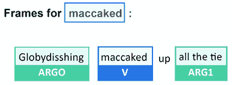

# 第十章：基于 BERT 的Transformers的语义角色标记

Transformers在过去几年中取得的进展比上一代 NLP 更大。标准的 NLU 方法首先学习句法和词汇特征来解释句子的结构。以前的 NLP 模型在运行**语义角色标注**（**SRL**）之前会被训练来理解语言的基本句法。

*Shi* 和 *Lin*（2019）在他们的论文中提出了一个问题，是否可以跳过初步的句法和词汇训练。基于 BERT 的模型可以在不经历这些传统训练阶段的情况下执行 SRL 吗？答案是肯定的！

*Shi* 和 *Lin*（2019）建议将 SRL 视为序列标记，并提供标准化的输入格式。他们基于 BERT 的模型产生了令人惊讶的好结果。

本章将使用基于 *Shi* 和 *Lin*（2019）论文的艾伦人工智能研究所提供的预训练基于 BERT 的模型。*Shi* 和 *Lin* 通过放弃句法和词汇训练将 SRL 提高到了一个新的水平。我们将看到他们是如何做到的。

我们将首先定义 SRL 和序列标记输入格式的标准化。然后，我们将开始使用艾伦人工智能研究所提供的资源。接下来，我们将在 Google Colab 笔记本中运行 SRL 任务，并使用在线资源来理解结果。

最后，我们将通过运行 SRL 样本来挑战基于 BERT 的模型。第一批样本将展示 SRL 的工作原理。然后，我们将运行一些更困难的样本。我们将逐步推动基于 BERT 的模型达到 SRL 的极限。找到模型的极限是确保Transformers模型的现实和实用之路。

本章涵盖以下主题：

+   定义语义角色标记

+   定义 SRL 输入格式的标准化

+   基于 BERT 的模型架构的主要方面

+   编码器堆栈如何管理屏蔽的 SRL 输入格式

+   基于 BERT 的模型 SRL 注意力过程

+   开始使用由艾伦人工智能研究所提供的资源

+   构建笔记本来运行预训练的基于 BERT 的模型

+   在基本示例上测试句子标记

+   在困难的例子上测试 SRL 并解释结果

+   将基于 BERT 的模型推向 SRL 的极限并解释如何做到这一点

我们的第一步将是探索 *Shi* 和 *Lin*（2019）定义的 SRL 方法。

# 开始 SRL

对于人类和机器来说，SRL 都是一样困难的。然而，一次又一次，Transformers已经朝着我们人类基线迈出了一步。

在本节中，我们将首先定义 SRL 并举例说明。然后，我们将运行一个预训练的基于 BERT 的模型。

让我们首先定义 SRL 这个棘手的任务。

## 定义语义角色标记

*Shi* 和 *Lin* (2019)推进并证明了一个想法，即我们可以找出谁做了什么以及在哪里，而不依赖于词汇或句法特征。本章基于 *Peng Shi* 和 *Jimmy Lin* 在加利福尼亚滑铁卢大学展开的研究。他们展示了Transformers如何通过注意力层更好地学习语言结构。

SRL 将*语义角色*定义为单词或一组单词在句子中所起的作用以及与谓语所建立的关系。

*语义角色*是一个名词或名词短语在句子中与主要动词的关系中所扮演的角色。例如，在句子`Marvin walked in the park`中，`Marvin`是句子中发生事件的*施事者*。*施事者*是事件的*执行者*。主动词，或*控制动词*，是`walked`。

*谓语*描述了主语或施事者的一些信息。谓语可以是任何提供有关主题特征或行为的信息的东西。在我们的方法中，我们将谓语称为主要*动词*。例如，在句子`Marvin walked in the park`中，谓语是`walked`。

词组`在公园里` *修饰*了`走`的含义，并且是*修饰语*。

环绕谓词的名词或名词短语称为*论元*或*论元项*。例如，`Marvin`是`walked`的一个*论元*。

我们可以看到，SRL 不需要句法树或词汇分析。

让我们可视化我们的示例的 SRL。

### 可视化 SRL

本章将使用 Allen Institute 的视觉和代码资源（有关更多信息，请参见*参考*部分）。 Allen Institute for AI 拥有出色的交互式在线工具，例如我们在本章中用来可视化 SRL 的工具。您可以在[`demo.allennlp.org/`](https://demo.allennlp.org/)上访问这些工具。

Allen Institute for AI 倡导*AI 造福人类*。我们将充分利用这种方法。本章中的所有图表都是用 AllenNLP 工具创建的。

Allen Institute 提供了不断发展的Transformers模型。因此，当您运行这些示例时，本章中的示例可能会产生不同的结果。最充分利用本章的最佳方法是：

+   阅读并理解解释的概念，而不只是运行程序

+   花时间理解提供的示例

然后，使用本章中使用的工具运行您自己选择的句子进行您自己的实验：[`demo.allennlp.org/semantic-role-labeling`](https://demo.allennlp.org/semantic-role-labeling)。

现在让我们可视化我们的 SRL 示例。*图 10.1*是`Marvin walked in the park`的 SRL 表示：


图 10.1: 句子的 SRL 表示

我们可以在*图 10.1*中观察到以下标签：

+   **动词**：句子的谓语

+   **论据**：一个被命名为**ARG0**的句子论点

+   **修饰语**：句子的修饰成分。在这种情况下是一个地点。它也可以是副词，形容词，或任何修改谓词意义的成分

文本输出同样有趣，其中包含了可视表示标签的缩写形式：

```py
walked: [ARG0: Marvin] [V: walked] [ARGM-LOC: in the park] 
```

我们已经定义了 SRL 并进行了一个例子。现在是时候看看基于 BERT 的模型了。

## 运行一个预训练的基于 BERT 的模型

本节将首先描述本章中使用的基于 BERT 的模型的架构。

接下来我们将定义使用 BERT 模型实验 SRL 样本的方法。

让我们开始看一下基于 BERT 的模型的架构。

### 基于 BERT 的模型架构

AllenNLP 的基于 BERT 的模型是一个 12 层只编码器的 BERT 模型。AllenNLP 团队实现了*Shi*和*Lin*（2019）描述的 BERT 模型，并添加了一个额外的线性分类层。

欲了解更多关于 BERT 模型的描述，如有必要，请花几分钟回顾*第三章*，*BERT 模型微调*。

基于 BERT 的模型充分利用了双向注意力以简单的方法和架构。Transformers模型的核心潜力存在于注意力层中。我们已经看到了既有编码器和解码器堆栈的Transformers模型。我们已经看到了其他只有编码器层或者解码器层的Transformers。Transformers的主要优势仍然在于近乎人类的注意力层方法。

*Shi*和*Lin*（2019）定义的谓词标识格式的输入格式显示了Transformers在标准化语言理解方面取得的进展：

```py
[CLS] Marvin walked in the park.[SEP] walked [SEP] 
```

训练流程已被标准化：

+   `[CLS]`表示这是一个分类练习

+   `[SEP]`是第一个分隔符，表示句子的结束

+   `[SEP]`后面是作者设计的谓词标识

+   `[SEP]`是第二个分隔符，表示谓词标识符的结束

光是这种格式就足够训练一个 BERT 模型来识别并标记句子中的语义角色。

让我们设置环境来运行 SRL 样本。

### 设置 BERT SRL 环境

我们将使用 Google Colab 记事本，在[`demo.allennlp.org/`](https://demo.allennlp.org/)上提供的 AllenNLP SRL 的文本可视化下进行

我们将应用以下方法：

1.  我们将打开`SRL.ipynb`，安装`AllenNLP`，并运行每个样本

1.  我们将显示 SRL 运行的原始输出

1.  我们将使用 AllenNLP 的在线可视化工具来可视化输出

1.  我们将使用 AllenNLP 的在线文本可视化工具来显示输出

本章是自包含的。您可以阅读它，或按照描述运行示例。

当 AllenNLP 更改了使用的 transformer 模型时，SRL 模型的输出可能会有所不同。这是因为 AllenNLP 的模型和 transformers 通常都是持续训练和更新的。此外，用于训练的数据集可能会发生变化。最后，这些不是基于规则的算法，每次产生的结果可能会有所不同，正如屏幕截图中所描述和显示的那样。

现在让我们运行一些 SRL 实验。

# 使用基于 BERT 的模型进行 SRL 实验

我们将使用本章“设置 BERT SRL 环境”的方法来运行 SRL 实验。我们将从具有各种句子结构的基本样本开始。然后，我们将挑战基于 BERT 的模型，使用一些更难的样本来探索系统的能力和限制。

打开`SRL.ipynb`并运行安装单元格：

```py
!pip install allennlp==2.1.0 allennlp-models==2.1.0 
```

然后我们导入标记模块和训练好的 BERT 预测器：

```py
from allennlp.predictors.predictor import Predictor
import allennlp_models.tagging
import json
predictor = Predictor.from_path("https://storage.googleapis.com/allennlp-public-models/structured-prediction-srl-bert.2020.12.15.tar.gz") 
```

我们还添加了两个函数来显示 SRL BERT 返回的 JSON 对象。第一个显示谓语动词和描述：

```py
def head(prediction):
  # Iterating through the json to display excerpt of the prediciton
  for i in prediction['verbs']:
    print('Verb:',i['verb'],i['description']) 
```

第二个函数显示完整的响应，包括标签：

```py
def full(prediction):
  #print the full prediction
  print(json.dumps(prediction, indent = 1, sort_keys=True)) 
```

在本出版物发布之时，BERT 模型专门用于语义角色标注。该模型的名称是 SRL BERT。SRL BERT 是使用 OntoNotes 5.0 数据集进行训练的：[`catalog.ldc.upenn.edu/LDC2013T19`](https://catalog.ldc.upenn.edu/LDC2013T19)。

此数据集包含句子和注释。该数据集设计用于识别句子中的谓词（包含动词的部分），并确定提供有关动词的更多信息的单词。每个动词都带有其关于它的“参数”，告诉我们更多信息。一个“框架”包含一个动词的参数。

因此，SRL BERT 是一个专门训练来执行特定任务的专用模型，并且与我们在*第七章*看到的 OpenAI GPT-3 一样，并不是像 OpenAI GPT-3 这样的基础模型。

SRL BERT 将专注于语义角色标注，只要句子包含谓词，就可以以可以接受的准确度执行。

现在我们已经准备好使用一些基本样本进行热身了。

# 基本样本

基本样本在直观上看起来很简单，但分析起来可能有点棘手。复合句，形容词，副词和情态动词对于非专业人士来说甚至也很难识别。

让我们从 transformer 的一个简单样本开始。

## 样本 1

第一个样本很长，但对 transformer 来说相对容易：

“Bob 真的以为自己能在几小时内为 50 个人准备一顿饭吗？”

运行`SRL.ipynb`中的*样本 1*单元格：

```py
prediction=predictor.predict(
    sentence="Did Bob really think he could prepare a meal for 50 people in only a few hours?"
)
head(prediction) 
```

BERT SRL 识别了四个谓词；每个谓词的动词都标记了结果，如在使用`head(prediction)`函数显示的这段摘录中：

```py
Verb: Did [V: Did] Bob really think he could prepare a meal for 50 people in only a few hours ?
Verb: think Did [ARG0: Bob] [ARGM-ADV: really] [V: think] [ARG1: he could prepare a meal for 50 people in only a few hours] ?
Verb: could Did Bob really think he [V: could] [ARG1: prepare a meal for 50 people in only a few hours] ?
Verb: prepare Did Bob really think [ARG0: he] [ARGM-MOD: could] [V: prepare] [ARG1: a meal for 50 people] [ARGM-TMP: in only a few hours] ? 
```

您可以通过运行`full(prediction)`单元格来查看完整的响应。

如果我们根据 PropBank（命题银行）的结构使用数据集参数的描述，例如在这段摘录中，动词`think`可以被解释为：

+   `V`标识动词`think`

+   `ARG0`标识代理人; 因此，`Bob`是代理人或“主体代理人”

+   `ARGM-ADV`将`really`视为副词(`ADV`)，`ARGM`表示该副词提供一个修饰语（不是必要的），因此没有编号

如果我们在 AllenNLP 在线界面上运行样本，则会获得每个动词一个框架的 SRL 任务的可视化表示。第一个动词是`Did`：


图 10.2：识别动词“Did”

第二个确认的动词是`think`：


图 10.3：识别动词“think”

如果我们仔细观察这个表示，我们可以检测到 SRL BERT 的一些有趣属性：

+   检测到动词`think`

+   避免了可能被解释为主要动词的`prepare`陷阱。 相反，`prepare`仍然是`think`的论点的一部分

+   检测到一个副词并进行标记

第三个动词是`could`：


图 10.4：识别动词“could”和论点

转换器然后转向动词`prepare`，标记它，并分析其上下文：


图 10.5：识别动词“prepare”，论点和修饰语

再次，基于简单 BERT 的转换器模型检测到了大量关于句子语法结构的信息，并发现：

+   确定动词`prepare`并将其孤立出来

+   确定名词`he`并将其标记为论据，对于`a meal for 50 people`也做同样处理，这是一个“原始患者”，涉及由其他参与者修改

+   `in only a few hours`是一个时间修饰语（**ARGM-TMP**）

+   `could`是一个表示动词情态性的情态修饰语，例如事件发生的可能性

现在我们将分析另一个相对较长的句子。

## 样本 2

下面的句子看似简单，但包含多个动词：

`Mrs.和 Mr. Tomaso 去欧洲度假并访问巴黎，首先去参观埃菲尔铁塔。`

这个令人困惑的句子会使转换器犹豫吗？让我们通过运行`SRL.ipynb`笔记本的*Sample 2*单元格来看一下：

```py
prediction=predictor.predict(
    sentence="Mrs. and Mr. Tomaso went to Europe for vacation and visited Paris and first went to visit the Eiffel Tower."
)
head(prediction) 
```

输出摘录证明转换器正确识别了句子中的动词：

```py
Verb: went [ARG0: Mrs. and Mr. Tomaso] [V: went] [ARG4: to Europe] [ARGM-PRP: for vacation] and visited Paris and first went to visit the Eiffel Tower .
Verb: visited [ARG0: Mrs. and Mr. Tomaso] went to Europe for vacation and [V: visited] [ARG1: Paris] and first went to visit the Eiffel Tower .
Verb: went [ARG0: Mrs. and Mr. Tomaso] went to Europe for vacation and visited Paris and [ARGM-TMP: first] [V: went] [ARG1: to visit the Eiffel Tower] .
Verb: visit [ARG0: Mrs. and Mr. Tomaso] went to Europe for vacation and visited Paris and first went to [V: visit] [ARG1: the Eiffel Tower] . 
```

在 AllenNLP 在线上运行样本，可识别四个谓词，从而生成四个框架。

第一个框架是`went`：


图 10.6：识别动词“went”，论点和修饰语

我们可以解释动词`went`的论点。`Mrs.和 Mr. Tomaso`是代理。 转换器发现动词的主要修饰语是旅行目的：`to Europe`。 如果我们不知道*Shi*和*Lin*（2019）只是建立了一个简单的 BERT 模型来获取这种高质量的语法分析，则结果将不令人惊讶。

我们还可以注意到`went`与`Europe`正确关联。Transformers正确地识别了动词`visited`与`Paris`相关联：


图 10.7：识别动词“visited”和论点

Transformers本可以将动词`visited`直接与`Eiffel Tower`关联起来。但是它没有。它坚持自己的立场并做出了正确的决定。

我们要求Transformers做的下一个任务是确定动词`went`的第二次使用的上下文。同样，它没有陷入将与动词`went`相关的所有论点合并的陷阱。再次，它正确地分割了序列并产生了一个出色的结果：


图 10.8：识别动词“went”，论点和修饰语

动词`went`被使用了两次，但Transformers没有陷入陷阱。它甚至发现`first`是动词`went`的时间修饰语。

最后，动词`visit`第二次被使用，而 SRL BERT 正确解释了它的使用：


图 10.9：识别动词“visit”和论点

让我们运行一个更加令人困惑的句子。

## 示例 3

*示例 3* 将使我们的Transformers模型变得更加困难。以下示例包含动词`drink`的变体四次：

`John 想喝茶，Mary 喜欢喝咖啡，但 Karim 喝了一些凉爽的水，Faiza 想喝番茄汁。`

让我们在 `SRL.ipynb` 笔记本中运行 *示例 3*：

```py
prediction=predictor.predict(
    sentence="John wanted to drink tea, Mary likes to drink coffee but Karim drank some cool water and Faiza would like to drink tomato juice."
)
head(prediction) 
```

Transformers找到了它的方法，如下面输出的摘录所示，其中包含动词：

```py
Verb: wanted [ARG0: John] [V: wanted] [ARG1: to drink tea] , Mary likes to drink coffee but Karim drank some cool water and Faiza would like to drink tomato juice .
Verb: drink [ARG0: John] wanted to [V: drink] [ARG1: tea] , Mary likes to drink coffee but Karim drank some cool water and Faiza would like to drink tomato juice .
Verb: likes John wanted to drink tea , [ARG0: Mary] [V: likes] [ARG1: to drink coffee] but Karim drank some cool water and Faiza would like to drink tomato juice .
Verb: drink John wanted to drink tea , [ARG0: Mary] likes to [V: drink] [ARG1: coffee] but Karim drank some cool water and Faiza would like to drink tomato juice .
Verb: drank John wanted to drink tea , Mary likes to drink coffee but [ARG0: Karim] [V: drank] [ARG1: some cool water] and Faiza would like to drink tomato juice .
Verb: would John wanted to drink tea , Mary likes to drink coffee but Karim drank some cool water and [ARG0: Faiza] [V: would] like [ARG1: to drink tomato juice] .
Verb: like John wanted to drink tea , Mary likes to drink coffee but Karim drank some cool water and [ARG0: Faiza] [ARGM-MOD: would] [V: like] [ARG1: to drink tomato juice] .
Verb: drink John wanted to drink tea , Mary likes to drink coffee but Karim drank some cool water and [ARG0: Faiza] would like to [V: drink] [ARG1: tomato juice] . 
```

当我们在 AllenNLP 在线界面上运行句子时，我们获得了几个视觉表示。我们将检查其中的两个。

第一个完美。它识别了动词`wanted`并做出了正确的关联：


图 10.10：识别动词“wanted”和论点

当它识别到动词`drank`时，它正确地排除了`Faiza`，并且只产生了`some cool water`作为论点。


图 10.11：识别动词“drank”和论点

到目前为止，我们发现基于 BERT 的Transformers在基本样本上产生了相对较好的结果。所以让我们尝试一些更困难的样本。

# 困难样本

本节将运行包含 BERT-based Transformers首先解决的问题的示例。最后，我们将以一个棘手的样本结束。

让我们从一个 BERT-based Transformers可以分析的复杂样本开始。

## 示例 4

*示例 4* 将我们带入更复杂的 SRL 领域。该样本将`Alice`与动词`liked`分开，创建了一个长期依赖，必须跳过`whose husband went jogging every Sunday.`

句子是：

`Alice，她的丈夫每个星期天都去慢跑，而她则喜欢在此期间去跳舞课。`

一个人可以分离出`Alice`并找到谓词：

`爱丽丝喜欢在此期间去上舞蹈课。`

BERT 模型能像我们一样找到谓词吗？

让我们首先在`SRL.ipynb`中运行代码，看看结果如何：

```py
prediction=predictor.predict(
    sentence="Alice, whose husband went jogging every Sunday, liked to go to a dancing class in the meantime."
)
head(prediction) 
```

输出确定了每个谓词的动词并标记了每个框架：

```py
Verb: went Alice , [ARG0: whose husband] [V: went] [ARG1: jogging] [ARGM-TMP: every Sunday] , liked to go to a dancing class in the meantime .
Verb: jogging Alice , [ARG0: whose husband] went [V: jogging] [ARGM-TMP: every Sunday] , liked to go to a dancing class in the meantime .
Verb: liked [ARG0: Alice , whose husband went jogging every Sunday] , [V: liked] [ARG1: to go to a dancing class in the meantime] .
Verb: go [ARG0: Alice , whose husband went jogging every Sunday] , liked to [V: go] [ARG4: to a dancing class] [ARGM-TMP: in the meantime] .
Verb: dancing Alice , whose husband went jogging every Sunday , liked to go to a [V: dancing] class in the meantime . 
```

让我们关注我们感兴趣的部分，看看模型是否找到了谓词。它找到了！它在输出的节选中找到了动词`liked`，尽管动词`like`与`Alice`被另一个谓词隔开：

`动词：liked [ARG0: Alice，whose husband went jogging every Sunday]`

现在让我们看看在 AllenNLP 的在线 UI 上运行样本后模型分析的视觉表示。转换器首先找到了爱丽丝的丈夫：


图 10.12：谓语“went”已被识别

转换器解释道：

+   谓语或动词是`went`

+   `whose husband`是参数

+   `慢跑`是另一个与`went`相关的参数

+   `每个星期天`是一个表示在原始输出中的时间修饰语 `[ARGM-TMP: 每个星期天]`

然后转换器发现了爱丽丝的丈夫在*做*什么：


图 10.13：动词“慢跑”的 SRL 检测

我们可以看到动词`jogging`被识别出来并与`她的丈夫`以及时态修饰语`每个星期天`相关联。

转换器到此为止。现在它发现了爱丽丝喜欢什么：


图 10.14：识别动词“liked”

转换器还正确地检测和分析了动词`go`：


图 10.15：检测动词“go”，它的参数和修饰语

我们可以看到，时态修饰语`与此同时`也被识别出来了。考虑到 SRL BERT 训练时的简单*序列* + *动词*输入，这是相当出色的表现。

最后，转换器确定了最后一个动词`dancing`与`class`有关：


图 10.16：将参数“class”与动词“跳舞”相关联

*示例 4*产生的结果相当令人信服！让我们尝试找到转换器模型的极限。

## 示例 5

*示例 5* 不会多次重复动词。但是，*示例 5* 包含一个具有多种功能和含义的单词。它超越了一词多义，因为单词`round`可以有不同的含义和语法功能。单词`round`可以是名词、形容词、副词、及物动词或不及物动词。

作为及物动词或不及物动词，`round`可以达到完美或完成。在这个意义上，`round`可以用于`off`。

以下句子使用`round`的过去式：

`明亮的太阳，蓝天，温暖的沙滩，棕榈树，一切都圆满结束。`

此谓词中的动词`round`是“使完美”的意思。当然，最容易理解的语法形式应该是“rounded”。但我们来看看我们的句子会发生什么。

让我们在`SRL.ipynb`中运行*Sample 5*：

```py
prediction=predictor.predict(
    sentence="The bright sun, the blue sky, the warm sand, the palm trees, everything round off."
)
head(prediction) 
```

输出显示没有动词。变换器未识别出谓词。实际上，即使我们运行`full(prediction)`函数时，它也找不到任何动词：

```py
"verbs": [] 
```

然而，在线版本似乎更好地解释了句子，因为它找到了动词：


图 10.17：检测动词“round”和“everything”作为参数

既然我们喜欢我们的 SRL 变换器，我们会对它友好。*我们将向它展示如何处理更常用的动词形式*。我们将句子从过去时改为现在时，通过在`round`后加上`s`：

`明亮的阳光，蓝色的天空，温暖的沙滩，棕榈树，一切都` `rounds` `off。`

让我们再次尝试用现在时运行`SRL.ipynb`：

```py
prediction=predictor.predict(
    sentence="The bright sun, the blue sky, the warm sand, the palm trees, everything rounds off."
)
head(prediction) 
```

原始输出显示找到了谓词，如下输出所示：

```py
Verb: rounds [ARG1: The bright sun , the blue sky , the warm sand , the palm trees , everything] [V: rounds] [ARGM-PRD: off] . 
```

如果我们在 AllenNLP 上运行句子，我们将得到视觉解释：


图 10.18：检测单词“rounds”作为动词

我们基于 BERT 的变换器表现良好，因为单词`round`在其现在时形式`rounds`中可以找到。

BERT 模型最初未能产生我们预期的结果。但在它的朋友的一点帮助下，这个样本最终结束得不错。

我们可以看到：

+   输出可能会随着我们实施的模型版本的演变而有所不同

+   工业 4.0 的实用主义心态需要更多认知努力来*向变换器展示要做什么*

让我们尝试另一个难以标记的句子。

## 样本 6

*Sample 6*选取了一个我们经常认为只是名词的词。然而，我们怀疑的词比我们想象的更多，可以是名词也可以是动词。例如，*to ice*是曲棍球中用来将冰球射向整个溜冰场并超出对手球门线的动词。冰球是曲棍球中使用的圆盘。

曲棍球教练可以通过告诉队伍训练冰球来开始一天。然后当教练喊道时，我们可以得到*祈使句*：

`现在，让冰球过去，伙计们！`

请注意，`guys`可以表示无论性别的人。

让我们运行*Sample 6*单元格，看看会发生什么：

```py
prediction=predictor.predict(
    sentence="Now, ice pucks guys!"
)
head(prediction) 
```

变换器无法找到动词：“verbs”：[]。

游戏结束！我们可以看到变换器已经取得了巨大的进步，但开发人员仍然有很多改进模型的空间。人类仍然在*向变换器展示要做什么*的游戏中。

在线界面将`pucks`与动词混淆：


图 10.19：模型错误地将“pucks”标记为动词

这个问题可能会通过另一个模型解决，但你会遇到另一个限制。即使是 GPT-3 也有你必须应对的限制。

当你为一个定制的应用程序实现变换器时，使用专业术语或技术词汇，你会在某个时候达到难以解决的限制。

这些限制将需要您的专业知识来使项目成功。因此，您将不得不创建专门的词典才能在项目中取得成功。这对开发人员来说是个好消息！您将培养新的跨学科和认知技能，您的团队会感激您的。

尝试一些您自己的示例或样本，看看 SRL 如何处理这种方法的限制。然后探索如何开发预处理函数，以向变换器展示如何处理您的定制应用程序。

在我们离开之前，让我们质疑一下 SRL 的动机。  

# 质疑 SRL 的范围

当我们面对现实项目时，我们是孤身一人。我们有一项工作要做，唯一要满足的人是那些要求该项目的人。

*实用主义必须放在前面。技术意识随后。*

在 20 世纪 20 年代，前人工智能意识和新意识并存。到了十年结束时，只会有一个赢家将前者的部分融合到后者中。

本节质疑了 SRL 的生产力，同时也通过两个方面质疑了其动机：

+   谓词分析的限制

+   质疑“语义”一词的使用

## 谓词分析的限制

SRL 依赖于谓词。只要提供动词，SRL BERT 就能工作。但是数百万句子没有包含动词。

如果你在 AllenNLP 演示界面的**语义角色标注**部分（[`demo.allennlp.org/`](https://demo.allennlp.org/)）只提供了 SRL BERT 的断言，它就能工作。

但是，如果你的断言是对问题的回答会发生什么：

+   人员 1：`请问您想喝什么？`

+   人员 2：`一杯咖啡，谢谢。`

当我们输入人员 2 的答案时，SRL BERT 什么也找不到：


图 10.20：未获得任何帧

输出是`0`个总帧。由于含有*省略号*，SRL 无法分析此句。谓词是隐式的，而不是显式的。

省略的定义是省略句子中不必要理解的一个或多个词。

每天都会有数亿句包含省略的句子被口头和书面表达。

然而，对于所有这些句子，SRL BERT 都产生了*0 个总帧*。

下面的回答（`A`）对以`what`、`where`和`how`开头的问题（`Q`）产生了*0 个总帧*：

`Q: 早餐想要吃什么？`

`A: 用热巧克力的薄煎饼。`

（模型推断：`pancakes`=专有名词，`with`=介词，`hot`=形容词，`chocolate`=普通名词。）

`Q: 您想去哪里？`

`A: 请去伦敦。`

（模型推断：`London`=专有名词，`please`=副词。）

`Q: 你今天怎么去上班的？`

`A: Subway.`

（模型推断：`subway`=专有名词。）

我们可以找到数百万个 SRL BERT 无法理解的例子，因为这些句子不包含谓词。

我们也可以将其应用到对话中间的问题上，但仍然无法从 SRL BERT 获得帧（输出）：

场景：对话中段，人 2 不想要咖啡：

`Q: 那么，茶呢？`

`A: 不用了，谢谢。`

`Q: 好的，热巧克力呢？`

`A: 没有。`

`Q: 一杯水？`

`A: 是的！`

我们刚刚看到了一段没有框架、没有语义标注的对话。什么都没有。

我们可以在社交媒体上发布一些电影、音乐会或展览的评论，这些评论不包含任何框架：

+   `有史以来最好的电影！`

+   `我一生中最糟糕的音乐会！`

+   `精彩的展览！`

这一节展示了 SRL 的局限性。现在让我们重新定义 SRL 并展示如何实现它。

## 重新定义 SRL

SRL BERT 假设句子包含谓词，这在许多情况下是错误的假设。仅基于谓词分析来分析句子是不正确的。

谓词包含一个动词。谓词告诉我们更多关于主语的信息。下面的谓词包含一个动词和额外的信息：

```py
`The dog ate his food quickly.` 
```

`快速吃...`告诉我们关于狗吃饭的方式更多的信息。然而，动词本身可以是一个谓词，如：

`狗吃。`

这里的问题在于“动词”和“谓词”是语法和语法分析的一部分，而不是语义学的一部分。

从语法、功能的角度理解词语如何组合是有限制的。

看这句完全毫无意义的句子：

```py
`Globydisshing maccaked up all the tie.` 
```

SRL BERT 完美地对一句毫无意义的句子进行“语义”分析：



图 10.21：分析无意义的句子

我们可以从这些例子中得出一些结论：

+   SRL 谓词分析仅在句子中存在动词时才有效

+   SRL（语义角色标注）谓词分析无法识别省略。

+   谓词和动词是语言结构的一部分，是语法分析的一部分

+   谓词分析识别结构，但不能理解句子的意义

+   语法分析远远超出了谓词分析作为句子必要中心的范围

语义学关注短语或句子的意义。语义学关注上下文和词语之间的关系。

语法分析包括句法、屈折和短语或句子中单词的功能。术语“语义角色标注”具有误导性；它应该被命名为“谓词角色标注”。

我们可以完全理解没有谓词并超出顺序结构的句子。

情感分析可以解码句子的含义，并给出输出，而不需要进行谓词分析。情感分析算法完全理解“有史以来最好的电影”是积极的，无论是否存在谓词。

单独使用 SRL 来分析语言是有限制的。将 SRL 与 AI 流水线或其他 AI 工具结合使用可以非常有益，以增加对自然语言理解的智能化。

我建议将 SRL 与其他 AI 工具结合使用，正如我们将在*第十三章*中看到的，*使用 Transformer 分析假新闻*。

现在让我们总结一下我们对 SRL 的范围和限制的探讨。

# 摘要

在本章中，我们探讨了 SRL。SRL 任务对人类和机器都很困难。Transformers模型已经显示出在许多 NLP 主题上在一定程度上可以达到人类基线。

我们发现，一个简单的基于 BERT 的Transformers可以执行谓词语义消歧。我们运行了一个简单的Transformers，它可以识别动词（谓词）的含义，而无需词汇或句法标签。*Peng Shi*和*Jimmy Lin*（2019）使用了标准的*句子* + *动词*输入格式来训练他们的基于 BERT 的Transformers。

我们发现，使用简化的*句子* + *谓词*输入训练的Transformers可以解决简单和复杂的问题。当我们使用相对罕见的动词形式时，就达到了限制。然而，这些限制并非最终。如果将困难问题添加到训练数据集中，研究团队可以改进模型。

我们还发现了为了人类的利益而存在的 AI。*艾伦人工智能研究所*已经提供了许多免费的 AI 资源。此外，研究团队还向 NLP 模型的原始输出添加了可视化表示，以帮助用户理解 AI。我们发现解释 AI 与运行程序一样重要。可视化和文本表示提供了对基于 BERT 模型潜力的清晰视图。

最后，我们探讨了 SRL 的范围和限制，以优化我们如何将该方法与其他 AI 工具结合使用。

Transformers将通过其分布式架构和输入格式继续改进 NLP 的标准化。

在下一章，*第十一章*，*让您的数据说话：故事、问题和答案*中，我们将在通常只有人类表现良好的任务上挑战Transformers。我们将探索当面临**命名实体识别**（**NER**）和问答任务时，Transformers的潜力。

# 问题

1.  **语义角色标注**（**SRL**）是一个文本生成任务。（真/假）

1.  谓词是一个名词。（真/假）

1.  动词是一个谓词。（真/假）

1.  参数可以描述谁和什么在做某事。（真/假）

1.  修饰语可以是副词。（真/假）

1.  修饰语可以是一个地点。（真/假）

1.  基于 BERT 的模型包含编码器和解码器堆叠。（真/假）

1.  基于 BERT 的 SRL 模型具有标准的输入格式。（真/假）

1.  Transformers可以解决任何 SRL 任务。（真/假）

# 参考文献

+   *Peng Shi*和*Jimmy Lin*，2019 年，*关系抽取和语义角色标注的简单 BERT 模型*：[`arxiv.org/abs/1904.05255`](https://arxiv.org/abs/1904.05255)

+   艾伦人工智能研究所：[`allennlp.org/`](https://allennlp.org/)

+   艾伦人工智能研究所语义角色标注资源：[`demo.allennlp.org/semantic-role-labeling`](https://demo.allennlp.org/semantic-role-labeling)

# 加入我们书籍的 Discord 空间

加入书籍的 Discord 工作空间，与作者进行每月的*问我任何事*会话：

[`www.packt.link/Transformers`](https://www.packt.link/Transformers)


