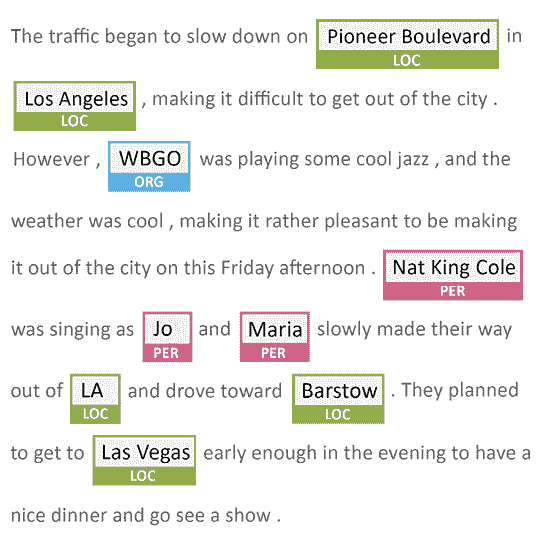
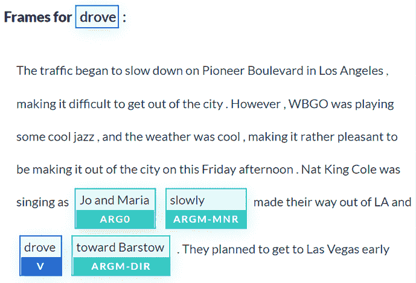
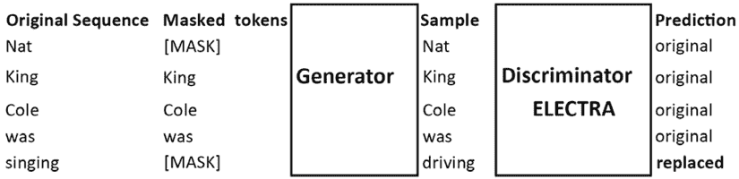
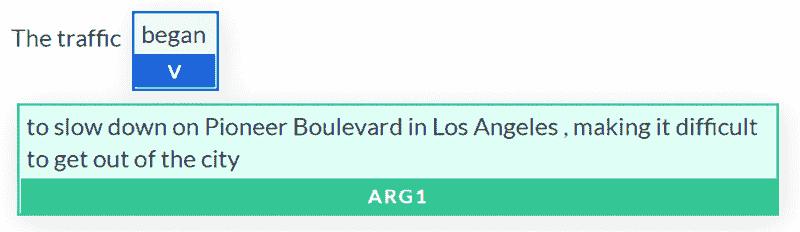
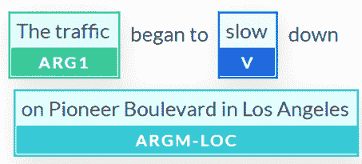
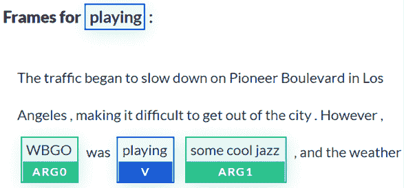
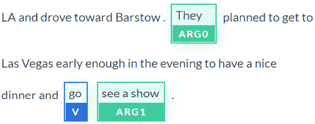
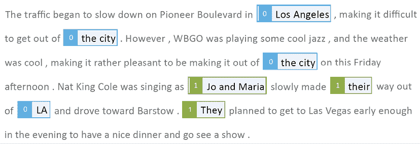

# 11

# 让你的数据说话：故事、问题和答案

阅读理解需要许多技能。当我们阅读一段文字时，我们注意关键词和主要事件，并创造内容的心理表征。然后我们可以利用我们对内容和表征的知识来回答问题。我们还会检查每个问题，以避免陷阱和错误。

无论它们变得多么强大，变压器都不能轻松回答开放式问题。开放环境意味着有人可以就任何主题提出任何问题，而变压器会正确回答。这对于某种程度的 GPT-3 来说是困难的，正如我们将在本章中看到的那样。然而，变压器通常在封闭的问答环境中使用通用领域训练数据集。例如，在医疗保健和法律解释中的关键性答案通常需要额外的 NLP 功能。

然而，变压器不能无论训练环境是否闭合都正确回答任何问题。如果一个序列包含多个主语和复合命题，变压器模型有时会做出错误的预测。

本章将重点介绍构建问题生成器的方法，该生成器利用其他 NLP 任务帮助在文本中找到明确的内容。问题生成器将展示一些应用于实现问答的思想。

我们将首先展示问随机问题并期望变压器每次都能良好响应的困难程度。

我们将通过引入**命名实体识别**（**NER**）功能来帮助`DistilBERT`模型回答问题，该功能建议合理的问题。此外，我们还将为变压器的问题生成器奠定基础。

我们将把一个预训练为鉴别器的 ELECTRA 模型添加到我们的问答工具箱中。

我们将在文本生成器的蓝图中添加**语义角色标注**（**SRL**）功能。

然后，*下一步*部分将提供额外的想法来构建可靠的问答解决方案，包括实现`Haystack`框架。

最后，我们将直接进入 GPT-3 Davinci 引擎在线界面，探索开放环境下的问答任务。再次强调，无需开发、培训和准备！

在本章结束时，你将看到如何构建自己的多任务 NLP 助手或使用云 AI 进行问答。

本章涵盖以下主题：

+   随机问答的极限

+   利用命名实体识别根据实体识别创建有意义的问题

+   开始设计变压器问题生成器的蓝图

+   测试使用 NER 找到的问题

+   引入预训练为鉴别器的 ELECTRA 编码器

+   使用标准问题测试 ELECTRA 模型

+   利用语义角色标注根据谓词识别创建有意义的问题

+   实施问答变压器的项目管理指南

+   分析如何利用 SRL 生成问题

+   利用 NER 和 SRL 的输出来定义变压器问题生成器的蓝图

+   使用 RoBERTa 探索 Haystack 的问答框架

+   使用 GPT-3 的界面无需开发或准备

让我们首先通过我们将应用的方法来分析问答任务的问题生成过程。

# 方法论

问答主要是作为一个涉及变压器和包含准备提问和回答这些问题的数据集的 NLP 练习。变压器被训练来回答在这个封闭环境中提出的问题。

然而，在更复杂的情况下，可靠的变压器模型实现需要定制方法。

## 变压器和方法

完美和高效的通用变压器模型，无论是用于问答还是其他 NLP 任务，都不存在。对于一个特定的数据集和任务来说，最适合的模型是产生最佳输出的模型。

*该方法在许多情况下优于模型*。例如，一个适当的方法通常会比一个优秀模型但有缺陷的方法产生更高效的结果。

在本章中，我们将运行`DistilBERT`、`ELECTRA`和`RoBERTa`模型。有些比其他模型有更好的*性能*。

但是，在关键领域中，*性能*并不保证结果。

例如，在太空火箭和航天器生产项目中，向 NLP 机器人提问意味着获得一个确切的答案。

假设用户需要在一个关于火箭再生式冷却喷嘴和燃烧室状态的一百页报告中提出问题。问题可能很具体，比如`冷却状态可靠吗？`这是用户从 NLP 机器人那里想要得到的底线信息。

简而言之，让 NLP 机器人、变压器模型或其他任何东西做一个没有质量和认知控制的统计答案是太冒险了，也不会发生。可信赖的 NLP 机器人将连接到一个包含数据和规则的知识库，以在后台运行基于规则的专家系统来检查 NLP 机器人的答案。NLP 变压器模型机器人将产生一个流畅、可靠的自然语言答案，可能还是人声。

适用于所有需求的通用变压器*模型*和*方法*并不存在。每个项目都需要特定的功能和定制的方法，这取决于用户的期望值，变化将是巨大的。

本章将着眼于超出特定变压器模型选择范围的问答的一般约束。本章不是一个问答项目指南，而是介绍了变压器如何用于问答。

我们将专注于在没有事先准备的情况下使用问答在开放环境中。变压器模型需要其他 NLP 任务和经典程序的帮助。我们将探索一些方法，以提供如何组合任务以达到项目目标的想法：

+   *Method 0* 探索了随机提问的试错方法。

+   *Method 1* 引入 NER 来帮助准备问答任务。

+   *Method 2* 尝试使用 ELECTRA 变压器模型来帮助默认变压器。它还引入了 SRL 来帮助变压器准备问题。

这三种方法的介绍表明，单一的问答方法对于高调的公司项目不起作用。添加 NER 和 SRL 将提高变压器代理解决方案的语言智能。

例如，在我最早的一个 AI NLP 项目中，为航空航天公司的防御项目实施问答功能，我结合了不同的 NLP 方法，以确保提供的答案是`100%`可靠的。

您可以为您实施的每个项目设计一个多方法解决方案。

让我们从试错方法开始。

# Method 0：试错

问答似乎非常简单。这是真的吗？让我们来看看。

打开本章将使用的 Google Colab 笔记本`QA.ipynb`。我们将逐个单元格地运行笔记本。

运行第一个单元格来安装 Hugging Face 的 transformers，这是我们将在本章中实施的框架：

```py
!pip install -q transformers 
```

注意：Hugging Face transformers 不断发展，更新库和模块以适应市场。如果默认版本不起作用，您可能需要使用`!pip install transformers==[与笔记本中的其他函数兼容的版本]`来固定一个版本。

我们现在将导入 Hugging Face 的 pipeline，其中包含许多即用型变压器资源。它们为 Hugging Face 库资源提供高级抽象函数，以执行各种任务。我们可以通过一个简单的 API 访问这些 NLP 任务。该程序是在 Google Colab 上创建的。建议使用免费的 Gmail 帐户在 Google Colab VM 上运行它。

通过一行代码导入`pipeline`：

```py
from transformers import pipeline 
```

一旦完成，我们有一行选项来实例化变压器模型和任务：

1.  使用默认的`model`和默认的`tokenizer`执行一个 NLP 任务：

    ```py
    pipeline("<task-name>") 
    ```

1.  使用自定义`model`执行一个 NLP 任务：

    ```py
    pipeline("<task-name>", model="<model_name>") 
    ```

1.  使用自定义`model`和自定义`tokenizer`执行 NLP 任务：

    ```py
    pipeline('<taskname>', model='<model name>', tokenizer='<tokenizer_name>') 
    ```

让我们从默认模型和分词器开始：

```py
nlp_qa = pipeline('question-answering') 
```

现在，我们只需要提供一段文本，然后我们将使用它来向变压器提交问题：

```py
sequence = "The traffic began to slow down on Pioneer Boulevard in Los Angeles, making it difficult to get out of the city. However, WBGO was playing some cool jazz, and the weather was cool, making it rather pleasant to be making it out of the city on this Friday afternoon. Nat King Cole was singing as Jo, and Maria slowly made their way out of LA and drove toward Barstow. They planned to get to Las Vegas early enough in the evening to have a nice dinner and go see a show." 
```

这个序列看起来非常简单，我们所需要做的就是将一行代码插入 API 中来提问并获得答案：

```py
nlp_qa(context=sequence, question='Where is Pioneer Boulevard ?') 
```

输出是一个完美的答案：

```py
{'answer': 'Los Angeles,', 'end': 66, 'score': 0.988201259751591, 'start': 55} 
```

我们刚刚用几行代码实现了一个问答变压器 NLP 任务！您现在可以下载一个包含文本、问题和答案的即用数据集。

实际上，本章可以在此结束，您将准备好进行问答任务了。然而，在实际实施中事情从来都不简单。假设我们必须为用户实现一个问答变换模型，让用户在数据库中存储的许多文档上提问。我们有两个重要的约束：

+   我们首先需要运行变换器通过一组关键文档，并创建显示系统工作的问题

+   我们必须展示如何保证变换器正确回答问题

几个问题立即出现：

+   谁将找到要询问测试系统的问题？

+   即使专家同意做这项工作，如果许多问题产生错误结果会怎么样？

+   如果结果不令人满意，我们是否会继续训练模型？

+   如果一些问题无论我们使用或训练哪个模型都无法回答，会发生什么？

+   如果这在有限样本上有效，但过程耗时且无法扩展，因为成本过高，会怎样？

如果我们只是试试专家帮助我们提出的问题，看看哪些有效，哪些无效，那将永远不会完成。试错不是解决方案。

本章旨在提供一些方法和工具，以降低实施问答变换模型的成本。*在为客户实施新数据集时，为问答问题找到好问题是一项相当大的挑战*。

我们可以将变换器视为我们可以根据需要组装的一套乐高®（LEGO®）堆积积木，使用编码器堆栈或解码器堆栈。我们可以使用一组小型、大型或**超大**（**XL**）变换器模型。

我们还可以将我们在本书中探讨过的 NLP 任务看作是我们必须实施的项目中的解决方案的一套乐高®（LEGO®）集。我们可以组装两个或更多 NLP 任务来达到我们的目标，就像任何其他软件实现一样。我们可以从试错搜索问题转向系统方法。

在本章中：

+   我们将继续逐个单元格运行`QA.ipynb`来探索每个部分描述的方法。

+   我们还将使用`AllenNLP` NER 接口获取 NER 和 SRL 结果的可视化表示。您可以通过访问[`demo.allennlp.org/reading-comprehension`](https://demo.allennlp.org/reading-comprehension)，然后选择**命名实体识别**或**语义角色标注**，并输入序列，在界面中输入句子。在本章中，我们将考虑使用的`AllenNLP`模型。我们只想获得可视化表示。

让我们从尝试使用 NER-first 方法为问题回答找到合适的 XL 变换器模型问题开始。

# 方法 1：NER 先

本节将使用 NER 来帮助我们找到好问题的想法。变压器模型是持续训练和更新的。此外，用于训练的数据集可能会发生变化。最后，这些不是基于规则的算法，每次可能产生相同的结果。输出可能会在一个运行到另一个运行之间发生变化。NER 可以检测序列中的人、位置、组织和其他实体。我们首先运行一个 NER 任务，它将为我们提供段落的一些主要部分，以便我们专注于提问。

## 使用 NER 寻找问题

我们将继续逐步运行`QA.ipynb`。现在程序使用 NER 任务以默认模型和分词器初始化管道：

```py
nlp_ner = pipeline("ner") 
```

我们将继续使用本章*方法 0：试和错误*部分中运行的看似简单的序列：

```py
sequence = "The traffic began to slow down on Pioneer Boulevard in Los Angeles, making it difficult to get out of the city. However, WBGO was playing some cool jazz, and the weather was cool, making it rather pleasant to be making it out of the city on this Friday afternoon. Nat King Cole was singing as Jo and Maria slowly made their way out of LA and drove toward Barstow. They planned to get to Las Vegas early enough in the evening to have a nice dinner and go see a show." 
```

我们在`QA.ipynb`中运行了`nlp_ner`单元格：

```py
print(nlp_ner(sequence)) 
```

输出生成了自然语言处理任务的结果。分数被四舍五入到两位小数以适应页面的宽度：

```py
[{'word': 'Pioneer', 'score': 0.97, 'entity': 'I-LOC', 'index': 8}, 
{'word': 'Boulevard', 'score': 0.99, 'entity': 'I-LOC', 'index': 9}, 
{'word': 'Los', 'score': 0.99, 'entity': 'I-LOC', 'index': 11}, 
{'word': 'Angeles', 'score': 0.99, 'entity': 'I-LOC', 'index': 12}, 
{'word': 'W', 'score': 0.99, 'entity': 'I-ORG', 'index': 26}, 
{'word': '##B', 'score': 0.99, 'entity': 'I-ORG', 'index': 27}, 
{'word': '##G', 'score': 0.98, 'entity': 'I-ORG', 'index': 28}, 
{'word': '##O', 'score': 0.97, 'entity': 'I-ORG', 'index': 29}, 
{'word': 'Nat', 'score': 0.99, 'entity': 'I-PER', 'index': 59}, 
{'word': 'King', 'score': 0.99, 'entity': 'I-PER', 'index': 60}, 
{'word': 'Cole', 'score': 0.99, 'entity': 'I-PER', 'index': 61}, 
{'word': 'Jo', 'score': 0.99, 'entity': 'I-PER', 'index': 65}, 
{'word': 'Maria', 'score': 0.99, 'entity': 'I-PER', 'index': 67},
{'word': 'LA', 'score': 0.99, 'entity': 'I-LOC', 'index': 74}, 
{'word': 'Bar', 'score': 0.99, 'entity': 'I-LOC', 'index': 78}, 
{'word': '##sto', 'score': 0.85, 'entity': 'I-LOC', 'index': 79}, 
{'word': '##w', 'score': 0.99, 'entity': 'I-LOC', 'index': 80}, 
{'word': 'Las', 'score': 0.99 'entity': 'I-LOC', 'index': 87}, 
{'word': 'Vegas', 'score': 0.9989519715309143, 'entity': 'I-LOC', 'index': 88}] 
```

Hugging Face 的文档描述了在我们的案例中使用的标签。主要的标签包括：

+   `I-PER`，一个人的名字

+   `I-ORG`，一个组织名称

+   `I-LOC`，一个位置名称

结果是正确的。注意`Barstow`被分成了三个标记。

让我们在**命名实体识别**部分的`AllenNLP`上运行相同的序列（[`demo.allennlp.org/named-entity-recognition`](https://demo.allennlp.org/named-entity-recognition)）以获得我们序列的可视化表示：



图 11.1：NER

我们可以看到 NER 已经突出显示了我们将用于创建问答问题的关键实体。

让我们询问我们的变压器两种类型的问题：

+   与位置相关的问题

+   与人有关的问题

让我们从位置问题开始。

### 位置实体问题

`QA.ipynb`生成了近 20 个实体。位置实体特别有趣：

```py
[{'word': 'Pioneer', 'score': 0.97, 'entity': 'I-LOC', 'index': 8}, 
{'word': 'Boulevard', 'score': 0.99, 'entity': 'I-LOC', 'index': 9}, 
{'word': 'Los', 'score': 0.99, 'entity': 'I-LOC', 'index': 11}, 
{'word': 'Angeles', 'score': 0.99, 'entity': 'I-LOC', 'index': 12}, 
{'word': 'LA', 'score': 0.99, 'entity': 'I-LOC', 'index': 74}, 
{'word': 'Bar', 'score': 0.99, 'entity': 'I-LOC', 'index': 78}, 
{'word': '##sto', 'score': 0.85, 'entity': 'I-LOC', 'index': 79}, 
{'word': '##w', 'score': 0.99, 'entity': 'I-LOC', 'index': 80}, 
{'word': 'Las', 'score': 0.99 'entity': 'I-LOC', 'index': 87}, 
{'word': 'Vegas', 'score': 0.9989519715309143, 'entity': 'I-LOC', 'index': 88}] 
```

#### 应用启发式方法

我们可以应用启发式方法，使用`QA.ipynb`生成的输出创建问题：

+   将位置合并回其原始形式

+   将模板应用到位置

本书的范围已经超出了为项目写经典代码的范围。我们可以编写一个能为我们完成工作的函数，如下伪代码所示：

```py
for i in range beginning of output to end of the output:
    filter records containing I-LOC
    merge the I-LOCs that fit together
    save the merged I-LOCs for questions-answering 
```

NER 的输出将变为：

+   `I-LOC`，`Pioneer Boulevard`

+   `I-LOC`，`Los Angeles`

+   `I-LOC`，`LA`

+   `I-LOC`，`Barstow`

+   `I-LOC`，`Las Vegas`

我们可以使用两个模板自动生成问题。例如，我们可以应用一个随机函数。我们可以编写一个能为我们完成工作的函数，如下伪代码所示：

```py
from the first location to the last location:
    choose randomly:
        Template 1: Where is [I-LOC]?
        Template 2: Where is [I-LOC] located? 
```

我们将自动生成五个问题。例如：

```py
Where is Pioneer Boulevard?
Where is Los Angeles located?
Where is LA?
Where is Barstow?
Where is Las Vegas located? 
```

我们知道，有些问题不能直接用我们创建的序列回答。但我们也可以自动处理这个问题。假设问题是用我们的方法自动生成的：

1.  输入一个序列

1.  运行 NER

1.  自动创建问题

假设问题是自动生成的，然后让我们运行它们：

```py
nlp_qa = pipeline('question-answering')
print("Question 1.",nlp_qa(context=sequence, question='Where is Pioneer Boulevard ?'))
print("Question 2.",nlp_qa(context=sequence, question='Where is Los Angeles located?'))
print("Question 3.",nlp_qa(context=sequence, question='Where is LA ?'))
print("Question 4.",nlp_qa(context=sequence, question='Where is Barstow ?'))
print("Question 5.",nlp_qa(context=sequence, question='Where is Las Vegas located ?')) 
```

输出显示只有 `问题 1` 被正确回答了：

```py
Question 1\. {'score': 0.9879662851935791, 'start': 55, 'end': 67, 'answer': 'Los Angeles,'}
Question 2\. {'score': 0.9875189033668121, 'start': 34, 'end': 51, 'answer': 'Pioneer Boulevard'}
Question 3\. {'score': 0.5090435442006118, 'start': 55, 'end': 67, 'answer': 'Los Angeles,'}
Question 4\. {'score': 0.3695214621538554, 'start': 387, 'end': 396, 'answer': 'Las Vegas'}
Question 5\. {'score': 0.21833994202792262, 'start': 355, 'end': 363, 'answer': 'Barstow.'} 
```

输出显示了 `分数`、答案的 `起始` 和 `结束` 位置，以及 `答案` 本身。在这次运行中，`问题 2` 的 `分数` 是 `0.98`，尽管它错误地说明了 `Pioneer Boulevard` 在 `Los Angeles` 中。

现在我们该怎么办？

现在是控制变压器的时间了，通过项目管理来增加质量和决策功能。

#### 项目管理

我们将检查四个例子，其中包括管理变压器和管理它的硬编码函数的方法。我们将这四个项目管理示例分类为四个项目级别：简单、中级、困难和非常困难。项目管理不在本书的范围之内，因此我们将简要介绍这四个类别：

1.  **一个简单的项目** 可以是一个小学的网站。老师可能会对我们所见到的感到高兴。文本可以显示在 HTML 页面上。我们自动获得的五个问题的答案可以与一些开发合并为五个断言，并以固定格式显示：`I-LOC 在 I-LOC 中`（例如，`Barstow 在 California 中`）。然后在每个断言下添加 `(True, False)`。老师所需要做的就是有一个管理员界面，允许老师点击正确答案来完成多项选择问卷！

1.  **一个中级项目** 可以是封装变压器的自动问题和答案，使用 API 检查答案并自动纠正的程序。用户看不到任何东西。这个过程是无缝的。变压器产生的错误答案将被存储以供进一步分析。

1.  **一个困难的项目** 将是在具有后续问题的聊天机器人中实现一个中级项目。例如，变压器将 `Pioneer Boulevard` 正确放置在 `Los Angeles` 中。聊天机器人用户可能会问一个自然的后续问题，比如 `在 LA 的哪里附近？` 这需要更多的开发。

1.  **一个非常困难的项目** 将是一个研究项目，培训变压器识别数据集中数百万记录中的 `I-LOC` 实体，并输出地图软件 API 的实时流结果。

好消息是我们也可以找到一种利用我们所发现的方法。

坏消息是，实现的变压器或任何现实项目中的 AI 需要强大的机器和项目经理、**主题专家**（**SMEs**）、开发人员和最终用户之间大量的团队合作。

现在让我们尝试人物实体问题。

### 人物实体问题

让我们从变压器的一个简单问题开始：

```py
nlp_qa = pipeline('question-answering')
nlp_qa(context=sequence, question='Who was singing ?') 
```

答案是正确的。它说明了序列中谁在唱歌：

```py
{'answer': 'Nat King Cole,'
 'end': 277,
 'score': 0.9653632081862433,
 'start': 264} 
```

现在我们将向变压器提出一个需要一些思考的问题，因为它没有明确陈述：

```py
nlp_qa(context=sequence, question='Who was going to Las Vegas ?') 
```

不能回答那个问题而不分析句子。转换器犯了一个大错误：

```py
{'answer': 'Nat King Cole,'
 'end': 277,
 'score': 0.3568152742800521,
 'start': 264} 
```

转换器足够诚实，只显示了一个`0.35`的分数。这个`分数`可能因每次计算或不同转换器模型而异。我们可以看到转换器遇到了一个语义标记问题。让我们尝试通过应用 SRL-first 方法来更好地处理人物实体问题。

# 方法 2：首先进行 SRL

转换器找不到是谁驾车去`Las Vegas`，认为是来自`Nat King Cole`而不是`Jo`和`Maria`。

发生了什么错了？我们能看到转换器的想法并获得解释吗？要找出，请返回语义角色建模。如果需要，花几分钟回顾*第十章*，*基于 BERT 的转换器的语义角色标记*。

让我们在**语义角色标记**部分的`AllenNLP`上运行相同的序列，[`demo.allennlp.org/semantic-role-labeling`](https://demo.allennlp.org/semantic-role-labeling)，以通过运行我们在上一章节中使用的 SRL BERT 模型来获取动词`drove`的视觉表示：



图 11.2：在文本上运行的 SRL

SRL BERT 找到了 19 个帧。在本节中，我们专注于`drove`。

注意：结果可能因每次运行或当 AllenNLP 更新模型版本时而有所不同。

我们可以看到问题所在。动词`drove`的论点是`Jo 和 Maria`。似乎可以推断出结论。

请记住，转换器模型不断发展。输出可能会有所不同；但是，概念保持不变。

真的吗？让我们在`QA.ipynb`中提出问题：

```py
nlp_qa(context=sequence, question='Who are they?') 
```

输出是正确的：

```py
{'answer': 'Jo and Maria',
 'end': 305,
 'score': 0.8486017557290779,
 'start': 293} 
```

我们能找到一个提出问题以获得正确答案的方法吗？我们将尝试通过改写问题来实现：

```py
nlp_qa(context=sequence, question='Who drove to Las Vegas?') 
```

我们得到了稍微更好的结果：

```py
{'answer': 'Nat King Cole was singing as Jo and Maria',
 'end': 305,
 'score': 0.35940926070820467,
 'start': 264} 
```

转换器现在理解`Nat King Cole`在`唱歌`，而`Jo 和 Maria`在同时做一些事情。

我们仍然需要进一步，找到一个提出更好问题的方法。

让我们尝试另一个模型。

## 使用 ELECTRA 进行问答

在切换模型之前，我们需要知道我们正在使用哪个模型：

```py
print(nlp_qa.model) 
```

输出首先显示该模型是一个在问答训练的 DistilBERT 模型：

```py
DistilBertForQuestionAnswering((distilbert): DistilBertModel( 
```

该模型有`6`层和`768`个特征，如第`6`层所示（层从`0`到`n`编号）：

```py
(5): TransformerBlock(
          (attention): MultiHeadSelfAttention(
            (dropout): Dropout(p=0.1, inplace=False)
            (q_lin): Linear(in_features=768, out_features=768, bias=True)
            (k_lin): Linear(in_features=768, out_features=768, bias=True)
            (v_lin): Linear(in_features=768, out_features=768, bias=True)
            (out_lin): Linear(in_features=768, out_features=768, bias=True) 
```

现在我们将尝试`ELECTRA`转换器模型。*Clark*等人（2020 年）设计了一个改进**掩码语言建模**（**MLM**）预训练方法的转换器模型。

在*第三章*，*Fine-Tuning BERT Models*，*Masked language modeling*小节中，我们看到 BERT 模型在训练过程中插入带有`[MASK]`的随机掩码标记。 

*Clark*等人（2020）提出了一种可行的替代方案，使用了生成器网络而不仅仅是使用随机令牌。BERT 模型被训练以预测（屏蔽的）损坏令牌的标识。*Clark*等人（2020）训练了一个 ELECTRA 模型作为鉴别器，以预测屏蔽的令牌是否是生成的令牌。*图 11.3*显示了 ELECTRA 的训练方式：



图 11.3：ELECTRA 作为鉴别器进行训练

*图 11.3*显示，在送入生成器之前，原始序列会被屏蔽。生成器插入*可接受*的令牌而不是随机的令牌。ELECTRA 变压器模型训练以预测一个令牌是否来自原始序列还是已被替换。

一个 ELECTRA 变压器模型的架构和大多数超参数与 BERT 变压器模型相同。

我们现在希望看看是否能获得更好的结果。在*QA.ipynb*中要运行的下一个单元是使用*ELECTRA-small-generator*的问答单元：

```py
nlp_qa = pipeline('question-answering', model='google/electra-small-generator', tokenizer='google/electra-small-generator')
nlp_qa(context=sequence, question='Who drove to Las Vegas ?') 
```

输出不是我们所期望的：

```py
{'answer': 'to slow down on Pioneer Boulevard in Los Angeles, making it difficult to',
 'end': 90,
 'score': 2.5295573154019736e-05,
 start': 18} 
```

输出可能会从一个运行或变压器模型到另一个变化；然而，想法仍然是一样的。

输出也发送了训练消息：

```py
- This IS expected if you are initializing ElectraForQuestionAnswering from the checkpoint of a model trained on another task or with another architecture..
- This IS NOT expected if you are initializing ElectraForQuestionAnswering from the checkpoint of a model that you expect to be exactly identical.. 
```

你可能不喜欢这些警告消息，并可能得出这是一个糟糕的模型的结论。但一定要尽可能地探索给你提供的每一个途径。当然，ELECTRA 可能需要更多的训练。但*尝试*尽可能多地找到新的想法! 然后你可以决定是否进一步训练模型或转移到另一个模型。

我们现在必须考虑下一步要采取的步骤。

## 项目管理约束

我们并没有获得我们所期望的默认 DistilBERT 和 ELECTRA 变压器模型的结果。

在其他解决方案中，有三个主要选项：

+   用额外的数据集训练 DistilBERT 和 ELECTRA 或其他模型。在现实项目中，训练数据集是一个昂贵的过程。如果需要实施新的数据集并改变超参数，训练可能会持续几个月。硬件成本也需要考虑在内。此外，如果结果不尽人意，项目经理可能会关闭项目。

+   你也可以尝试使用现成的变压器，尽管它们可能不符合你的需求，比如 Hugging Face 模型：[`huggingface.co/transformers/usage.html#extractive-question-answering`](https://huggingface.co/transformers/usage.html#extractive-question-answering)。

+   通过使用额外的 NLP 任务来帮助问答模型，找到获得更好结果的方法。

在本章中，我们将重点关注寻找额外的 NLP 任务，以帮助默认的 DistilBERT 模型。

让我们使用 SRL 来提取谓词及其论证。

## 使用 SRL 来找到问题

AllenNLP 使用我们在*SRL.ipynb*笔记本中实现的基于 BERT 的模型，*第十章*，*使用基于 BERT 的变压器进行语义角色标注*。

让我们在**语义角色标注**部分重新运行 AllenNLP 上的序列，[`demo.allennlp.org/semantic-role-labeling`](https://demo.allennlp.org/semantic-role-labeling)，以获取句子中谓词的可视化表示。

我们将进入我们一直在处理的序列：

```py
The traffic began to slow down on Pioneer Boulevard in Los Angeles, making it difficult to get out of the city. However, WBGO was playing some cool jazz, and the weather was cool, making it rather pleasant to be making it out of the city on this Friday afternoon. Nat King Cole was singing as Jo and Maria slowly made their way out of LA and drove toward Barstow. They planned to get to Las Vegas early enough in the evening to have a nice dinner and go see a show. 
```

基于 BERT 模型找到了几个谓词。我们的目标是找到 SRL 输出的特性，可以根据句子中的动词自动生成问题。

我们将首先列出 BERT 模型产生的谓词候选者：

```py
verbs={"began," "slow," "making"(1), "playing," "making"(2), "making"(3), "singing,",…, "made," "drove," "planned," go," see"} 
```

如果我们必须编写一个程序，我们可以先引入一个动词计数器，如下面的伪代码所示：

```py
def maxcount:
for in range first verb to last verb:
    for each verb
       counter +=1
       if counter>max_count, filter verb 
```

如果计数器超出可接受发生的次数（`max_count`），则该动词将在此实验中被排除。如果没有进一步的开发，要消除动词参数的多重语义角色将会太困难。

让我们也把`made`（`make`的过去式）从列表中移除。

我们的列表现在被限制在：

```py
verbs={"began," "slow," "playing," "singing," "drove," "planned," go," see"} 
```

如果我们继续编写一个函数来过滤动词，我们可以寻找参数很长的动词。动词`began`有一个非常长的参数：



图 11.4：SRL 应用于动词“began”

`began`的参数太长，无法在截图中显示。文本版本显示了解释`began`参数有多困难：

```py
began: The traffic [V: began] [ARG1: to slow down on Pioneer Boulevard in Los Angeles , making it difficult to get out of the city] . However , WBGO was playing some cool jazz] , and the weather was cool , making it rather pleasant to be making it out of the city on this Friday afternoon . Nat King Cole was singing as Jo and Maria slowly made their way out of LA and drove toward Barstow . They planned to get to Las Vegas early enough in the evening to have a nice dinner and go see a show . 
```

我们可以添加一个函数来过滤包含超出最大长度的参数的动词：

```py
def maxlength:
for in range first verb to last verb:
    for each verb
       if length(argument of verb)>max_length, filter verb 
```

如果一个动词的参数长度超过了最大长度（`max_length`），则该动词将在此实验中被排除。暂时让我们把`began`从列表中移出：

我们的列表现在被限制在：

```py
verbs={ "slow", "playing", "singing", "drove",   "planned"," go"," see"} 
```

我们可以根据我们正在处理的项目添加更多排除规则。我们还可以再次使用非常严格的`max_length`值调用`maxlength`函数，以提取可能对我们的自动问题生成器感兴趣的候选动词。参数最短的动词候选者可以转换为问题。动词`slow`符合我们设置的三条规则：它在序列中只出现一次，参数不太长，并且包含序列中一些最短的参数。AllenNLP 的可视化表示确认了我们的选择：



图 11.5：SRL 应用于动词“slow”

文本输出可以很容易地被解析：

```py
slow: [ARG1: The traffic] began to [V: slow] down [ARG1: on] [ARGM-ADV: Pioneer Boulevard] [ARGM-LOC: in Los Angeles] , [ARGM-ADV: making it difficult to get out of the city] . 
```

这个结果和接下来的输出可能会随着不断发展的转换模型而有所变化，但是想法仍然是一样的。动词`slow`被识别出来，而这是 SRL 输出的关键方面。

我们可以自动生成`what`模板。我们不会生成`who`模板，因为没有一个参数标记为`I-PER`（人物）。我们可以编写一个函数来管理这两种可能性，如下面的伪代码所示：

```py
def whowhat:
   if NER(ARGi)==I-PER, then:
        template=Who is [VERB]  
   if NER(ARGi)!=I-PER, then:
     template=What is [VERB] 
```

这个函数需要更多的工作来处理动词形式和修饰词。然而，在这个实验中，我们将只应用该函数并生成以下问题：

```py
What is slow? 
```

让我们用下面的单元格来运行默认的`pipeline`：

```py
nlp_qa = pipeline ('question-answering')
nlp_qa(context= sequence, question='What was slow?') 
```

结果是令人满意的：

```py
{'answer': 'The traffic',
'end': 11, 
'score': 0.4652545872921081, 
'start': 0} 
```

默认模型，在这种情况下是`DistilBERT`，正确回答了问题。

我们的自动问答生成器可以做到以下几点：

+   自动运行 NER

+   用经典代码解析结果

+   生成仅实体问题

+   自动运行 SRL

+   使用规则过滤结果

+   使用 NER 结果生成仅 SRL 问题，以确定使用哪个模板

这个解决方案绝对并不完整。还需要更多的工作，可能需要额外的自然语言处理任务和代码。然而，这给出了实现任何形式的 AI 所需的艰苦工作的一个概念。

让我们尝试我们的方法与下一个过滤动词：`playing`。可视化表示显示参数是`WBGO`和`一些很酷的爵士乐`：



图 11.6：应用于动词“playing”的 SRL

文本版本易于解析：

```py
playing: The traffic began to slow down on Pioneer Boulevard in Los Angeles , making it difficult to get out of the city . [ARGM-DIS: However] , [ARG0: WBGO] was [V: playing] [ARG1: some cool jazz] 
```

这个结果和以下输出可能会随着不断发展的变压器模型而有所不同，但思想仍然是一样的：识别动词及其参数。

如果我们运行`whowhat`函数，它会显示参数中没有`I-PER`。所选模板将是`what`模板，并且以下问题可能会自动生成：

```py
What is playing? 
```

让我们在以下单元格中使用这个问题来运行默认的 pipeline：

```py
nlp_qa = pipeline('question-answering')
nlp_qa(context=sequence, question='What was playing') 
```

输出也是令人满意的：

```py
{'answer': 'cool jazz,,'
 'end': 153,
 'score': 0.35047012837950753,
 'start': 143} 
```

`唱歌`是一个很好的选择，`whowhat`函数会找到`I-PER`模板并自动生成以下问题：

```py
Who is singing? 
```

我们已经在本章中成功测试了这个问题。

下一个动词是`drove`，我们已经标记为一个问题。变压器无法解决这个问题。

动词`go`是一个很好的选择：



图 11.7：应用于动词“go”的 SRL

需要进一步开发才能生成带有正确动词形式的模板。假设工作已完成并问模型以下问题：

```py
nlp_qa = pipeline('question-answering')
nlp_qa(context=sequence, question='Who sees a show?') 
```

输出是错误的参数：

```py
{'answer': 'Nat King Cole,'
 'end': 277,
 'score': 0.5587267250683112,
 'start': 264} 
```

我们可以看到`Nat King Cole`、`Jo`和`Maria`在一个复杂序列中的出现会为变压器模型和任何 NLP 模型造成歧义问题。需要更多的项目管理和研究。

# 下一步

实现问答或捷径的方法并不容易。我们开始实施可以自动生成问题的方法。自动生成问题是 NLP 的一个关键方面。

需要对更多 Transformer 模型进行预训练，包含命名实体识别（NER）、语义角色标注（SRL）和问答问题，以解决问题。项目经理还需要学习如何组合几个 NLP 任务来帮助解决特定任务，例如问答。

指代消解，[`demo.allennlp.org/coreference-resolution`](https://demo.allennlp.org/coreference-resolution)，可以帮助我们的模型识别我们工作的序列中的主要主语。这个由 `AllenNLP` 生成的结果显示了一个有趣的分析：



图 11.8：序列的指代消解

我们可以通过添加指代消解的输出来继续开发我们的程序：

```py
Set0={'Los Angeles', 'the city,' 'LA'}
Set1=[Jo and Maria, their, they} 
```

我们可以将指代消解添加为一个预训练任务，或者将其作为问题生成器的后处理任务。无论哪种方式，模拟人类行为的问题生成器都可以显著提升问答任务的性能。我们将在问题回答模型的预训练过程中包含更多定制的额外 NLP 任务。

当然，我们可以决定使用新的策略来预训练我们在本章中运行的模型，例如 DistilBERT 和 ELECTRA，然后让用户提出他们希望的问题。我推荐两种方法都使用：

+   为问答任务开发问题生成器。这些问题可以用于教育目的，训练 Transformer，甚至为实时用户提供思路。

+   通过包含特定的 NLP 任务来对 Transformer 模型进行预训练，这将提高它们的问答性能。使用问题生成器进一步训练它。

## 使用 RoBERTa 模型探索 Haystack

`Haystack` 是一个具有有趣功能的问答框架。值得探索一下，看看它是否适合您的项目需求。

在本节中，我们将对我们在本章中使用其他模型和方法进行实验的句子进行问答。

打开 `Haystack_QA_Pipeline.ipynb`。

第一个单元格安装运行 `Haystack` 所需的模块：

```py
# Install Haystack
!pip install farm-haystack==0.6.0
# Install specific versions of urllib and torch to avoid conflicts with preinstalled versions on Colab
!pip install urllib3==1.25.4
!pip install torch==1.6.0+cu101-f https://download.pytorch.org/whl/torch_stable.html 
```

这个笔记本使用了一个 RoBERTa 模型：

```py
# Load a  local model or any of the QA models on Hugging Face's model hub (https://huggingface.co/models)
from haystack.reader.farm import FARMReader
reader = FARMReader(model_name_or_path="deepset/roberta-base-squad2", use_gpu=True, no_ans_boost=0, return_no_answer=False) 
```

您可以回到*第四章*，*从头开始预训练 RoBERTa 模型*，了解 RoBERTa 模型的一般描述。

笔记本的其余部分将回答我们在本章中详细探讨的文本的问题：

```py
text = "The traffic began to slow down on Pioneer Boulevard in…/… have a nice dinner and go see a show." 
```

您可以比较之前章节的输出得到的答案，并决定您想要实现哪种 Transformer 模型。

## 使用 GTP-3 引擎探索问答

本节将尝试避免训练、微调、在服务器上加载程序，甚至使用数据集。相反，用户只需连接到他们的 OpenAI 账户并使用交互式教育界面即可。

一个 GPT-3 引擎在线教育界面将通过提供 *E*（解释）和 *T*（文本）来提供足够好的答案，如下所示：

*E* = 回答这段文本的问题

*T* = `在先驱大道上交通开始减速……/……吃一顿美味的晚餐，然后去看一场演出。`

以下是以问答形式提出的一些问题和获得的答案：

+   `谁要去拉斯维加斯？`: `乔和玛丽亚`

+   `谁在唱歌？`: `纳特·金·科尔`

+   `正在播放什么样的音乐？`: `爵士`

+   `晚上的计划是什么？`: `吃一顿美味的晚餐，然后去看一场演出`

就是这样！这就是您在线运行各种教育 NLP 任务所需做的一切，即使没有 GPT-3 引擎的 API，也可以使用交互式界面。

你可以改变*S*（向 GPT-3 展示预期的内容）和*E*，并创建无尽的互动。下一代 NLP 诞生了！工业 4.0 的开发人员、顾问或项目经理需要掌握一套新的技能：认知方法、语言学、心理学和其他跨学科的维度。如果需要，您可以花时间返回到*第七章*，*GPT-3 引擎超人变压器的崛起*。

我们已经探讨了使用变压器进行问答的一些关键方面。让我们总结一下我们所做的工作。

# 摘要

在本章中，我们发现问答并不像看起来那么容易。实现一个变压器模型只需几分钟。然而，让它正常运行可能需要几个小时或几个月！

我们首先让 Hugging Face 管道中的默认变压器回答一些简单的问题。默认变压器 DistilBERT 对简单的问题回答得相当好。然而，我们选择了简单的问题。在现实生活中，用户提出各种各样的问题。变压器可能会感到困惑，并产生错误的输出。

然后，我们决定是否继续随机提问并得到随机答案，还是开始设计一个问题生成器的蓝图，这是一个更有效的解决方案。

我们首先使用 NER 来找到有用的内容。我们设计了一个函数，可以根据 NER 输出自动生成问题。质量很有前途，但需要更多的工作。

我们尝试了一个 ELECTRA 模型，但并没有产生我们预期的结果。我们停顿了几分钟，决定是花费昂贵的资源来训练变压器模型，还是设计一个问题生成器。

我们在问题生成器的蓝图中添加了 SRL，并测试了它可以生成的问题。我们还在分析中添加了 NER，并生成了几个有意义的问题。还引入了`Haystack`框架，以发现使用 RoBERTa 进行问答的其他方法。

最后，我们在没有 API 的情况下，直接在 OpenAI 教育交互界面中运行了一个使用 GPT-3 引擎的示例。云 AI 平台的功能和可访问性正在增加。

我们的实验得出了一个结论：多任务 Transformer 在复杂的 NLP 任务上会比单一任务训练的 Transformer 提供更好的性能。实现 Transformer 需要准备充分的多任务训练、经典代码中的启发式以及一个问题生成器。问题生成器可以进一步训练模型，方法是使用问题作为训练输入数据或作为独立解决方案。

在下一章节中，*检测客户情绪以进行预测*，我们将探讨如何在社交媒体反馈上实现情感分析。

# 问题

1.  训练过的 Transformer 模型可以回答任何问题。（True/False）

1.  问答不需要进一步的研究。它现在已经完美了。（True/False）

1.  **命名实体识别**（**NER**）在寻找有意义的问题时可以提供有用的信息。（True/False）

1.  **语义角色标注**（**SRL**）在准备问题时毫无用处。（True/False）

1.  一个问题生成器是生成问题的绝佳方式。（True/False）

1.  实现问答需要仔细的项目管理。（True/False）

1.  ELECTRA 模型与 GPT-2 具有相同的架构。（True/False）

1.  ELECTRA 模型与 BERT 具有相同的架构，但是被训练为判别器。（True/False）

1.  NER 能够识别一个地点并将其标记为 `I-LOC`。（True/False）

1.  NER 能够识别一个人并将其标记为 `I-PER`。（True/False）

# 参考文献

+   *艾伦研究所* ：[`allennlp.org/`](https://allennlp.org/)

+   *艾伦研究所* 的阅读理解资源：[`demo.allennlp.org/reading-comprehension`](https://demo.allennlp.org/reading-comprehension)

+   *Kevin Clark*、*Minh-Thang Luong*、*Quoc V. Le*、*Christopher D. Manning*，2020 年，*ELECTRA：将文本编码器预训练为判别器而不是生成器*：[`arxiv.org/abs/2003.10555`](https://arxiv.org/abs/2003.10555)

+   Hugging Face pipelines：[`huggingface.co/transformers/main_classes/pipelines.html`](https://huggingface.co/transformers/main_classes/pipelines.html)

+   GitHub Haystack 框架存储库：[`github.com/deepset-ai/haystack/`](https://github.com/deepset-ai/haystack/)

# 加入我们书籍的 Discord 空间

加入本书的 Discord 工作区，与作者进行每月的 *问我任何事* 会话：

[`www.packt.link/Transformers`](https://www.packt.link/Transformers)


