# 第十二章：检测客户情绪以进行预测

情感分析依赖于组合性原则。如果我们无法理解句子的部分，如何理解整个句子？这对于 NLP Transformers模型来说是一项困难的任务吗？我们将在本章中尝试几个Transformers模型以找出答案。

我们将从 **斯坦福情感树库**（**SST**）开始。SST 提供了用于分析的复杂句子数据集。分析诸如 `电影很棒` 这样的句子很容易。但是，如果任务变得非常困难，如 `虽然电影有点太长，但我真的很喜欢它。` 这个句子被分割了。它迫使一个Transformers模型理解序列的结构和逻辑形式。

然后我们将测试几个Transformers模型，包括复杂句子和简单句子。我们会发现，无论我们尝试哪种模型，如果没有足够的训练，它都不会起作用。Transformers模型就像我们一样。它们是需要努力学习并尝试达到现实生活中人类基准的学生。

运行 DistilBERT、RoBERTa-large、BERT-base、MiniLM-L12-H84-uncased 和 BERT-base 多语言模型非常有趣！然而，我们会发现其中一些模型需要更多的训练，就像我们一样。

在此过程中，我们将看到如何利用情感任务的输出来改善客户关系，并了解一个您可以在网站上实现的漂亮的五星级界面。

最后，我们将使用 GPT-3 的在线界面进行情感分析，无需 OpenAI 账户的 AI 开发或 API！

本章涵盖以下主题：

+   用于情感分析的 SST

+   为长序列定义组合性

+   使用 AllenNLP 进行情感分析（RoBERTa）

+   运行复杂句子，探索Transformers的新领域

+   使用 Hugging Face 情感分析模型

+   DistilBERT 用于情感分析

+   尝试 MiniLM-L12-H384-uncased

+   探索 RoBERTa-large-mnli

+   探究 BERT-base 多语言模型

+   使用 GPT-3 进行情感分析

让我们从 SST 开始。

# 入门：情感分析 transformers

本节将首先探索Transformers将用于情感分析的 SST。

接下来我们将使用 AllenNLP 运行一个 RoBERTa-large transformer。

# 斯坦福情感树库（SST）

*Socher* 等人（2013）设计了长短语的语义词空间。他们定义了应用于长序列的 *组合性* 原则。组合性原则意味着 NLP 模型必须检查复杂句子的组成表达式以及组合它们的规则，以理解序列的含义。

让我们从 SST 中取样以掌握组合性原则的含义。

本节和本章内容独立完整，您可以选择执行所述的操作，或者阅读章节并查看提供的屏幕截图。

前往交互式情感树库：[`nlp.stanford.edu/sentiment/treebank.html?na=3&nb=33`](https://nlp.stanford.edu/sentiment/treebank.html?na=3&nb=33)。

你可以进行你想要的选择。情感树图将显示在页面上。点击图像以获取情感树：

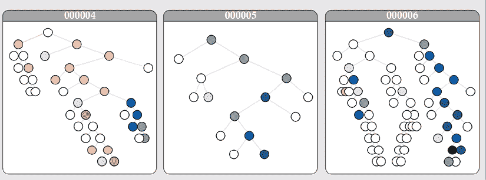

图 12.1：情感树图

对于这个例子，我点击了包含提到`在语言学中解构理论的先驱雅克·德里达`的句子的第 6 图表。出现了一个又长又复杂的句子：

无论你是否受到德里达关于“他者”和“自我”的任何讲座的启示，德里达无疑是一个极具吸引力和富有趣味的人。

*Socher*等人（2013）致力于向量空间和逻辑形式中的组合性。

例如，定义统治雅克·德里达样本的逻辑规则意味着理解以下内容：

+   如何解释单词`无论`、`还是`和`不`以及将`无论`短语与句子其他部分分开的逗号

+   如何理解逗号后句子的第二部分带有另一个`和`！

一旦向量空间被定义，*Socher*等人（2013）可以生成代表组合原则的复杂图表。

我们现在可以逐段查看图表。第一部分是句子的`无论`部分：

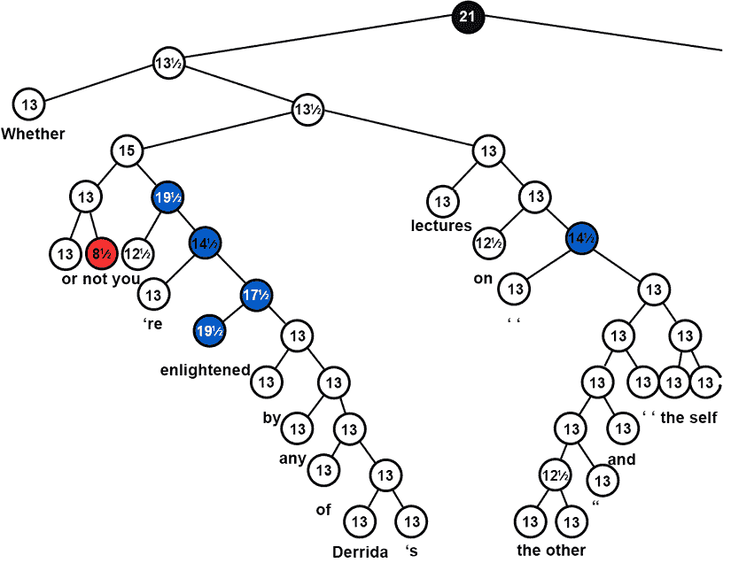

图 12.2：复杂句子中的“无论”部分

句子已被正确地分成两个主要部分。第二部分也是正确的：

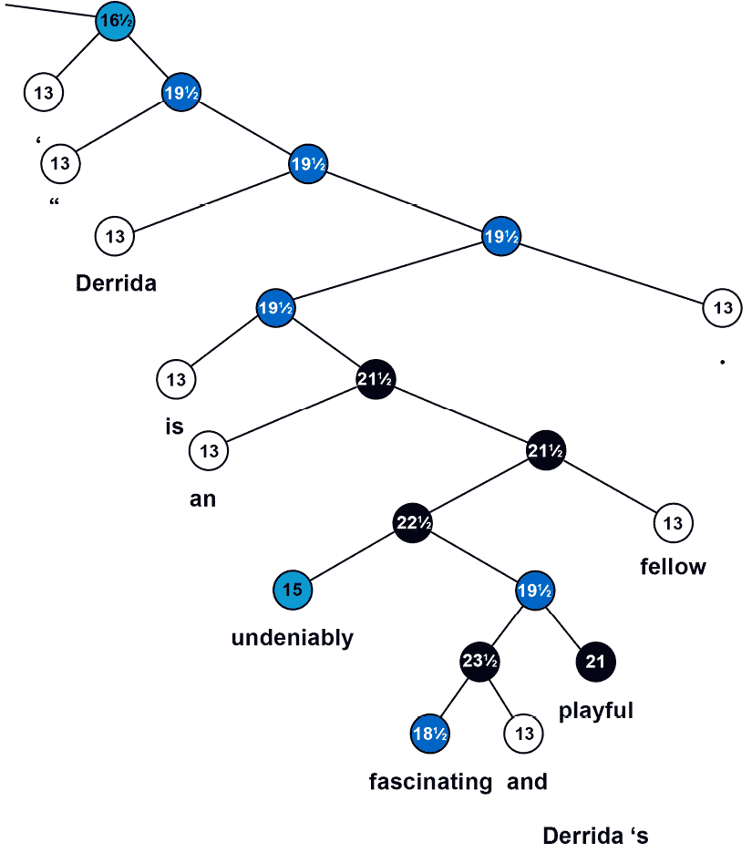

图 12.3：复杂句子的主要部分

我们可以从*Socher*等人（2013）设计的方法中得出几个结论：

+   情感分析不能简化为在句子中计算积极和消极的词语

+   一个Transformers模型或任何 NLP 模型必须能够学习组合原则，以理解复杂句子的构成成分如何与逻辑形式规则相互契合

+   一个Transformers模型必须能够建立一个向量空间来解释复杂句子的微妙之处

我们现在将用一个 RoBERTa-large 模型将这一理论付诸实践。

## 使用 RoBERTa-large 进行情感分析

在本节中，我们将使用 AllenNLP 资源运行 RoBERTa-large Transformers。*Liu*等人（2019）分析了现有的 BERT 模型，并发现它们并没有训练得像预期的那样好。考虑到这些模型的生成速度，这并不令人惊讶。他们致力于改进 BERT 模型的预训练，以产生一个**强大优化的 BERT 预训练方法**（**RoBERTa**）。

让我们首先在`SentimentAnalysis.ipynb`中运行一个 RoBERTa-large 模型。

运行第一个单元格以安装`allennlp-models`：

```py
!pip install allennlp==1.0.0 allennlp-models==1.0.0 
```

现在让我们尝试运行我们的雅克·德里达样本：

```py
!echo '{"sentence": "Whether or not you're enlightened by any of Derrida's lectures on the other and the self, Derrida is an undeniably fascinating and playful fellow."}' | \
allennlp predict https://storage.googleapis.com/allennlp-public-models/sst-roberta-large-2020.06.08.tar.gz - 
```

输出首先显示 RoBERTa-large 模型的架构，该模型有`24`层和`16`个注意力头：

```py
"architectures": [
  "RobertaForMaskedLM"
  ],
  "attention_probs_dropout_prob": 0.1,
  "bos_token_id": 0,
  "eos_token_id": 2,
  "hidden_act": "gelu",
  "hidden_dropout_prob": 0.1,
  "hidden_size": 1024,
  "initializer_range": 0.02,
  "intermediate_size": 4096,
  "layer_norm_eps": 1e-05,
  "max_position_embeddings": 514,
  "model_type": "roberta",
  "num_attention_heads": 16,
  "num_hidden_layers": 24,
  "pad_token_id": 1,
  "type_vocab_size": 1,
  "vocab_size": 50265
} 
```

如果需要，您可以花几分钟阅读 *第三章* *Fine-Tuning BERT Models* 中的 *BERT model configuration* 部分的 BERT 架构描述，以充分利用该模型。

情感分析会产生介于`0`（负面）和`1`（正面）之间的数值。

输出然后产生情感分析任务的结果，显示输出 logits 和最终的正面结果：

```py
prediction:  {"logits": [3.646597385406494, -2.9539334774017334], "probs": [0.9986421465873718, 0.001357800210826099] 
```

注意：算法是随机的，因此输出可能会在每次运行时变化。

输出还包含令牌 ID（可能会在每次运行时变化）和最终的输出标签：

```py
"token_ids": [0, 5994, 50, 45, 47, 769, 38853, 30, 143, 9, 6113, 10505, 281, 25798, 15, 5, 97, 8, 5, 1403, 2156, 211, 14385, 4347, 16, 41, 35559, 12509, 8, 23317, 2598, 479, 2], "label": "1", 
```

输出还显示了令牌本身：

```py
"tokens": ["<s>", "\u0120Whether", "\u0120or", "\u0120not", "\u0120you", "\u0120re", "\u0120enlightened", "\u0120by", "\u0120any", "\u0120of", "\u0120Der", "rid", "as", "\u0120lectures", "\u0120on", "\u0120the", "\u0120other", "\u0120and", "\u0120the", "\u0120self", "\u0120,", "\u0120D", "err", "ida", "\u0120is", "\u0120an", "\u0120undeniably", "\u0120fascinating", "\u0120and", "\u0120playful", "\u0120fellow", "\u0120.", "</s>"]} 
```

花些时间输入一些样本来探索设计良好且预训练的 RoBERTa 模型。

现在让我们看看如何使用其他 transformer 模型来使用情感分析来预测客户行为。

# 使用情感分析预测客户行为

此部分将在几个 Hugging Face transformer 模型上运行情感分析任务，以查看哪些模型产生了最佳结果，哪些模型我们简单地喜欢。

我们将使用 Hugging Face 的 DistilBERT 模型开始此过程。

## 使用 DistilBERT 进行情感分析

让我们使用 DistilBERT 运行情感分析任务，并看看我们如何使用结果来预测客户行为。

打开 `SentimentAnalysis.ipynb` 和Transformers安装和导入单元格：

```py
!pip install -q transformers
from transformers import pipeline 
```

我们现在将创建一个名为 `classify` 的函数，它将使用我们发送给它的序列运行模型：

```py
def classify(sequence,M):
   #DistilBertForSequenceClassification(default model)
    nlp_cls = pipeline('sentiment-analysis')
    if M==1:
      print(nlp_cls.model.config)
    return nlp_cls(sequence) 
```

请注意，如果您将 `M=1` 发送给该函数，它将显示我们正在使用的 DistilBERT 6 层、12 个头模型的配置：

```py
DistilBertConfig {
  "activation": "gelu",
  "architectures": [
    "DistilBertForSequenceClassification"
  ],
  "attention_dropout": 0.1,
  "dim": 768,
  "dropout": 0.1,
  "finetuning_task": "sst-2",
  "hidden_dim": 3072,
  "id2label": {
    "0": "NEGATIVE",
    "1": "POSITIVE"
  },
  "initializer_range": 0.02,
  "label2id": {
    "NEGATIVE": 0,
    "POSITIVE": 1
  },
  "max_position_embeddings": 512,
  "model_type": "distilbert",
  "n_heads": 12,
  "n_layers": 6,
  "output_past": true,
  "pad_token_id": 0,
  "qa_dropout": 0.1,
  "seq_classif_dropout": 0.2,
  "sinusoidal_pos_embds": false,
  "tie_weights_": true,
  "vocab_size": 30522
} 
```

此 DistilBERT 模型的具体参数是标签定义。

现在我们创建一个序列列表（您可以添加更多），我们可以将其发送给 `classify` 函数：

```py
seq=3
if seq==1:
  sequence="The battery on my Model9X phone doesn't last more than 6 hours and I'm unhappy about that."
if seq==2:
  sequence="The battery on my Model9X phone doesn't last more than 6 hours and I'm unhappy about that. I was really mad! I bought a Moel10x and things seem to be better. I'm super satisfied now."
if seq==3:
  sequence="The customer was very unhappy"
if seq==4:
  sequence="The customer was very satisfied"
print(sequence)
M=0 #display model cofiguration=1, default=0
CS=classify(sequence,M)
print(CS) 
```

在这种情况下，`seq=3` 被激活以模拟我们需要考虑的客户问题。 输出为负面，这正是我们要寻找的示例：

```py
[{'label': 'NEGATIVE', 'score': 0.9997098445892334}] 
```

我们可以从这个结果中得出几个结论，以预测客户行为，编写一个函数来：

+   将预测存储在客户管理数据库中。

+   统计客户在某段时间内（周、月、年）投诉服务或产品的次数。 经常投诉的客户可能会转向竞争对手以获得更好的产品或服务。

+   检测在负面反馈信息中不断出现的产品和服务。 产品或服务可能存在缺陷，需要质量控制和改进。

您可以花几分钟运行其他序列或创建一些序列来探索 DistilBERT 模型。

我们现在将探索其他 Hugging Face transformers。

## 使用 Hugging Face 模型列表进行情感分析

本节将探索 Hugging Face 的Transformers模型列表，并输入一些样本以评估它们的结果。想法是测试多个模型，而不仅仅是一个，并查看哪个模型最适合您的给定项目需求。

我们将运行 Hugging Face 模型：[`huggingface.co/models`](https://huggingface.co/models)。

对于我们使用的每个模型，您可以在 Hugging Face 提供的文档中找到模型的描述：[`huggingface.co/transformers/`](https://huggingface.co/transformers/)。

我们将测试几个模型。如果您实现它们，您可能会发现它们需要微调甚至是对您希望执行的 NLP 任务进行预训练。在这种情况下，对于 Hugging Face Transformers，您可以执行以下操作：

+   对于微调，您可以参考*第三章*，*对 BERT 模型进行微调*

+   对于预训练，您可以参考*第四章*，*从头开始预训练 RoBERTa 模型*

让我们首先浏览 Hugging Face 模型列表：[`huggingface.co/models`](https://huggingface.co/models)。

然后，在**任务**窗格中选择**文本分类**：

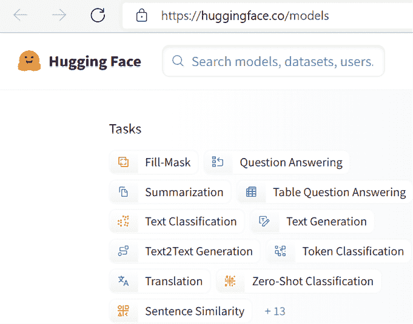

图 12.4：选择文本分类模型

将显示一系列用于文本分类的Transformers模型：

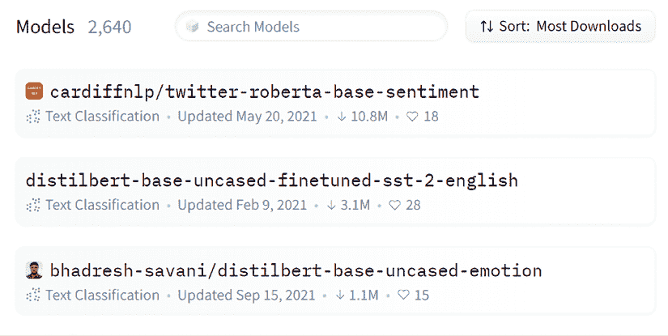

图 12.5：Hugging Face 预训练的文本分类模型

默认排序模式为**排序：最多下载**。

现在我们将搜索一些有趣的Transformers模型，我们可以在线测试。

我们将从 DistilBERT 开始。

### DistilBERT 用于 SST

`distilbert-base-uncased-finetuned-sst-2-english` 模型在 SST 上进行了微调。

让我们试试一个需要对组成原理有良好理解的例子：

`"尽管客户似乎不满意，但事实上她是满意的，只是当时在想其他事情，这给了一个错误的印象。"`

这个句子对于Transformers来说很难分析，需要逻辑规则训练。

输出是一个假阴性：

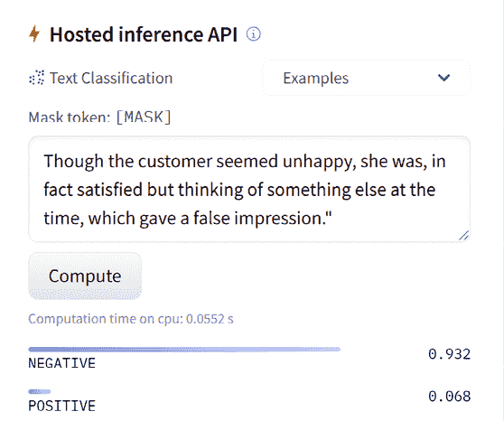

图 12.6：复杂序列分类任务的输出

假阴性并不意味着模型工作不正确。我们可以选择另一个模型。然而，这可能意味着我们必须下载并训练它更长时间更好！

在撰写本书时，类似 BERT 的模型在 GLUE 和 SuperGLUE 排行榜上排名靠前。排名将不断变化，但Transformers的基本概念不会改变。

现在我们将尝试一个困难但不那么复杂的示例。

这个例子是真实项目的一个关键教训。当我们尝试估计客户投诉的次数时，我们将得到假阴性和假阳性。*因此，对于未来几年，定期的人工干预仍将是必要的*。

让我们试试一个 MiniLM 模型。

### MiniLM-L12-H384-uncased

Microsoft/MiniLM-L12-H384-uncased 优化了老师的最后一个自注意力层的大小，以及对 BERT 模型的其他调整，以获得更好的性能。它有 12 层，12 个头部和 3300 万参数，并且比 BERT-base 快 2.7 倍。

让我们测试它对组成原则的理解能力：

`尽管客户似乎不高兴，但事实上她很满意，只是在那时在想其他事情，这造成了误解。`

输出很有趣，因为它产生了一个谨慎的分数（未决定）：

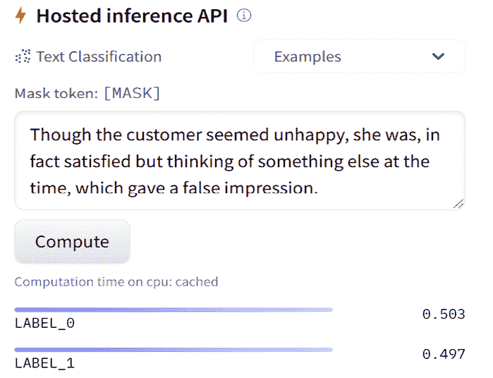

图 12.7: 复杂句子情感分析

我们可以看到这个输出不是决定性的，因为它在`0.5`左右。应该是积极的。

让我们尝试一个涉及含意的模型。

### RoBERTa-large-mnli

一个**多题材自然语言推理**（**MultiNLI**）任务，[`cims.nyu.edu/~sbowman/multinli/`](https://cims.nyu.edu/~sbowman/multinli/)，可以帮助解决复杂句子的解释，当我们试图确定客户的意思时。推理任务必须确定一个序列是否导致下一个序列。

我们需要对输入进行格式化，并使用序列分割标记分割序列：

`尽管客户似乎不高兴</s></s> 事实上她很满意，只是当时在想其他事情，这造成了误解`

结果很有趣，尽管保持中性：

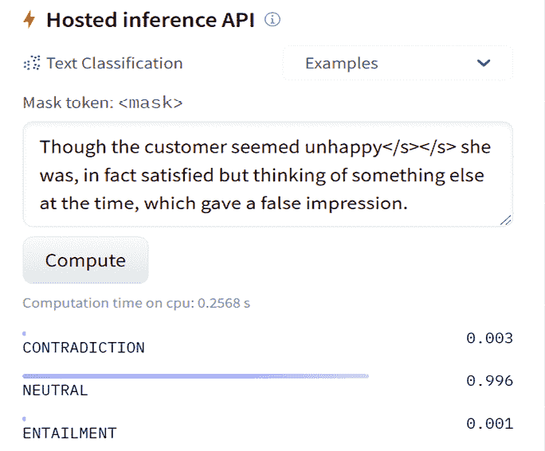

图 12.8: 针对稍微积极的句子获得的中性结果

但是，这个结果没有错误。第二个序列不是从第一个序列推断出的。结果非常正确。

让我们以“积极情感”多语言 BERT-base 模型结束我们的实验。

### BERT-base 多语言模型

让我们在一个超级酷的 BERT-base 模型上运行我们的最终实验：`nlptown/bert-base-multilingual-uncased-sentiment`。

它设计得非常好。

让我们用友好和积极的英文句子来运行它：

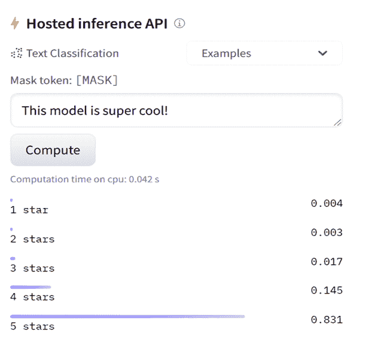

图 12.9: 英文情感分析

让我们用法语尝试一下，“Ce modèle est super bien!”（“这个模型超级好！”，意思是“酷”）：

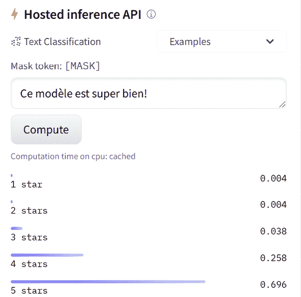

图 12.10: 法语情感分析

Hugging Face 上这个模型的路径是`nlptown/bert-base-multilingual-uncased-sentiment`。您可以在 Hugging Face 网站的搜索表单中找到它。其当前链接为[`huggingface.co/nlptown/bert-base-multilingual-uncased-sentiment?text=Ce+mod%C3%A8le+est+super+bien%21`](https://huggingface.co/nlptown/bert-base-multilingual-uncased-sentiment?text=Ce+mod%C3%A8le+est+super+bien%21)。

您可以通过以下初始化代码在您的网站上实现它：

```py
from transformers import AutoTokenizer, AutoModelForSequenceClassification
tokenizer = AutoTokenizer.from_pretrained("nlptown/bert-base-multilingual-uncased-sentiment")
model = AutoModelForSequenceClassification.from_pretrained("nlptown/bert-base-multilingual-uncased-sentiment") 
```

这将需要一些时间和耐心，但结果可能会非常好！

您可以在您的网站上实施此转换器，以平均全球客户的满意度！您还可以将其用作持续反馈，以改善您的客户服务并预测客户的反应。

在我们离开之前，我们将看看 GPT-3 如何执行情感分析。

# 使用 GPT-3 进行情感分析

您需要一个 OpenAI 账户来运行本节的示例。教育界面不需要 API、开发或培训。您可以简单地输入一些推特，然后请求进行情感分析：

**推特**: `我觉得这部电影不那么令人兴奋，但不知怎么的我真的很享受看它！`

**情感**: `积极`

**推特**: `我以前从未吃过这样的辛辣食物，但觉得它超级好吃！`

**情感**: `积极`

输出是令人满意的。

现在我们将向 GPT-3 引擎提交一个困难的序列：

**推特**: `因为我们不得不考虑所有参数，所以很难找到我们在生活中真正喜欢的东西。`

**情感**: `积极`

输出是错误的！这个情感根本不是积极的。这句话显示了生活的困难。然而，“享受”这个词为 GPT-3 引入了偏见。

如果我们从序列中去除“享受”并用动词 `是` 替换，输出将是负面的：

**推特**: `因为我们不得不考虑所有参数，所以很难找到我们在生活中真正喜欢的东西。`

**情感**: `消极`

输出也是错误的！并不是因为生活难以理解，我们就可以得出这句话是负面的结论。正确的输出应该是中性的。然后我们可以要求 GPT-3 在流水线中执行另一个任务，例如解释为什么它很困难。

作为一个没有任务的用户运行 NLP 任务显示了工业 4.0（I4.0）的发展方向：更少的人为干预，更多的自动功能。 *然而，我们知道某些情况下我们的新技能是必需的，比如在转换器产生意外结果时设计预处理功能。人类仍然是有用的！*

在 *第七章*，*GPT-3 引擎崛起的超人类转换器* 的 *运行 OpenAI GPT-3 任务* 部分中描述了一种具有现成代码的推特分类示例。如果您愿意，您可以在该代码中实现本节的示例。

现在让我们看看我们如何仍然证明自己是有价值的资产。

# 在我们离开之前进行一些务实的 I4.0 思考

Hugging Face transformers 进行情感分析时包含了一句被判定为“中性”的句子。

但那是真的吗？

将这句话标记为“中性”让我感到不安。我很好奇 OpenAI GPT-3 能否做得更好。毕竟，GPT-3 是一个理论上可以做许多其未经过训练的事情的基础模型。

我再次检查了这句话：

`虽然客户看起来不高兴，但实际上她却很满意，只是在那时在想其他事情，这给了一个错误的印象。`

当我仔细阅读句子时，我能看到顾客是 `she`。当我更深入地观察时，我理解到 `she` 实际上是 `satisfied`。我决定不是盲目地尝试各种模型，直到找到一个有效的为止。一直尝试一个接一个的模型是没有生产力的。

我需要通过逻辑和实验来找到问题的根源。我不想依赖自动找到原因的算法。有时候我们需要使用*我们的*神经元！

问题可能是很难为机器识别 `she` 作为 `customer` 吗？就像我们在*第十章*中所做的那样，*基于 BERT 的语义角色标注*，让我们问问 SRL BERT。

## 用 SRL 进行调查

*第十章*以我建议使用 SRL 与其他工具结束，我们现在正在这样做。

我首先在[`demo.allennlp.org/`](https://demo.allennlp.org/)上使用**语义角色标注**接口运行了 `She was satisfied`。

结果是正确的：

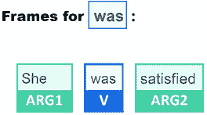

图 12.11：简单句子的 SRL

这个谓词框架中的分析很清晰：`was` 是动词，`She` 是 **ARG1**，而 `satisfied` 是 **ARG2**。

我们应该在一个复杂的句子中找到相同的分析结果，而我们做到了：

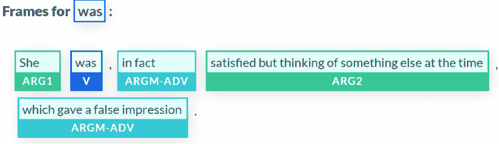

图 12.12：动词“satisfied”与其他单词合并，导致混淆

`Satisfied` 仍然是 **ARG2**，所以问题可能不在这里。

现在，焦点在**ARGM-ADV**上，它也修改了 `was`。这个字 `false` 是相当具有误导性的，因为**ARGM-ADV**是与包含 `thinking` 的**ARG2**相关的。

`thinking` 谓词给出了一个 `false impression`，但在这个复杂的句子中却没有被识别为谓词。难道 `she was` 是一个未知的省略，正如*第十章*中的*SRL 范围的质疑*部分所示？

通过输入完整句子而不使用省略号，我们可以快速验证：

`Though the customer seemed unhappy, she was, in fact, satisfied but she was thinking of something else at the time, which gave a false impression.`

SRL 的问题再次出现，正如我们在*第十章*中所看到的那样。我们现在有五个正确的谓词和五个准确的框架。

*Frame 1* 显示 `unhappy` 与 `seemed` 正确相关：


图 12.13：“Unhappy” 与 “seemed” 正确相关

*Frame 2* 显示 `satisfied` 现在从句子中分离出来，并在一个复杂句子中单独识别为 `was` 的参数：

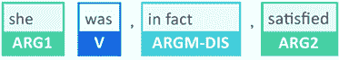

图 12.14：“satisfied” 现在是 ARG2 中的一个独立单词

现在，让我们直接到包含`thinking`的谓语，这是我们希望 BERT SRL 能够正确分析的动词。现在我们压制了省略号并重复了“she was”在句子中，输出是正确的：

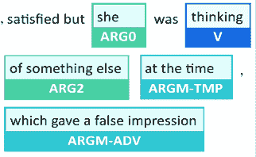

图 12.15：没有省略号的准确输出

现在，我们可以用两个线索结束我们的 SRL 调查：

+   单词`false`对算法来说是一个让其难以理解复杂句子中其他单词的令人困惑的论点

+   `she was`的重复省略号

在我们转向 GPT-3 之前，让我们回到 Hugging Face，带着我们的线索。

## 用 Hugging Face 进行调查

现在让我们回到本章 *DistilBERT 用于 SST* 部分使用的 DistilBERT 基础 uncased fine-tuned SST-2 模型。

我们将调查我们的两个线索：

+   `she was`的省略号

    我们将首先提交一个没有省略号的完整句子：

    “尽管顾客似乎不快乐，但事实上，她是满意的，只是当时在想其他事情，给人以错误的印象”

    输出仍然是消极的：

    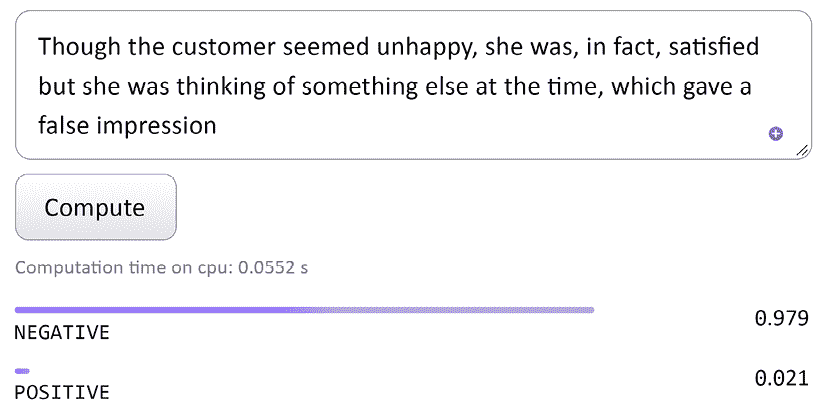

    图 12.16：一个假阴性

+   在一个原本积极的句子中出现了`false`。

    现在我们将`false`从句子中移除，但留下省略号：

    “尽管顾客似乎不满意，但事实上，她很满意，只是当时在想其他事情，留下了这样的印象”

    中了！输出为积极：

    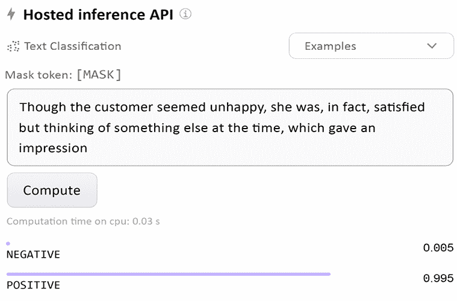

    图 12.17：一个真阳性

我们知道单词`false`对 SRL 造成混淆，如果有`was thinking`的省略号。我们也知道`false`对我们使用的情感分析 Hugging Face transformer 模型造成困惑。

GPT-3 能做得更好吗？让我们看看。

## 用 GPT-3 游��场进行调查

让我们使用 OpenAI 的**高级推文分类器**的例子，并通过三个步骤修改它来满足我们的调查需求：

+   *步骤 1*：向 GPT-3 展示我们期望的内容：

    **句子**：“顾客很满意”

    **情感**：`积极`

    **句子**：“顾客并不满意”

    **情感**：`消极`

    **句子**：“服务很 `好`”

    **情感**：`积极`

    **句子**：“`这是评论的链接`”

    **情感**：`中性`

+   *步骤 2*：展示少量输出格式示例：

    `1\. "我喜欢新的蝙蝠侠电影！"`

    `2\. "我讨厌我的手机电量耗尽时的情况"`

    `3\. "我的一天过得如此 "`

    `4\. "这是文章的链接"`

    `5\. "这个新的音乐视频让我大吃一惊"`

    句子情感评分：

    `1: 积极`

    `2: 消极`

    `3: 积极`

    `4: 中性`

    `5: 积极`

+   *步骤 3*：将我们的句子与其他句子一起输入（编号 3）：

    `1\. "我受不了这个产品"`

    `2\. "服务很差！ "`

    `3\. "尽管客户看起来不满意，但事实上她当时是满意的，只是想着其他事情，这给人以错误的印象"`

    `4\. "支持团队很棒！"`

    `5\. "这是产品的链接。"`

    句子情感评分：

    `1: 消极`

    `2: 积极`

    `3: 积极`

    `4: 积极`

    `5: 中性`

输出似乎令人满意，因为我们的句子是积极的（编号 3）。这个结果可靠吗？我们可以在这里多次运行示例。但让我们深入到代码层面去找出答案。

### GPT-3 代码

我们只需在游乐场中点击**查看代码**，复制它，并将其粘贴到我们的 `SentimentAnalysis.ipynb` 章节笔记本中。我们添加一行只打印我们想要看到的内容：

```py
response = openai.Completion.create(
  engine="davinci",
  prompt="This is a Sentence sentiment classifier\nSentence: \"The customer was satisfied\"\nSentiment: Positive\n###\nSentence: \"The customer was not satisfied\"\nSentiment: Negative\n###\nSentence: \"The service was ``\"\nSentiment: Positive\n###\nSentence: \"This is the link to the review\"\nSentiment: Neutral\n###\nSentence text\n\n\n1\. \"I loved the new Batman movie!\"\n2\. \"I hate it when my phone battery dies\"\n3\. \"My day has been ``\"\n4\. \"This is the link to the article\"\n5\. \"This new music video blew my mind\"\n\n\nSentence sentiment ratings:\n1: Positive\n2: Negative\n3: Positive\n4: Neutral\n5: Positive\n\n\n###\nSentence text\n\n\n1\. \"I can't stand this product\"\n2\. \"The service was bad! \"\n3\. \"Though the customer seemed unhappy she was in fact satisfied but thinking of something else at the time, which gave a false impression\"\n4\. \"The support team was ``\"\n5\. \"Here is the link to the product.\"\n\n\nSentence sentiment ratings:\n",
  temperature=0.3,
  max_tokens=60,
  top_p=1,
  frequency_penalty=0,
  presence_penalty=0,
  stop=["###"]
)
r = (response["choices"][0])
print(r["text"]) 
```

输出不稳定，正如我们在以下回应中所看到的：

+   **运行 1**：我们的句子（编号 3）是中性的：

    `1: 消极`

    `2: 消极`

    `3: 中性`

    `4: 积极`

    `5: 积极`

+   **运行 2**：我们的句子（编号 3）是积极的：

    `1: 消极`

    `2: 消极`

    `3: 积极`

    `4: 积极`

    `5: 中性`

+   **运行 3**：我们的句子（编号 3）是积极的

+   **运行 4**：我们的句子（编号 3）是消极的

这将引导我们得出调查的结论：

+   SRL 表明，如果句子是简单而完整的（没有省略号，没有遗漏的单词），我们将得到可靠的情感分析输出。

+   SRL 表明，如果句子是中等难度的，输出可能可靠，也可能不可靠。

+   SRL 表明，如果句子是复杂的（省略号、多个命题、许多含糊不清的短语等），结果是不稳定的，因此不可靠。

开发者的现在和未来的工作岗位的结论是：

+   云 AI 和即用模块将需要更少的 AI 开发。

+   将需要更多的设计技能。

+   发展用于供给 AI 算法、控制它们并分析其输出的经典流程管道将需要思考和有针对性的发展。

本章展示了开发者作为思想家、设计师和管道开发的巨大前景！

现在是总结我们的旅程并探索新的Transformers地平线的时候了。

# 摘要

在本章中，我们讨论了一些高级理论。组合性原则不是一个直观的概念。组合性原则意味着Transformers模型必须理解句子的每个部分才能理解整个句子。这涉及到将提供句子部分之间联系的逻辑形式规则。

情感分析的理论难度需要大量的Transformers模型训练、强大的机器和人力资源。虽然许多Transformers模型为许多任务进行了训练，但它们通常需要针对特定任务进行更多的训练。

我们测试了 RoBERTa-large、DistilBERT、MiniLM-L12-H384-uncased 和出色的 BERT-base 多语言模型。我们发现其中一些提供了有趣的答案，但需要更多的训练来解决我们在多个模型上运行的 SST 样本。

情感分析需要对句子有深入的理解和非常复杂的序列。所以，尝试 RoBERTa-large-mnli 是有意义的，以了解干扰任务会产生什么。这里的教训是，在像 transformer 模型这样非常不传统的东西上，不要墨守成规！尝试一切。在各种任务上尝试不同的模型。transformer 的灵活性使我们能够在同一模型上尝试许多不同的任务，或者在许多不同的模型上尝试相同的任务。

我们一路上收集了一些改善客户关系的想法。如果我们发现一个客户经常不满意，那么这个客户可能只是在寻找我们的竞争对手。如果有几个客户抱怨某个产品或服务，我们必须预见未来的问题并改善我们的服务。我们还可以通过 transformer 反馈的在线实时表现来展示我们的服务质量。

最后，我们直接在线使用 GPT-3 进行情感分析，除了使用界面之外什么也不用做！这是令人惊讶的有效，但我们看到人类仍然需要解决更困难的序列。我们看到 SRL 如何帮助识别复杂序列中的问题。

我们可以得出结论，开发人员在思考者、设计者和管道开发方面有着巨大的未来。

在下一章，*使用 transformer 分析假新闻*，我们将使用情感分析来分析对假新闻的情感反应。

# 问题

1.  对于情感分析，没有必要为 transformer 进行预训练。(是/否)

1.  一个句子总是积极的或消极的。它不能是中性的。(是/否)

1.  合成性原理表示 transformer 必须理解句子的每一部分才能理解它。(是/否)

1.  RoBERTa-large 旨在改进 transformer 模型的预训练过程。(是/否)

1.  一个 transformer 可以提供反馈，告诉我们客户是否满意。(是/否)

1.  如果产品或服务的情感分析一直是负面的，这有助于我们做出适当的决策，以改善我们的服务。(是/否)

1.  如果一个模型在一个任务上不能提供良好的结果，那么在更改模型之前，它需要更多的训练。(是/否)

# 参考文献

+   *Richard Socher*, *Alex Perelygin*, *Jean Wu*, *Jason Chuang*, *Christopher Manning*, *Andrew Ng*, 和 *Christopher Potts*, *递归深度模型用于情感树库的语义组成性*：[`nlp.stanford.edu/~socherr/EMNLP2013_RNTN.pdf`](https://nlp.stanford.edu/~socherr/EMNLP2013_RNTN.pdf)

+   Hugging Face 管道、模型和文档：

    +   [`huggingface.co/transformers/main_classes/pipelines.html`](https://huggingface.co/transformers/main_classes/pipelines.html)

    +   [`huggingface.co/models`](https://huggingface.co/models)

    +   [`huggingface.co/transformers/`](https://huggingface.co/transformers/)

+   *刘银涵*, *陈丹琪*, *奥默·莱维*, *迈克·刘易斯*, *卢克·泽特莫耶*, 和 *维塞林·斯托扬诺夫*, 2019, *RoBERTa: 一个经过强化优化的 BERT 预训练方法*: [`arxiv.org/pdf/1907.11692.pdf`](https://arxiv.org/pdf/1907.11692.pdf)

+   *艾伦人工智能研究所*: [`allennlp.org/`](https://allennlp.org/)

+   艾伦人工智能阅读理解资源：[`demo.allennlp.org/sentiment-analysis`](https://demo.allennlp.org/sentiment-analysis)

+   RoBERTa-large 贡献者，*吴照峰*: [`zhaofengwu.github.io/`](https://zhaofengwu.github.io/)

+   *斯坦福情感树库*: [`nlp.stanford.edu/sentiment/treebank.html`](https://nlp.stanford.edu/sentiment/treebank.html)

# 加入我们书籍的 Discord 空间

加入书籍的 Discord 工作空间，与作者进行每月的 *问我任何事* 会议：

[`www.packt.link/Transformers`](https://www.packt.link/Transformers)


