# 第十三章：用Transformers分析假新闻

我们生来就认为地球是平的。作为婴儿，我们在平坦的表面上爬行。在幼儿园时，我们在平坦的操场上玩耍。在小学时，我们坐在平的教室里。然后，我们的父母和老师告诉我们，地球是圆的，而在地球的另一边的人是倒挂着的。我们花了很长时间才明白他们为什么没有从地球上摔下来。即使今天，当我们看到美丽的日落时，我们还是看到“太阳落下”，而不是地球从太阳那边转过去！

辨别假新闻和真实新闻需要时间和努力。像孩子一样，我们不得不努力理清我们认为是假新闻的东西。

本章将涉及一些制造紧张关系的主题。我们将核实诸如气候变化、枪支管制和唐纳德·特朗普的推特等主题的事实。我们将分析推特、脸书帖子和其他信息来源。

我们的目标当然不是评判任何人或任何事物。假新闻涉及观点和事实。新闻往往取决于当地文化对事实的看法。我们将提供想法和工具，帮助他人在某一主题上收集更多信息，并在我们每天收到的信息丛林中找到自己的方向。

我们将专注于道德方法，而不是Transformers的性能。出于这个原因，我们不会使用 GPT-3 引擎。我们不会取代人类的判断。相反，我们为人类提供工具，让他们自己进行判断。GPT-3 引擎在许多任务上已达到了人类水平的表现。然而，我们应该将道德和伦理决策留给人类。

因此，首先，我们将开始定义导致我们对假新闻产生情感和理性反应的路径。

我们将然后定义一些利用Transformers和启发式方法识别假新闻的方法。

我们将利用前几章中建立的资源来理解和解释假新闻。我们不会进行评判。我们将提供能够解释新闻的Transformers模型。有些人可能更喜欢创建一个通用的绝对Transformers模型，以检测并断言一条消息是假新闻。

我选择用Transformers来教育用户，而不是对他们说教。这是我的观点，而不是事实！

本章涵盖以下主题：

+   认知 dissonance

+   对假新闻的情感反应

+   假新闻的行为表现

+   对假新闻的理性方法

+   假新闻的解决方案路线图

+   将情感分析Transformers任务应用于社交媒体

+   使用 NER 和 SRL 来分析枪支管制的感知

+   利用Transformers提取的信息找到可靠的网站

+   使用Transformers为教育目的生成结果

+   如何以客观但批判的眼光阅读前总统特朗普的推特

我们的第一步将是探索对假新闻的情感和理性反应。

# 对假新闻的情感反应

人类行为对我们的社会、文化和经济决策有着巨大的影响。我们的情绪影响着我们的经济，甚至比理性思考更为重要。行为经济学推动着我们的决策过程。我们购买消费品是出于我们的实际需求和满足情感欲望。我们甚至可能会在一时冲动之下购买一部超出预算的智能手机。

我们对假新闻的情感和理性反应取决于我们是慢思考还是快速对入信息做出反应。*丹尼尔·卡内曼*在他的研究和书籍*《思考，快与慢》（2013）*中描述了这一过程。

他和*弗农·L·史密斯*因行为经济学研究而获得了*诺贝尔经济学奖*。行为驱动我们之前认为是理性的决定。不幸的是，我们许多的决定是基于情感而不是理性的。

让我们将这些概念转化为应用于假新闻的行为流程图。

## 认知失调会引发情感反应。

认知失调将假新闻推到了 Twitter、Facebook 和其他社交媒体平台的顶峰。如果每个人都同意一条推文的内容，那么什么也不会发生。如果有人写了一条推文说：“气候变化很重要”，没有人会做出反应。

当我们的头脑中存在矛盾的思想时，我们会进入认知失调状态。因此，我们变得紧张、烦躁，就像烤面包机中的短路一样消耗我们的精力。

我们有许多例子可以思考。在户外戴口罩是否必要？封锁是好事还是坏事？冠状病毒疫苗有效吗？或者冠状病毒疫苗是危险的吗？认知失调就像一个音乐家在演奏简单曲子时不断犯错。这让我们疯狂！

假新闻综合症将认知失调指数级地增加！一位专家会断言疫苗是安全的，另一位专家会警告我们要小心。一位专家说在外面戴口罩没用，而另一位在新闻频道上坚持认为我们必须戴上！双方都指责对方传播假新闻！

对于一方来说，看起来很大一部分假新闻是另一方的真相。

我们处于 2022 年，美国的共和党人和民主党人仍然无法就 2020 年总统选举之后的国家选举规则达成一致意见，或者即将举行的选举的组织形式达成一致意见。

我们可以继续通过打开一份报纸找到其他无数话题，然后在另一份反对的报纸上找到另一种观点！尽管如此，从这些例子中可以得出一些本章的常识前提：

+   找到一个能够自动检测假新闻的Transformers模型是没有意义的。在社交媒体和多元文化表达的世界中，每个群体都对真相有一种认知，而另一方则在传播假新闻。

+   试图将我们的观点表达为来自一种文化到另一种文化的真理是毫无意义的。在一个全球化的世界里，不同国家、不同大陆和社交媒体的各个地方都有不同的文化。

+   绝对的假新闻是一个谬论。

+   我们需要找到假新闻的更好定义。

我的观点（当然，这不是事实！）是假新闻是一种只能通过认知推理来解决的认知失调状态。因此，解决假新闻问题正好像试图解决两个当事方之间或我们心中的冲突一样。

在本章和生活中，我建议通过使用转换模型来解构每一个冲突紧张局势和观点。我们并不是在“打击假新闻”，“寻找内心平静”，或者假装使用转换工具来寻找“对抗假新闻的绝对真理”。

*我们使用转换工具来更深入理解一系列词语（一条消息），从而对某个话题形成更深刻、更广阔的观点*。

一旦完成这些，让幸运的转换模型用户得到更好的视觉和观点。

为此，我设计了本章作为一个我们自己和其他人可以使用的课堂练习。转换工具是加深我们对语言序列理解、形成更广泛观点和发展认知能力的好方法。

让我们先看看当有人发布冲突性推特时会发生什么。

### 分析一条引发冲突的推特

下面的推特是在 Twitter 上发布的一条消息（我进行了改写）。在本章中显示的推特是原始数据集格式，而不是 Twitter 界面的显示。可以肯定的是，如果一个主要的政治人物或著名演员发推特，很多人会反对其内容：

`气候变化是虚假的。这是自由派图谋破坏经济的一个阴谋。`

这可能引发情绪反应。推特将从各个方面堆积起来。它将迅速传播并成为趋势！

让我们通过转换工具来分析这条推特，了解这条推特如何在某人的心里引起认知失调风暴。

打开`Fake_News.ipynb`，这是我们在本节中将要使用的笔记本。

我们将先从*Allen 人工智能研究院*获得资源。我们将运行我们在*第十二章*中用于情感分析的 RoBERTa 转换模型。

首先，我们需要安装`allennlp-models`。

```py
!pip install allennlp==1.0.0 allennlp-models==1.0.0 
```

AllenNLP 在不断更新版本。在撰写本文时，版本 2.4.0 已存在，但对本章提供的示例并无额外价值。*随机算法或经过更新的模型会产生不同的输出*。

然后我们用 Bash 运行下一条命令来详细分析推特的输出（模型和输出的信息）：

```py
!echo '{"sentence":"Climate change is bogus. It's a plot by the liberals to take the economy down."}' | \
allennlp predict https://storage.googleapis.com/allennlp-public-models/sst-roberta-large-2020.06.08.tar.gz - 
```

输出显示这条推特是负面的。积极值为`0`，而负面值接近`1`：

```py
"probs": [0.0008486526785418391, 0.999151349067688] 
```

输出可能因为转换工具的随机算法而有所不同。

现在我们将前往 [`allennlp.org/`](https://allennlp.org/) 获取分析的可视化表示。

输出可能会从一个运行到另一个运行改变。Transformer 模型持续进行训练和更新。本章的目标是专注于 Transformer 模型的推理。

我们选择 **情感分析** ([`demo.allennlp.org/sentiment-analysis`](https://demo.allennlp.org/sentiment-analysis)) 并选择 **RoBERTa 大模型** 运行分析。

我们得到了相同的负结果。然而，我们可以进一步调查，看看哪些词影响了 RoBERTa 的决定。

转到 **模型解释**。

解释模型将提供如何获得结果的见解。我们可以选择一个或查看三个选项：

+   **简单梯度可视化**：该方法提供两种可视化。第一种计算与输入相关的类别得分的梯度。第二种是从类别和输入推断出的显著性（主要特征）地图。

+   **综合梯度可视化**：这个模型不需要对神经网络进行任何更改。

+   设计调用梯度的动机是为了生成神经网络对其输入的预测的归因。

+   **平滑梯度可视化**：这种方法使用输出预测和输入来计算梯度。目标是识别输入的特征。然而，为了改进解释，添加了噪声。

在本节中，转到 **模型解释**，然后点击 **简单梯度可视化** 和 **解释预测**，以获取以下表示：


图 13.1：可视化前 3 个最重要的单词

`is` + `bogus` + `plot` 主要影响了负预测。

此时，你可能想知道为什么我们要看一个如此简单的例子来解释认知失调。解释来自以下推文。

一个坚定的共和党人写了第一条推文。我们称该成员为 `Jaybird65`。令他惊讶的是，一位同样是共和党人的人发了以下推文：

`我是共和党人，认为气候变化意识是一件好事！`

这条推文来自我们将称之为 `Hunt78` 的成员。让我们在 `Fake_News.ipynb` 中运行这个句子：

```py
!echo '{"sentence":"I am a Republican and think that climate change consciousness is a great thing!"}' | \
allennlp predict https://storage.googleapis.com/allennlp-public-models/sst-roberta-large-2020.06.08.tar.gz - 
```

输出当然是正的：

```py
"probs": [0.9994876384735107, 0.0005123814917169511] 
```

一个认知失调的风暴正在 `Jaybird65` 的脑海中酝酿。他喜欢 `Hunt78`，但不同意。他的思绪风暴正在加剧！如果你读了 `Jaybird65` 和 `Hunt78` 之间接连发生的推文，你会发现一些令 `Jaybird65` 难过的令人惊讶的事实：

`Jaybird65` 和 `Hunt78` 显然彼此认识。

+   如果你去他们各自的 Twitter 账户，你会发现他们都是猎人。

+   你可以看到他们都是坚定的共和党人。

`Jaybird65` 最初的推文是对 *纽约时报* 一篇声称气候变化正在摧毁地球的文章的反应。

`Jaybird65` 感到很困惑。他可以看到 `Hunt78` 和他一样是共和党人。他也是个猎人。那么 `Hunt78` 怎么会相信气候变化呢？

这个推特串的愤怒推文数量惊人。

然而，我们可以看到，虚假新闻讨论的根源在于对新闻的情感反应。对气候变化的理性方法应该是：

+   无论原因是什么，气候都在变化。

+   我们不需要因为改变人类而使经济崩溃。

+   我们需要继续制造电动汽车，在大城市增加更多的行走空间，并改善农业习惯。我们只需要以可能会带来收入的新方式经营业务。

但情感在人类中是很强烈的！

让我们来描述一下从新闻到情感和理性反应的过程。

### 虚假新闻的行为表示

虚假新闻始于情感反应，逐渐升级，并经常导致个人攻击。

*图 13.2* 表示了当认知失调阻碍我们的思维过程时，对虚假新闻的三阶段情感反应路径：

#### 第 1 阶段：收到的新闻

两个人或一组人对他们通过各自媒体获得的新闻做出反应：Facebook、Twitter、其他社交媒体、电视、广播、网站。每个信息来源都包含偏见观点。

#### 第 2 阶段：共识

两个人或一组人可以同意或不同意。如果他们不同意，我们将进入第 3 阶段，在此期间冲突可能会激化。

如果他们同意，共识会阻止热情的积聚，新闻被接受为`真实`新闻。然而，即使所有各方相信他们收到的新闻不是虚假的，这并不意味着它不是虚假的。以下是一些解释标记为`非虚假新闻`的新闻可能是虚假新闻的原因：

+   在 12 世纪早期，欧洲大多数人认为地球是宇宙的中心，太阳系围绕地球旋转。

+   1900 年，大多数人认为永远不会有一种飞越海洋的飞机。

+   2020 年 1 月，大多数欧洲人认为 COVID-19 只是影响中国而不是全球流行的病毒。

底线是，两个或甚至整个社会之间的共识并不意味着传入的新闻是真实还是虚假的。如果两个派系意见不一致，这将导致冲突：

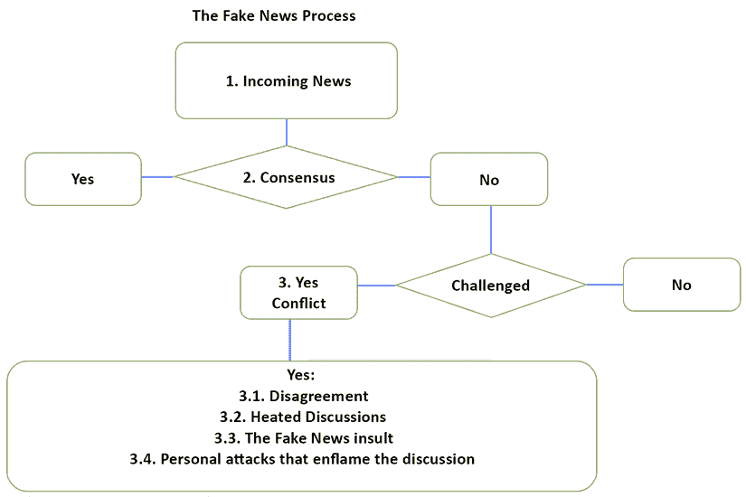

图 13.2：从新闻到虚假新闻冲突的路径的表示

让我们面对现实吧。在社交媒体上，成员通常与持有相同观点的其他人汇聚在一起，并且无论如何都很少改变他们的想法。这种描述表明，一个人通常会坚持在推特上表达的观点，一旦有人挑战他们的消息，冲突就会升级！

#### 第 3 阶段：冲突

一个虚假新闻冲突可以分为四个阶段：

+   **3.1**：冲突始于分歧。各方会在推特或 Facebook 或其他平台上发帖留言。经过几次交流后，冲突可能会消散，因为各方对这个话题不感兴趣。

+   **3.2**：如果我们回到 `Jaybird65` 和 `Hunt78` 之间关于气候变化的讨论，我们知道情况可能会变得糟糕。对话正在升温！

+   **3.3**：在某个时刻，不可避免地，一方的观点将变成虚假新闻。`Jaybird65`会生气，并在多条推文中表现出来，他认为由于人类引起的气候变化是假新闻。`Hunt78`会生气，并表示否认人类对气候变化的贡献是假新闻。

+   **3.4**：这些讨论通常以人身攻击结束。即使我们不知道它是如何出现的，戈德温定律也经常进入对话。戈德温定律指出，在对话的某个时刻，一方会找到最糟糕的参考来描述另一方。有时会表现为“你们自由派就像希特勒试图通过气候变化压制我们的经济。”这种类型的信息可以在推特、Facebook 和其他平台上看到。它甚至出现在总统关于气候变化的演讲期间的实时聊天中。

是否有一种理性的方式可以缓和双方的讨论，让他们冷静下来，至少达成一种折中的共识以便继续前进？

让我们尝试通过 transformers 和启发式方法建立一种理性的方式。

# 对虚假新闻的理性处理方法

Transformers 是有史以来最强大的自然语言处理工具。本节将首先定义一种方法，可以将两方在虚假新闻上的冲突从情绪层面提升到理性层面。

然后我们将使用 transformer 工具和启发式方法。我们将对枪支管制和前总统特朗普在 COVID-19 大流行期间的推文运行 transformer 样本。我们还将描述可以与传统功能一起实施的启发式方法。

你可以实现这些 transformer 自然语言处理任务或其他你选择的任务。不管怎样，这个路线图和方法可以帮助老师、家长、朋友、同事以及任何寻求真相的人。因此，你的工作总是值得的！

让我们从包含 transformers 的虚假新闻的理性解决方案路线图开始。

## 定义一个虚假新闻解决路线图

*图 13.3* 定义了一个理性的虚假新闻分析流程路线图。该流程包含 transformer 自然语言处理任务和传统功能：

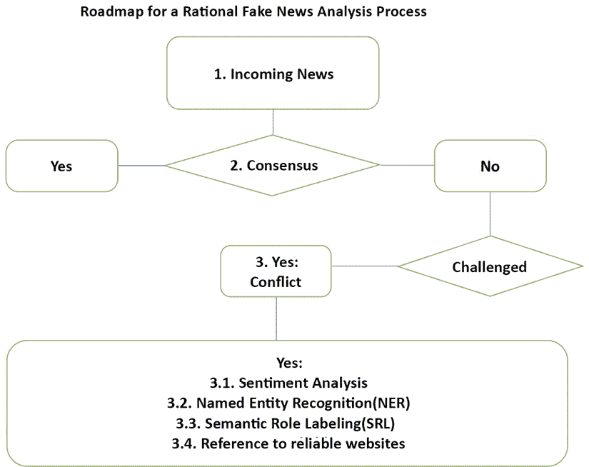

图 13.3：从对虚假新闻的情绪反应到理性表达

我们发现，一旦情绪反应开始，理性过程几乎总是会开始。理性过程必须尽快开始，以避免累积可能中断讨论的情绪反应。

第三阶段现在包含四个工具：

+   **3.1**: 使用情感分析来分析排名前列的“情感”正面或负面词汇。我们将在我们的`Fake_News.ipynb`笔记本中使用`AllenNLP`资源来运行一个 RoBERTa 大型Transformers。我们将使用 AllenNLP 的可视化工具来可视化关键词和解释。我们在*第十二章*中介绍了情感分析，*检测客户情绪以进行预测*。

+   **3.2**: **命名实体识别**（**NER**）用于从社交媒体消息中提取实体以进行*第 3.4 阶段*。我们在*第十一章*中描述了 NER，*让你的数据说话：故事、问题和答案*。我们将使用 Hugging Face 的 BERT Transformers模型来执行此任务。此外，我们将使用 AllenNLP.org 的可视化工具来可视化实体和解释。

+   **3.3**: 使用**语义角色标注**（**SRL**）来标注社交媒体消息中的动词，用于*第 3.4 阶段*。我们在*第十章*中描述了 SRL，*使用基于 BERT 的Transformers进行语义角色标注*。我们将在`Fake_News.ipynb`中使用 AllenNLP 的 BERT 模型。我们将使用 AllenNLP.org 的可视化工具来可视化标注任务的输出。

+   **3.4**: 将描述可靠网站的参考文献，以显示经典编码如何帮助。

让我们从枪支管制开始。

## 枪支管制辩论

*美国宪法*的第二修正案断言以下权利：

`A well regulated Militia, being necessary to the security of a free State, the right of the people to keep and bear Arms, shall not be infringed.`

数十年来，美国在这个问题上分裂了：

+   一方面，许多人认为携带武器是他们的权利，他们不想忍受枪支管制。他们认为声称拥有武器会导致暴力是假新闻。

+   另一方面，许多人认为携带火器是危险的，没有枪支管制，美国将仍然是一个暴力国家。他们认为声称携带武器不危险是假新闻。

我们需要帮助每一个团体。让我们从情感分析开始。

### 情感分析

如果你阅读演讲期间的推文、Facebook 消息、YouTube 聊天或任何其他社交媒体，你会看到各方正在进行激烈的争斗。你不需要看电视节目。你只需吃着爆米花，看着推文之间的战斗撕裂各方！

让我们选取一条来自一方的推文和一条来自对立方的 Facebook 消息。我改变了成员的名字并改写了文本（考虑到消息中的侮辱，这并不是一个坏主意）。让我们从支持枪支的推文开始：

#### 支持枪支的分析

这条推文是一个人的真实观点：

`Afirst78: 我多年来一直有步枪和枪支，从未出过问题。我把孩子们培养得很好，所以他们也有枪支，除了兔子，从未伤害过任何东西。`

让我们在`Fake_News.ipynb`中运行这个：

```py
!echo '{"sentence": "I have had rifles and guns for years and never had a problem. I raised my kids right so they have guns too and never hurt anything except rabbits."}' | \
allennlp predict https://storage.googleapis.com/allennlp-public-models/sst-roberta-large-2020.06.08.tar.gz - 
```

预测是积极的：

```py
prediction:  {"logits": [1.9383275508880615, -1.6191326379776], "probs": [0.9722791910171509, 0.02772079035639763] 
```

我们现在将在 AllenNLP 上可视化结果。**简单梯度可视化**提供了一个解释：

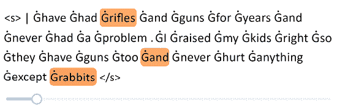

图 13.4：一句话的简单梯度可视化

解释显示，对 `Afirst78` 的推文进行的情感分析突出显示了 `rifles` + `and` + `rabbits`。

每次运行或随着时间的推移结果可能会有所不同。这是因为Transformers模型正在持续训练和更新。然而，本章的重点在于过程，而不是特定结果。

我们将在每一步拾起想法和功能。`Fake_News_FUNCTION_1` 是本节的第一个函数：

`Fake_News_FUNCTION_1`：`rifles` + `and` + `rabbits` 可以被提取和记录以供进一步分析。我们可以看到在这个例子中，`rifles`并不“危险”。

我们现在将分析 `NYS99` 认为必须控制枪支的观点。

#### 枪支管制分析

`NYS99:“我一生中一直在我的社区听到枪声，失去了许多朋友，晚上害怕出门。”`

让我们首先在 `Fake_News.ipynb` 中运行分析：

```py
!echo '{"sentence": "I have heard gunshots all my life in my neighborhood, have lost many friends, and am afraid to go out at night."}' | \
allennlp predict https://storage.googleapis.com/allennlp-public-models/sst-roberta-large-2020.06.08.tar.gz - 
```

结果自然是消极的：

```py
prediction:  {"logits": [-1.3564586639404297, 0.5901418924331665], "probs": [0.12492450326681137, 0.8750754594802856] 
```

让我们使用 AllenNLP 在线工具找到关键词。我们运行示例，可以看到**平滑梯度可视化**突出显示以下内容：

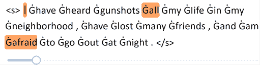

图 13.5：一句话的平滑梯度可视化

关键词 `afraid` 在本节的功能 2 中显眼。我们现在知道 `afraid` 与 “guns” 相关联。

我们可以看到模型在解释这些认知上存在问题。我们的人类批判性思维仍然是必要的！

`Fake_News_FUNCTION_2`：`afraid` 和 `guns`（主题）可以被提取和记录以供进一步分析。

如果我们现在将我们的两个功能并排放置，我们就可以清楚地理解为什么两个团体在互相争斗：

+   `Fake_News_FUNCTION_1`：`rifles` + `and` + `rabbits`

    `Afirst78` 可能住在美国中西部的一个州。这些州中的许多人口不多，非常安静，并且享有低犯罪率。`Afirst78` 可能从未去过大城市，享受着乡村宁静生活的乐趣。

+   `Fake_News_FUNCTION_2`：`afraid` + 主题 `guns`

    `NYS99` 可能住在美国大城市或主要美国大城市的大地区。犯罪率通常很高，暴力是日常现象。`NYS99` 可能从未去过中西部州，也没见过 `Afirst78` 的生活方式。

这两种诚实而强烈的观点证明了为什么我们需要实施本章描述的解决方案。

*更好的信息是减少假新闻战斗的关键*。

我们将按照我们的流程对我们的句子应用命名实体识别。

### 命名实体识别（NER）

本章显示，通过使用几种Transformers方法，用户将通过不同角度获得更广泛的消息认知。HTML 页面可以总结本章的Transformers方法，甚至可以包含生产模式中的其他Transformers任务。

现在，我们必须将我们的流程应用到推特和 Facebook 消息上，尽管我们在消息中看不到任何实体。然而，程序并不知道这一点。我们将只运行第一条消息来说明这个过程的这一步。

我们将首先安装 Hugging Face transformers：

```py
!pip install -q transformers
from transformers import pipeline
from transformers import AutoTokenizer, AutoModelForSequenceClassification,AutoModel 
```

现在，我们可以运行第一条消息：

```py
nlp_token_class = pipeline('ner')
nlp_token_class('I have had rifles and guns for years and never had a problem. I raised my kids right so they have guns too and never hurt anything except rabbits.') 
```

由于没有实体，输出没有产生结果。然而，这并不意味着它应该从管道中去除。另一句话可能包含一个提供有关该地区文化线索的人的位置名称。

在我们继续之前，让我们检查一下我们正在使用的模型：

```py
nlp_token_class.model.config 
```

输出显示模型在注意力层使用了 9 个标签和 1024 个特征：

```py
BertConfig {
  "_num_labels": 9,
  "architectures": [
    "BertForTokenClassification"
  ],
  "attention_probs_dropout_prob": 0.1,
  "directionality": "bidi",
  "hidden_act": "gelu",
  "hidden_dropout_prob": 0.1,
  "hidden_size": 1024,
  "id2label": {
    "0": "O",
    "1": "B-MISC",
    "2": "I-MISC",
    "3": "B-PER",
    "4": "I-PER",
    "5": "B-ORG",
    "6": "I-ORG",
    "7": "B-LOC",
    "8": "I-LOC"
  }, 
```

我们正在使用一个 BERT 24 层的 transformer 模型。如果您想探索架构，请运行`nlp_token_class.model`。

我们现在将在消息上运行 SRL。

### 语义角色标注（SRL）

我们将按照笔记本中找到的顺序，逐个运行`Fake_News.ipynb`的单元格。我们将考虑两种观点。

让我们从支持枪支的角度开始。

#### 支持枪支 SRL

我们将首先在`Fake_News.ipynb`中运行以下单元格：

```py
!echo '{"sentence": "I have had rifles and guns for years and never had a problem. I raised my kids right so they have guns too and never hurt anything except rabbits."}' | \
allennlp predict https://storage.googleapis.com/allennlp-public-models/bert-base-srl-2020.03.24.tar.gz - 
```

输出非常详细，如果您想要详细调查或解析标签，可能会很有用，就像这段摘录中所示：

```py
prediction:  {"verbs": [{"verb": "had", "description": "[ARG0: I] have [V: had] [ARG1: rifles and guns] [ARGM-TMP: for years] and never had a problem ... 
```

现在让我们在**语义角色标注**部分详细了解 AllenNLP。我们首先对这条消息运行 SRL 任务。第一个动词`had`表明`Afirst78`是一个*经验丰富的枪支拥有者*：

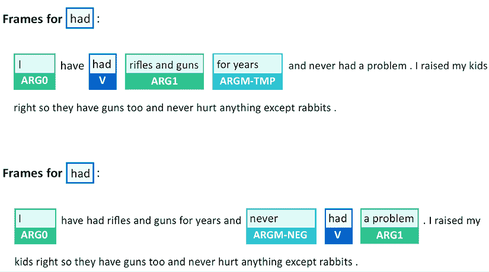

图 13.6：动词“had”的 SRL

`had`的参数总结了`Afirst78`的经验：`I` + `rifles and guns` + `for years`。

`had`的第二帧添加了信息`I` + `never` + `had` + `a problem`

`raised`的参数显示了`Afirst78`的父母经验：

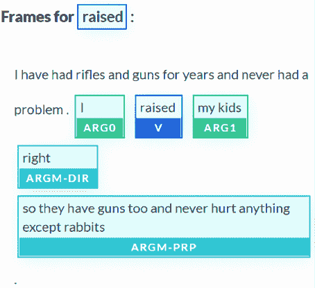

图 13.7：动词“raised”的 SRL 和参数

参数解释了许多支持枪支立场：`my kids` + `…have guns too and` `never hurt anything`。

结果可能因每次运行或模型更新而有所不同，但流程保持不变。

我们可以将我们在这里找到的内容添加到我们的函数集合中进行一些解析：

+   `Fake_News_FUNCTION_3`：`I` + `rifles and guns` + `for years`

+   `Fake_News_FUNCTION_4`：`my kids` + `have guns` too and `never hurt anything`

现在让我们探索枪支控制消息。

### 枪支控制 SRL

我们将首先在`Fake_News.ipynb`中运行 Facebook 消息。我们将继续按照笔记本中创建的顺序逐个运行笔记本单元格：

```py
!echo '{"sentence": "I have heard gunshots all my life in my neighborhood, have lost many friends, and am afraid to go out at night."}' | \
allennlp predict https://storage.googleapis.com/allennlp-public-models/bert-base-srl-2020.03.24.tar.gz - 
```

结果详细标记了序列中的关键动词，就像以下摘录所示：

```py
prediction:  {"verbs": [{"verb": "heard", "description": "[ARG0: I] have [V: heard] [ARG1: gunshots all my life in my neighborhood]" 
```

我们继续应用我们的流程，进入 AllenNLP，然后进入**语义角色标注**部分。我们输入句子并运行 transformer 模型。动词`heard`显示了这条消息的严峻现实：

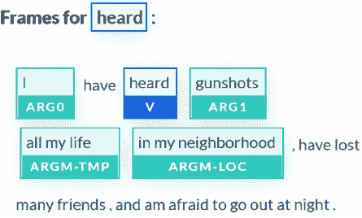

图 13.8：动词“听到”的 SRL 表示

我们可以快速解析我们第五个功能的单词：

+   `Fake_News_FUNCTION_5`：`一直听到` + `枪声` + `我一生都听到`

动词`失去`显示了与之相关的重要论点：

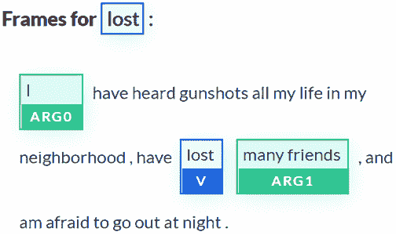

图 13.9：动词“丢失”的 SRL 表示

我们已经拥有我们第六个功能所需的一切：

+   `Fake_News_FUNCTION_6`：`失去` + `很多` + `朋友`

建议在不同的转换模型澄清了消息的每个方面后，向用户提供参考网站是一个好主意。

### 参考网站

我们已经对 NLP 任务运行了转换器模型，并描述了需要开发以解析数据并生成六个功能的传统启发式硬编码。

请记住，结果可能会因每次运行而异。六个功能是在不同时间生成的，并且与上一节略有不同。但是，主要思想仍然相同。现在让我们专注于这六个功能。

+   Pro-guns: `Fake_News_FUNCTION_1`：`从未` + `问题` + `枪支`

+   枪支管制：`Fake_News_FUNCTION_2`：`一直听到` + `害怕` + `枪支`

+   Pro-guns: `Fake_News_FUNCTION_3`：`我` + `几年来持有步枪和枪支`

+   Pro-guns: `Fake_News_FUNCTION_4`：`我的孩子们` + `有枪` + `从未伤害过任何东西`

+   枪支管制：`Fake_News_FUNCTION_5`：`一直听到` + `枪声` + `我一生都听到`

+   枪支管制：`Fake_News_FUNCTION_6`：`失去` + `很多` + `朋友`

让我们重新组织列表，并分开两个观点，并得出一些结论以决定我们的行动。

#### 支持枪支和枪支管制

反对枪支的论点是诚实的，但它们表明在美国主要城市发生的情况缺乏信息：

+   Pro-guns: `Fake_News_FUNCTION_1`：`从未` + `问题` + `枪支`

+   Pro-guns: `Fake_News_FUNCTION_3`：`我` + `几年来持有步枪和枪支`

+   Pro-guns: `Fake_News_FUNCTION_4`: `我的孩子们` + `有枪` + `从未伤害过任何东西`

枪支管控的论点是诚实的，但它们表明在中西部大片安静地区发生了缺乏信息的情况：

+   枪支管制：`Fake_News_FUNCTION_2`：`一直听到` + `害怕` + `枪支`

+   枪支管制：`Fake_News_FUNCTION_5`：`一直听到` + `枪声` + `我一生都听到`

+   枪支管制：`Fake_News_FUNCTION_6`：`失去` + `很多` + `朋友`

每个功能都可以被开发以通知另一方。

例如，让我们以伪代码的形式表达`FUNCTION1`：

```py
Def FUNCTION1:
call FUNCTIONs 2+5+6 Keywords and simplify
Google search=afraid guns lost many friends gunshots 
```

过程的目标是：

+   首先，运行转换模型来 *解构和解释* 消息。使用 NLP 转换器就像使用数学计算器一样。它可以产生良好的结果，但需要一个自由思考的人类大脑来解释它们！

+   然后，请一个经过训练的 NLP 人类用户更主动地、更好地搜索和阅读信息。

变换模型帮助用户更深入地理解信息；它们不会替用户思考！我们试图帮助用户，而不是讲课或洗脑他们！

需要解析来处理这些函数的结果。然而，如果我们有数百条社交媒体消息，我们可以自动让我们的程序完成整个工作。

链接将随着 Google 修改搜索而变化。然而，出现的第一个链接是有趣的，可以展示给持争议性枪支主张者看：

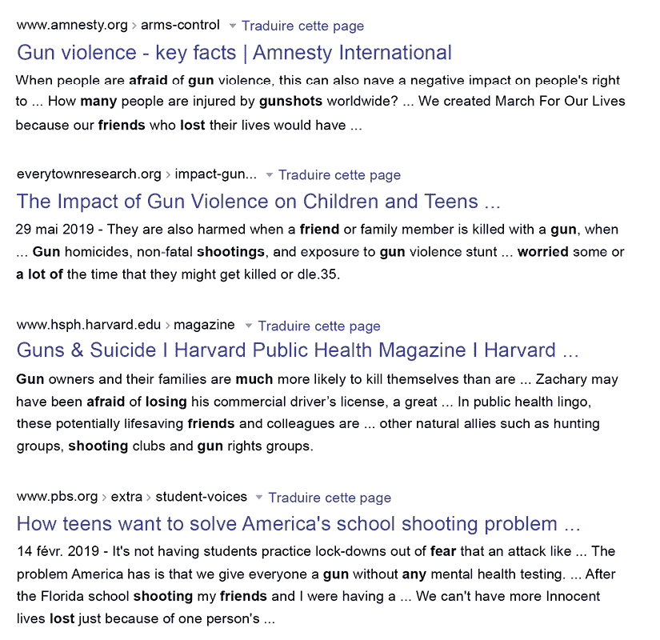

图 13.10：枪支和暴力

假设我们要用以下伪代码搜索支持枪支管制的人：

```py
Def FUNCTION2:
call FUNCTIONs 1+3+4 Keywords and simplify
Google search=never problem guns for years kids never hurt anything 
```

谷歌搜索未返回明确支持持争议性枪支主张者的积极结果。最有趣的是中立且教育性的：

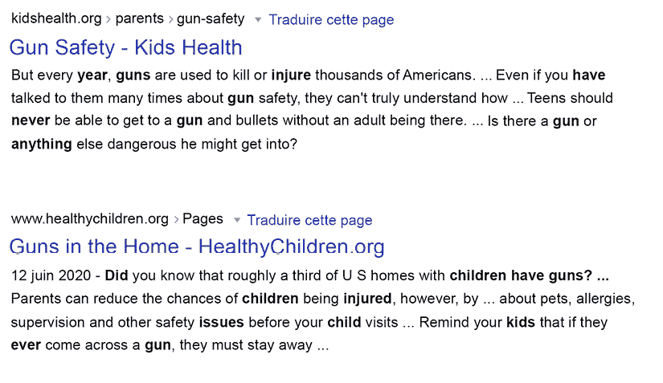

图 13.11：枪支安全

你可以在亚马逊的书店、杂志和其他教育资料上进行自动搜索。

最重要的是，对持相反意见的人来说，能够交谈而不争吵是至关重要的。相互理解是发展双方共鸣的最佳方式。

有人可能会倾向于相信社交媒体公司。*我建议永远不要让第三方代表你的思维过程。*使用变换模型来解构信息，但保持主动！

在这个问题上达成共识可能是同意遵循持枪规则。例如，一个人可以选择要么不在家中拥有枪支，要么安全地将它们锁起来，这样孩子就无法接触到它们。

让我们继续讨论 COVID-19 和前总统特朗普的推文。

## COVID-19 和前总统特朗普的推文

无论你的政治观点是什么，都有很多关于唐纳德·特朗普的言论以及对他的言论，需要一个专门的书来分析所有信息！这是一本技术，而不是政治书，所以我们将从科学的角度分析这些推文。

我们在本章的*枪支管制*部分描述了对假新闻的教育方法。我们不需要再次走过整个过程。

我们在我们的`Fake_News.ipynb`笔记本中的*枪支管制*部分，使用了 BERT 模型来实现和运行 AllenNLP 的 SRL 任务。

在本节中，我们将专注于假新闻的逻辑。我们将在 AllenNLP 的网站上运行 BERT 模型的 SRL 并可视化结果。

现在，让我们来看一些总统关于 COVID-19 的推文。

### 语义角色标注（SRL）

SRL 对我们所有人来说都是一个出色的教育工具。我们往往只是被动地阅读推文，听取他人对其的看法。用 SRL 来分解信息是发展社交媒体分析技能的好方法，以区分虚假信息和准确信息。

 我建议在课堂上将 SRL transformers 用于教育目的。一个年轻的学生可以输入一条推特，并分析每个动词及其参数。这可以帮助年轻一代在社交媒体上成为积极的读者。

 首先我们将分析一个相对一致的推特，然后是一个充满冲突的推特：

 让我们分析一下在写这本书时发现的最新推特。我去掉了“黑人美国人”的名字，并改写了前总统的部分文本：

 `X 是一个伟大的美国人，因感染冠状病毒已被送往医院，并要求祈祷。你今天会和我一起为他祈祷，以及所有正在受新冠肺炎病痛折磨的人吗？`

 让我们去 AllenNLP 的**语义角色标注**部分，运行句子，并查看结果。动词`hospitalized`显示成员对事实保持接近：

 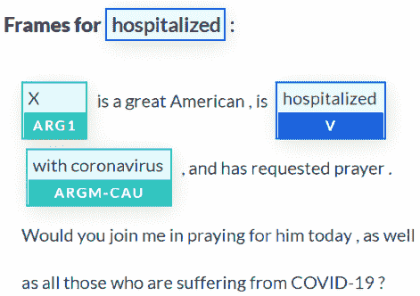

 图 13.12：动词“hospitalized”的 SRL 参数

 这条信息很简单：`X` + `hospitalized` + `with coronavirus`。

 动词`requested`表明信息变得政治化：

 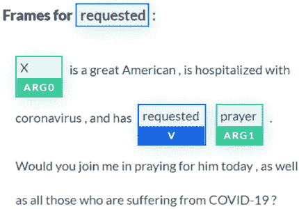

 图 13.13：动词“requested”的 SRL 参数

 我们不知道是这个人要求前总统祈祷，还是决定他会成为请求的中心。

 一个很好的练习是展示一个 HTML 页面，然后问用户他们的看法。例如，可以要求用户查看 SRL 任务的结果，并回答以下两个问题：

 `前总统特朗普是被要求祈祷，还是因政治原因偏离了向他人提出的请求？`

 `前总统特朗普称自己间接被要求为 X 祈祷是假新闻吗？`

 你可以思考一下，然后自己决定！

 让我们看一个被推特禁止的情况。我去掉了名字，并改写了它并放低了语气。然而，当我们在 AllenNLP 上运行它并可视化结果时，我们得到一些令人惊讶的 SRL 输出。

 这是缓和并改写的推特：

 `这些暴徒正在玷污 X 的记忆。`

 `当抢劫开始时，必须采取行动。`

 尽管我删除了原始推特的主要部分，但我们可以看到 SRL 任务显示了推特中的糟糕联想：

 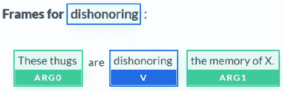

 图 13.14：动词“dishonoring”的 SRL 参数

 对此的教育性方法应该是解释我们不应该将“暴徒”和“记忆”以及“抢劫”联系起来。它们根本不相符。

 问一个用户为什么 SRL 参数不匹配会是一个重要的练习。

 我建议进行许多这样的练习，以便 transformer 模型的用户们培养 SRL 技能，对他们所呈现的任何话题持批判性观点。

批判性思维是阻止假新闻传播的最佳方法！

我们已经通过Transformers、启发式和指导性网站讨论了假新闻的理性方法。然而，在最后，假新闻辩论中的很多热情归结为情绪化和非理性的反应。

在一个意见纷呈的世界中，你永远不会找到一个完全客观的Transformers模型来检测假新闻，因为对立的双方从一开始就无法就真相达成一致意见！一方会同意Transformers模型的输出。另一方会说这个模型是有偏见的，是由他们意见的敌人建造的！

最好的方法是倾听他人的意见并保持冷静！

# 在我们离开之前

本章更注重将Transformers应用于问题，而不是找到一个不存在的银弹Transformers模型。

你有两个主要选择来解决 NLP 问题：找到新的Transformers模型或者创建可靠、耐用的方法来实施Transformers模型。

我们现在将结束本章，转而解释Transformers模型。

# 总结

假新闻始于我们作为人类的情感历史的深处。当事件发生时，情绪接管以帮助我们迅速对情况做出反应。当我们受到威胁时，我们本能地做出强烈反应。

假新闻引发了强烈的反应。我们担心这些新闻可能会暂时或永久地损害我们的生活。我们中许多人相信气候变化可能会从地球上根除人类生命。还有人认为，如果我们对气候变化反应过激，我们可能会摧毁我们的经济并使社会崩溃。我们中一些人认为枪支是危险的。其他人提醒我们，*美国宪法*第二修正案赋予我们在美国拥有枪支的权利。

我们经历了关于 COVID-19、前总统特朗普和气候变化的其他激烈冲突。在每种情况下，我们看到情绪反应是最快形成冲突的。

然后，我们设计了一个路线图，将假新闻的情感感知提升到理性水平。我们使用一些Transformers NLP 任务来展示，在 Twitter、Facebook 消息和其他媒体中找到关键信息是可能的。

我们利用一些人认为是真实新闻，而另一些人认为是假新闻的新闻来为老师、父母、朋友、同事或者只是交谈的人们创造了一个理性。我们添加了经典的软件功能来帮助我们一路前行。

此时，你手头有一套Transformers模型、NLP 任务和样本数据集的工具箱。

你可以利用人工智能造福人类。将这些Transformers工具和思想付诸实施，使世界成为一个更好的地方，这取决于你。

了解Transformers的一个好方法是可视化它们的内部过程。我们将在下一章中分析Transformers如何逐渐构建序列的表示，*解释黑匣子Transformers模型*。

# 问题

1.  标记为假新闻的新闻总是假的。（真/假）

1.  所有人都同意的新闻总是准确的。（是/否）

1.  Transformers可以用于对推文进行情感分析。（是/否）

1.  可以通过运行 DistilBERT 模型的 NER 从 Facebook 消息中提取关键实体。（是/否）

1.  关键动词可以通过运行基于 BERT 模型的 SRL 的 YouTube 聊天来识别。（是/否）

1.  情感反应是对虚假新闻的自然第一反应。（是/否）

1.  对虚假新闻的理性处理可以帮助澄清一个人的立场。（是/否）

1.  将Transformers与可靠网站连接可以帮助某人理解为什么一些新闻是虚假的。（是/否）

1.  Transformers可以总结可靠网站的内容，帮助我们理解一些被标记为虚假新闻的话题。（是/否）

1.  如果你为了我们所有人的利益使用人工智能，你可以改变世界。（是/否）

# 参考资料

+   *丹尼尔·卡尼曼*，2013 年，*思考，快与慢*

+   拥抱面孔管道：[`huggingface.co/transformers/main_classes/pipelines.html`](https://huggingface.co/transformers/main_classes/pipelines.html)

+   Allen 人工智能研究所：[`allennlp.org/`](https://allennlp.org/)

# 加入我们书籍的 Discord 空间

加入该书的 Discord 工作空间，与作者进行每月的*问我任何事*会话：

[`www.packt.link/Transformers`](https://www.packt.link/Transformers)


