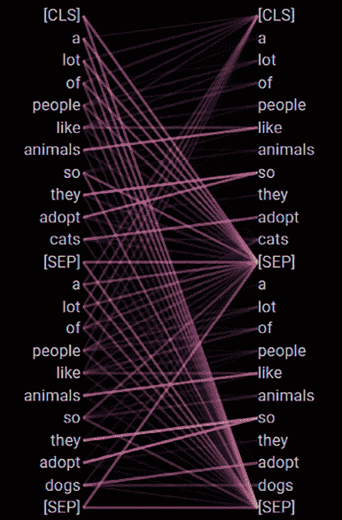
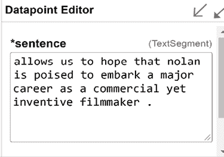

# 第十四章：解释黑匣子变压器模型

百万到十亿参数的变压器模型看起来像是无法解释的巨大黑匣子。 因此，当处理这些令人震惊的模型时，许多开发者和用户有时会感到沮丧。 然而，最近的研究已经开始用创新的前沿工具解决了这个问题。

描述所有可解释的 AI 方法和算法超出了本书的范围。 因此，本章将专注于提供给变压器模型开发者和用户洞察力的即用型视觉界面。

本章首先通过安装和运行*Jesse Vig*的`BertViz`来开始。 Jesse 在构建显示 BERT 变压器模型中注意力头活动的可视界面方面做得相当出色。 BertViz 与 BERT 模型交互，并提供了一个设计良好的交互界面。

我们将继续专注于使用**语言可解释工具**（**LIT**）来可视化变压器模型的活动。 LIT 是一个非侵入性工具，可以使用 PCA 或 UMAP 来表示变压器模型的预测。 我们将介绍 PCA 并使用 UMAP。

最后，我们将使用字典学习可视化变压器穿越 BERT 模型层的旅程。 **局部可解释的模型不可知解释**（**LIME**）提供了可视化变压器学习如何理解语言的实用函数。 该方法显示变压器通常首先学习一个词，然后学习句子上下文中的词，最后是长距离依赖关系。

在本章结束时，您将能够与用户交互，以展示变压器模型的活动可视化。 BertViz，LIT 和通过字典学习进行的可视化仍有很长的路要走。 然而，这些新生工具将帮助开发者和用户理解变压器模型的工作方式。

本章涵盖以下主题：

+   安装和运行 BertViz

+   运行 BertViz 的交互界面

+   探究和非侵入性方法的区别

+   **主成分分析**（**PCA**）提醒

+   运行 LIT 分析变压器输出

+   介绍 LIME

+   通过字典学习运行变压器可视化

+   单词级多义消歧

+   可视化低级，中级和高级依赖性

+   可视化关键变压器因素

我们的第一步将从安装和使用 BertViz 开始。

# 使用 BertViz 进行变压器可视化

*Jesse Vig*的文章，*变压器模型中注意力的多尺度可视化*，2019 年，认识到了变压器模型的有效性。 但是，*Jesse Vig*解释了解密注意力机制是具有挑战性的。 该论文描述了 BertViz 的过程，即可视化工具。

BertViz 可以可视化注意力头活动并解释变压器模型的行为。

BertViz 最初是为了可视化 BERT 和 GPT-3 模型而设计的。 在本节中，我们将可视化 BERT 模型的活动。

现在让我们安装并运行 BertViz。

## 运行 BertViz

可视化变形器注意头并与之交互只需五个步骤。

在 GitHub 仓库的`Chapter14`目录中打开`BertViz.ipynb`笔记本。

第一步是安装`BertViz`和必要的依赖。

### 步骤 1：安装 BertViz 并导入模块

笔记本安装了`BertViz`、Hugging Face transformers 和其他实现程序所需的基本要求：

```py
!pip install bertViz
from bertViz import head_view, model_view
from transformers import BertTokenizer, BertModel 
```

头视图和模型视图库现在已被导入。我们现在将加载 BERT 模型和分词器。

### 步骤 2：加载模型并检索注意力

BertViz 支持 BERT、GPT-2、RoBERTa 和其他模型。您可以在 GitHub 上查阅 BertViz 获取更多信息：[`github.com/jessevig/BertViz`](https://github.com/jessevig/BertViz)。

在本节中，我们将运行一个`bert-base-uncased`模型和一个预训练的分词器：

```py
# Load model and retrieve attention
model_version = 'bert-base-uncased'
do_lower_case = True
model = BertModel.from_pretrained(model_version, output_attentions=True)
tokenizer = BertTokenizer.from_pretrained(model_version, do_lower_case=do_lower_case) 
```

我们现在输入两个句子。您可以尝试不同的序列以分析模型的行为。`sentence_b_start`将在*步骤 5：模型视图*中必需：

```py
sentence_a = "A lot of people like animals so they adopt cats"
sentence_b = "A lot of people like animals so they adopt dogs"
inputs = tokenizer.encode_plus(sentence_a, sentence_b, return_tensors='pt', add_special_tokens=True)
token_type_ids = inputs['token_type_ids']
input_ids = inputs['input_ids']
attention = model(input_ids, token_type_ids=token_type_ids)[-1]
sentence_b_start = token_type_ids[0].tolist().index(1)
input_id_list = input_ids[0].tolist() # Batch index 0
tokens = tokenizer.convert_ids_to_tokens(input_id_list) 
```

就是这样！我们已经准备好与可视化界面进行交互。

### 步骤 3：头视图

我们只需添加一个最后一行来激活注意头的可视化：

```py
head_view(attention, tokens) 
```

第一层（layer 0）中的单词并非实际标记，但界面是教育性的。每一层的 12 个注意头以不同的颜色显示。默认视图设置为层 0，如*图 14.1*所示：


图 14.1：注意头的可视化

我们现在准备探索注意头。

### 步骤 4：处理和显示注意头

上面两列标记中的每种颜色表示该层编号的一个注意头。选择一个层编号并单击一个注意头（颜色）。

句子中的单词在注意中被分解成标记。然而，在本节中，单词`tokens`宽泛指`words`，以帮助我们了解变形器头是如何工作的。

我专注于*图 14.2*中的单词`animals`：


图 14.2：选择一个层、一个注意头和一个标记

`BertViz`显示模型在`animals`和几个单词之间建立了连接。这是正常的，因为我们只在层 0。

Layer 1 开始单独分离与之相关的单词`animals`，如*图 14.3*所示：


图 14.3：可视化第 1 层中注意头 11 的活动

注意头 11 在`animals`、`people`和`adopt`之间建立了一个连接。

如果我们点击`cats`，一些有趣的连接将显示在*图 14.4*中：


图 14.4：可视化猫与其他标记之间的连接

现在，单词`cats`与`animals`相关联。这种关联表明模型正在学习猫是动物。

您可以更改句子，然后单击图层和注意力头，以可视化变压器如何建立连接。当然，您会发现限制。好的和坏的连接将向您展示变压器的工作原理和失败情况。这两种情况对于解释变压器的行为以及为什么它们需要更多层、参数和数据都是有价值的。

让我们看看 `BertViz` 如何显示模型视图。

### 步骤 5：模型视图

只需一行代码就可以获得一个带有 `BertViz` 的变压器的模型视图：

```py
model_view(attention, tokens, sentence_b_start) 
```

`BertViz` 在一个视图中显示所有的层和头部，如 *图 14.5* 中所示：


图 14.5：BertViz 的模型视图模式

如果您单击其中一个头部，将获得一个带有单词对单词和句子对句子选项的头部视图。然后，您可以浏览注意力头，以查看变压器模型在通过层时如何生成更好的表示。例如，*图 14.6* 显示了第一层中一个注意力头的活动：



图 14.6：模型较低层的注意力头活动

有时，表示会在分隔符 `[SEP]` 和单词之间建立连接，这并没有太多意义。但是，有时标记不会在每个层的每个注意力头中激活。此外，变压器模型的训练水平限制了解释的质量。

无论如何，`BertViz` 仍然是一个有趣的教育工具和变压器模型的可解释性工具。

现在让我们运行直观的 LIT 工具。

# LIT

LIT 的可视化界面将帮助您找到模型处理不正确的示例，深入研究类似示例，查看在更改上下文时模型的行为以及与变压器模型相关的更多语言问题。

LIT 不像 `BertViz` 那样显示注意力头的活动。然而，值得分析为什么事情出错了并尝试找到解决方案。

您可以选择**均匀流形逼近与投影**（**UMAP**）可视化或 PCA 投影仪表示。PCA 将在特定方向和幅度上进行更线性的投影。UMAP 将其投影分解为小型聚类。根据您分析模型输出的深入程度，这两种方法都是有意义的。您可以同时运行并获得相同模型和示例的不同视角。

本节将使用 PCA 运行 LIT。让我们从简要回顾 PCA 的工作原理开始。

## PCA

PCA 将数据提升到更高的层次进行表示。

想象一下您在厨房里。您的厨房是一个 3D 笛卡尔坐标系。您厨房里的物体也都有特定的 *x*、*y*、*z* 坐标。

您想要烹饪一道菜，并将配料摆放在厨房桌上。您的厨房桌是您厨房里菜谱的较高级别表示。

厨房桌也在使用笛卡尔坐标系。但是当您提取厨房的*主要特征*以在厨房桌上表示菜谱时，您正在执行 PCA。这是因为您展示了一起适合制作特定菜谱的主要组件。

相同的表现可以应用于 NLP。例如，字典是一个词语列表。但是一起有意义的词语构成序列主成分的表示。

在 LIT 中序列的 PCA 表示将有助于可视化变压器的输出。

获得 NLP PCA 表示的主要步骤是：

+   **方差**：数据集中一个词语的数值方差；其含义的频率和频率，例如。

+   **协方差**：多个单词的方差与数据集中另一个单词的相关性。

+   **特征值和特征向量**：要在笛卡尔系统中获得表示，我们需要协方差的向量和幅角表示。特征向量将提供向量的方向。特征值将提供它们的幅角。

+   **派生数据**：最后一步是通过将行特征向量乘以行数据来将特征向量应用于原始数据集：

+   **要显示的数据** = 行特征向量 * 行数据

PCA 投影提供了清晰的数据点线性可视化以进行分析。

现在让我们运行 LIT。

## 运行 LIT

您可以在线运行 LIT 或在 Google Colaboratory 笔记本中打开它。单击以下链接以访问两个选项：

+   [`pair-code.github.io/lit/`](https://pair-code.github.io/lit/)

教程页面包含几种类型的 NLP 任务进行分析：

+   [`pair-code.github.io/lit/tutorials/`](https://pair-code.github.io/lit/tutorials/)

在本节中，我们将在线运行 LIT 并探索情感分析分类器：

+   [`pair-code.github.io/lit/tutorials/sentiment/`](https://pair-code.github.io/lit/tutorials/sentiment/)

单击**自己探索这个演示**，您将进入直观的 LIT 接口。变压器模型是一个小型变压器模型：


图 14.7：选择模型

您可以通过单击模型更改模型。您可以直接在 Hugging Face 提供的托管 API 页面上测试这种类型的模型和类似模型：

[`huggingface.co/sshleifer/tiny-distilbert-base-uncased-finetuned-sst-2-english`](https://huggingface.co/sshleifer/tiny-distilbert-base-uncased-finetuned-sst-2-english)

NLP 模型可能会根据 LIT 在线版本的后续更新而发生变化。概念保持不变，只是模型变化。

让我们从选择 PCA 投影仪和每个示例的二元`0`或`1`分类标签开始：


图 14.8：选择投影仪和标签类型

然后我们转到数据表，点击一个**句子**及其分类**标签**：


图 14.9：选择一句话

该算法是随机的，因此输出可能会在不同运行中有所变化。

在数据点编辑器中也会出现这个句子：



图 14.10：数据点编辑器

数据点编辑器允许您改变句子的上下文。例如，您可能想要找出为什么一个反事实的分类本应属于一个类别，但最终属于另一个类别。您可以改变句子的上下文，直到它出现在正确的类别中，以了解模型的工作原理及为何出现错误。

这个句子将与它的分类一起出现在 PCA 投影仪中：


图 14.11：正向聚类中的 PCA 投影仪

您可以在 PCA 投影仪中点击数据点，所选句子将出现在数据点编辑器中。这样，您可以比较结果。

LIT 包含许多您可以探索和使用的交互功能。

LIT 中得到的结果并不总是令人信服。然而，在许多情况下，LIT 提供了有价值的见解。同时，参与这些新兴的工具和技术是至关重要的。

现在让我们通过词典学习来可视化变压器层。

# 通过词典学习的变压器可视化

通过词典学习的变压器可视化是基于变压器因子的。

## 变压器因子

变压器因子是包含上下文单词的嵌入向量。一个没有上下文的单词可以有许多意义，从而产生多义问题。例如，单词`separate`可以是动词或形容词。此外，`separate`还可以意味着断开、区分、分散，以及许多其他定义。

*Yun*等人在 2021 年创造了一个包含上下文单词的嵌入向量。单词的嵌入向量可以由单词因子的稀疏线性表示构建。例如，根据数据集中句子的上下文，`separate`可以被表示为：

```py
`separate=0.3" keep apart"+"0.3" distinct"+ 0.1 "discriminate"+0.1 "sever" + 0.1 "disperse"+0.1 "scatter"` 
```

为了确保线性表示保持稀疏，我们不添加会创建大量 0 值矩阵的 0 因子。因此，我们不包括无用的信息，比如：

```py
`separate= 0.0"putting together"+".0" "identical"` 
```

整个关键是通过强制因子的系数大于 0 来保持表示的稀疏性。

每个单词的隐藏状态在每一层中都被检索出来。由于每一层在理解数据集中句子中单词的表示方面都有所进展，潜在的依赖关系逐渐增加。这种稀疏线性叠加的变压器因子变成了一个带有稀疏系数向量的词典矩阵，我们可以将其总结为：


在其中：

+   （phi）是词典矩阵。

+   是待推断的稀疏系数向量

*Yun*等人在 2021 年补充说，，添加高斯噪声样本以强制算法搜索更深层的表示。

同样，为了确保表示保持稀疏，方程必须写成，使得（such that）。

作者将*X*指代为层的隐藏状态集合，将*x*指代为属于*X*的变换因子的稀疏线性叠加。

他们将自己稀疏字典学习模型总结为：


在词典矩阵中，:,c 指的是词典矩阵的一列，其中包含一个变换因子。

:,c 分为三个级别：

+   **低级**变换因子用于通过词级消歧解决多义问题

+   **中级**变换因子将我们进一步带入句子级模式，这将为低级模式带来重要的上下文。

+   **高级**变换模式帮助理解长程依赖关系

该方法是创新的、令人兴奋的，看起来效率很高。然而，目前还没有可视化功能。因此，*Yun*等人于 2021 年为 LIME 创造了必要的信息，这是一种标准的可解释人工智能方法，可以用于可视化他们的发现。

交互式变换器可视化页面基于 LIME 进行输出。以下部分是对 LIME 的简要介绍。

## 介绍 LIME

**LIME**代表**局部可解释的模型-不可知解释**。这一可解释的人工智能方法的名称说明了它的特点。它是*模型不可知*的。因此，我们可以立即得出有关通过词典学习进行变换器可视化方法的结论：

+   该方法不会深入研究变换器层的矩阵、权重和矩阵乘法。

+   该方法不会解释变换器模型的工作原理，就像我们在*第二章*中所做的那样，*开始使用变换器模型的架构*。

+   在本章中，该方法窥视了由变换因子的稀疏线性叠加提供的数学输出。

LIME 并不试图解析数据集中的所有信息。相反，LIME 通过检查预测周围的特征来判断模型是否*局部可靠*。

LIME 不适用于全局模型。它专注于预测的局部环境。

这在处理自然语言处理时尤为有效，因为 LIME 探索了一个词的上下文，为模型的输出提供了宝贵的信息。

在通过词典学习进行可视化时，一个实例*x*可以表示为：


此实例的可解释表示是一个二进制向量：


目标是确定特征或多个特征的局部存在或缺失。在 NLP 中，这些特征是可以重建为单词的令牌。

对于 LIME 来说，*g*代表一个变压器模型或任何其他机器学习模型。*G*代表一组包含*g*在内的变压器模型，以及其他模型：


因此，LIME 的算法可以应用于任何变压器模型。

在这一点上，我们知道：

+   LIME 以一个词为目标，并搜索其他词的局部上下文

+   因此，LIME 提供了一个词的局部上下文，以解释为什么会预测这个词，而不是其他词

探索 LIME 等可解释 AI 并不在这本关于 NLP 的变压器书籍的范围内。不过，有关 LIME 的更多信息，请参见*参考*部分。

现在让我们看看 LIME 是如何将自己融入通过字典学习的变压器可视化方法中的。

现在让我们探索可视化界面。

## 可视化界面

访问以下网站以访问交互式的变压器可视化页面：[`transformervis.github.io/transformervis/`](https://transformervis.github.io/transformervis/)。

可视化界面提供了直观的说明，只需点击一次即可开始分析特定层的变压器因素，如*图 14.12*所示：


图 14.12：选择一个变压器因素

一旦选择了一个因素，您可以点击您想要为这个因素可视化的层：


图 14.13：每层的函数可视化

第一个可视化展示了按层激活因素的情况：


图 14.14：每层因素的重要性

因素`421`着眼于`separate`的词汇领域，正如下层所示：


图 14.15：在下层中对“separate”的表示

随着我们可视化更高的层级，会出现更长范围的表示。因素`421`从`separate`的表示开始。但在更高的层次上，变压器开始形成对因素的更深层次的理解，并将`separate`与`distinct`相关联，如*图 14.16*所示：


图 14.16：变压器要素的高层表示

尝试使用几个变压器因素来可视化，以便逐层扩展他们对语言的理解和感知。

您会发现许多好例子，也会发现很多糟糕的结果。专注于好例子，以了解变压器如何通过语言学习的方式。利用糟糕的结果来理解它为什么会犯错误。此外，可视化界面所使用的变压器模型并非最强大或经过充分训练的模型。

无论如何，参与其中并保持对这个不断发展的领域的关注！

例如，您可以探索 `Understanding_GPT_2_models_with_Ecco.ipynb`，这是本章的 GitHub 存储库中的内容。它演示了变压器在选择标记之前如何生成候选项。这是不言自明的。

在本节中，我们看到了变压器如何逐层学习单词的含义。一个变压器在做出选择之前会生成候选项。正如笔记本所示，变压器模型是随机的，因此会在几个最高概率中进行选择。考虑以下句子：

```py
"The sun rises in the_____." 
```

您会选择什么词放在句子的结尾？我们都会犹豫。这也是变压器所做的！

在这种情况下，GPT-2 模型选择了`sky`这个词：


图 14.17：完成一个序列

但是 GPT-2 模型可能会在另一次运行中选择其他候选项，就像*图 14.18*中显示的：

图 14.18：其他的完成候选项

我们可以看到`sky`出现在第一名。但`morning`也出现在第二名，并且也可以合适。如果我们多次运行模型，可能会得到不同的输出，因为模型是随机的。

看起来 AI 和变压器的领域已经完备了。

然而，在我们继续之前，让我们看看为什么人们在这个领域仍然有很多工作要做。

# 探索我们无法访问的模型

本章探讨的可视化界面非常引人入胜。但仍然有很多工作要做！

例如，OpenAI 的 GPT-3 模型可以在线运行或通过 API 运行。因此，我们无法访问一些**软件即服务**（**SaaS**）变压器模型的权重。这种趋势将在未来数年内增加和扩展。那些花费数百万美元用于研究和计算机动力的公司更倾向于提供按需付费的服务，而不是开源应用程序。

即使我们能够访问 GPT-3 模型的源代码或输出权重，使用可视化界面来分析 9,216 个注意力头（96 层 x 96 头）也将是相当具有挑战性的。

在很多情况下，寻找错误仍然需要一些人的参与。

例如，在英语到法语翻译中，`coach`这个词的多义性经常会造成问题。在英语中，coach 可以是一个训练别人的人，也可以是一辆公共汽车。法语中也有`coach`这个词，但它只适用于一个训练别人的人。

如果您去 OpenAI AI GPT-3 游乐场，[`openai.com/`](https://openai.com/)，并翻译含有`coach`这个词的句子，您可能会得到混合的结果。

句子 1 被 OpenAI 引擎正确翻译了：

```py
English: The coach broke down, and everybody complained.
French: Le bus a eu un problème et tout le monde s'est plaint. 
```

`coach`被翻译成了巴士，这是正确的。但需要更多的语境。

输出是随机的，所以翻译可能一次正确，下一次错误。

然而，第二句被误译了：

```py
English: The coach was dissatisfied with the team and everybody complained.
French: Le bus était insatisfait du équipe et tout le monde s'est plaint. 
```

这一次，GPT-3 引擎错过了`coach`指的是一个人，而不是一辆公共汽车的事实。相同的随机运行将提供不稳定的输出。

如果我们通过添加上下文来修改句子 2，我们将获得正确的翻译：

```py
English: The coach of the football team was dissatisfied and everybody complained.
French: Le coach de l'équipe de football était insatisfait et tout le monde s'est plaint. 
```

现在翻译中包含了法语单词`coach`，表示与本句英语单词`coach`相同的含义。添加了更多上下文。

OpenAI 的解决方案，AI 总体上，尤其是变压器模型，都在不断进步。此外，大多数工业 4.0 的 AI 驱动微决策不需要如此复杂的 NLP 或翻译任务，并且非常有效。

但是，在 Cloud AI API 级别的人为干预和发展仍然需要相当长的时间！

# 总结

变压器模型被训练来解决词级别的一词多义消歧

低层、中层和高层的依赖关系。通过连接训练百万到万亿参数模型来实现这一过程。解释这些巨型模型的任务似乎令人生畏。然而，一些工具正在涌现。

我们首先安装了`BertViz`。我们学会了如何使用交互式界面解释注意头的计算。我们看到了每一层的单词是如何与其他单词互动的。

本章继续定义了探查任务和非探查任务的范围。诸如 NER 之类的探查任务提供了有关变压器模型如何表示语言的见解。然而，非探查方法分析模型如何做出预测。例如，LIT 将 PCA 项目和 UMAP 表示插入 BERT 变压器模型的输出中。然后，我们可以分析输出的集群以查看它们如何组合在一起。

最后，我们通过词典学习运行了变压器可视化。用户可以选择一个变压器因子来分析并可视化其在变压器的低层到高层的表示演变。该因子将逐渐从一词多义的消歧到句子上下文分析，最终到长期依赖。

本章的工具将随着其他技术的发展而不断发展。然而，本章的关键重点是变压器模型的活动可以以用户友好的方式进行可视化和解释。在下一章中，我们将发现新的变压器模型。我们还将通过风险管理方法选择变压器模型项目的最佳实现。

# 问题

1.  BertViz 只显示了 BERT 模型最后一层的输出。（真/假）

1.  BertViz 显示了 BERT 模型每一层的注意头。（真/假）

1.  BertViz 展示了标记之间的关系。（真/假）

1.  LIT 显示了类似 BertViz 的注意头的内部工作。（真/假）

1.  探查是算法预测语言表示的一种方式。（真/假）

1.  NER 是一个探查任务。（真/假）

1.  PCA 和 UMAP 都不是探查任务。（真/假）

1.  LIME 是与模型无关的。（真/假）

1.  Transformers 通过逐层深化令牌之间的关系。（True/False）

1.  视觉 Transformer 模型解释为可解释的人工智能增添了一个新的维度。（True/False）

# 参考资料

+   BertViz：*Jesse Vig，2019，Transformer 模型中的注意力的多尺度可视化，2019*，[`aclanthology.org/P19-3007.pdf`](https://aclanthology.org/P19-3007.pdf)

+   BertViz：[`github.com/jessevig/BertViz`](https://github.com/jessevig/BertViz)

+   LIT，情感分析表示的解释：[`pair-code.github.io/lit/tutorials/sentiment/`](https://pair-code.github.io/lit/tutorials/sentiment/)

+   LIT：[`pair-code.github.io/lit/`](https://pair-code.github.io/lit/)

+   *通过字典学习进行 Transformer 可视化*：*Zeyu Yun*，*Yubei Chen*，*Bruno A Olshausen*，*Yann LeCun*，2021，通过字典学习进行 Transformer 可视化：上下文嵌入作为 Transformer 因子的线性叠加，[`arxiv.org/abs/2103.15949`](https://arxiv.org/abs/2103.15949)

+   通过字典学习的 Transformer 可视化：[`transformervis.github.io/transformervis/`](https://transformervis.github.io/transformervis/)

# 加入我们书籍的 Discord 空间

加入本书的 Discord 工作空间，与作者进行每月的*问我任何事*会话：

[`www.packt.link/Transformers`](https://www.packt.link/Transformers)


