# 15

# 从 NLP 到任务不可知的变压器模型

到目前为止，我们已经检查了原始变压器模型的变体，具有编码器和解码器层，以及具有仅编码器或仅解码器层的其他模型。此外，层和参数的大小已经增加。然而，变压器的基本结构保留了其原始结构，具有相同的层和注意头的计算并行化。

在本章中，我们将探索尊重原始变压器基本结构但进行了一些重大变化的创新变压器模型。许多变压器模型会出现，就像一个乐高^© 件盒给出的许多可能性一样。你可以以数百种方式组装这些部件！变压器模型子层和层是先进 AI 的乐高^© 部件。

我们将从众多提供中选择哪个变压器模型，并选择我们将实施它们的生态系统开始。

然后，我们将发现 Reformer 模型中的**局部敏感哈希**（**LSH**）桶和分块技术。然后我们将了解 DeBERTa 模型中解耦关注的含义。DeBERTa 还介绍了一种在解码器中管理位置的替代方法。DeBERTA 的高功率变压器模型超越了人类基线。

我们的最后一步将是发现像 Vit、CLIP 和 DALL-E 这样的强大的计算机视觉变压器。我们可以将 CLIP 和 DALL-E 添加到 OpenAI GPT-3 和 Google BERT（由 Google 训练）这个非常小的**基础模型**组中。

这些强大的基础模型证明了变压器是*任务不可知*的。变压器学习序列。这些序列包括视觉、声音以及任何以序列表示的数据类型。

图像包含类似语言的数据序列。我们将运行 ViT、CLIP 和 DALL-E 模型进行学习。我们将把视觉模型提升到创新水平。

在本章结束时，你将看到*任务不可知*变压器的世界已经演变成了一个充满想象力和创造力的宇宙。

本章涵盖以下主题：

+   选择变压器模型

+   Reforme 变压器模型

+   **局部敏感哈希**（**LSH**）

+   桶和分块技术

+   DeBERTA 变压器模型

+   解耦关注

+   绝对位置

+   具有 CLIP 的文本图像视觉变压器

+   DALL-E，一个创意文本图像视觉变压器

我们的第一步将是看看如何选择一个模型和一个生态系统。

# 选择一个模型和一个生态系统

我们认为通过下载转换器模型进行测试将需要机器和人力资源。而且，你可能会认为如果一个平台到这个时候还没有在线沙盒，那么进一步进行测试就会有风险，因为测试几个示例的工作量。

然而，像 Hugging Face 这样的网站会在实时自动下载预训练模型，正如我们将在*The Reformer*和*DeBERTa*部分看到的那样！那么我们该怎么办？由于这个，我们可以在 Google Colab 上运行 Hugging Face 模型，而不需要在本机上安装任何东西。我们还可以在线测试 Hugging Face 模型。

思路是分析而无需任何“安装”。在 2022 年，“无需安装”可能意味着：

+   在线运行一个变压器任务

+   在预安装的 Google Colaboratory 虚拟机上运行一个变压器，它可以无缝地下载一个预训练模型以完成任务，我们可以用几行代码来运行。

+   通过 API 运行一个变压器

“安装”的定义在过去几年已经扩展了。 “在线”的定义也已经扩大。我们可以考虑使用几行代码来运行一个 API 作为元在线测试。

在本节中，我们将广义上谈到“无需安装”和“在线”。*图 15.1*显示了我们应该如何“在线”测试模型：

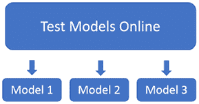

图 15.1：在线测试变压器模型

正如下面展示的，这十年的测试变得灵活和高效：

+   Hugging Face 托管诸如 DeBERTa 和其他一些模型等 API 模型。此外，Hugging Face 还提供 AutoML 服务，用于在其生态系统中训练和部署变压器模型。

+   OpenAI 的 GPT-3 引擎在在线游乐场上运行并提供 API。OpenAI 提供涵盖许多 NLP 任务的模型。这些模型无需训练。 GPT-3 的十亿参数零射引擎令人印象深刻。它显示出参数多的变压器模型整体产生更好的结果。Microsoft Azure、Google Cloud AI、AllenNLP 和其他平台提供有趣的服务。

+   如果值得的话，可以通过阅读一篇论文来进行在线模型分析。Google 的*Fedus*等人在 2021 年的一篇关于*Switch Transformers: Scaling to Trillion Parameter Models with Simple and Efficient Sparsity*的论文是一个很好的例子。Google 增加了我们在*第八章*中研究的基于 T5 的模型的规模，即*应用于法律和金融文件的 AI 文本摘要*。这篇论文证实了像 GTP-3 这样的大型在线模型的策略。

然而，最终，*选择一种解决方案的风险还是在你自己*。在选择一种解决方案后，你花在探索平台和模型上的时间将有助于你优化项目的实施。

可以通过三种不同的方式托管你的选择，如*图 15.2*所示：

+   使用 API 在本地机器上。OpenAI、Google Cloud AI、Microsoft Azure AI、Hugging Face 和其他提供了良好的 API。一个应用程序可以在本地机器上而不是在云平台上，但可以通过 API 经过云服务。

+   在像**亚马逊网络服务**(**AWS**)或 Google Cloud 这样的云平台上。您可以在这些平台上训练、微调、测试和运行模型。在这种情况下，没有应用在本地机器上。一切都在云上。

+   可以从任何地方使用 API！在本地机器上，数据中心虚拟机上，或从任何地方。这意味着 API 将集成在一个物理系统中，比如风车、飞机、火箭或自动驾驶车辆。因此，系统可以通过 API 与另一个系统永久连接。

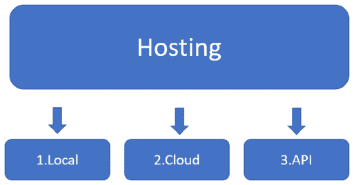

图 15.2: 为您的模型实现选项

最后，决定权在你手中。花点时间。测试、分析、计算成本，并团队合作听取不同的观点。*你对转换器的工作方式了解得越多，你做出的选择就会越好*。

现在让我们来探索改革者，这是原始转换器模型的一个变种。

# 改革者

*Kitaev*等人（2020 年）设计改革者来解决注意力和内存问题，为原始转换器模型添加功能。

改革者首先用**局部敏感哈希**(**LSH**)桶和分块来解决注意力问题。

LSH 在数据集中搜索最近的邻居。哈希函数确定如果数据点*q*接近*p*，那么*hash*(*q*) == *hash*(*p*)。在这种情况下，数据点是变压器模型头的键。

LSH 函数将键转换为 LSH *桶*（*图 15.3* 中的*B1*到*B4*），这个过程称为 LSH 分桶，就像我们将彼此相似的对象放在同一个排序的桶中一样。

排序的桶被分成*块*（*图 15.3* 中的*C1*到*C4*）进行并行化。最后，注意力仅在其块内和前一个块中的相同桶中应用：

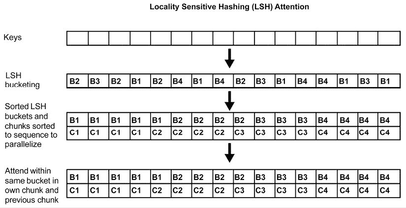

图 15.3: LSH 注意力头

LSH 分桶和分块将复杂度从*O*(*L*²)，即关注所有词对，减少到*O*(*L*log*L*)，即仅关注每个桶的内容。

改革者还解决了重新计算每一层输入而不是存储多层模型信息的内存问题。重新计算是按需实现的，而不是为一些大型多层模型消耗的千字节内存。

我们现在将使用在*Fyodor Dostoevsky*的*《罪与罚》*英文翻译上训练的一个改革者模型。

## 运行一个例子

让我们直接在托管的推理 API 上在线运行它。输入句子是：

`这个学生贫困潦倒，不知所措。`

在在线接口的链接中包含输入：

[`huggingface.co/google/reformer-crime-and-punishment?text=The+student+was+impoverished+and+did+not+know+what+to+do`](https://huggingface.co/google/reformer-crime-and-punishment?text=The+student+was+impoverished+and+did+not+know+what+to+do)

托管推理 API 与输入句子一起显示。点击`计算`以获得推理，结果将直接显示在输入下方：

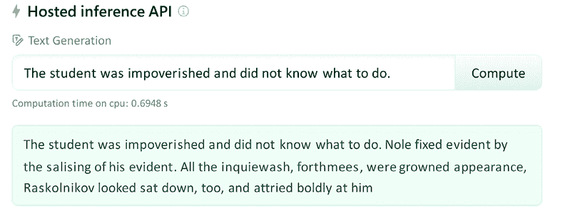

图 15.4：Reformer 的托管推理 API

由于算法是随机的，您可能会得到不同的响应。Reformer 经过了合理的训练，尽管没有像 OpenAI 的 GPT-3 那样拥有数十亿位信息的超级计算机。Reformer 的结果并不令人印象深刻。它需要更多的训练和微调才能获得更好的结果。

OpenAI 的 GPT-3 引擎对文本完成产生了以下结果：

学生生活贫困，不知所措。他找不到可以求助的人，也找不到住的地方。他从包里拿出一个记事本开始写。他写道：

“我的名字叫 XXXXXXXXXX。我是 XXXXXXX 的学生。我没有家人，没有朋友，没有钱。”

结果更具说服力。注册后，您可以访问 OpenAI 的游乐场：[`openai.com/`](https://openai.com/)

注意：OpenAI GPT-3，与其他变压器模型和大多数深度学习模型一样，基于随机算法。结果可能会有所不同。

这表明，包含数十亿参数的高度训练有素的变压器模型可以胜过一种创新的变压器模型架构。

超级计算机驱动的云 AI 平台是否会逐渐胜过本地尝试甚至功能较弱的云平台？在投资于一种解决方案之前，您需要通过原型解决这些问题。

**注意**：变压器模型的随机性可能导致在运行这些模型时产生不同的结果。此外，在线平台不断变化其界面。我们需要接受并适应这一点。

DeBERTa 引入了另一种创新的架构，我们现在将对其进行探讨。

# DeBERTa

通过*分解*还可以找到变压器的另一种新方法。在 AI 中，*分解*允许您分离表示特征，使训练过程更加灵活。*Pengcheng He*，*Xiaodong Liu*，*Jianfeng Gao*和*Weizhu Chen*设计了 DeBERTa，这是变压器的分解版本，并在一篇有趣的文章中描述了该模型：*DeBERTa: Decoding-enhanced BERT with Disentangled Attention*: [`arxiv.org/abs/2006.03654`](https://arxiv.org/abs/2006.03654)

DeBERTa 实现的两个主要思想是：

+   在变压器模型中将内容和位置分离开来，分别训练这两个向量

+   在预训练过程中使用解码器中的绝对位置来预测屏蔽的标记

作者在 GitHub 上提供了代码：[`github.com/microsoft/DeBERTa`](https://github.com/microsoft/DeBERTa)

DeBERTa 超越了 SuperGLUE 排行榜上的人类基准：


图 15.5：DeBERTa 在 SuperGLUE 排行榜上的表现

在“让我们在 Hugging Face 的云平台上运行一个示例”之前，去除任何空格。

## 运行一个示例

要在 Hugging Face 的云平台上运行示例，请单击以下链接：

[`huggingface.co/cross-encoder/nli-deberta-base`](https://huggingface.co/cross-encoder/nli-deberta-base)

托管推理 API 将显示一个示例和可能的类名称输出：

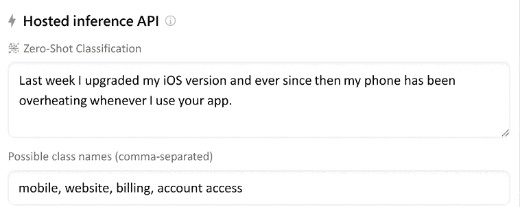

图 15.6：DeBERTa 的托管推理 API

可能的类名称是`mobile`，`website`，`billing`和`account access`。

结果很有趣。让我们将其与 GPT-3 关键词任务进行比较。首先，在[`openai.com/`](https://openai.com/)上注册一下

输入`Text`作为输入，并输入`Keywords`以要求引擎找到关键词：

**文本**：`上周我升级了我的 iOS 版本，自那时起，每当我使用你们的应用时，我的手机就会过热。`

**关键词**: `app, overheating, phone`

可能的关键词是`app`，`overheating`和`phone`。

我们已经学习了 DeBERTa 和 GPT-3 变压器。现在我们将将变压器扩展到视觉模型。

# 从任务无关模型到视觉变压器

基础模型，正如我们在第一章“什么是变压器？”中所看到的，具有两个独特而独特的属性：

+   **涌现** - 符合基础模型标准的变压器模型可以执行未经训练的任务。它们是在超级计算机上训练的大型模型。它们没有被训练来学习像许多其他模型那样的特定任务。基础模型学会了如何理解序列。

+   **同质化** - 相同的模型可以在许多领域中使用相同的基本架构。基础模型可以通过数据比其他任何模型更快更好地学习新技能。

GPT-3 和 Google BERT（仅 Google 训练的 BERT 模型）是任务不可知的基础模型。这些任务不可知的模型直接引导到 ViT、CLIP 和 DALL-E 模型。变压器有着奇特的序列分析能力。

变压器模型的抽象程度导致多模态神经元：

+   **多模态神经元**可以处理可被标记为像素或图像片段的图像。然后它们可以在视觉变压器中被处理为*单词*。一旦图像被编码，变压器模型将标记视为任何*单词*标记，如图 15.7 所示：

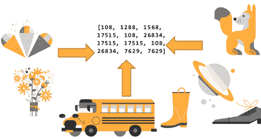

图 15.7：图像可以编码为类似单词的标记

在本节中，我们将介绍以下内容：

+   ViT，将图像处理为*单词*片段的视觉变压器

+   CLIP，将文本和图像编码的视觉变压器

+   DALL-E，用文本构造图像的视觉变压器

让我们开始探索 ViT，一个将图像处理为*单词*片段的视觉变压器。

## ViT - 视觉变压器

*Dosovitskiy*等人（2021）在文章标题中总结了他们设计的视觉变压器架构的精华：*一张图片价值 16x16 个单词：大规模图像识别的变压器*。

图像可以转换为 16x16 单词的片段。

在查看代码之前，让我们先看一下 ViT 的架构。

### ViT 的基本架构

视觉变换器可以将图像作为“单词”补丁来处理。在本节中，我们将按照三个步骤进行处理：

1.  将图像拆分成补丁

1.  补丁的线性投影

1.  混合输入嵌入子层

第一步是将图像拆分成相同尺寸的补丁。

#### 第一步：将图像拆分成补丁

图像被分割成*n*个补丁，如图 15.8 所示。只要所有补丁的尺寸相同（例如 16x16），就没有规定补丁数量的规定：

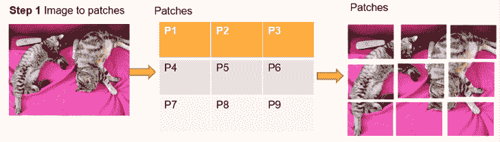

图 15.8：将图像拆分成补丁

相等尺寸的补丁现在代表我们序列的“单词”。如何处理这些补丁仍然是个问题。我们将看到每种视觉变换器都有自己的方法。

图像引用：本节和随后的几节中使用的猫的图像由*DocChewbacca*拍摄：[`www.flickr.com/photos/st3f4n/`](https://www.flickr.com/photos/st3f4n/)，于 2006 年。它属于 Flickr 免费许可证，[`creativecommons.org/licenses/by-sa/2.0/`](https://creativecommons.org/licenses/by-sa/2.0/)。有关更多详情，请查看 Flickr 上*DocChewbacca*的图片：[`www.flickr.com/photos/st3f4n/210383891`](https://www.flickr.com/photos/st3f4n/210383891)

在这种情况下，对于 ViT，*第 2 步*是对展平的图像进行线性投影。

#### 第二步：对展平的图像进行线性投影

*第 1 步*将图像转换为尺寸相等的补丁。补丁的动机是避免逐像素处理图像，但问题在于找到处理补丁的方法。

Google Research 团队决定设计一个由图像的展平图像的线性投影和通过分割图像获得的补丁组成的线性投影，如图 15.9 所示：

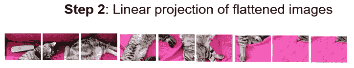

图 15.9：图像的线性投影

思路是获得一个类似单词的补丁序列。剩下的问题是嵌入展平图像序列。

#### 第三步：混合输入嵌入子层

类似单词的图像序列可以适应变换器。问题在于它们仍然是图像！

Google Research 决定使用混合输入模型，如图 15.10 所示：

+   添加一个卷积网络以嵌入补丁的线性投影

+   添加位置编码以保留原始图像的结构

+   然后使用标准的原始 BERT 样式编码器处理嵌入的输入

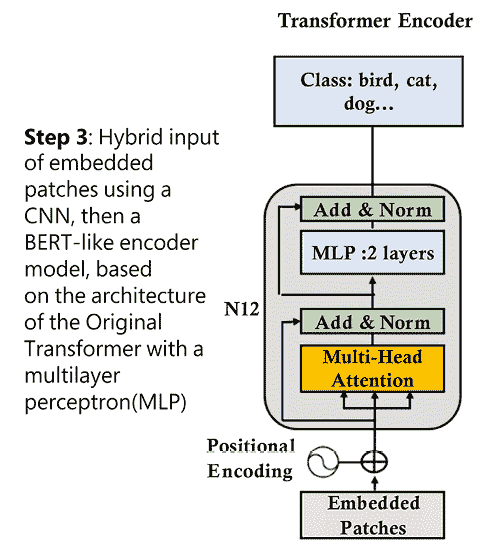

图 15.10：混合输入子层和标准编码器

Google Research 找到了一种巧妙的方法将 NLP 变换器模型转换成视觉变换器。

现在，让我们在代码中实现一个 Hugging Face 视觉变换器示例。

### 代码中的视觉变换器

在本节中，我们将重点关注与视觉变换器特定体系结构相关的主要代码区域。

打开`Vision_Transformers.ipynb`，它位于本章的 GitHub 存储库中。

Google Colab VM 中包含许多预安装的软件包，如`torch`和`torchvision`。可以通过在笔记本的第一个单元格中取消注释该命令来显示它们：

```py
#Uncomment the following command to display the list of pre-installed modules 
#!pip list -v 
```

然后前往笔记本的**Vision Transformer**（**ViT**）单元。该笔记本先安装了 Hugging Face transformers 并导入了必要的模块：

```py
!pip install transformers
from transformers import ViTFeatureExtractor, ViTForImageClassification
from PIL import Image
import requests 
```

**注意**：在撰写本书时，Hugging Face 警告我们，由于不断的演变，代码可能不稳定。但这不应阻止我们探索 ViT 模型。探索新领域正是前沿的所在！

然后我们从 COCO 数据集下载了一幅图像。如果你想进一步进行实验，可以在他们的网站上找到大量数据集：[`cocodataset.org/`](https://cocodataset.org/)

让我们从 VAL2017 数据集中下载。按照 COCO 数据集网站的说明通过程序获取这些图像或在本地下载数据集。

VAL2017 包含了 5,000 张我们可以选择的图像，以测试这个 ViT 模型。你可以运行其中任何一张图像。

让我们用猫的图片测试笔记本。我们首先通过它们的 URL 检索猫的图片：

```py
url = 'http://images.cocodataset.org/val2017/000000039769.jpg'
image = Image.open(requests.get(url, stream=True).raw) 
```

我们接下来要下载 Google 的特征提取器和分类模型：

```py
feature_extractor = ViTFeatureExtractor.from_pretrained('google/vit-base-patch16-224')
model = ViTForImageClassification.from_pretrained('google/vit-base-patch16-224') 
```

该模型在 224 x 244 分辨率图像上进行训练，但在特征提取和分类时采用了 16 x 16 的块。笔记本运行模型并进行预测：

```py
inputs = feature_extractor(images=image, return_tensors="pt")
outputs = model(**inputs)
logits = outputs.logits
# model predicts one of the 1000 ImageNet classes
predicted_class_idx = logits.argmax(-1).item()
print("Predicted class:",predicted_class_idx,": ", model.config.id2label[predicted_class_idx]) 
```

输出为：

```py
Predicted class: 285 :  Egyptian cat 
```

探索在预测后的代码，它提供了一些低层次的信息，其中包括：

+   `model.config.id2label`，会列出类的标签。这 1000 个标签类解释了为什么我们得到一个类而不是详细的文本描述：

    ```py
    {0: 'tench, Tinca tinca',1: 'goldfish, Carassius auratus', 2: 'great white shark, white shark, man-eater, man-eating shark, Carcharodon carcharias',3: 'tiger shark, Galeocerdo cuvieri',...,999: 'toilet tissue, toilet paper, bathroom tissue'} 
    ```

+   `模型`，该模型将显示从卷积输入子层开始的模型架构：

    ```py
    (embeddings): ViTEmbeddings(
      (patch_embeddings): PatchEmbeddings(
        (projection): Conv2d(3, 768, kernel_size=(16, 16), stride=(16, 16))
      ) 
    ```

在卷积输入嵌入子层之后，模型是一个类似 BERT 的编码器。

请花些时间探索这个创新的从 NLP 变换器到图像变换器的转变，迅速导向为一切都使用变换器。

现在，让我们了解另一个计算机视觉模型 CLIP。

## CLIP

**对比语言-图像预训练**（**CLIP**）遵循了变换器的理念。它在其变换器类型的层中插入数据序列。这次，模型发送的是文本-图像对，而不是文本对。一旦数据被分词、编码和嵌入，CLIP，一个无关任务的模型，就像处理任何其他数据序列一样学习文本-图像对。

这种方法是对比的，因为它寻找图像特征中的对比。这是我们在一些杂志游戏中使用的方法，在这些游戏中，我们必须找到两幅图像之间的差异，对比。

让我们先看一下 CLIP 的架构，然后再看代码。

### CLIP 的基本架构

对比：图像通过它们的差异和相似之处学习如何相互配合。通过（联合文本，图像）预训练，图像和字幕找到彼此的路径。预训练后，CLIP 学习新任务。

CLIP 是可转移的，因为它们可以学习新的视觉概念，就像 GPT 模型一样，比如视频序列中的动作识别。字幕带来了无尽的应用。

ViT 将图像分割成类似单词的补丁。CLIP 联合训练*文本和图像*编码器以最大化余弦相似度，如*图 15.11*所示：

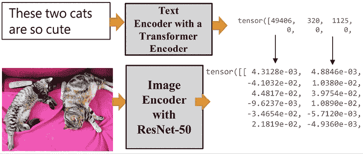

图 15.11：联合训练文本和图像

*图 15.11*显示了变压器将为文本输入运行标准变压器编码器。它将在变压器结构中为图像运行一个 ResNet 50 层 CNN。 ResNet 50 被修改为在具有多头 QKV 注意头的注意力池化机制中运行平均池化层。

让我们看看 CLIP 是如何学习文本-图像序列以进行预测的。

### 代码中的 CLIP

打开 GitHub 上本章的存储库中的`Vision_Transformers.ipynb`。然后转到笔记本的`CLIP`单元格。

该程序开始安装 PyTorch 和 CLIP：

```py
!pip install ftfy regex tqdm
!pip install git+https://github.com/openai/CLIP.git 
```

该程序还导入模块和 CIFAR-100 来访问图像：

```py
import os
import clip
import torch
from torchvision.datasets import CIFAR100 
```

有 10,000 张图像可用，索引介于 0 和 9,999 之间。下一步是选择我们要进行预测的图像：


图 15.12：选择一个图像索引

程序然后将模型加载到可用的设备上（GPU 或 CPU）：

```py
# Load the model
device = "cuda" if torch.cuda.is_available() else "cpu"
model, preprocess = clip.load('ViT-B/32', device) 
```

图像已下载：

```py
# Download the dataset
cifar100 = CIFAR100(root=os.path.expanduser("~/.cache"), download=True, train=False) 
```

输入已准备好：

```py
# Prepare the inputs
image, class_id = cifar100[index]
image_input = preprocess(image).unsqueeze(0).to(device)
text_inputs = torch.cat([clip.tokenize(f"a photo of a {c}") for c in cifar100.classes]).to(device) 
```

在运行预测之前，让我们可视化所选的输入：

```py
import matplotlib.pyplot as plt
from torchvision import transforms
plt.imshow(image) 
```

输出显示`索引 15`是一只狮子：

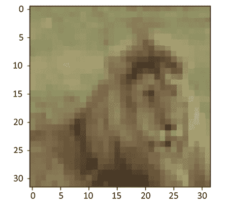

图 15.13：索引 15 的图像

本节中的图像来自于*从小图像中学习多层特征*，*Alex Krizhevsky*，2009 年：[`www.cs.toronto.edu/~kriz/learning-features-2009-TR.pdf`](https://www.cs.toronto.edu/~kriz/learning-features-2009-TR.pdf)。它们是`CIFAR-10`和`CIFAR-100`数据集的一部分（`toronto.edu`）：[`www.cs.toronto.edu/~kriz/cifar.html`](https://www.cs.toronto.edu/~kriz/cifar.html)

我们知道这是一只狮子，因为我们是人类。一个最初设计用于自然语言处理的变压器必须学习图像是什么。现在我们将看到它能多好地识别图像。

在计算特征时，程序表明正在运行一个联合变压器模型，将图像输入与文本输入分开：

```py
# Calculate features
with torch.no_grad():
    image_features = model.encode_image(image_input)
    text_features = model.encode_text(text_inputs) 
```

现在 CLIP 进行预测并显示前五个预测：

```py
# Pick the top 5 most similar labels for the image
image_features /= image_features.norm(dim=-1, keepdim=True)
text_features /= text_features.norm(dim=-1, keepdim=True)
similarity = (100.0 * image_features @ text_features.T).softmax(dim=-1)
values, indices = similarity[0].topk(5)
# Print the result
print("\nTop predictions:\n")
for value, index in zip(values, indices):
    print(f"{cifar100.classes[index]:>16s}: {100 * value.item():.2f}%") 
```

如果您想获得更多或更少的预测结果，可以修改`topk(5)`。显示前五个预测：

```py
Top predictions:
            lion: 96.34%
           tiger: 1.04%
           camel: 0.28%
      lawn_mower: 0.26%
         leopard: 0.26% 
```

CLIP 找到了狮子，这显示了变压器架构的灵活性。

下一个单元格显示类别：

```py
cifar100.classes 
```

您可以浏览类别，看看只有一个标签的情况下，CLIP 的表现如何受限制。

```py
[...,'kangaroo','keyboard','lamp','lawn_mower','leopard','lion',
 'lizard', ...] 
```

笔记本包含了其他几个单元格，描述了您可以探索的 CLIP 的架构和配置。

`model` 单元格特别有趣，因为您可以看到以类似于 ViT 模型的卷积嵌入开始，然后继续作为一个“标准”大小为 768 的变压器，具有多头注意力的视觉编码器：

```py
CLIP(
  (visual): VisionTransformer(
    (conv1): Conv2d(3, 768, kernel_size=(32, 32), stride=(32, 32), bias=False)
    (ln_pre): LayerNorm((768,), eps=1e-05, elementwise_affine=True)
    (transformer): Transformer(
      (resblocks): Sequential(
        (0): ResidualAttentionBlock(
          (attn): MultiheadAttention(
            (out_proj): NonDynamicallyQuantizableLinear(in_features=768, out_features=768, bias=True)
          )
          (ln_1): LayerNorm((768,), eps=1e-05, elementwise_affine=True)
          (mlp): Sequential(
            (c_fc): Linear(in_features=768, out_features=3072, bias=True)
            (gelu): QuickGELU()
            (c_proj): Linear(in_features=3072, out_features=768, bias=True)
          )
          (ln_2): LayerNorm((768,), eps=1e-05, elementwise_affine=True)
        ) 
```

`model` 单元格的另一个有趣之处是查看与图像编码器同时运行的大小为 512 的文本编码器：

```py
(transformer): Transformer(
    (resblocks): Sequential(
      (0): ResidualAttentionBlock(
        (attn): MultiheadAttention(
          (out_proj): NonDynamicallyQuantizableLinear(in_features=512, out_features=512, bias=True)
        )
        (ln_1): LayerNorm((512,), eps=1e-05, elementwise_affine=True)
        (mlp): Sequential(
          (c_fc): Linear(in_features=512, out_features=2048, bias=True)
          (gelu): QuickGELU()
          (c_proj): Linear(in_features=2048, out_features=512, bias=True)
        )
        (ln_2): LayerNorm((512,), eps=1e-05, elementwise_affine=True)
      ) 
```

浏览描述架构、配置和参数的单元格，了解 CLIP 如何表示数据。

我们展示了任务无关的变压器模型将图像文本对处理为文本文本对。我们可以将任务无关模型应用于音乐文本、声音文本、音乐图像以及任何类型的数据对。

现在我们将探讨另一个任务无关的变压器模型 DALL-E，它可以处理图像和文本。

## DALL-E

与 CLIP 一样，DALL-E 是一个任务无关的模型。CLIP 处理文本图像对。DALL-E 分别处理文本和图像令牌。DALL-E 的输入是一个包含 1,280 个令牌的文本和图像的单一流。256 个令牌用于文本，1,024 个令牌用于图像。DALL-E 是一个像 CLIP 一样的基础模型。

DALL-E 的命名来源于 *萨尔瓦多·达利* 和 Pixar 的 WALL-E。DALL-E 的使用方法是输入文本提示并生成图像。然而，DALL-E 必须先学会如何用文本生成图像。

DALL-E 是 GPT-3 的 120 亿参数版本。

该变压器使用文本-图像对数据集从文本描述生成图像。

### DALL-E 的基本架构

与 CLIP 不同，DALL-E 将最多 256 个 BPE 编码的文本令牌与 32×32 = 1,024 个图像令牌连接起来，如 *图 15.14* 所示：

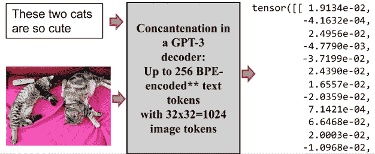

图 15.14：DALL-E 将文本和图像输入连接起来

*图 15.14* 显示，这一次我们的猫图像与输入文本连接在一起。

DALL-E 有一个编码器和一个解码器堆栈，其构建了将卷积功能注入到变压器模型中的混合架构。

让我们窥探一下代码，看看模型是如何工作的。

### 代码中的 DALL-E

在本节中，我们将看到 DALL-E 如何重构图像。

打开 `Vision_Transformers.ipynb`。然后转到笔记本的 `DALL-E` 单元格。笔记本首先安装 OpenAI DALL-E：

```py
!pip install DALL-E 
```

笔记本下载图像并处理图像：

```py
import io
import os, sys
import requests
import PIL
import torch
import torchvision.transforms as T
import torchvision.transforms.functional as TF
from dall_e import map_pixels, unmap_pixels, load_model
from IPython.display import display, display_markdown
target_image_size = 256
def download_image(url):
    resp = requests.get(url)
    resp.raise_for_status()
    return PIL.Image.open(io.BytesIO(resp.content))
def preprocess(img):
    s = min(img.size)

    if s < target_image_size:
        raise ValueError(f'min dim for image {s} < {target_image_size}')

    r = target_image_size / s
    s = (round(r * img.size[1]), round(r * img.size[0]))
    img = TF.resize(img, s, interpolation=PIL.Image.LANCZOS)
    img = TF.center_crop(img, output_size=2 * [target_image_size])
    img = torch.unsqueeze(T.ToTensor()(img), 0)
    return map_pixels(img) 
```

程序现在加载 OpenAI DALL-E 编码器和解码器：

```py
# This can be changed to a GPU, e.g. 'cuda:0'.
dev = torch.device('cpu')
# For faster load times, download these files locally and use the local paths instead.
enc = load_model("https://cdn.openai.com/dall-e/encoder.pkl", dev)
dec = load_model("https://cdn.openai.com/dall-e/decoder.pkl", dev) 
```

我添加了 `enc` 和 `dec` 单元格，以便您可以查看编码器和解码器块，了解这种混合模型的工作原理：变压器模型中的卷积功能和文本与图像输入的连接。

本节中处理的图像是 `mycat.jpg`（作者：Denis Rothman，版权所有，需取得书面许可方可复制）。该图像位于本书存储库的 `Chapter15` 目录中。它已被下载并处理：

```py
x=preprocess(download_image('https://github.com/Denis2054/AI_Educational/blob/master/mycat.jpg?raw=true')) 
```

最后，我们显示原始图片：

```py
display_markdown('Original image:')
display(T.ToPILImage(mode='RGB')(x[0])) 
```

输出显示图像：

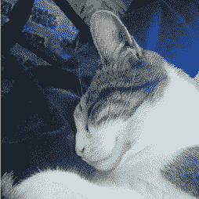

图 15.15：一张猫的图片

现在，程序处理并显示*重建*图像：

```py
import torch.nn.functional as F
z_logits = enc(x)
z = torch.argmax(z_logits, axis=1)
z = F.one_hot(z, num_classes=enc.vocab_size).permute(0, 3, 1, 2).float()
x_stats = dec(z).float()
x_rec = unmap_pixels(torch.sigmoid(x_stats[:, :3]))
x_rec = T.ToPILImage(mode='RGB')(x_rec[0])
display_markdown('Reconstructed image:')
display(x_rec) 
```

重建后的图像看起来与原始图像极为相似：

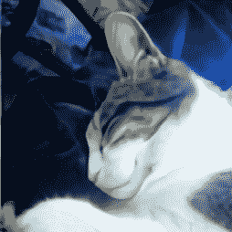

图 15.16：DALL-E 重建了猫的图像

结果令人印象深刻。DALL-E 学会了如何自动生成图像。

在书写本书时，完整的 DALL-E 源代码尚不可用，也许永远都不会。目前尚未上线 OpenAI 的 API，用于从文本提示生成图像。但请保持关注！

与此同时，我们可以继续在 OpenAI 上发现 DALL-E：[`openai.com/blog/dall-e/`](https://openai.com/blog/dall-e/)

一旦你打开页面，就滚动到提供的示例下面。例如，我选择了旧金山 Alamo Square 的照片作为提示：


图 15.17：旧金山 Alamo Square 的提示

然后我将“在晚上”修改为“在早晨”：


图 15.18：修改提示

DALL-E 然后生成了大量的 `text2image` 图像：

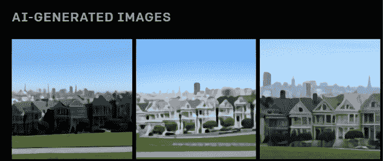

图 15.19：从文本提示生成图像

我们已经实现了 ViT、CLIP 和 DALL-E，三种视觉变压器。在结束之前，让我们简要总结一下。

# 一个不断扩大的模型宇宙

新的变压器模型，就像新的智能手机一样，几乎每周都会出现。其中一些模型既令人惊叹又对项目经理构成挑战：

+   **ERNIE** 是一个持续的预训练框架，为语言理解提供了令人印象深刻的结果。

    **论文**：[`arxiv.org/abs/1907.12412`](https://arxiv.org/abs/1907.12412)

    **挑战**：Hugging Face 提供了一个模型。这是一个完整的模型吗？这是百度训练的超越人类基线的模型吗（2021 年 12 月）：[`super.gluebenchmark.com/leaderboard`](https://super.gluebenchmark.com/leaderboard)？我们是否可以访问到最好的模型还是只有一个玩具模型？对于这样小型模型运行 AutoML 的目的是什么？我们是否能在百度平台或类似平台上获得访问权限？这会花费多少？

+   **SWITCH**：一个经过稀疏建模优化的万亿参数模型。

    **论文**：[`arxiv.org/abs/2101.03961`](https://arxiv.org/abs/2101.03961)

    **挑战**：这篇论文很棒。模型在哪里？我们将永远能够访问到真正完全训练好的模型吗？会花费多少？

+   **Megatron-Turing**：一个拥有 5000 亿参数的变压器模型。

    **博客**：[`developer.nvidia.com/blog/using-deepspeed-and-megatron-to-train-megatron-turing-nlg-530b-the-worlds-largest-and-most-powerful-generative-language-model/`](https://developer.nvidia.com/blog/using-deepspeed-and-megatron-to-train-megatron-turing-nlg-530b-the-worlds-largest-and-most-powerful-generative-language-model/)

    **挑战**：市场上最好的模型之一。我们是否可以通过 API 访问？它是否会是一个成熟的模型？会花费多少？

+   **XLNET** 像 BERT 一样进行了预训练，但作者认为它超过了 BERT 模型的性能。

    **论文**：[`proceedings.neurips.cc/paper/2019/file/dc6a7e655d7e5840e66733e9ee67cc69-Paper.pdf`](https://proceedings.neurips.cc/paper/2019/file/dc6a7e655d7e5840e66733e9ee67cc69-Paper.pdf)

    **挑战**：XLNET 是否真的超过了 Google BERT 的性能，Google 用于其活动的版本？我们是否可以访问到 Google BERT 或 XLNET 模型的最佳版本？

列表已经变得无穷无尽，而且还在增长！

测试它们仍然是一个超出前述问题的挑战。只有少数变压器模型符合基础模型的条件。基础模型必须是：

+   完全训练，可执行一系列任务

+   能够执行其未经训练的任务，因为它已经达到了独特的 NLU 水平

+   足够大以保证相当准确的结果，比如 OpenAI GPT-3

许多网站提供的变压器对于教育目的而言是有用的，但不能被视为足够训练和庞大以符合基准测试的。

最好的方法是尽可能地加深对变压器模型的理解。在某个时刻，你会成为一名专家，通过大型技术创新的丛林将变得像选择智能手机一样容易！

# 摘要

新的变压器模型不断出现在市场上。因此，通过阅读出版物和书籍，并测试一些系统，跟上前沿研究是一个好的实践。

这导致我们评估选择哪些变压器模型以及如何实现它们。我们不能花几个月时间探索每个出现在市场上的模型。如果一个项目正在生产中，我们不能每个月都更换模型。工业 4.0 正在转向无缝的 API 生态系统。

学习所有模型是不可能的。然而，通过加深对变压器模型的了解，可以快速理解一个新模型。

变压器模型的基本结构保持不变。编码器和/或解码器堆栈的层保持相同。注意力头可以并行化以优化计算速度。

Reformer 模型应用**LSH**桶和分块。它还重新计算每个层的输入，而不是存储信息，从而优化了内存问题。然而，像 GPT-3 这样的十亿参数模型对于相同的示例产生可接受的结果。

DeBERTa 模型分解内容和位置，使训练过程更加灵活。结果令人印象深刻。然而，像 GPT-3 这样的十亿参数模型可以与 DeBERTa 的输出相媲美。

ViT、CLIP 和 DALL-E 带我们进入了迷人的任务无关的文本图像视觉变压器模型的世界。结合语言和图像会产生新的、富有成效的信息。

问题仍然存在，即现成的人工智能和自动化系统将走多远。我们将尝试在下一章关于元人类崛起的章节中可视化基于变压器的人工智能的未来。

# 问题

1.  Reformer 变压器模型不包含编码器。（True/False）

1.  Reformer 变压器模型不包含解码器。（True/False）

1.  输入在 Reformer 模型中按层存储。（True/False）

1.  DeBERTa 变压器模型分解内容和位置。（True/False）

1.  在选择项目使用的预训练变压器模型之前，有必要测试数百个预训练的变压器模型。（True/False）

1.  最新的变压器模型总是最好的。（True/False）

1.  每个自然语言处理任务最好有一个变压器模型，而不是一个多任务变压器模型。（True/False）

1.  一个变压器模型总是需要进行微调。（True/False）

1.  OpenAI GPT-3 引擎可以在不进行微调的情况下执行广泛的自然语言处理任务。（True/False）

1.  在本地服务器上实现 AI 算法总是更好的。（True/False）

# 参考文献

+   Hugging Face Reformer: [`huggingface.co/transformers/model_doc/reformer.html?highlight=reformer`](https://huggingface.co/transformers/model_doc/reformer.html?highlight=reformer)

+   Hugging Face DeBERTa: [`huggingface.co/transformers/model_doc/deberta.html`](https://huggingface.co/transformers/model_doc/deberta.html)

+   *Pengcheng He*，*Xiaodong Liu*，*Jianfeng Gao*，*Weizhu Chen*，2020 年，*Decoding-enhanced BERT with Disentangled Attention*: [`arxiv.org/abs/2006.03654`](https://arxiv.org/abs/2006.03654)

+   *Alexey Dosovitskiy*, *Lucas Beyer*, *Alexander Kolesnikov*, *Dirk Weissenborn*, *Xiaohua Zhai*, *Thomas Unterthiner*, *Mostafa Dehghani*, *Matthias Minderer*, *Georg Heigold*, *Sylvain Gelly*, *Jakob Uszkoreit*, *Neil Houlsby*, *2020 年，一张图片等于 16x16 个单词：* *Transformers for Image Recognition at Scale*: [`arxiv.org/abs/2010.11929`](https://arxiv.org/abs/2010.11929)

+   OpenAI: [`openai.com/`](https://openai.com/)

+   *William Fedus*, *Barret Zoph*, *Noam Shazeer*，2021 年，*Switch Transformers: Scaling to Trillion Parameter Models with Simple and Efficient Sparsity*: [`arxiv.org/abs/2101.03961`](https://arxiv.org/abs/2101.03961 )

+   *Alec Radford*, *Jong Wook Kim*, *Chris Hallacy*, *Aditya Ramesh*, *Gabriel Goh*, *Sandhini Agarwal*, *Girish Sastry*, *Amanda Askell*, *Pamela Mishkin*, *Jack Clark*, *Gretchen Krueger*, *Ilya Sutskever*, 2021, *Learning Transferable Visual Models From Natural Language Supervision*: [`arxiv.org/abs/2103.00020`](https://arxiv.org/abs/2103.00020)

+   C7LIP: [`github.com/openai/CLIP`](https://github.com/openai/CLIP)

+   *Aditya Ramesh*, *Mikhail Pavlov*, *Gabriel Goh*, *Scott Gray*, *Chelsea Voss*, *Alec Radford*, *Mark Chen*, *Ilya Sutskever*, 2021, *Zero-Shot Text-to-Image Generation*: [`arxiv.org/abs/2102.12092`](https://arxiv.org/abs/2102.12092)

+   DALL-E: [`openai.com/blog/dall-e/`](https://openai.com/blog/dall-e/)

# 加入我们书籍的 Discord 空间

加入书籍的 Discord 工作空间，与作者进行每月的*问我任何事*会话：

[`www.packt.link/Transformers`](https://www.packt.link/Transformers)


