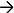
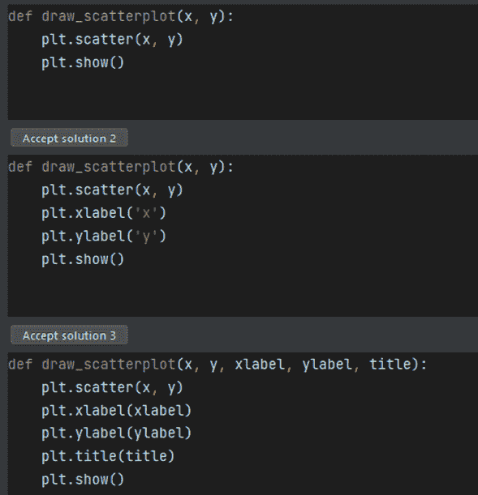
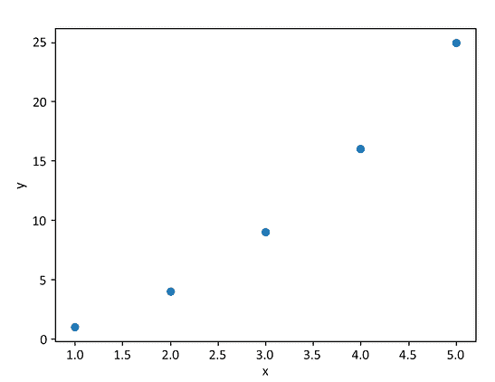
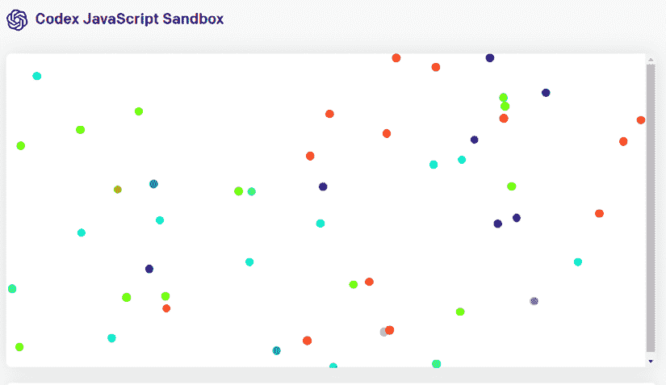
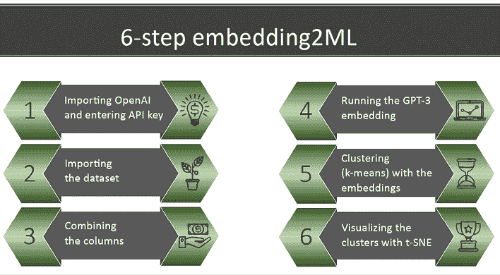
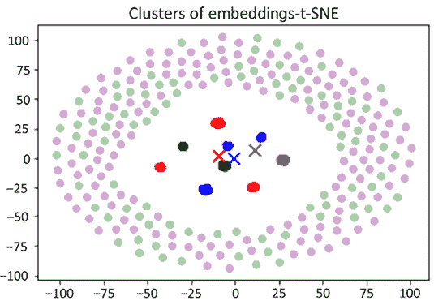
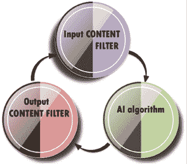
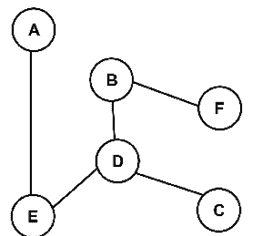
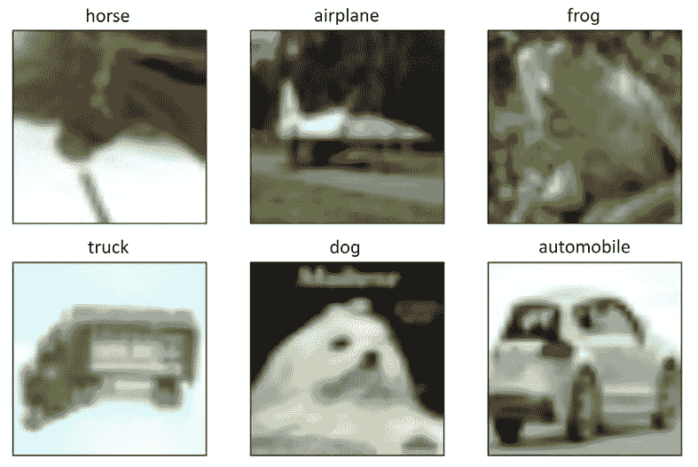
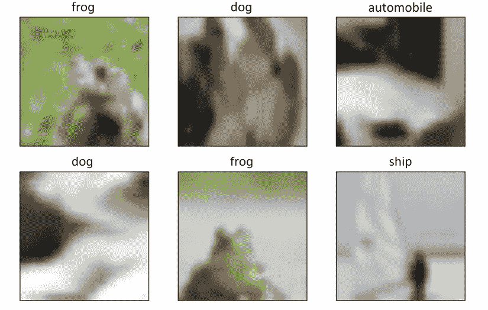

# 第十六章：Transformers驱动副驾驶员的出现

当**工业 4.0**（**I4.0**）达到成熟时，一切都将关于机器对机器的连接、通信和决策。人工智能将主要嵌入成熟的按需付费云 AI 解决方案中。大型科技公司将吸收大部分才华横溢的 AI 专家，创建 API、接口和集成工具。

AI 专家将从开发转变为设计，成为架构师、集成者和云 AI 管道管理员。因此，AI 更像是工程顾问的工作，而不是工程开发者的工作。

*第一章*，*Transformers是什么？*，介绍了基础模型，Transformers可以完成它们未经训练的自然语言处理任务。*第十五章*，*从自然语言处理到任务无关的Transformers模型*，将基础模型Transformers扩展到可以执行视觉任务、自然语言处理任务等的任务无关模型。

本章将把 OpenAI GPT-3 模型扩展到各种副驾驶员任务。新一代 AI 专家和数据科学家将学习如何与 AI 副驾驶员合作，帮助他们自动生成源代码并做出决策。

本章将首先更详细地探讨提示工程。示例任务包括将会议记录转换为摘要。Transformers提高了我们的生产力。但是，我们将看到自然语言对 AI 仍然是一个挑战。

我们将学习如何将 OpenAI Codex 作为副驾驶员。GitHub Copilot 在我们编写程序时使用 Codex 为我们建议源代码。Codex 也可以将自然语言转换为代码。

然后，我们将发现具有特定领域 GPT-3 引擎的新 AI 方法。本章将展示如何生成具有 12288 维度的嵌入并将其插入机器学习算法中。我们还将看到如何要求转换器自动生成说明。

在研究Transformers驱动的推荐系统之前，我们将看到如何过滤偏见的输入和输出。2020 年代的人工智能必须以道德方法构建。

推荐系统渗透到每个社交媒体平台，推荐视频、帖子、消息、书籍和其他我们可能想消费的产品。我们将在这个过程中构建一个基于 ML 的教育多用途Transformers推荐系统。

Transformers模型分析序列。它们起初用于自然语言处理，但已成功扩展到计算机视觉。我们将探索在 JAX 中开发的基于Transformers的计算机视觉程序。

最后，我们将看到 AI 副驾驶员如何促进虚拟系统向元宇宙的过渡，在本十年中将会扩展。当你开发应用程序时，你是飞行员。但是，当你有要开发的代码时，激活的完成只限于方法，而不是代码行。IDE 可能会建议方法列表。副驾驶员可以生成整段代码的完成！

本章涵盖以下主题：

+   提示工程

+   GitHub Copilot

+   Codex 语言到源代码模型

+   嵌入数据集

+   嵌入式驱动的机器学习

+   指导系列

+   内容过滤模型

+   探索基于转换器的推荐系统

+   将自然语言处理序列学习扩展到行为预测

+   在 JAX 中实现转换器模型

+   将转换器模型应用于计算机视觉

让我们从提示工程开始，这是一种必须获得的关键能力。

# 提示工程

说一种特定的语言不是遗传的。我们大脑中没有一个包含我们父母语言的语言中心。我们的大脑在我们的生活早期工程化我们的神经元，以便说、阅读、写作和理解一种语言。每个人的语言电路都取决于他们的文化背景以及在早年如何与他们交流。

随着我们成长，我们发现我们听到的很多东西都是混乱的：未完整的句子、语法错误、词语误用、发音错误以及许多其他扭曲。

我们使用语言传达信息。我们很快发现我们需要将我们的语言适应我们所面向的人或观众。我们可能需要尝试额外的“输入”或“提示”来得到我们期望的结果（“输出”）。像 GPT-3 这样的基础级转换器模型可以以无限多种方式执行数百种任务。*我们必须像学习任何其他语言一样学习转换器提示和响应的语言*。与人或接近人类水平的转换器进行有效沟通必须包含最少的信息以最大化结果。我们代表获得结果所需的最小输入信息为*minI*，以及任何系统的最大输出为*maxR*。

我们可以将这种沟通链表示为：

*minI(input)  maxR(output)*

我们将用“提示”取代“输入”，以便转换器表明我们的输入会影响模型的反应。输出是“响应”。与转换器的对话，*d(T)*，可以表示为：

*d(T)=minI(prompt)* * maxR(response)*

当*minI(prompt)*`1`时，*maxR*(response)的概率也**`1`。

当*minI(prompt)* **`0`时，*maxR*(response)的概率也**`0`。

*d(T)*的质量取决于我们能够定义*minI(prompt)*的程度。

如果你的提示倾向于达到`1`，那么它将产生倾向于`1`的概率。

如果你的提示趋向于达到`0`，那么它将产生趋向于`0`的输出概率。

你的提示是影响概率的内容的一部分！为什么？因为转换器将在其估计中包含提示和响应。

作为孩子或成年人学习一门语言需要很多年的时间。学习Transformers语言和如何有效设计*minI(prompt)*也需要相当长的时间。我们需要了解它们，它们的架构以及算法计算预测的方式。然后我们需要花相当多的时间来理解如何设计输入，提示，以使Transformers表现出我们期望的行为。

本节重点介绍口头语言。OpenAI GPT-3 的 NLP 任务的提示通常来自会议记录或对话，这些记录往往是非结构化的。将会议记录或对话转换成摘要可能是相当具有挑战性的。本节将专注于总结相同对话的七种情况下的笔记，从随意英语到具有有限上下文的随意或正式英语。

我们将从具有有意义上下文的随意英语开始。

## 具有有意义上下文的随意英语

随意英语是用较短的句子和有限的词汇说话的。

让我们要求 OpenAI GPT-3 执行“笔记到摘要”的任务。转到 [www.openai.](http://www.openai.com)com。登录或注册。然后转到**示例**页面并选择**笔记到摘要**。

我们将给 GPT-3 提供所有必要的信息，以总结简和汤姆之间的随意对话。简和汤姆是两位开始工作的开发人员。汤姆提供咖啡给简。简拒绝了这个提议。

在这种情况下，*minI(prompt)=1*，因为输入信息是正确的，如*图 16.1*所示：


图 16.1：总结了详细记录的笔记

当我们点击**生成**时，我们得到了一个令人惊讶的好答案，如*图 16.2*所示：


图 16.2：GPT-3 提供了一个可以接受的摘要

我们能否得出结论，AI 可以在我们混乱的日常对话、会议和漫无目的的闲聊中找到结构？答案并不容易。我们现在将通过添加一个代称来使输入复杂化。

## 以代称为特征的随意英语

汤姆提到了`coffee`这个词，让 GPT-3 保持正确的方向。但如果汤姆用`java`代替`coffee`呢？咖啡是指饮料，而`java`是一种来自爪哇岛的成分。代称是当我们使用一个对象的属性时，比如用`java`代替`coffee`。Java 也是一种编程语言，其标志是一杯咖啡。

我们面临着`java`的三种可能定义：指咖啡的成分咖啡（代称），爪哇岛和一种编程语言的名称。GPT-3 现在有一个多义性（同一个词的几个含义）问题需要解决。

人类掌握了多义性。我们学会了单词的不同含义。我们知道一个词没有上下文是没有多大意义的。在这种情况下，简和汤姆是开发人员，使情况复杂化。他们是在谈论咖啡还是语言？

对于人类来说答案很容易，因为汤姆随后谈到了他的妻子，她已经停止喝咖啡了。但是当词语`java`代替`coffee`时，GPT-3 可能会因为这种多义性而产生错误的答案：


图 16.3：当提示混淆时 GPT-3 的错误响应

因此我们证实了当*minI(prompt)***`0`时，*maxR(response)*`0`的概率。

如果我们加入省略号，人类的对话会变得更加难以分析。

## 具有省略号的非正式英语

情况可能会变得更糟。假设汤姆正在喝一杯咖啡，简看着他和咖啡杯，然后随意地打了个招呼。

汤姆没有问简是否想要咖啡或者 Java，而是说：

`"想要一些吗？"`

汤姆省略了`coffee`这个词，这是一个省略号。简仍然可以通过看着他拿着一杯咖啡来理解汤姆的意思。

OpenAI GPT-3 检测到了`drinking`这个词，并成功地将这个动词与问题`想要一些吗？`联系起来。我们不需要某种编程语言的`想要一些`。由 GPT-3 产生的以下摘要仍然是正确的：


图 16.4：GPT-3 产生的正确响应

现在，让我们看看当存在人类可以理解但对人工智能仍然是一个挑战的模糊背景时会发生什么。

## 具有模糊背景的非正式英语

如果我们进一步思考，`汤姆`并不需要提及他的妻子才能让`简`理解他在说什么，因为他正在拿着一杯咖啡。

让我们去掉`汤姆`提到他的妻子和动词`drinking`。让我们保留`想要一些`而不是咖啡或 Java：


图 16.5：模糊的输入情境

输出反映了对话的明显混乱：


图 16.6：GPT-3 的不良响应

提示太模糊了，导致了一条不足的回答，我们可以总结为：

*d(T)0，因为当* *minI(prompt)*`0`时，*maxR(response)*`0`的概率

当人类进行交流时，他们会将文化、过去的关系、视觉情境和其他*不可见因素带入对话*。对于第三方来说，这些不可见因素可能包括：

+   阅读文字而看不到人们正在做什么（行动、面部表情、身体语言等）。

+   听人们提到我们不了解的事物（电影、体育、工厂的问题等）。

+   来自与我们不同文化的文化事件

列举的例子还有很多！

我们可以看到这些*不可见*因素让人工智能*失明*。

现在让我们将传感器引入到情境中。

## 使用传感器的非正式英语

现在我们将视频传感器引入房间进行思想实验。想象一下我们可以使用图像字幕处理视频源，并在对话开始时提供上下文，比如：

人类有时会产生只有彼此了解的对话。考虑一下简和汤姆之间的对话。视频镜头显示汤姆正在喝咖啡，简在键盘上打字。简和汤姆是两个开发者，在开放空间里摸索着努力工作的一天。

然后我们以以下混乱的聊天作为提示：

`Tom: "hi" Jane: "yeah sure" Tom: "Want some?" Jane: "Nope" Tom: "Cool. You're trying then." Jane: "Yup" Tom: "Sleep better?" Jane: "Yeah. Sure."`

GPT-3 的输出是可以接受的，虽然在开头缺少了重要的语义词：

```py
Summarize: A developer can be seen typing on her keyboard. Another developer enters the room and offers her a cup of coffee. She declines, but he insists. They chat about her sleep and the coffee. 
```

结果可能会在每一次运行中有所不同。GPT-3 查看了最高的概率并选择了最好的其中之一。GPT-3 完成了这个实验，因为图像标题提供了上下文。

然而，如果汤姆没有拿着一杯咖啡，剥夺了 GPT-3 的视觉背景，那该怎么办？

## 没有可见的上下文的随意英语

对于 AI 来说最困难的情况是如果汤姆每天都提到一个事件，但今天不是。假设汤姆每天早晨都拿着一杯咖啡进来。他现在进来了，问简是否在拿一杯咖啡之前想要一些。我们的思维实验是想象所有可能的情况。在这种情况下，我们的思维实验中的视频镜头将什么也没有揭示，我们又回到了混乱中。此外，视频镜头无法看到他们是开发者、会计还是顾问。所以，让我们剔除掉这部分上下文，只剩下以下上下文。让我们再进一步。对话包含`Tom:`和`Jane:`。所以我们不需要提及上下文。我们得到的是：

`Tom: "hi" Jane: "yeah sure" Tom: "Want some?" Jane: "Nope" Tom: "Cool. You're trying then." Jane: "Yup" Tom: "Sleep better?" Jane: "Yeah. Sure."`

输出是相当惊人的。简和汤姆使用的随意语言导致 GPT-3 得出荒谬的结论。请记住，GPT-3 是一种随机算法。输入中最微小的变化可能会导致完全不同的输出。GPT-3 试图猜测他们在谈论什么。GPT-3 发现这段对话是关于消费某物。他们的随意语言导致了关于非法物质的荒谬预测，出于道德原因，我不在本节中重现这些。

GPT-3 确定语言水平并将其与相关情境关联起来。

如果我们使用正式英语重现相同的实验会发生什么？

## 没有上下文的正式英语对话

现在让我们把所有的上下文都剔除掉，但提供正式的英语。正式英语包含更长的句子、良好的语法和礼貌。我们可以使用正式的英语表达不包含上下文的相同对话：

`汤姆：“早上好，简” 简：“早上好，汤姆” 汤姆：“你也要来点吗？” 简：“不，谢谢。我很好。” 汤姆：“太棒了。你走在了正确的道路上！” 简：“是的，我是的” 汤姆：“这些日子你睡得更好吗？” 简：“是的，谢谢。”`

GPT-3 自然地理解了汤姆所说的“喝”与这种程度的英语和良好的礼貌。输出结果相当令人满意：

`总结：汤姆对简说“早上好”。汤姆给了她他喝的东西。简说“不，谢谢。我很好。” 汤姆说“太棒了”并且她走在了正确的道路上。简说：“是的，我是。” 汤姆问她这些日子她睡得更好吗。`

我们可以通过引入其他人物和其他对象并生成无数的情况，想象出同一对话的无尽变化。

让我们总结一下这些实验。

## 提示工程培训

我们的思维常常是混乱的。人类使用许多方法来重构无结构的句子。*人类经常需要询问额外的问题才能理解别人在说什么。与 OpenAI GPT-3 这样的经过训练的转换器交互时，您需要接受这一点*。

请记住，与转换器的 *对话 d(T)* 和响应 *maxR(response)*，取决于您的输入的质量 *minI(prompt)*，如本节开始时所定义的：

*d(T)=minI(prompt)  maxR(response)*

当 *minI(prompt)*`1` 时，*maxR(response)*`1` 的概率。

当 *minI(prompt)*`0` 时，*maxR(response)*`0` 的概率。

练习提示工程，并以时间来衡量您的进步。提示工程是一项将您带入下一个 AI 水平的新技能。

提示工程能力导致能够掌握协助工具。

# 协助工具

欢迎来到由 OpenAI 提供并在 Visual Studio 中提供的 AI 驱动的开发协助工具的世界。

## GitHub Copilot

让我们从 [GitHub Copilot:](https://github.com/github/copilot-docs) 开始

[`github.com/git`](https://github.com/github/copilot-docs)hub/copilot-docs

在这一节中，我们将使用 GitHub Copilot 与 PyCh[arm (JetBrains):](https://github.com/github/copilot-docs/tree/main/docs/jetbrains)

[`github.com/github/copilot-docs/tree/ma`](https://github.com/github/copilot-docs/tree/main/docs/jetbrains)in/docs/jetbrains

按照文档中的说明在 PyCharm 中安装 JetBrains 并激活 OpenAI GitHub Copilot。

与 GitHub Copilot 合作是一个四步骤的过程（见 *图 16.7*）：

+   OpenAI Codex 是在互联网上公开的代码和文本上进行训练的。

+   训练模型被插入到 GitHub Copilot 服务中。

+   GitHub 服务管理编辑器中编写的代码（在本例中为 PyCharm）和 OpenAI Codex 之间的双向流动。 GitHub 服务管理器提出建议，然后将交互发送回进行改进。

+   代码编辑器是我们的开发工作空间。


图 16.7：GitHub Copilot 的四步流程

按照 GitHub Copilot 提供的说明，在 PyCharm 中登录 GitHub。对于任何问题，请阅读 [`copilot.github.com/#faqs`](https://copilot.github.com/#faqs)。

一旦在 PyCharm 编辑器中设置好，只需键入：

```py
import matplotlib.pyplot as plt
def draw_scatterplot 
```

一旦代码被输入，您可以打开 OpenAI GitHub 建议窗格并查看建议：



图 16.8：您键入的代码的建议

一旦选择了您喜欢的副驾驶建议，它将出现在编辑器中。您可以使用 *Tab* 键确认建议。您可以等待另一个建议，比如绘制散点图：

```py
import matplotlib.pyplot as plt
def draw_scatterplot(x, y):
    plt.scatter(x, y)
    plt.xlabel('x')
    plt.ylabel('y')
    plt.show()
draw_scatterplot([1, 2, 3, 4, 5], [1, 4, 9, 16, 25]) 
```

绘图将被显示：



图 16.9：GitHub Copilot 散点图

您可以在本书的 GitHub 存储库的 `Chapter16` 文件夹中找到的 `GitHub_Copilot.py` 上运行结果。

该技术是无缝的、不可见的，并将逐渐扩展到所有开发领域。该系统装载了 GPT-3 功能以及其他流水线。该技术适用于 Python、JavaScript 等。

它需要通过提示工程进行培训，以适应由 OpenAI Codex 驱动的 GitHub Copilot 的工作方式。

让我们直接进入 OpenAI Codex，这可能是使用副驾驶进行训练的好地方。

## Codex

OpenAI Codex 不仅提供源代码建议。Codex 还可以将自然语言转换为源代码。

转到 OpenAI 网站并点击链接到 Codex 界面：

[`beta.openai.com/codex-javascript-sandbox`](https://beta.openai.com/codex-javascript-sandbox)

提供说明，结果将显示在 Codex 窗口和界面右侧的源代码中。

本节中的示例包含使用提示窗格的几个序列：


图 16.10：Codex 的 JavaScript 沙盒

我们在 **提供说明...** 窗格中输入自然语言，生成将运行的 JavaScript。

例如，我用自然语言输入了两条说明：

`绘制 50 个各种颜色的小乒乓球`

`使球变圆`

Codex 源自 GPT-3。在某些情况下，该引擎被称为“davinci-codex”。这意味着 Codex 继承了 GPT-3 引擎的属性。为了理解这一点，让我们看看其中的一个参数：`top_p`。引擎对引擎的输出进行采样。例如，如果 `top_p` 设置为 `0.1`，它将仅考虑采样中的前 10%。它将检索该前 10% 概率质量中的标记。由于整个计算是随机的，可能需要一些前选项和另一组前选项来运行。请耐心等待，花时间设计提示。

#### 您的 AI 引擎学习路径：

1.  学习了解 Codex 引擎的行为。

1.  接受随机算法的自由创造性本质。

1.  习惯于用更好的提示来驾驭它们。然后，随着引擎的改进，您将能够随着 Codex 的成长而成长。

脚本将出现在 JavaScript 窗格中，带有注释的说明和代码：

```py
/* draw 50 small ping pong balls of all sorts of colors */
var balls = [];
for (var i = 0; i < 50; i++) {
  var ball = document.createElement('div');
  ball.style.width = '10px';
  ball.style.height = '10px';
  ball.style.backgroundColor = 'hsl(' + Math.random() * 360 + ', 100%, 50%)';
  ball.style.position = 'absolute';
  ball.style.left = Math.random() * window.innerWidth + 'px';
  ball.style.top = Math.random() * window.innerHeight + 'px';
  document.body.appendChild(ball);
  balls.push(ball);
}
/* Make the balls round */
for (var i = 0; i < balls.length; i++) {
  balls[i].style.borderRadius = '50%';
} 
```

结果显示如下：



图 16.11：创建五十个多彩的球

现在让我们要求程序移动球：

```py
`Make all of the balls move inside the window` 
```

代码已生成：

```py
/* make all of the balls move inside the window. */
var moveBalls = function() {
  for (var i = 0; i < balls.length; i++) {
    var ball = balls[i];
    ball.style.left = (parseInt(ball.style.left) + Math.random() * 10 - 5) + 'px';
    ball.style.top = (parseInt(ball.style.top) + Math.random() * 10 - 5) + 'px';
  }
  window.requestAnimationFrame(moveBalls);
};
moveBalls(); 
```

一旦球移动，通过单击 **导出到 JSFiddle** 按钮将代码导出到 HTML：


图 16.12：导出到 JSFiddle 按钮

JSFiddle 创建了一个 HTML 页面：


图 16.13：JSFiddle 创建 HTML 页面

在这种情况下，代码已保存到 `codex.html`，它位于本章文件夹中的 GitHub 存储库中。您可以打开并观看使用自然编程语言创建 HTML 页面的创新结果。

# 领域特定的 GPT-3 引擎

本节探讨可以执行领域特定任务的 GPT-3 引擎。我们将在本节的三个子部分中运行三个模型：

+   Embedding2ML 使用 GPT-3 为 ML 算法提供嵌入

+   指示系列要求 GPT-3 为任何任务提供说明

+   内容过滤器，用于过滤偏见或任何形式的不可接受的输入和输出

打开 `Domain_Specific_GPT_3_Functionality.ipynb`。

我们将从 embedding2ML（将嵌入作为 ML 输入）开始。

## Embedding2ML

OpenAI 已经训练了几个具有不同维度和不同功能的嵌入模型：

+   艾达（1,024 维度）

+   巴贝奇（2,048 维度）

+   居里（4,096 维度）

+   达芬奇（12,288 维度）

对于每个引擎的更多解释，您可以在 OpenAI 的网站上找到更多信息：

[`beta.openai.com/docs/guides/embeddings`](https://beta.openai.com/docs/guides/embeddings).

达芬奇模型提供具有 12,288 维度的嵌入。在本节中，我们将利用达芬奇的力量生成供应链数据集的嵌入。但是，我们不会将嵌入发送到Transformers的嵌入子层！

我们将嵌入发送到 scikit-learn 库中的聚类机器学习程序中的六个步骤：

+   *步骤 1：安装和导入 OpenAI，并输入 API 密钥*

+   *步骤 2：加载数据集*

+   *步骤 3：合并列*

+   *步骤 4：运行 GPT-3 嵌入*

+   *步骤 5：使用嵌入进行聚类（k-means）*

+   *步骤 6：可视化聚类（t-SNE）*

过程总结在 *图 16.14* 中：



图 16.14：将嵌入发送到聚类算法的六个步骤流程

打开 Google Colab 文件，`Domain_Specific_GPT_3_Functionality.ipynb`，并转到笔记本的 `Embedding2ML with GPT-3 engine` 部分。

本节中描述的步骤与笔记本单元格相匹配。让我们总结一下流程的每个步骤。

### 步骤 1: 安装和导入 OpenAI

让我们从以下子步骤开始:

1.  运行单元格

1.  重新启动运行时

1.  再次运行单元格以确保，因为你重新启动了运行时:

    ```py
    try:
      import openai
    except:
      !pip install openai
      import openai 
    ```

1.  输入 API 密钥:

    ```py
    openai.api_key="[YOUR_KEY]" 
    ```

我们现在加载数据集。

### 步骤 2: 加载数据集

在运行该单元之前加载文件。我上传了`tracking.csv`（在本书的 GitHub 存储库中可用），其中包含 SCM 数据:

```py
import pandas as pd
df = pd.read_csv('tracking.csv', index_col=0) 
```

数据包含七个字段:

+   `ID`

+   `时间`

+   `产品`

+   `用户`

+   `得分`

+   `摘要`

+   `文本`

让我们使用以下命令打印前几行:

```py
print(df) 
```

```py
 Time Product  User  Score        Summary   Text     
Id                                                                    
1     01/01/2016 06:30   WH001  C001      4        on time   AGV1     
2     01/01/2016 06:30   WH001  C001      8           late     R1  NaN
3     01/01/2016 06:30   WH001  C001      2          early    R15  NaN
4     01/01/2016 06:30   WH001  C001     10  not delivered    R20  NaN
5     01/01/2016 06:30   WH001  C001      1        on time     R3  NaN
...                ...     ...   ...    ...            ...    ...  ...
1049  01/01/2016 06:30   WH003  C002      9        on time   AGV5  NaN
1050  01/01/2016 06:30   WH003  C002      2           late  AGV10  NaN
1051  01/01/2016 06:30   WH003  C002      1          early   AGV5  NaN
1052  01/01/2016 06:30   WH003  C002      6  not delivered   AGV2  NaN
1053  01/01/2016 06:30   WH003  C002      3        on time   AGV2  NaN
[1053 rows x 7 columns] 
```

我们可以组合列来构建我们想要的聚类。

### 步骤 3: 合并列

我们可以将`产品`列与`摘要`组合以获得产品及其交付状态的视图。请记住，这只是一个实验性的练习。在实际项目中，仔细分析并决定你想要组合的列。

下面的示例代码可以用你选择的任何选项来替换，以进行你的实验:

```py
df['combined'] = df.Summary.str.strip()+ "-" + df.Product.str.strip()
print(df) 
```

我们现在可以看到一个名为`combined`的新列:

```py
 Time Product  User  ... Text           combined
Id                                    ...                                 
1     01/01/2016 06:30 WH001  C001  ... AGV1             on time-WH001
2     01/01/2016 06:30 WH001  C001  ... R1  NaN           late-WH001
3     01/01/2016 06:30 WH001  C001  ... R15  NaN          early-WH001
4     01/01/2016 06:30 WH001  C001  ... R20  NaN  not delivered-WH001
5     01/01/2016 06:30 WH001  C001  ... R3  NaN        on time-WH001
...                ...     ...   ...  ...    ...  ...                  ...
1049  01/01/2016 06:30 WH003  C002  ... AGV5  NaN        on time-WH003
1050  01/01/2016 06:30 WH003  C002  ... AGV10  NaN         late-WH003
1051  01/01/2016 06:30 WH003  C002  ... AGV5  NaN          early-WH003
1052  01/01/2016 06:30 WH003  C002  ... AGV2  NaN  not delivered-WH003
1053  01/01/2016 06:30 WH003  C002  ... AGV2  NaN        on time-WH003
[1053 rows x 8 columns] 
```

我们现在将在`combined`列上运行嵌入模型。

### 步骤 4: 运行 GPT-3 嵌入

我们现在将运行`davinci-similarity`模型，为`combined`列获取 12,288 维度:

```py
import time
import datetime
# start time
start = time.time()
def get_embedding(text, engine="davinci-similarity"):
   text = text.replace("\n", " ")
   return openai.Engine(id=engine).embeddings(input = [text])['data'][0]['embedding']
df['davinci_similarity'] = df.combined.apply(lambda x: get_embedding(x, engine='davinci-similarity'))
# end time
end = time.time()
etime=end-start
conversion = datetime.timedelta(seconds=etime)
print(conversion)
print(df) 
```

结果令人印象深刻。我们为 combined 列有 12,288 维度:

```py
0:04:44.188250
                  Time  ...                                 davinci_similarity
Id                      ...                                                   
1     01/01/2016 06:30  ...  [-0.0047378824, 0.011997132, -0.017249448, -0....
2     01/01/2016 06:30  ...  [-0.009643857, 0.0031537763, -0.012862709, -0....
3     01/01/2016 06:30  ...  [-0.0077407444, 0.0035147679, -0.014401976, -0...
4     01/01/2016 06:30  ...  [-0.007547746, 0.013380095, -0.018411927, -0.0...
5     01/01/2016 06:30  ...  [-0.0047378824, 0.011997132, -0.017249448, -0....
...                ...  ...                                                ...
1049  01/01/2016 06:30  ...  [-0.0027823148, 0.013289047, -0.014368941, -0....
1050  01/01/2016 06:30  ...  [-0.0071367626, 0.0046446105, -0.010336877, 0....
1051  01/01/2016 06:30  ...  [-0.0050991694, 0.006131069, -0.0138306245, -0...
1052  01/01/2016 06:30  ...  [-0.0066779135, 0.014575769, -0.017257102, -0....
1053  01/01/2016 06:30  ...  [-0.0027823148, 0.013289047, -0.014368941, -0....
[1053 rows x 9 columns] 
```

现在我们需要将结果转换为`numpy`矩阵:

```py
#creating a matrix
import numpy as np
matrix = np.vstack(df.davinci_similarity.values)
matrix.shape 
```

矩阵的形状为 1,053 行 x 12,288 列，这相当令人印象深刻:

```py
(1053, 12288) 
```

矩阵现已准备好发送到 scikit-learn 机器学习聚类算法。

### 步骤 5: 使用嵌入进行聚类（k-means 聚类）

我们通常将传统数据集发送到 k-means 聚类算法。我们将一个 12,288 维度的数据集发送到 ML 算法，而不是发送到 transformer 的下一个子层。

我们首先从 scikit-learn 导入 k-means:

```py
from sklearn.cluster import KMeans 
```

我们现在运行一个传统的 k-means 聚类算法，使用我们的 12,288 维度数据集:

```py
n_clusters = 4
kmeans = KMeans(n_clusters = n_clusters,init='k-means++',random_state=42)
kmeans.fit(matrix)
labels = kmeans.labels_
df['Cluster'] = labels
df.groupby('Cluster').Score.mean().sort_values() 
```

输出如请求的四个聚类:

```py
Cluster
2    5.297794
0    5.323529
1    5.361345
3    5.741697 
```

我们可以打印数据集内容的标签:

```py
print(labels) 
```

输出是:

```py
[2 3 0 ... 0 1 2] 
```

现在让我们使用 t-SNE 可视化聚类。

### 步骤 6: 可视化聚类（t-SNE）

t-SNE 保留局部相似性。PCA 最大化大的成对距离。在这种情况下，小的成对距离。

笔记本将使用`matplotlib`来显示 t-SNE:

```py
from sklearn.manifold import TSNE
import matplotlib
import matplotlib.pyplot as plt 
```

在可视化之前我们需要运行 t-SNE 算法:

```py
#t-SNE
tsne = TSNE(n_components=2, perplexity=15, random_state=42, init='random', learning_rate=200)
vis_dims2 = tsne.fit_transform(matrix) 
```

现在我们可以在`matplotlib`中显示结果:

```py
x = [x for x,y in vis_dims2]
y = [y for x,y in vis_dims2]
for category, color in enumerate(['purple', 'green', 'red', 'blue']):
    xs = np.array(x)[df.Cluster==category]
    ys = np.array(y)[df.Cluster==category]
    plt.scatter(xs, ys, color=color, alpha=0.3)
    avg_x = xs.mean()
    avg_y = ys.mean()

    plt.scatter(avg_x, avg_y, marker='x', color=color, s=100)
plt.title("Clusters of embeddings-t-SNE") 
```

该图显示了聚类周围堆积了许多数据点。还有许多数据点环绕着附加到最近质心的聚类:



图 16.15: 嵌入-t-SNE 的聚类

我们运行了一个大型的 GPT-3 模型，嵌入了 12,288 维度。然后我们将结果送入聚类算法。将 Transformer 和机器学习相结合的潜力是无限的！

如果您希望查看数据框，请转到笔记本的`Peeking into the embeddings`部分。

现在让我们看一下指示系列。

## 指示系列

个人助手、元宇宙中的头像、网站等在用户请求帮助时需要提供清晰的指示。转到`Domain_Specific_GPT_3_Functionality.ipynb`的`instruct series`部分。

在这一部分，我们将要求一个 Transformer 解释如何在 Microsoft Edge 中设置家长控制，使用以下提示：`解释如何在 Edge 中设置家长控制`。

我们首先运行完成单元：

```py
import os
import openai
os.environ['OPENAI_API_KEY'] ='[YOUR_API_KEY]'
print(os.getenv('OPENAI_API_KEY'))
openai.api_key = os.getenv("OPENAI_API_KEY")
response = openai.Completion.create(
  engine="davinci-instruct-beta",
  prompt="Explain how to set up parent control in Edge.\n\n\nACTIONS:",
  temperature=0,
  max_tokens=120,
  top_p=1,
  frequency_penalty=0,
  presence_penalty=0
)
r = (response["choices"][0])
print(r["text"]) 
```

响应是根据请求的指示列表：

```py
1\. Start Internet Explorer.
2\. Click on the tools menu.
3\. Click on the Internet options.
4\. Click on the advanced tab.
5\. Click to clear or select the enable personalized favorite menu check box. 
```

您可以要求的指示数量是无限的！发挥您的创造力和想象力找到更多例子！

有时输入或输出是不可接受的。让我们看看如何实施内容过滤器。

## 内容过滤器

偏见、不可接受的语言和任何形式的不道德输入都应该从您的 AI 应用程序中排除。

OpenAI 训练的模型之一是内容过滤器。我们将在本节中运行一个示例。转到`Domain_Specific_GPT_3_Functionality.ipynb`的内容过滤器部分。

我的建议是过滤输入和输出，如*图 16.16*所示：



图 16.16：实现内容过滤器

我的建议是实施一个三步过程：

1.  对所有输入数据应用内容过滤器

1.  让 AI 算法根据训练运行

1.  对所有输出数据应用内容过滤器

在本节中，输入和输出数据将被命名为`content`。

以以下输入为例：

```py
content = "Small and fat children should not play basketball at school." 
```

这个输入是不可接受的！学校不是 NBA。篮球应该保持每个人的一个良好的锻炼。

现在让我们在单元`content-filter-alpha`中运行内容过滤器：

```py
response = openai.Completion.create(
      en      prompt = "<|endoftext|>"+content+"\n--\nLabel:",
      temperature=0,
      max_tokens=1,
      top_p=1,
      frequency gine="content-filter-alpha",
_penalty=0,
      presence_penalty=0,
      logprobs=10
    ) 
```

内容过滤器将结果存储在`response`中，一个字典对象。我们检索选择的值以获取可接受性的级别：

```py
r = (response["choices"][0])
print("Content filter level:", r["text"]) 
```

内容过滤器返回三个值之一：

+   `0` – 安全

+   `1` – 敏感

+   `2` – 不安全

在这种情况下，结果当然是 2：

```py
Content filter level: 2 
```

内容过滤器可能不够。我建议添加其他算法来控制和过滤输入/输出内容：规则库、字典和其他方法。

现在我们已经探索了特定领域的模型，让我们构建一个基于 Transformer 的推荐系统。

# 基于 Transformer 的推荐系统

Transformer 模型学习序列。学习语言序列是一个很好的开始，考虑到每天在社交媒体和云平台上发布的数十亿条消息。消费者行为、图像和声音也可以用序列表示。

在本节中，我们将首先创建一个通用序列图，然后在 Google Colaboratory 中构建一个基于 Transformer 的通用推荐系统。然后，我们将看到如何在元人中部署它们。

让我们首先定义通用序列。

## 通用序列

许多活动可以用实体和它们之间的链接表示。因此，它们被组织成序列。例如，YouTube 上的一个视频可以是实体 A，链接可以是一个人从视频 A 转到视频 E 的行为。

另一个例子是发烧是一个实体 F，链接是医生可能做出的导致微判断 B 的推理。消费者在亚马逊购买产品 D 可以生成到建议 C 或另一个产品的链接。例子是无穷无尽的！

我们可以用六个字母定义本节中的实体：

*E={A,B,C,D,E,F}*

当我们说一种语言时，我们遵循语法规则，无法摆脱它们。

例如，假设 *A =”我”*, *E =”吃”*, 和 *D =”糖”*。表达我吃糖的事实只有一种正确的序列：“我吃糖。”

如果有人说“吃糖我”，听起来会有点奇怪。

在这个序列中，表示这些规则的链接是：

*A->E (我吃)*

*E->D(吃糖)*

我们可以通过观察行为、学习数据集与 ML，或者手动听取专家的意见来自动推断任何领域的规则。

在本节中，我们假设我们已经观察了一个 YouTube 用户几个月，他花了几个小时观看视频。我们注意到用户始终从一种类型的视频转移到另一种类型的视频。例如，从歌手 B 的视频到歌手 D 的视频。这个人 *P* 的行为规则 *X* 似乎是：

*X(P)={AE,BD,BF,C,CD,DB,DC,DE,EA,ED,FB}*

我们可以将实体系统表示为图中的顶点，将链接表示为边。例如，如果我们将 *X(P)* 应用到顶点，我们得到以下无向图：



图 16.17：YouTube 用户视频组合的图

假设顶点是观众喜欢的歌手的视频，*C* 是观众偏爱的歌手。我们可以给予观众过去几周内进行的统计转换（链接或边）一个值为 1 的值。我们还可以给观众最喜欢的歌手的视频一个值为 100 的值。

对于这个观众，路径由（边，顶点）值 *V(R(P)):* 表示

*V(X(P))={AE=1,BD=1,BF=1,C=100,CD=1,DB=1,DE=1,EA=1,ED=1,FB=1}*

推荐系统的目标是建议导致歌手 *C* 的视频的序列，或在某些情况下直接建议 *C*。

我们可以用奖励矩阵 `R` 来表示无向图：

```py
 A,B,C,D,E,F     
R = ql.matrix([ [0,0,0,0,1,0],   A 
                [0,0,0,1,0,1],   B 
                [0,0,100,1,0,0], C 
                [0,1,1,0,1,0],   D 
                [1,0,0,1,0,0],   E 
                [0,1,0,0,0,0]])  F 
```

让我们使用这个奖励矩阵模拟观众 *X* 在几个月内的活动。

## 使用 MDP 进行数据集管道模拟的 RL

在本节中，我们将模拟人物*P*观看 YouTube 上歌曲视频的行为*X*，我们将其定义为*X(P)*。我们将确定*P*的行为值为*V(X(P))*。然后，我们将这些值组织到奖励矩阵*R*中，用于我们现在将在 Bellman 方程中实现的**马尔可夫决策过程**（**MDP**）。

打开`KantaiBERT_Recommender.ipynb`，它位于本书 GitHub 存储库的本章文件夹中。该笔记本是`KantaiBERT.ipynb`的修改版本，描述在*第四章*，*从头开始预训练 RoBERTa 模型*中。

在*第四章*中，我们使用`kant.txt`训练了一个变换器，其中包含 Immanuel Kant 的一些作品。在本节中，我们将通过**强化学习**（**RL**）生成一个人行为的数千个序列。RL 不在本书的范围之内，但本节包含一些提醒。

第一步是训练一个变换器模型，以学习和模拟一个人的行为。

### 使用 MDP 训练客户行为

`KantaiBERT.ipynb` 在*第四章*中通过加载`kant.txt`来开始训练具有 DistilBERT 架构的 RoBERTa。`kant.txt` 包含了 Immanuel Kant 的作品。在本节中，我们将使用在本章*通用序列*部分中定义的奖励矩阵*R*生成序列：

```py
R = ql.matrix([ [0,0,0,0,1,0],    
                [0,0,0,1,0,1],    
                [0,0,100,1,0,0],  
                [0,1,1,0,1,0],    
                [1,0,0,1,0,0],    
                [0,1,0,0,0,0]]) 
```

程序的第一个单元格是：

`Step 1A Training: Dataset Pipeline Simulation with RL using an MDP:`

此单元格使用 Bellman 方程实现 MDP：

```py
 `# The Bellman MDP based Q function`
 `Q[current_state, action] = R[current_state, action] + gamma * MaxValue` 
```

在这个方程中：

+   `R` 是原始奖励矩阵。

+   `Q` 是更新后的矩阵，与`R`的大小相同。但是，它通过强化学习进行更新，以计算每个实体（顶点）之间链接（边）的相对值。

+   `gamma` 是一个学习率，设置为 `0.8`，以避免过度拟合训练过程。

+   `MaxValue` 是下一个顶点的最大值。例如，如果 YouTube 视频的观看者`P`正在观看歌手`A`，程序可能会增加`E`的值，以便此建议可以作为推荐出现。

逐渐地，程序将尝试找到最佳值，以帮助观众找到最佳的观看视频。一旦强化程序学习了最佳的链接（边），它就可以推荐最佳的观看序列。

原始奖励矩阵已经被训练成为操作矩阵。如果我们添加原始实体，则训练值明显出现：

```py
 `A       B       C       D       E       F`
`[[  0\.      0\.      0\.      0\.    258.44    0\.   ]  A`
 `[  0\.      0\.      0\.    321.8     0\.    207.752]  B`
 `[  0\.      0\.    500\.    321.8     0\.      0\.   ]  C`
 `[  0\.    258.44  401\.      0\.    258.44    0\.   ]  D`
 `[207.752   0\.      0\.    321.8     0\.      0\.   ]  E`
 `[  0\.    258.44    0\.      0\.      0\.      0\.   ]] F` 
```

人物*P*的行为值*V*的原始序列是：

*V(X(P))={AE=1,BD=1,BF=1,C=100, CD=1,DB=1,DE=1,EA=1,ED=1,FB=1}*

它们已经被训练成：

*V(X(P))={AE=259.44, BD=321.8 ,BF=207.752, C=500, CD=321.8 ,DB=258.44, DE=258.44, EA=207.752, ED=321.8, FB=258.44}*

这是相当大的变化！

现在，可以推荐一系列*P*最喜欢的歌手的激动人心的视频。假设*P*观看了歌手*E*的视频。训练矩阵的第*E*行将推荐该行中最高值的视频，即*D=321.8*。因此，歌手*D*的视频将出现在*P*的 YouTube 视频源中。

本节的目标不是停留在这个阶段。相反，本节使用 MDP 创建有意义的序列，以创建转换器用于训练的数据集。

YouTube 不需要生成序列来创建数据集。YouTube 将所有观众的所有行为存储在大数据中。然后，谷歌强大的算法接管，推荐在观众的视频源中播放最佳视频。

其他平台使用余弦相似度来进行预测，如*第九章*，*匹配标记化器和数据集*中实现的那样。

MDP 可以为 YouTube 观众，亚马逊购买者，谷歌搜索结果，医生的诊断路径，供应链以及任何类型的序列进行训练。转换器正在将序列学习、训练和预测带到另一个水平。

让我们实现一个模拟，为转换器模型创建行为序列。

### 使用 MDP 模拟消费者行为

一旦程序的 RL 部分在第 1 个单元格，第 2 个单元格训练完成后，`Step 1B Applying: Dataset Pipeline Simulation with MDP`将模拟 YouTube 观众在几个月内的行为。它还将包括类似的观众档案，使总共模拟了 10,000 个视频观看序列。

第 2 个单元格开始创建`kant.txt`文件，该文件将用于训练 KantaiBERT 转换器模型：

```py
""" Simulating a decision-making process"""
f = open("kant.txt", "w") 
```

然后引入实体（顶点）：

```py
conceptcode=["A","B","C","D","E","F"]
Now the number of sequences is set to 10,000:
maxv=10000 
```

该函数选择一个名为`origin`的随机起始顶点：

```py
origin=ql.random.randint(0,6) 
```

该程序使用训练好的矩阵从原点选择任何域的最佳序列。在本例中，我们假设它们是一个人喜欢的歌手，如以下示例：

```py
`FBDC EDC EDC DC BDC AEDC AEDC BDC BDC AEDC BDC AEDC EDC BDC AEDC DC AEDC DC…/…` 
```

一旦计算出 10,000 个序列，`kant.txt`将包含转换器的数据集。

使用`kant.txt`，程序的剩余部分与*第四章*中描述的`KantaiBERT.ipynb`中相同。

转换器现在已准备好进行推荐。

### 提出建议

在*第四章*中，`KantaiBERT.ipynb`包含以下掩码序列：

```py
fill_mask("Human thinking involves human<mask>.") 
```

此序列是特定的，并与*伊曼纽尔·康德*的作品相关。此笔记本具有可用于任何领域的通用数据集。

在这个笔记本中，输入为：

```py
fill_mask("BDC<mask>.") 
```

输出包含重复项。需要一个清理函数来过滤它们，以获得两个非重复序列：

```py
[{'score': 0.00036507684853859246,
  'sequence': 'BDC FBDC.',
  'token': 265,
  'token_str': ' FBDC'},
 {'score': 0.00023987806343939155,
  'sequence': 'BDC DC.',
  'token': 271,
  'token_str': ' DC'}] 
```

序列是有意义的。有时观众会观看相同的视频，有时不会。行为可能是混乱的。这就是机器学习和人工智能如何应用于超人类的地方。

#### 超人类推荐系统

一旦序列生成，它们将被转换回自然语言用于用户界面。这里的超人指的是一个接受大量特征的推荐系统，比如：

+   超过人类的推理能力，具有如此多的参数

+   比人类能做出更准确的预测

这些实用的超人在这个语境下还不是数字化的人类，而是强大的计算工具。我们将在*元宇宙中人类和 AI 联合驾驶员*部分详细介绍数字意义上的超人。

例如，BDC 序列可能是歌手*B*的歌曲，然后是歌手*D*的歌曲，然后是*P*喜欢的歌手*C*的歌曲。

一旦序列转换为自然语言，就会出现几种可能的选项：

+   该序列可以发送给一个机器人或者数字化人类。

    当一项新兴技术出现时，赶紧跳上这列列车，并一同享受吧！你将会了解这项技术，并与之一同发展。你可以搜索其他超人平台。无论如何，通过学习如何规避限制并找到使用新技术的方式，你都可以保持在前沿。

+   你可以在等待 API 时使用超人做一个教育视频。

+   一个超人可以作为语音信息被插入到界面中。例如，在车上使用谷歌地图时，你听到的是声音。它听起来像是一个人类。有时我们甚至会误以为它是一个人，但其实不是。它是一个机器。

+   它也可以是亚马逊中的看不见的内嵌建议。它会提供建议，引导我们做微观决策。它会像销售员一样影响我们。它是一个看不见的超人。

在这种情况下，通用序列由 MDP 创建，并由 RoBERTa transformer 进行训练。这表明 transformers 可以应用于任何类型的序列。

让我们看看 transformers 如何应用于计算机视觉。

# 计算机视觉

这本书是关于自然语言处理，而不是计算机视觉。然而，在前一节中，我们实现了一个可以应用于许多领域的通用序列。计算机视觉就是其中之一。

*Dosovitskiy*等人(2021)的文章标题就把一切都说清楚了: *一张图片价值 16x16 个词：大规模图像识别的 Transformer*。作者将一张图片处理为序列。结果证明了他们的观点。

谷歌已经在 Colaboratory 笔记本中提供了视觉 transformers。在本书的 GitHub 代码库的`Chapter16`目录中打开`Vision_Transformer_MLP_Mixer.ipynb`。

打开`Vision_Transformer_MLP_Mixer.ipynb`包含了一个在`JAX()`中的 transformer 计算机视觉模型。JAX 结合了 Autograd 和 XLA。JAX 可以区分 Python 和 NumPy 函数。JAX 通过使用编译技术和并行化来加速 Python 和 NumPy。

笔记本是自说明的。您可以探索它以了解它的工作原理。然而，请记住，当工业 4.0 成熟并进入工业 5.0 时，最佳实现将通过在云 AI 平台上集成您的数据来实现。本地开发将减少，公司将转向云 AI，而不必承担本地开发、维护和支持的成本。

笔记本的目录包含我们在本书中已经多次经历的Transformers过程。然而，这一次，它仅应用于数字图像信息的序列：


图 16.18: 我们的视觉Transformers笔记本

笔记本遵循标准的深度学习方法。它显示了一些带有标签的图片：

```py
# Show some images with their labels.
images, labels = batch['image'][0][:9], batch['label'][0][:9]
titles = map(make_label_getter(dataset), labels.argmax(axis=1))
show_img_grid(images, titles) 
```



图 16.19: 带有标签的图像

本章中的图像来自*从小图像中学习多层特征*，*Alex Krizhevsky*，2009：https://www.cs.toronto.edu/~kriz/learning-features-2009-TR.pdf。它们是`CIFAR-10`和`CIFAR-100`数据集的一部分（`toronto.edu`）：https://www.cs.toronto.edu/~kriz/cifar.html。

笔记本包含标准的Transformers过程，然后显示训练图片：

```py
# Same as above, but with train images.
# Note how images are cropped/scaled differently.
# Check out input_pipeline.get_data() in the editor at your right to see how the
# images are preprocessed differently.
batch = next(iter(ds_train.as_numpy_iterator()))
images, labels = batch['image'][0][:9], batch['label'][0][:9]
titles = map(make_label_getter(dataset), labels.argmax(axis=1))
show_img_grid(images, titles) 
```



图 16.20: 训练数据

Transformers程序可以对随机图片进行分类。将最初设计用于自然语言处理的Transformers模型用于通用序列推荐器，然后用于计算机视觉，似乎是一种奇迹。然而，我们只是开始探索序列训练的泛化。

模型的简单性令人惊讶！视觉Transformers依赖于Transformers的架构。它不包含卷积神经网络的复杂性。然而，它产生了可比较的结果。

现在，机器人和机器人可以配备Transformers模型，以理解语言并解释图像以了解周围的世界。

视觉Transformers可以在超人类和元宇宙中实现。

# 元宇宙中的人类和人工智能联合驾驶员

人类和超人工智能正在融入元宇宙。探索元宇宙超出了本书的范围。本书提供的工具箱展示了通往由人类和超人工智能构成的元宇宙的路径。

头像、计算机视觉和视频游戏体验将使我们与他人的交流*沉浸式*。我们将从看手机转变为与他人在同一地点。

## 从看到到变成

从看到变成是自然的过程。我们发明了计算机，加上了屏幕，然后发明了智能手机，现在使用应用程序进行视频会议。

现在我们可以进入虚拟现实进行各种类型的会议和活动。

例如，我们将在智能手机上使用 Facebook 的元宇宙，*感觉*就像在与见面的人（个人和专业人士）身处相同的地点。*感受到的存在*无疑将是智能手机通信的一次重大进化。

*感受到的存在*在某个地方与在手机上看着小屏幕很不一样。

元宇宙将使不可能变为可能：太空漫步，在巨浪上冲浪，在森林散步，拜访恐龙，以及我们想象的其他任何地方。

是的，人工智能有局限性、危险、威胁，以及与人类技术相关的一切。然而，正如我们在内容过滤中所看到的那样，我们可以使用 AI 来控制 AI。

本书中的Transformers工具结合新兴的元宇宙技术将让我们真正到达另一个世界。

充分利用你在本书中学到的知识和技能，在元宇宙或现实世界中创造你的道德未来。

# 总结

本章描述了 AI 副驾驶机器人的崛起，具有人类决策水平的能力。工业 4.0 已经打开了机器互联的大门。机器之间的微决策将加快交易速度。AI 副驾驶机器人将提高我们在各个领域的生产力。

我们看到如何使用 OpenAI Codex 在编码时生成源代码，甚至可以使用自然语言指令。

我们利用 MDP 程序生成的数据集来训练一个 RoBERTa Transformers模型，构建了基于Transformers的推荐系统。数据集结构是一个多用途序列模型。因此，元人类可以获得多领域的推荐功能。

接着，本章展示了视觉Transformers如何将图像分类为信息序列进行处理。

最后，我们看到元宇宙将通过元人类界面使推荐变得可见，或者在社交媒体中深度嵌入功能中变得不可见，例如。

Transformers已经涌现出创新的副驾驶机器人和模型，进入一个极其复杂的新时代。这个旅程将是具有挑战性和令人兴奋的！

# 问题

1.  不存在可以自动生成代码的 AI 副驾驶机器人。（True/False）

1.  AI 副驾驶机器人永远不会取代人类。（True/False）

1.  GPT-3 引擎只能做一项任务。（True/False）

1.  Transformers可以被训练成推荐者。（True/False）

1.  Transformers只能处理语言。（True/False）

1.  一个Transformers序列只能包含单词。（True/False）

1.  视觉Transformers无法与 CNN 相提并论。（True/False）

1.  具有计算机视觉的 AI 机器人不存在。（True/False）

1.  自动产生 Python 源代码是不可能的。（True/False）

1.  也许有一天我们会成为机器人的副驾驶员。（True/False）

# 参考文献

+   OpenAI 平台 GPT-3：[htt](https://openai.com)ps://openai.com

+   OpenAI 模型[s 和引擎：[`beta.openai.c`](https://beta.openai.com/docs/engines)om/docs/engines

+   视觉 Transformers：*Alexey Dosovitskiy*、*Lucas Beyer*、*Alexander Kolesnikov*、*Dirk Weissenborn*、*Xiaohua Zhai*、*Thomas Unterthiner*、*Mostafa Dehghani*、*Matthias Minderer*、*Georg Heigold*、*Sylvain Gelly*、*Jakob Uszkoreit*、*Neil Houlsby*，2020 年，*一幅图值得 16x16 个单词：用于图像识别的 Transformers*[*规模*: https://arxiv.org](https://arxiv.org/abs/2010.11929)/abs/2010.11929

+   JAX 用于视觉 [transformers: https://github](https://github.com/google/jax).com/google/jax

+   OpenAI，Visual S[tudio Copilot: https://copi](https://copilot.github.com/)lot.github.com/

+   Facebook metaverse: https://www.facebook.com/Meta/videos/577658430179350

+   马尔科夫决策过程（MDP），示例和图表：*Denis Rothman*，2020 年，*通过示例学习人工智能*[, 第二版：https://www.amazon.com/Artificial-Intelligence-Example-advanced-learning/dp/1839211539/ref=sr_1_3?crid=238SF8FPU7BB0&keywords=denis+rothman&qid=1644008912&sprefix=denis+rothman%2Ca](https://www.amazon.com/Artificial-Intelligence-Example-advanced-learning/dp/1839211539/ref=sr_1_3?crid=238SF8FPU7BB0&keywords=denis+rothman&qid=1644008912&sprefix=denis+rothman%2Caps%2C143&sr=8-3)ps%2C143&sr=8-3

# 加入我们书籍的 Discord 空间

加入书籍的 Discord 工作空间，与作者一起参加每月的 *Ask me Anything* 会话：

https://www.packt.link/Transformers


