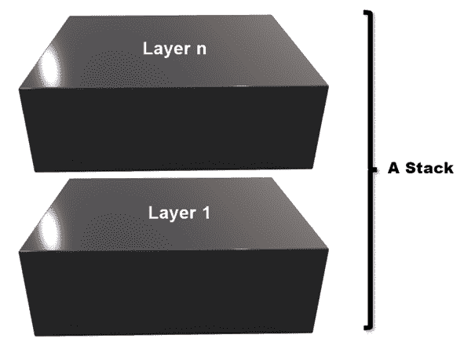
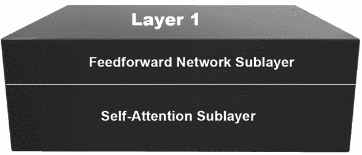
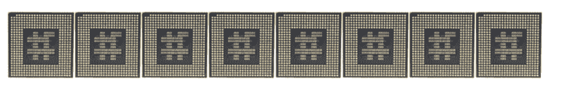

# 附录 I：Transformers模型术语

过去几十年产生了**卷积神经网络**（**CNNs**）、**循环神经网络**（**RNNs**）和更多类型的**人工神经网络**（**ANNs**）。它们都有一定数量的共同词汇。

当应用于Transformers时，Transformers模型引入了一些新词汇，并略微不同地使用现有词汇。本附录简要描述了Transformers模型，以澄清深度学习词汇在应用于Transformers时的使用情况。

Transformers模型架构的动机取决于深度学习的工业化方法。Transformers的几何特性增强了并行处理。此外，Transformers的架构完全符合硬件优化要求。例如，谷歌利用Transformers的堆栈结构设计了领域特定的优化硬件，需要较少的浮点数精度。

设计Transformers模型意味着考虑硬件。因此，Transformers的架构从一开始就结合了软件和硬件优化。

本附录定义了一些神经网络语言的新用法。

# 堆栈

一个*堆栈*包含大小相同的层，与经典的深度学习模型不同，如*图 I.1*所示。一个堆栈从*底部到顶部*运行。堆栈可以是编码器或者解码器。

图 I.1：层形成一个堆栈

Transformers堆栈随着升高而学习并看到更多。每一层将其学到的内容传递给下一层，就像我们的记忆一样。

想象一下，*堆栈*就像纽约市的帝国大厦。在底部，你看不到太多。但是当你升上更高层的办公室并透过窗户望出去时，你将看到更多，更远的景色。最后，在顶部，你将拥有一个美妙的曼哈顿景色！

# 子层

每个层包含子层，如*图 I.2*所示。不同层的每个子层具有相同的结构，这有助于硬件优化。

原始Transformers包含从*底部到顶部*运行的两个子层：

+   自注意力子层，专为自然语言处理和硬件优化而设计

+   一种经过一些调整的经典前馈网络

图 I.2：一个层包含两个子层

# 注意头部

自注意力子层被分为 n 个独立和相同的层，称为*头部*。例如，原始Transformers包含八个头部。

*图 I.3*将头部表示为处理器，以显示Transformers的工业化结构适合硬件设计：

图 I.3：自注意力子层包含头部

注意，*图 I.3*中的注意头部被表示为微处理器，以突出Transformers架构的并行处理能力。

transformer 结构适用于自然语言处理和硬件优化需求。

# 加入我们书的 Discord 空间

加入该书的 Discord 工作区，与作者一起参加每月的*问我任何事*活动：

[`www.packt.link/Transformers`](https://www.packt.link/Transformers)

