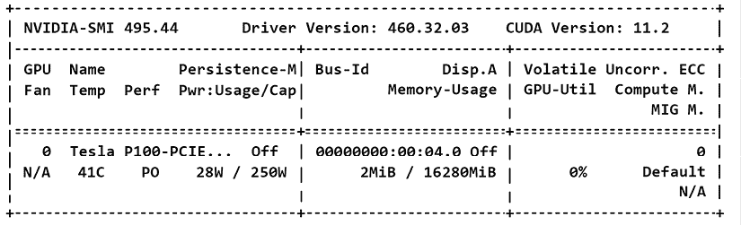

# 附录 II：对Transformers模型的硬件约束

Transformer 模型无法没有优化的硬件存在。内存和硬盘管理设计仍然是关键组成部分。然而，计算能力仍然是先决条件。要训练*第二章*中描述的原始 Transformer 几乎是不可能的，*开始使用 Transformer 模型架构*，没有 GPU。GPU 处于高效Transformers模型的战斗的中心。

这个附录将引导您在三个步骤中了解 GPU 的重要性：

+   Transformers的架构和规模

+   CPU 与 GPU

+   在 PyTorch 中实现 GPU，作为任何其他优化语言优化的示例

# Transformers的架构和规模

关于硬件驱动设计的线索出现在*第二章*的*开始使用 Transformer 模型架构*的*多头关注的架构*部分中：

“然而，通过分析具有一个 *d*[model] 块的序列，我们只会一次得到一个观点。此外，要找到其他观点需要相当长的计算时间。

一个更好的方法是将每个单词 *x*（一个序列的所有单词）的 *d*[model] = 512 维分成 8 个 *d*[k] = 64 维。

然后我们可以并行运行这 8 个“头部”，加快训练速度，并获得关于每个单词如何与另一个单词相关的 8 个不同的表示子空间：


图 II.1：多头表示

您现在可以看到有 8 个头并行运行。

我们可以很容易地看出，强迫注意力头学习 8 种不同角度的动机。然而，深入挖掘原始 8 个注意力头并行执行不同计算的动机直接导致硬件优化。

*Brown*等人（2020 年）在*语言模型*——*少量训练者*中，[`arxiv.org/abs/2005.14165`](https://arxiv.org/abs/2005.14165)，描述了他们如何设计 GPT 模型。他们证实Transformers架构是硬件驱动的。

我们将模型跨 GPUs 进行分区，同时沿深度和宽度维度，以最小化节点间的数据传输。每个模型的精确结构参数基于跨 GPU 模型布局中的计算效率和负载平衡而选择。

Transformer 在构造（编码器和解码器）和大小上有所不同。但它们都有需要并行处理的硬件约束。我们需要进一步了解为什么 GPU 如此特殊。

# 为什么 GPU 如此特殊

在*第二章*的*开始使用 Transformer 模型架构*的*多头关注的架构*部分中出现了 GPU 驱动设计的线索。

注意力被定义为“缩放点积注意力”，用以下方程表示，我们将 *Q*、*K* 和 *V* 带入其中：


我们现在可以得出以下结论：

+   注意力头（Attention heads）是为并行计算设计的。

+   注意力头基于*matmul*，矩阵乘法。

# GPU 是为并行计算而设计的。

**CPU**（**中央处理单元**）被优化用于*串行处理*。但如果我们通过串行处理来运行注意力头，那么训练一个有效的 Transformer 模型将需要更长的时间。非常小的教育型 Transformer 可以在 CPU 上运行。但是，它们不符合最先进模型的标准。

**GPU**（**图形处理单元**）是专为*并行处理*而设计的。Transformer 模型是为*并行处理（GPU）*而设计的，而不是*串行处理（CPU）*。

# GPU 也是为矩阵乘法而设计的。

例如，NVIDIA GPU 包含加速矩阵操作的张量核心。包括 Transformer 模型在内的大部分人工智能算法使用矩阵操作。NVIDIA GPU 包含大量用于矩阵操作的硬件优化。以下链接提供了更多信息：

+   [`blogs.nvidia.com/blog/2009/12/16/whats-the-difference-between-a-cpu-and-a-gpu/`](https://blogs.nvidia.com/blog/2009/12/16/whats-the-difference-between-a-cpu-and-a-gpu/)

+   [`www.nvidia.com/en-us/data-center/tesla-p100/`](https://www.nvidia.com/en-us/data-center/tesla-p100/)

谷歌的**张量处理单元**（**TPU**）是 NVIDIA GPU 的等价物。使用 TPU 时，TensorFlow 将优化张量的使用。

+   关于 TPU 的更多信息，请参见[`cloud.google.com/tpu/docs/tpus`](https://cloud.google.com/tpu/docs/tpus)。

+   关于 TensorFlow 中张量的更多信息，请参阅[`www.tensorflow.org/guide/tensor`](https://www.tensorflow.org/guide/tensor)。

BERT[BASE]（110M 参数）最初是使用 16 个 TPU 芯片进行训练的。BERT[LARGE]（340M 参数）是使用 64 个 TPU 芯片进行训练的。有关训练 BERT 的更多信息，请参见[`arxiv.org/abs/1810.04805`](https://arxiv.org/abs/1810.04805)。

我们已经确定了 Transformer 的架构完全符合并行硬件的约束条件。我们仍然需要解决在 GPU 上运行源代码的问题。

# 在代码中实现 GPU

`PyTorch`，以及其他语言和框架，管理着 GPU。PyTorch 包含张量（tensors），就像 TensorFlow 一样。张量可能看起来像 NumPy `np.arrays()`。然而，NumPy 不适合并行处理。张量使用 GPU 的并行处理特性。

在 PyTorch 中，张量（Tensors）打开了在 GPU 上分布式数据的大门，以及其他框架：[`pytorch.org/tutorials/intermediate/ddp_tutorial.html`](https://pytorch.org/tutorials/intermediate/ddp_tutorial.html)

在`Chapter03`笔记本`BERT_Fine_Tuning_Sentence_Classification_GPU.ipynb`中，我们使用**CUDA（Compute Unified Device Architecture）**与 NVIDIA GPU 通信。CUDA 是 NVIDIA 平台上的通用计算平台。特定的指令可以添加到我们的源代码中。更多信息，请参见[`developer.nvidia.com/cuda-zone`](https://developer.nvidia.com/cuda-zone)。

在`Chapter03`笔记本中，我们使用 CUDA 指令将我们的模型和数据传输到 NVIDIA GPU 上。`PyTorch`有一个指令来指定我们希望使用的设备：`torch.device`。

更多信息，请参见[`pytorch.org/docs/stable/notes/cuda.html`](https://pytorch.org/docs/stable/notes/cuda.html)。

我们将解释`device`以说明 PyTorch 和一般程序中 GPU 的实现。让我们重点关注选择设备、数据并行性、将模型加载到设备和将批次数据添加到设备上。每个项目符号都包含了设备的使用方式和`BERT_Fine_Tuning_Sentence_Classification_GPU.ipynb`中的单元格号：

+   **选择设备（Cell 3）**

    程序检查 CUDA 是否可用于 NVIDIA GPU。如果没有，设备将是 CPU：

    ```py
    device = torch.device("cuda" if torch.cuda.is_available() else "cpu")
    !nvidia-smi 
    ```

+   **数据并行（Cell 16）**

    如果有多个 GPU 可用，则可以将模型分布到几个 GPU 上进行并行计算：

    ```py
    model = BertForSequenceClassification.from_pretrained("bert-base-uncased", num_labels=2)
    model = nn.DataParallel(model) 
    ```

+   **将模型加载到设备上（cell 16）**

    模型被发送到设备：

    ```py
     model.to(device) 
    ```

+   **将批次添加到设备（cell 20）用于训练和验证数据**

    数据批次被添加到可用的 GPU（`1`至`n`）中：

    ```py
    # Add batch to GPU
    batch = tuple(t.to(device) for t in batch) 
    ```

在接下来的部分中，我描述了我进行的测试，以说明使用 GPU 来运行一个包含三个运行时配置的章节笔记本的Transformers模型的用法。

# 使用 Google Colab 测试 GPU

在本节中，我描述了我进行的非正式测试，以说明 GPU 的潜力。我们将使用相同的`Chapter03`笔记本：`BERT_Fine_Tuning_Sentence_Classification_GPU.ipynb`。

我在三种情况下运行了笔记本：

+   带 CPU 的免费 Google Colab

+   带 GPU 的免费 Google Colab

+   Google Colab Pro

# 带 CPU 的免费 Google Colab

在 CPU 上几乎不可能微调或训练一个拥有数百万或数十亿参数的Transformers模型。CPU 大多是顺序的。Transformers模型是为并行处理而设计的。

在**运行时**菜单和**更改运行时类型**子菜单中，您可以选择硬件加速器：**无（CPU）**，**GPU**或**TPU**。

这个测试是在**无（CPU）**下运行的，如*图 II.2*所示：


图 II.2：选择硬件加速器

当笔记本进入训练循环时，从一开始就会减慢速度：


图 II.3：训练循环

经过 15 分钟，实际上什么都没有发生。

CPU 并不是为并行处理而设计的。Transformers模型是为并行处理而设计的，所以除了玩具模型之外，它们需要 GPU。

## 带 GPU 的免费 Google Colab

让我们回到笔记本设置中选择一个**GPU**。


图 II.4 选择 GPU

在写作时，我测试了 Google Colab，并且 VM 配备了带有 CUDA 11.2 的 NVIDIA K80：


图 II.5：激活了 NVIDIA K80 GPU

训练循环正常进行，持续约 20 分钟。然而，截至测试时（2021 年 11 月），Google Colab VMs 并不提供多于一个 GPU。GPU 价格昂贵。无论如何，*图 II.6*显示，训练循环在合理的时间内完成：


图 II.6：配备 K80 GPU 的训练循环

我发现测试 Google Colab Pro 是否提供更快的 GPU 很有趣。

# Google Colab Pro 配备了 GPU

通过 Google Colab 提供的 VM 配备了 NVIDIA P100 GPU，如*图 II.7*所示。这很有趣，因为原始 Transformer 训练时，根据 *Vaswani* 等人（2017）*《关注力就是你所需的一切》*，用了 8 个 NVIDIA P100s，用了 12 小时来训练具有 10⁶×65 个参数的基础模型，并且使用了 8 个 GPU：



图 II.7：Google Colab Pro VM 配备了 P100 GPU

训练循环时间大大缩短，持续时间不到 10 分钟，如*图 II.8*所示：


图 II.8：配备 P100 GPU 的训练循环

# 加入我们书籍的 Discord 空间

加入该书的 Discord 空间，与作者进行每月的 *问我任何事* 专题讨论会：

[`www.packt.link/Transformers`](https://www.packt.link/Transformers)


