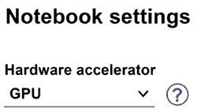
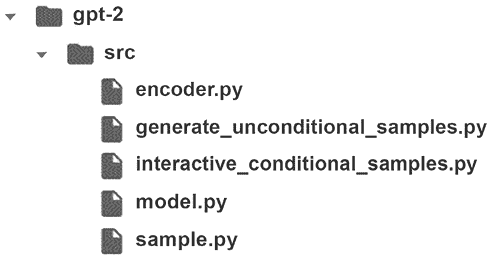
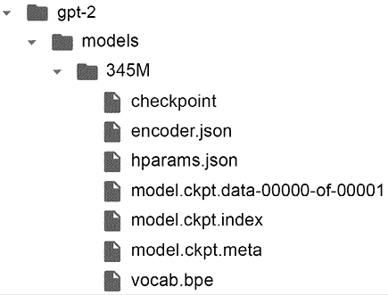

# 附录 III — 使用 GPT-2 进行通用文本完成

这个附录是*第七章*中*GPT-3 引擎与超人类变压器崛起*中*使用 GPT-2 进行通用文本完成*一节的详细解释。这一节描述了如何实现 GPT-2 变压器模型来完成通用文本。

你可以直接在*第七章*中阅读这本笔记本的用法，或者在附录中构建程序并运行它，以更深入地了解 GPT 模型的工作原理。

我们将克隆 `OpenAI_GPT_2` 代码库，下载 345M 参数的 GPT-2 变压器模型，并与其交互。我们将输入上下文句子，并分析变压器生成的文本。目标是看看它如何创建新内容。

这一部分分为九个步骤。在 Google Colaboratory 中打开 `OpenAI_GPT_2.ipynb`。这个笔记本在本书的 GitHub 代码库的 `AppendixIII` 目录中。你会注意到笔记本也被分成了和本节相同的九个步骤和单元格。

逐步运行笔记本的单元格。这个过程很枯燥，但*克隆 OpenAI GPT-2 代码库产生的结果是令人满意的*。我们看到我们可以用几行代码运行一个 GPT-3 引擎。但是这个附录给了你机会，即使代码不再被优化，也可以看到 GPT-2 模型是如何工作的。

Hugging Face 有一个封装 GPT-2 模型的包装器。作为 OpenAI API 的一个替代方案很有用。然而，在这个附录中的目标*不是*为了避免 GPT-2 模型底层组件的复杂性，而是为了探索它们！

最后，重要的是我们正在运行一个低级别的 GPT-2 模型，而不是一个一行代码调用即可获得结果的简易版本（OpenAI GPT-3 API，Hugging Face 封装等）。我们正在从零开始理解 GPT-2 的架构，所以可能会收到一些弃用消息。但这样的努力值得成为 4.0 工业人工智能专家。

让我们开始激活 GPU。

# 第 1 步：激活 GPU

我们必须激活 GPU 来训练我们的 GPT-2 345M 参数变压器模型。

要激活 GPU，请进入 **笔记本设置** 中的 **运行时** 菜单以充分利用 VM：



图 III.1：GPU 硬件加速器

我们可以看到激活 GPU 是更好性能的先决条件，这将让我们进入 GPT 变压器的世界。所以现在让我们克隆 OpenAI 的 GPT-2 代码库。

# 第 2 步：克隆 OpenAI GPT-2 代码库

目前 OpenAI 仍然允许我们下载 GPT-2。这种方式可能在将来被停止，或者可能我们会获得更多资源。此时，变压器的发展和使用速度如此之快，以至于没人能预见市场会如何发展，即使是主要的研究实验室自己也不行。

我们将在 VM 上克隆 OpenAI 的 GitHub 目录：

```py
#@title Step 2: Cloning the OpenAI GPT-2 Repository
!git clone https://github.com/openai/gpt-2.git 
```

克隆结束后，您应该在文件管理器中看到该代码库的出现：


图 III.2: 克隆的 GPT-2 存储库

点击 **src**，您会看到我们从 OpenAI 安装的运行模型所需的 Python 文件：



图 III.3: 运行模型的 GPT-2 Python 文件

您会发现我们没有需要的 Python 训练文件。在 *附录 IV* 的 *用 GPT-2 训练语言模型* 部分 *自定义文本完成与 GPT-2*中训练 GPT-2 模型时，我们将安装它们。

现在让我们安装所需的内容。

# 步骤 3: 安装要求

要自动安装所需的内容：

```py
#@title Step 3: Installing the requirements
import os          # when the VM restarts import os necessary
os.chdir("/content/gpt-2")
!pip3 install -r requirements.txt 
```

逐个单元格运行时，我们可能需要重新启动虚拟机，然后再次导入`os`。

本笔记本的要求是：

+   `Fire 0.1.3` 用于生成**命令行界面**（**CLIs**）

+   `regex 2017.4.5` 用于正则表达式使用

+   `Requests 2.21.0`，一个 HTTP 库

+   `tqdm 4.31.1` 用于显示循环的进度条

可能会要求您重新启动笔记本。

*现在不要重新启动它*。*让我们等到检查 TensorFlow 的版本*。

# 步骤 4: 检查 TensorFlow 的版本

OpenAI 提供的 GPT-2 345M 变压器模型使用 TensorFlow 1.x。这将在运行程序时导致几个警告。但是，我们将忽略它们，并在我们的普通机器上以全速运行训练 GPT 模型的薄冰上。

在 2020 年代，GPT 模型已经达到了 1750 亿个参数，使我们在没有超级计算机的情况下无法高效地进行训练。参数的数量只会继续增加。

企业巨头的研究实验室，例如 Facebook AI、OpenAI 和 Google Research/Brain，正在加速转向超级变压器，并且正在留下一些供我们学习和理解的东西。但是，不幸的是，他们没有时间回头更新他们分享的所有模型。然而，我们还有这个笔记本！

TensorFlow 2.x 是最新的 TensorFlow 版本。然而，旧程序仍然可能有所帮助。这就是为什么 Google Colaboratory VMs 预先安装了 TensorFlow 1.x 和 TensorFlow 2.x 的版本的一个原因。

我们将在此笔记本中使用 TensorFlow 1.x：

```py
#@title Step 4: Checking the Version of TensorFlow 
#Colab has tf 1.x and tf 2.x installed
#Restart runtime using 'Runtime' -> 'Restart runtime...'
%tensorflow_version 1.x
import tensorflow as tf
print(tf.__version__) 
```

输出应该是：

```py
TensorFlow 1.x selected.
1.15.2 
```

无论是否显示`tf 1.x`版本，请重新运行单元格以确保，然后重新启动虚拟机。*在继续之前重新运行此单元格以确保*。

如果在过程中遇到 TensforFlow 错误（忽略警告），请重新运行此单元格，重新启动虚拟机，确保重新运行。

每次重新启动虚拟机时都要做这个。虚拟机的默认版本是 `tf.2`。

我们现在准备下载 GPT-2 模型。

# 步骤 5: 下载 345M 参数 GPT-2 模型

我们现在将下载训练好的 345M 参数 GPT-2 模型：

```py
#@title Step 5: Downloading the 345M parameter GPT-2 Model
# run code and send argument
import os # after runtime is restarted
os.chdir("/content/gpt-2")
!python3 download_model.py '345M' 
```

模型目录的路径是：

`/content/gpt-2/models/345M`

它包含我们运行模型所需的信息：



图 III.4: 345M 参数模型的 GPT-2 Python 文件

`hparams.json` 文件包含了 GPT-2 模型的定义：

+   `"n_vocab"`: `50257`，模型词汇表的大小

+   `"n_ctx"`: `1024`，上下文大小

+   `"n_embd"`: `1024`，嵌入大小

+   `"n_head"`: `16`，头的数量

+   `"n_layer"`: `24`，层数

`encoder.json` 和 `vacab.bpe` 包含了标记化的词汇表和 BPE 单词对。如有必要，请花几分钟时间返回并阅读*第 3 步: 训练一个分词器*子节，*第四章*，*从零开始预训练 RoBERTa 模型*。

`checkpoint` 文件包含了检查点时的训练参数。例如，它可能包含了 1,000 步的训练参数，就像我们在*第 9 步: 训练 GPT-2 模型*章节的*附录 IV*中，*使用 GPT-2 进行自定义文本完成*部分将要做的那样。

`checkpoint` 文件与其他三个重要文件保存在一起:

+   `model.ckpt.meta` 描述了模型的图结构。它包含`GraphDef`，`SaverDef`等。我们可以使用`tf.train.import_meta_graph([path]+'model.ckpt.meta')`检索信息。

+   `model.ckpt.index` 是一个字符串表。键包含张量的名称，值是`BundleEntryProto`，其中包含张量的元数据。

+   `model.ckpt.data` 包含*TensorBundle collection*中所有变量的值。

我们已经下载了我们的模型。现在我们将在激活模型之前经历一些中间步骤。

# 步骤 6-7: 中间指令

在本节中，我们将经历*步骤 6*、*7*和*7a*，这些是通向*步骤 8*的中间步骤，其中我们将定义和激活模型。

在与模型交互时，我们希望将 UTF 编码的文本打印到控制台:

```py
#@title Step 6: Printing UTF encoded text to the console
!export PYTHONIOENCODING=UTF-8 
```

我们要确保我们在`src`目录下：

```py
#@title Step 7: Project Source Code
import os # import after runtime is restarted
os.chdir("/content/gpt-2/src") 
```

我们已经准备好与 GPT-2 模型交互。我们可以直接运行它，就像我们在*附录 IV*中的*使用 GPT-2 进行语言模型训练*部分将要做的那样。然而，在本节中，我们将讨论代码的主要方面。

`interactive_conditional_samples.py` 首先导入与模型交互所需的必要模块:

```py
#@title Step 7a: Interactive Conditional Samples (src)
#Project Source Code for Interactive Conditional Samples:
# /content/gpt-2/src/interactive_conditional_samples.py file 
import json
import os
import numpy as np
import tensorflow as tf 
```

我们已经经历了激活模型的中间步骤。

# 步骤 7b-8: 导入并定义模型

现在我们将使用`interactive_conditional_samples.py`激活与模型的交互。

我们需要导入三个同时也在 `/content/gpt-2/src`中的模块:

```py
import model, sample, encoder 
```

这三个程序是:

+   `model.py` 定义了模型的结构: 超参数，多头`tf.matmul`操作，激活函数以及所有其他属性。

+   `sample.py` 处理交互并控制将生成的样本。它确保标记更有意义。

    Softmax 值有时可能模糊不清，就像在低清晰度下查看图像。`sample.py` 包含一个名为`temperature`的变量，将使值更清晰，增加更高的概率并软化更低的概率。

    `sample.py` 可以激活 Top-*k*采样。Top-*k*采样对预测序列的概率分布进行排序。分布的头部具有较高的概率值，排除掉尾部具有较低概率的部分，以防止模型预测低质量的标记。

    `sample.py` 也可以激活用于语言建模的 Top-*p*采样。Top-*p*采样不对概率分布进行排序。相反，它选择具有较高概率的词，直到此子集的概率之和或可能序列的核心超过 *p*。

+   `encoder.py` 使用定义好的模型 `encoder.json` 和 `vocab.bpe` 对样本序列进行编码。它既包含了一个 BPE 编码器，又包含了文本解码器。

你可以双击打开这些程序来进一步探索它们。

`interactive_conditional_samples.py` 将调用所需的函数与模型进行交互，以初始化以下信息：来自 `model.py` 定义模型的超参数，以及来自 `sample.py` 的样本序列参数。它将使用 `encode.py` 进行编码和解码序列。

`interactive_conditional_samples.py` 将恢复本节的 *第 5 步：下载 345M 参数 GPT-2 模型* 子部分中定义的检查点数据。

你可以双击打开`interactive_conditional_samples.py`并尝试调整其参数：

+   `model_name` 是模型名称，如 `"124M"` 或 `"345M,"`，依赖于 `models_dir`。

+   `models_dir` 定义包含模型的目录。

+   `seed` 为随机生成器设置一个随机整数。可以设置种子以重现结果。

+   `nsamples` 是要返回的样本数。如果设置为 `0`，它将继续生成样本，直到你双击单元格的 *run* 按钮或按下 *Ctrl* + *M*。

+   `batch_size` 决定了批处理的大小，对内存和速度有影响。

+   `length` 是生成文本的标记数。如果设置为 `none`，则依赖于模型的超参数。

+   `temperature` 决定了 Boltzmann 分布的级别。如果温度很高，完成结果将更加随机。如果温度很低，结果将变得更加确定。

+   `top_k` 控制 Top-*k*在每一步考虑的标记数。 `0`表示没有限制。推荐值为 `40`。

+   `top_p` 控制 Top-*p*。

对于本节中的程序，我们刚刚探索的参数场景将是：

+   `model_name = "345M"`

+   `seed = None`

+   `nsamples = 1`

+   `batch_size = 1`

+   `length = 300`

+   `temperature = 1`

+   `top_k = 0`

+   `models_dir = '/content/gpt-2/models'`

这些参数将影响模型的行为，它如何受到上下文输入的条件影响，并生成文本完成序列。首先使用默认值运行笔记本。然后，您可以通过双击程序，编辑它并保存它来更改代码的参数。在每次重新启动 VM 时将删除更改。如果您希望创建交互场景，请保存程序并重新加载它。

程序现在已准备好提示我们与其交互。

# 步骤 9：与 GPT-2 交互

在本节中，我们将与 GPT-2 345M 模型交互。

系统运行时会有更多消息，但只要 Google Colaboratory 保持 `tf 1.x`，我们就会使用此笔记本运行模型。如果这本笔记本过时了，我们可能会有一天不得不使用 GPT-3 引擎，或者例如使用 Hugging Face GPT-2 包装器，未来它可能也会被弃用。

与此同时，GPT-2 仍在使用，所以让我们与模型交互吧！

要与模型交互，请运行 `interact_model` 单元格：

```py
#@title Step 9: Interacting with GPT-2
interact_model('345M',None,1,1,300,1,0,'/content/gpt-2/models') 
```

将提示您输入一些上下文：


图 III.5：用于文本完成的上下文输入

由于这是一个标准的 GPT-2 模型，您可以尝试任何类型的上下文。

我们可以尝试以艾曼纽尔·康德（Emmanuel Kant）的句子开头：

```py
`Human reason, in one sphere of its cognition, is called upon to`
`consider questions, which it cannot decline, as they are presented by`
`its own nature, but which it cannot answer, as they transcend every`
`faculty of the mind.` 
```

按下 *Enter* 键生成文本。由于 GPT-2 模型没有在我们的数据集上训练，而且我们正在运行一个随机模型，输出将相对随机。

让我们看看我运行模型时生成的前几行内容：

```py
"We may grant to this conception the peculiarity that it is the only causal logic. 
In the second law of logic as in the third, experience is measured at its end: apprehension is afterwards closed in consciousness.
The solution of scholastic perplexities, whether moral or religious, is not only impossible, but your own existence is blasphemous." 
```

要停止单元格，请双击单元格的运行按钮。

您还可以按 *Ctrl* + *M* 停止生成文本，但它可能会将代码转换为文本，您将不得不将其复制回程序单元格。

输出内容丰富。我们可以观察到几个事实：

+   我们输入的上下文 *条件化* 了模型生成的输出。

+   上下文是模型的演示。它从模型中学到了要说的话，而没有修改其参数。

+   文本完成受上下文影响。这为不需要微调的转换器模型打开了大门。

+   从语义的角度来看，输出可能更有趣。

+   从语法的角度来看，输出是令人信服的。

您可以通过阅读 *附录 IV*，*使用 GPT-2 进行自定义文本完成*，看看我们是否可以通过在自定义数据集上训练模型获得更令人印象深刻的结果。

# 参考资料

+   *OpenAI GPT-2* GitHub 仓库：[`github.com/openai/gpt-2`](https://github.com/openai/gpt-2)

+   *N Shepperd* 的 GitHub 仓库：[`github.com/nshepperd/gpt-2`](https://github.com/nshepperd/gpt-2)

# 加入我们书籍的 Discord 空间

加入书籍的 Discord 工作空间，与作者进行每月的 *问我任何* 会话：

[`www.packt.link/Transformers`](https://www.packt.link/Transformers)


